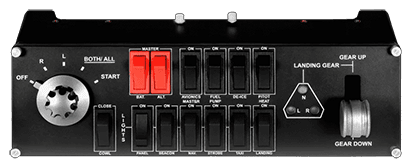
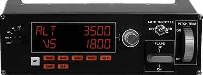
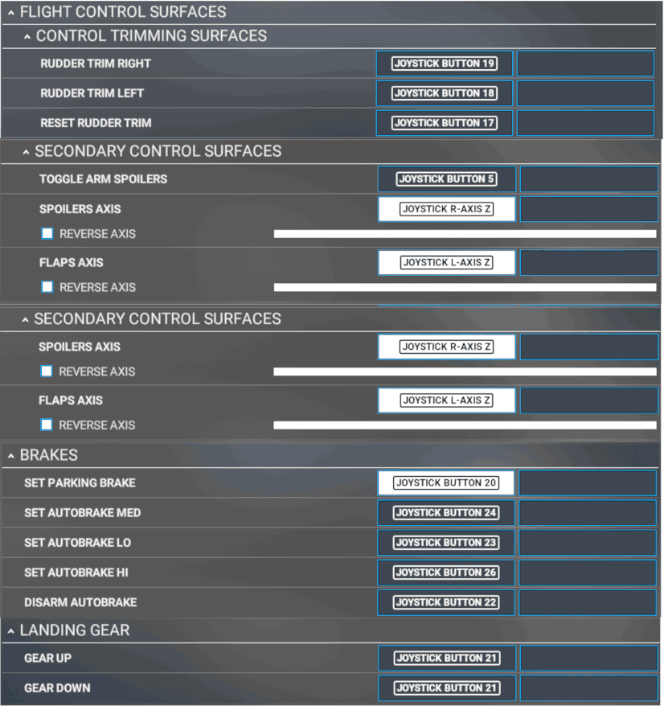
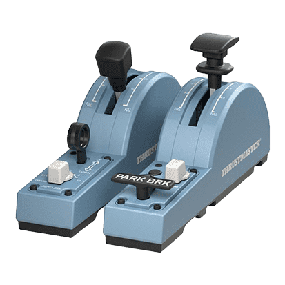
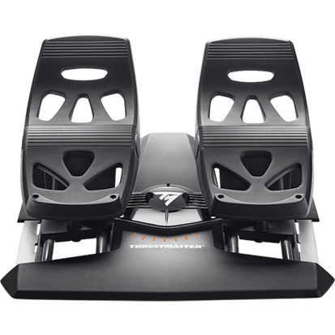
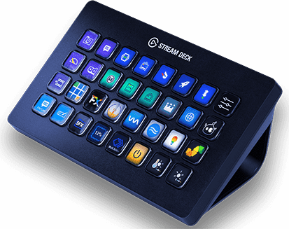
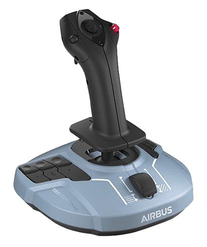
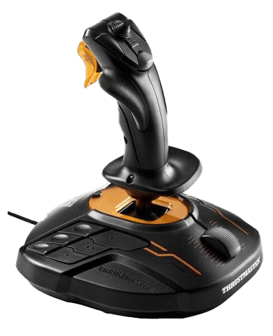
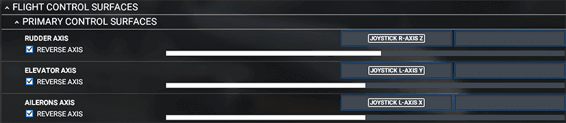

# Common Hardware Controllers and Setup

This page shows you a collection of common flight simulation hardware which can be used together with Microsoft Flight Simulator and the FlyByWire A32NX.

To make some of these controllers fully compatible, you need to replace their default drivers with the appropriate software. See [here](index.md#solutions).

The examples below are configured via SPAD.neXt and the configuration documentation is linked below.

With SPAD.neXt you can also download complete profiles for aircraft and hardware controllers. For the FlyByWire A32NX and the controllers below, this profile is used (which is downloadable from within SPAD.neXt):

{loading=lazy}

Find the complete SPAD documentation for these controllers in this single file: [A32NX FBW MSFS2020.pdf](../assets/api-guide/A32NX%20FBW%20MSFS2020.pdf){target=new}

This profile is maintained by Cdr_Maverick#6475.

To build your own profile, you can use our Flight-Deck API Documentation: [Flight-Deck API](a32nx-flightdeck-api.md)

### Logitech Switch Panel

{loading=lazy}

### Logitech Multi Panel

{loading=lazy}

### Thrustmaster TCA Quadrant Airbus Edition

{loading=lazy}

!!! tip ""
    Remember to calibrate your throttle detents for this throttle: [TCA Throttle Calibration](../../common/flypados3/throttle-calibration.md#thrustmaster-tca-throttle)

!!! warning ""
    To avoid unexpected problems during a flight, some default keybindings should be removed when using the TCA Throttle. 
    
    If you have the sidestick as well, make sure to unbind the mini-throttle from the sidestick.

    If you don't have the Add-ons, remove all the key bindings for the buttons, knobs, and axis on the Add-ons. These are shown in the image below:
    {loading=lazy}

### Thrustmaster TCA Throttle Add-On TCA Quadrant Add-on Airbus Edition

{loading=lazy}

### Thrustmaster T.Flight Rudder Pedals

{loading=lazy}

!!! tip ""
    If you experience problems like brakes getting stuck while taxiing or twitching rudders, make sure that your pedals 
    are set up correctly. [T.Flight Rudder Pedals Settings](../../support/detail-pages/rudder.md)

### Elgato Stream Deck

{loading=lazy}

### Thrustmaster TCA Sidestick Airbus Edition or T.16000M FCS

!!! block ""

    {loading=lazy align=left width=46%}

    {loading=lazy align=right width=46%}

These flight sticks have normal flight surface controls (pitch, roll, and yaw) but they also have 10 configurable buttons, 8-way hat switch and a slider.

We recommend using the Microsoft Flight Simulator normal mapping for the flight surfaces.

The rest of the buttons can be mapped as you require it.

### Thrustmaster TWCS Throttle

{loading=lazy}

!!! tip ""
    Remember to calibrate your throttle detents for this throttle: [TWCS Throttle Calibration](../../common/flypados3/throttle-calibration.md#thrustmaster-twcs-throttle)

The rest of the buttons can be mapped as you require it.

