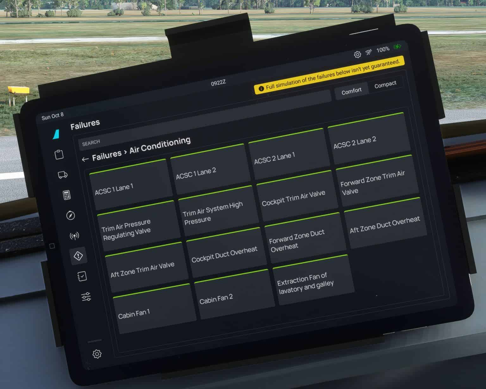
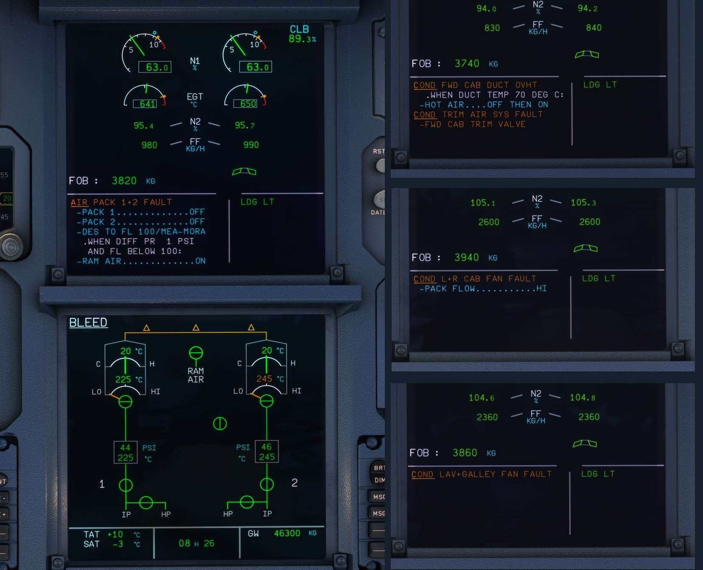

# Custom Air Conditioning System

## System Description
The air conditioning, pressurization and ventilation system (also known as Environmental Control System (ECS) or simply Air Conditioning System for convenience) regulates the 
temperature, pressure and airflow inside the aircraft.

Its main functions are to maintain a high level of comfort for passengers and crew and to protect the aircraft systems that need it (like the avionics).

Our aim at FBW is to model systems that match their real-life counterparts one-to-one. Throughout this guide, you will see items marked as “not yet implemented” or “coming soon”. In these cases, we are still hard at work to bring you the most advanced air conditioning, pressurization and ventilation system you’ve ever seen in a home simulator.

Please note, this guide doesn’t go through all conditions that trigger specific situations; you are encouraged to discover these details yourself as you fly along the open skies!

## Cabin Simulation
The first step in order to be able to model the air conditioning system is to simulate the air inside a virtual cabin.

Microsoft Flight Simulator doesn’t provide a default implementation for it, so we’ve developed our own. For every “tick” in MSFS, the A32NX runs a separate fluid simulation inside the fuselage that accurately mimics air behaviour in real life.

Some details and features of this simulation include:

- Heat exchange through aircraft walls (conduction, convection). Heat exchange with the environment is affected by:
    - Exterior and interior temperature
    - Exterior and interior air density
    - Aircraft altitude
    - Aircraft speed (Reynolds number)
    - Turbulent vs Laminar flow (Nusselt number)
    - Material and thickness of sidewall
- Heat generation in the cabin. This is calculated based on the number of passengers, using human body heat loss through skin and through lungs.
- Air Mass exchange between aircraft and the environment. Air leaves the fuselage mainly through the outflow valve but is also affected by:
    - Any open doors
    - Air leakage due to passengers using the toilet
    - Aircraft speed and pressure differential (supersonic, transonic or subsonic flow through the outflow valve)

!!! tip "Did You Know?"
    The flow of air that escapes through the outflow valve is not constant. Try to fly up to cruise altitude and manually open the outflow valve. 

    You will notice the cabin vertical speed "jump" at some point as you get close to equal pressure. This is due to the flow transitioning from supersonic to subsonic.

!!! info "Not Yet Implemented"
    Other details that might be added in the future include:

    - Radiation exchange with the environment (so the cabin warms up in a sunny but cold day, for example)
    - Change in human heat dissipation based on the season (the more clothes you wear, the less heat you dissipate)
    - Air particle calculation (so conditions are different depending on where you are in the cabin)

## Air Conditioning System
The air conditioning system of the A320 is better understood by following an air particle through its journey from the bleed system to the cabin.

### Air Conditioning Packs
Air from the bleed system is hot. It comes directly from the engines or APU, and it needs to be cooled down before it can be delivered to the cabin. This happens in the packs, which are heat exchangers that cool and dry the air.

The packs regulate their output temperature to target the minimum temperature selected on the overhead panel. They can be turned off with their respective push-button on the overhead panel, but their intake valve also closes in a few other situations, like when the engines are off or when the ditching push-button is pressed in.

!!! info "Not Yet Implemented"
    The inner workings of the packs haven’t been modelled yet in the A32NX, but they are in the works!

### Cabin Fans
Two big cabin fans (plus their respective filters) recirculate part of the cabin air back into the cabin. This is done to reduce the load on the packs.

They are housed in the underbelly of the aircraft and are controlled by a push-button on the overhead panel. 

### Mixer Unit
This is where the air from the packs and the cabin fans gets mixed (the name is pretty self-explanatory!).

!!! info "Not Yet Implemented"
    Some airports provide low pressure conditioned air, so aircraft don’t need to keep their APU on for extended periods of time in hot weather. This air is routed directly to the mixer unit, but this is not simulated yet in the A32NX.

### Trim Air
We’ve established that the packs deliver the minimum temperature selected on the overhead, and that the fans only recirculate cabin air (at whichever temperature this is in), so how do you achieve different temperatures in different cabin zones? With the trim air valves!

These small valves “inject” hot air directly from the bleed air system to the air coming out of the mixer unit to fine tune the final temperature that gets delivered to each of the zones. This hot air can be switched on and off using the overhead panel.

### Air Conditioning System Controller (ACSC)
The Air Conditioning System Controller is a dual channel, dual lane system that controls all components of the Air Conditioning System. 

When a zone temperature is selected on the overhead, it calculates the temperature demand and airflow required in the cabin outlets to achieve it. It sends signals to all the moving parts of the system (described above!) to achieve the right balance and meet the temperature and flow demands.

!!! tip "Did You Know?"
    The ACSC is an Airbus optional system for the A320. Some A320s come with individual local controllers for each of the elements (temperature, flow, trim air…). We’ve modelled the A32NX to come equipped with an ACSC because why not!

## Failures
We’ve implemented the most relevant failures to the Air Conditioning system components.

What you can fail:

- ACSC 1 & 2 (each lane individually)
- Trim Air Pressure Regulating Valve (hot air)
- Trim Air Valves
- Cabin Fan 1 & 2
- Lavatory and Galley Fan

{loading=lazy}

What you can expect to see when you activate them. Make sure you follow the ECAM actions to mitigate each failure!

#### ACSC -> One lane fault
- No effect as the second lane takes over. You will see a “COND CTL 1(2)-A(B) FAULT” ECAM warning (no chime) if you have engines off, otherwise no warning.
#### ACSC -> Two lane fault
- The related pack is lost, and the hot air pressure-regulating valve and trim air valves close. You will get a “AIR PACK 1(2) FAULT” ECAM warning (single chime). Temperature regulation is lost.
#### Trim Air Pressure Regulating Valve
- The “hot air” valve is stuck in position. If it fails open, this has no effect. If it fails closed, temperature optimisation is lost. You will only get a “HOT AIR FAULT” when the valve disagrees with the commanded position (note it takes a while to get the warning!). The FAULT light illuminates on the overhead.
#### Trim Air System High Pressure
- Hot air pressure increases, but it has no observable effect. You will get a “COND TRIM AIR SYS FAULT” and “TRIM AIR HI PR” ECAM message (no chime).
#### [CKPT/FWD/AFT] Trim Air Valve
- Optimised temperature regulation of the corresponding zone is lost. You will get a “COND TRIM AIR SYS FAULT” and “[CKPT/FWD/AFT] TRIM VALVE” ECAM message (no chime).
#### [CKPT/FWD/AFT] Duct Overheat
- The duct temperature rises above 88C momentarily. The TAPRV and trim air valves close. Temperature optimization is lost. You will get a “COND FWD CAB/AFT CAB/CKPT DUCT OVHT” ECAM warning (single chime).
#### Cabin Fan
- One cabin fan failure reduces the recirculated flow, if both fail, there is no air recirculation. You can see an amber “FAN” message appear on the COND page. You will get a “COND L+R CAB FAN FAULT” alert if both fail.
#### Lav and Galley Fan
- Cabin zone temperature sensors are ventilated by the air extracted by this fan. Cabin zone temperature regulation is lost. You will get a “COND LAV + GALLEY FAN FAULT” ECAM warning (single chime).

!!! tip "If you like to see things burn, you can fail the TAPRV open, then trigger an overheat and see what happens 😛."

{loading=lazy}
