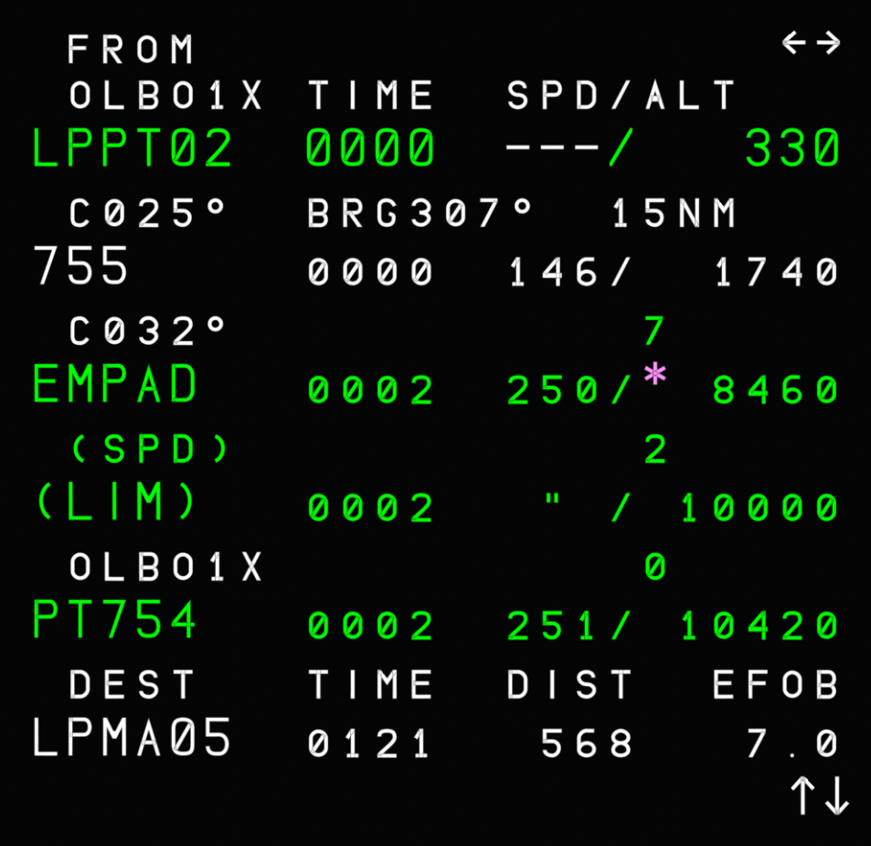
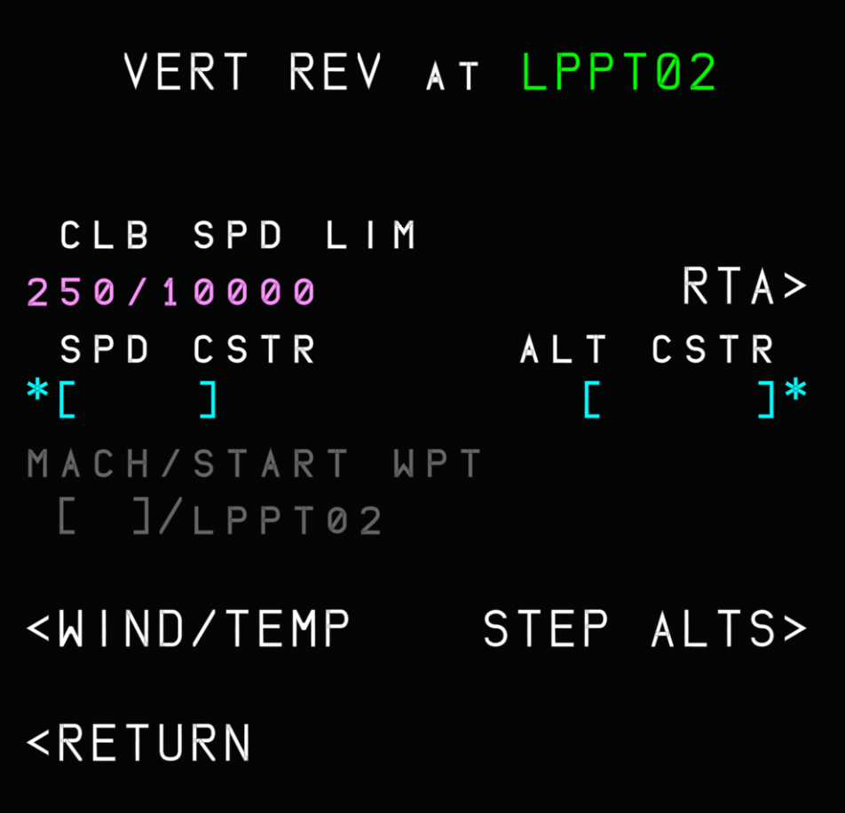
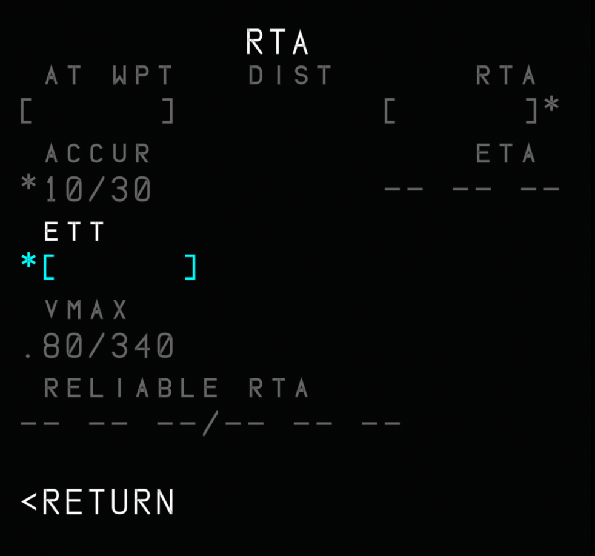
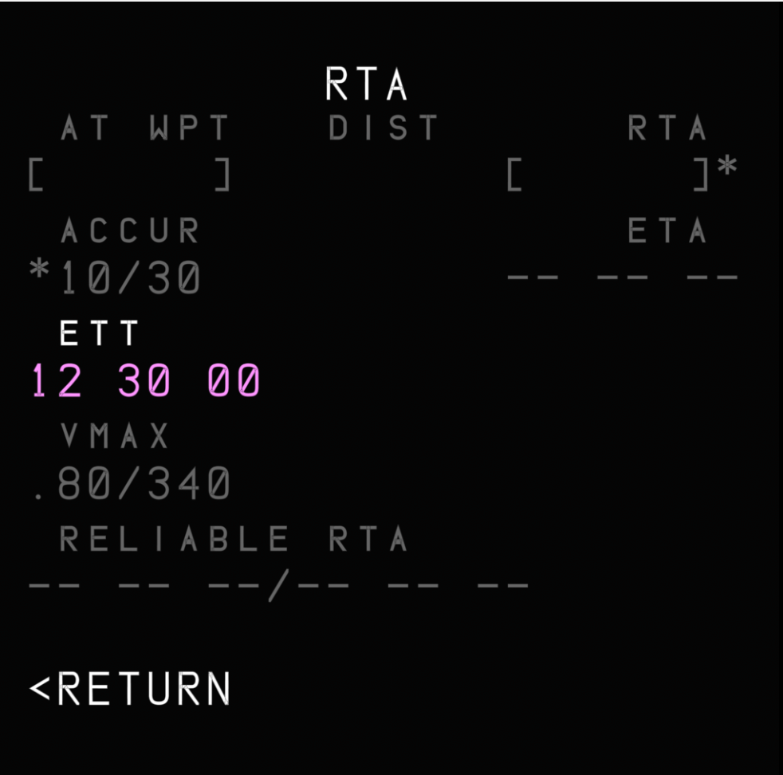
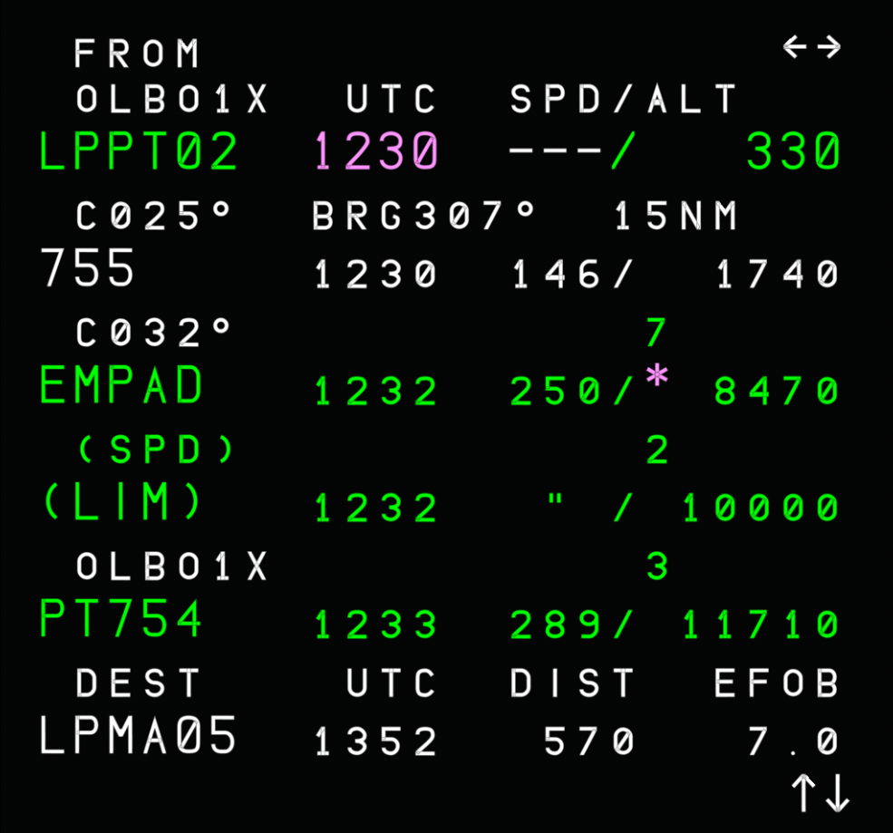
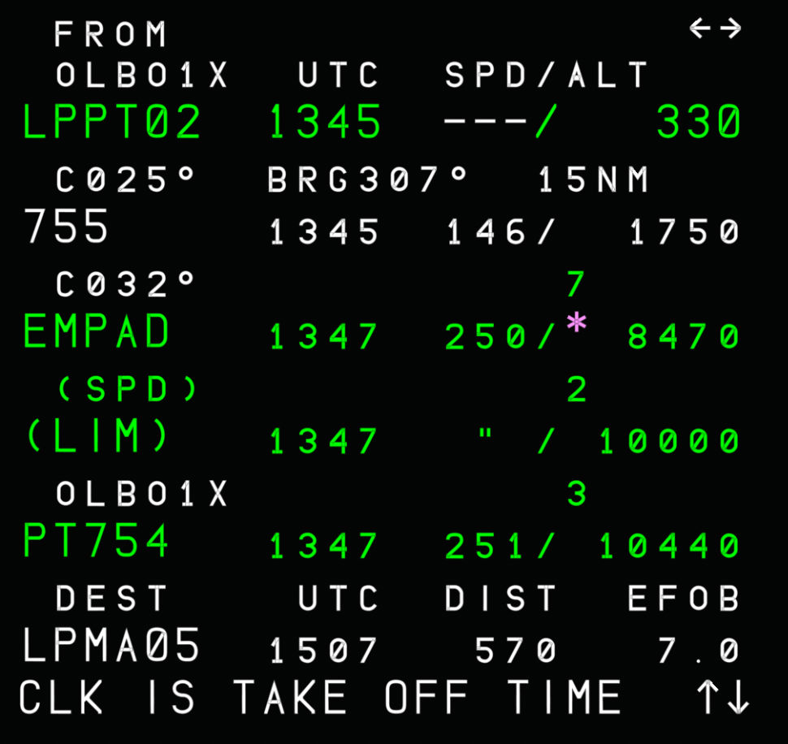

# Estimated Takeoff Time

The A32NX supports the insertion of an ETT on the MCDU. This time is used to initialize FMGS time predictions during preflight.

# Overview

A common use case for the ETT in real life is ATC delays. By knowing beforehand what the expected departure time will be, we can add it to the FMGS in order to adjust all the relevant time predictions.
# Usage Guide

In this scenario, we assume that ATC gave us a delay and we expect to take off at 12:30Z.
On the F-PLN page, we can check that all the time predictions are related to the expected flight time and not to our expected departure time.

{loading=lazy}

In order to enter an ETT, we must first perform a vertical revision on any waypoint of choice by pressing one of the right-side LSK on the MCDU.

{loading=lazy}

From here, we can access the RTA page, which allows us to modify the ETT.

{loading=lazy}

On this page, we can find the ETT prompt at LSK 3L, where we can add our ETT. The ETT can be inserted in HMM, HHMM, HHMMS, or HHMMSS format. Any entry that does not follow the rules beforehand will result in a "FORMAT ERROR".
Here, we will insert 1230 and, upon doing so, the ETT is accepted and shown in magenta.

{loading=lazy}

!!! warning "Valid ETT entries"
    We can insert any time as the ETT as long as it is at most 20 hours ahead of the present time. If that is not the case, an "ENTRY OUT OF RANGE" error will appear. For example, if current time is 11:00Z, anything from 11:00 to 07:00 is accepted.

If we now go back to the F-PLN page, we can notice that our ETT is shown in magenta at the departure airport and the time predictions are in relation to 12:30Z. While before we had flight times shown, now we have the expected time of arrival at each waypoint.

{loading=lazy}

If we don't depart by 12:30Z, the "CLK IS TAKE OFF TIME" scratchpad message appears on the MCDU as a reminder. At this point, time predictions are automatically updated based on the current time. Although the ETT has expired, we can insert a new one if we wish by repeating the whole process.

{loading=lazy}