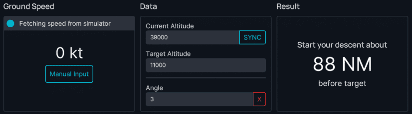
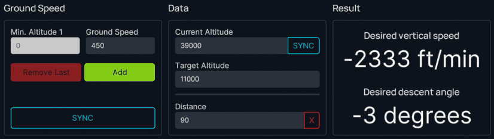
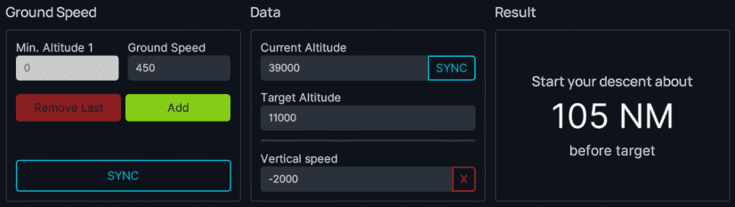
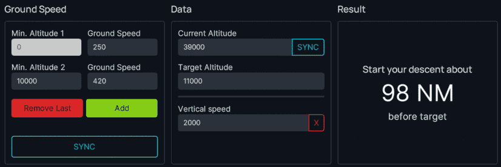
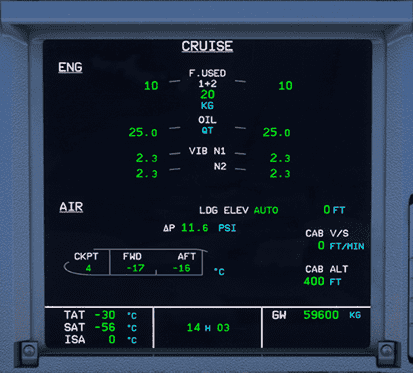
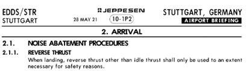

<link rel="stylesheet" href="/stylesheets/efb-interactive.css">

# flyPad Performance

## Takeoff Performance Calculator

    
    <a href="../dashboard/">   
Dashboard
</a>
    <a href="../dispatch/">    
Dispatch
</a>
    <a href="../ground/">      
Ground
</a>
    <a href="../performance/"> 
Performance
</a>
    <a href="../charts/">      
Navigation & Charts
</a>
    <a href="../online-atc/">  
Online ATC
</a>
    <a href="../failures/">    
Failures
</a>
    <a href="../checklists/">  
Checklists
</a>
    <a href="../presets/">     
Presets
</a>
    <a href="../settings/">    
Settings
</a>
    Click on the menu icons in this image to see other flyPad pages.

This calculator lets the pilots:

1.	Determine if the airplane can take off at the intended takeoff weight from a designated runway at a specified temperature, wind, and QNH setting using a specified airplane configuration and bleed settings (A/I and A/C);
2.	Determine the Flex temperature if a reduced thrust setting (Flex) can be used; 
3.	Determine the appropriate takeoff speeds, V1, VR, and V2, for the conditions specified.

!!! tip "Takeoff Performance Examples and Guide"
    To learn more about how to plan and identify the required information to input into the flyPad takeoff performance calculator, see our guide:

    [Advanced Takeoff Calculator Guide](../../../pilots-corner/advanced-guides/flight-planning/takeoff-perf-calc.md){ .md-button }

The calculator considers the following potentially limiting conditions:

- Runway Length
- 2nd Segment Climb Performance
- Ground Minimum Control Speeds (VMCG)
- Maximum Brake Energy Speed (VMBE)
- Maximum Tire Speed

!!! warning ""
    Takeoff obstacle clearance is not currently covered.

### Usage

All input fields must be filled before the "Calculate" button becomes available. There are two ways in which certain input fields can be automatically filled. If [SimBrief data 
has been loaded into the EFB](dashboard.md), airport and runway information (including runway bearing, TORA, runway elevation, and runway slope), as well as environmental data 
(wind, temperature, and QNH), can be automatically filled in by selecting "OFP" in the upper right drop-down selection box and clicking on the **Fill data from**.

This will load the environment data used by your SimBrief flight plan. You can either change/update the environment data or load it from scratch automatically without having
loaded it from the OFP by ensuring the Airport input field in the calculator is filled, then selecting "METAR" in the upper right drop-down selection box and clicking on **Fill
data from**.

### Information Required

**Airport**

- Enter the ICAO code for the airport. See the examples in [Advanced Takeoff Calculator Guide](../../../pilots-corner/advanced-guides/flight-planning/takeoff-perf-calc.md).

**Runway**

- Enter the runway number of the runway being used for takeoff.

**Runway Bearing** 

- This is the direction of the runway referenced to magnetic North. It will be filled automatically after entering the runway number.

**TORA**

- This is the length of the portion of the runway available for takeoff. It will be filled automatically after entering the runway number. Be aware that this information comes 
from the MSFS 2020 runway length data and may not always be accurate. We recommend checking the TORA distance with the airport 10-9 (or 10-9A) chart as shown in the examples in [Advanced Takeoff Calculator Guide](../../../pilots-corner/advanced-guides/flight-planning/takeoff-perf-calc.md), especially if you plan an intersection departure. You should also reduce the TORA if you start on the runway, as MSFS 2020 typically places the airplane well forward of the beginning of the TORA.
- If you enter a TORA that is less than the MSFS 2020 runway length, the difference will be shown as a TO Shift (takeoff shift) value in the replica of the MCDU performance 
  page on the right side of the calculator. 

!!! warning "TO Shift - Not Yet Implemented"
    This is for information only at this point since the TO Shift entry in the MCDU Takeoff Perf Page is not yet implemented.

**Entry Angle** 

- This is the angle of the taxiway to the runway. An input is needed to allow the calculator to reduce the TORA distance by the distance used to align the airplane on 
the runway for takeoff (since the runway behind the airplane should not be used to calculate takeoff performance). The entry angle can be determined from the airport 10-9 (or 10-9A) chart as shown in the examples in [Advanced Takeoff Calculator Guide](../../../pilots-corner/advanced-guides/flight-planning/takeoff-perf-calc.md).

**Runway Elevation** 

- This is the elevation of the runway at the beginning of the TORA. It will be automatically filled after entering the runway number. It can also be determined or checked from
  the airport 10-9 chart, as shown in the following examples in [Advanced Takeoff Calculator Guide](../../../pilots-corner/advanced-guides/flight-planning/takeoff-perf-calc.md).

**Runway Slope** 

- This is the gradient of the runway in the direction of takeoff. It will be automatically entered after entering the runway number. It can also be determined or checked from 
the airport 10-9 chart, but requires a little calculation from the data present on Jeppesen charts, as shown in the examples in [Advanced Takeoff Calculator Guide](../../../pilots-corner/advanced-guides/flight-planning/takeoff-perf-calc.md). A negative slope is downhill, while a positive slope is uphill.

**Runway Condition** 

- This allows input of runway conditions, including dry, wet, and numerous types of runway contamination. It defaults to a dry runway. Although the calculations are provided 
for other runway conditions, be aware that MSFS 2020 currently does not simulate these surface conditions properly.

**Wind** 

- The wind can be input simply as the headwind component (a single positive number) or tailwind component (a single negative number), or it can be input in the form degrees/kts. 
It can be automatically entered from either the OFP or the METAR as described above. If you enter the wind yourself, be sure you are entering the wind in terms of a magnetic 
  direction rather than the true direction. ATIS winds will be provided in terms of a magnetic direction, but METAR winds are in terms of true direction. If you enter the winds 
  from METAR, consult the airport 10-9 (or 10-9A) chart to determine the magnetic variation and convert the direction to magnetic, as shown in the following examples in [Advanced Takeoff Calculator Guide](../../../pilots-corner/advanced-guides/flight-planning/takeoff-perf-calc.md). If you choose to enter the winds automatically from the 
  METAR, this conversion will be done automatically.

- If the wind direction is given as variable, enter the wind direction into the takeoff performance calculator as a tailwind. If the wind direction varies between 2 values, 
enter the wind direction that will result in the largest tailwind (if the direction includes a tailwind direction) or the smallest headwind. If the wind speed includes a gust value, enter only the steady wind value. 

**Temperature** 

- This is simply the outside air temperature. It can be automatically entered from either the OFP or the METAR as described above. It can also be entered manually based on 
either the active ATIS or METAR.

**QNH** 

- This is the sea-level atmospheric pressure at the airport. It can be automatically filled from either the OFP or the METAR as described above. It can also be entered manually 
based on either the active ATIS or METAR.

**Takeoff Weight**

- This is the weight at which the airplane starts the takeoff (after taxiing to the runway). It can either be automatically entered from the OFP as described above or entered 
manually.

**CG Position** 

- This is the takeoff CG position. The standard CG position is the default entry. Select the forward CG position if the takeoff CG is forward of (less than) 27% MAC. (The 
standard CG envelope’s forward limit for takeoff is 25% MAC. However, considering the accuracy of loading calculations and to allow a tolerance, the extended forward CG takeoff performance should be used anytime the takeoff CG position is forward of 27% MAC.)

**Configuration**

- This is the flap/slat position to be used for takeoff. It is defaulted to CONF 1+F.
- Other choices are: 
    - Optimum (which will provide the highest Flex temperature, or if the Flex temperatures are the same, the lowest takeoff speeds); 
    - CONF 2, or 
    - CONF 3.

**Thrust**

- This is the thrust rating that will be used for takeoff. Flex (a reduced thrust) is the default, but TOGA can be selected. If Flex is selected but TOGA must be used, the 
calculator will inform you and perform the calculation with TOGA thrust.

**Anti-Ice** 

- This refers to the setting of the anti-ice bleeds. It defaults to off. Select engine or engine + wing anti-ice if anti-ice will be used for takeoff. Using anti-ice will 
reduce the takeoff thrust.

**Packs** 

- This refers to whether the air conditioning packs will be on for takeoff. It defaults to on, but can be changed to off if the air conditioning packs will 
be off for takeoff. Turning the air conditioning packs off allows the engines to produce more takeoff thrust.

## Top of Descent Calculator

    
    <a href="../dashboard/">   
Dashboard
</a>
    <a href="../dispatch/">    
Dispatch
</a>
    <a href="../ground/">      
Ground
</a>
    <a href="../performance/"> 
Performance
</a>
    <a href="../charts/">      
Navigation & Charts
</a>
    <a href="../online-atc/">  
Online ATC
</a>
    <a href="../failures/">    
Failures
</a>
    <a href="../checklists/">  
Checklists
</a>
    <a href="../presets/">     
Presets
</a>
    <a href="../settings/">    
Settings
</a>
    Click on the menu icons in this image to see other flyPad pages.

This calculator helps the pilot to calculate when to start descending (aka the Top of Descent) based on various variables so that different scenarios can be calculated (e.g., descending with 3° descent rate, descending with a given vertical speed, etc.).

For more information about descent and approach planning, see our guide: [Descent and Approach Planning](../../../../pilots-corner/a32nx/a32nx-beginner-guide/descent.md#1-descent-and-approach-planning)

### Usage

There are several scenarios for the TOD Calculation:

1. Fixed Angle of Descent:
    - Descending from altitude X to altitude Y with a fixed descent angle (commonly 3°)
2. Fixed Distance to Navigation Fix:
    - Descending from altitude X to altitude Y within a fixed distance (e.g., 90 NM)
3. Fixed Rate of Descent:
    - Descending from altitude X to altitude Y within a fixed vertical speed (e.g., - 2000 ft/min)

Depending on the scenario, ground speeds are included in the calculation to take into account that we usually also slow down at some point during descent.

The flyPad TOD calculator can be used for all of these scenarios.

#### Angle of Descent

To calculate the TOD with a fixed angle of descent, we simply have to enter the starting altitude and the desired target altitude.
We can also enter a certain angle besides 3°. But 3° is a common standard descent angle in aviation and rarely needs to be changed.

Example:

- Cruising altitude: 39 000 ft
- Target altitude: 11 000 ft
- Descent angle: 3°
- Ground Speed: has no impact on the calculation because of the fixed angle.

{loading=lazy}

**Result: We need to start our descent ^^88 NM^^ before the target fix, at which we want to reach 11 000 ft.**

#### Distance to Fix

To calculate the TOD with a fixed distance to a specific fix, we have to enter the starting altitude, the desired target altitude, and the distance to the target fix.

Example:

- Cruising altitude: 39 000 ft
- Target altitude: 11 000 ft
- Distance to fix: 90 NM
- Ground Speed: 450 kt (constant)

{loading=lazy}

**Result: We need to start our descent 90 NM before the target fix with either an average ^^vertical speed of - 2333 ft/min^^ or an average ^^descent angle of - 3.0°^^** during the descent distance.

!!! note ""
    The above result is averaged over the descent distance, and the values are approximations. For more precision, use one of the other two methods.

#### Rate of Descent

To calculate the TOD with a fixed vertical speed (rate of descent) we have to enter the starting altitude, the desired target altitude, and the desired vertical speed.

Example:

- Cruising altitude: 39 000 ft
- Target altitude: 11 000 ft
- Vertical Speed: - 2000 ft/min
- Ground Speed: 450 kt (constant)

{loading=lazy}

**Result: We need to start our descent ^^105 NM^^ before the target fix with a vertical speed of - 2000 ft/min**

#### Ground Speed and Wind

To allow for different ground speeds during descent, the calculator allows entering several altitude levels with the corresponding ground speed. This will be included in the calculations.

Example:

- Cruising altitude: 39 000 ft
- Target altitude: 11 000 ft
- Vertical Speed: - 2 000 ft/min
- Ground Speed: 420 kt at or above 10 000 ft, 250 kt below 10 000 ft

{loading=lazy}

**Result: We need to start our descent ^^98 NM^^ before the target fix with a vertical speed of -2 000 ft/min**

!!! note "Wind"
    Wind is not a factor and can be ignored as these calculations are done based on ground speed which includes any wind impacting an aircraft in the air.

## Landing Performance Calculator

The primary purpose of this calculator is to aid the flight crew in assessing whether a landing can be safely made within the given runway length in existing conditions. The pilot can also use this tool to determine the appropriate level of braking and whether reverse thrust is needed to stop within the available runway distance. 

The calculator results are shown both numerically and graphically. Variations in airplane configuration, approach speed, runway surface condition, and other parameters can also be investigated to see their effect on the airplane's landing distance. The landing distance results include a safety margin of 15 % added to the calculated distance.

    
    <a href="../dashboard/">   
Dashboard
</a>
    <a href="../dispatch/">    
Dispatch
</a>
    <a href="../ground/">      
Ground
</a>
    <a href="../performance/"> 
Performance
</a>
    <a href="../charts/">      
Navigation & Charts
</a>
    <a href="../online-atc/">  
Online ATC
</a>
    <a href="../failures/">    
Failures
</a>
    <a href="../checklists/">  
Checklists
</a>
    <a href="../presets/">     
Presets
</a>
    <a href="../settings/">    
Settings
</a>
    Click on the menu icons in this image to see other flyPad pages.

### Usage

Enter the required data into the calculator fields. The initial state of the calculator will have all input fields blank except for runway condition (Dry), flap setting (Full), overweight procedure (No), and reverse thrust (No). 
It is important to note that all fields must be filled to activate the "Calculate" button. The "Clear" button will return input fields to the initial state. 

Weather data can be automatically filled by entering an airport ICAO and pressing "Get METAR". How to get the information for all the fields is described in the following section.

- Wind, Temperature, QNH:
    - This information can be obtained from the METAR or ATIS.

- Rwy Altitude:
    - This information can be obtained from the airport chart (see example below).

- Rwy Heading:
    - This information can be obtained from the airport chart (see example below).

- Rwy Condition:
    - This information can be obtained from the METAR or ATIS and from NOTAMs on the OFP (Operational Flight Plan).
    - SimBrief provides field condition reports (FICONs) which helps populate appropriate data for this field.
        - For detailed information see the [RWY Conditions](../../../../pilots-corner/airliner/airliner-flying-guide/runway-conditions.md#rwy-conditions)
          section on the landing calculator additional info page.

- Rwy Slope:
    - This information can be obtained from the airport chart (see example in [Landing Calculator Additional Info](../../../../pilots-corner/airliner/airliner-flying-guide/runway-conditions.md#example-chart){target=new}) but requires a little calculation.
    - Formula: (((Runway elevation on touchdown side) - (Runway elevation on far side)) / Runway length) * 100.
    - E.g., EDDM 26R: 1449 ft - 1467 ft = - 18 ft.
    - Then - 18 ft / 13 123 ft = - 0.001 37.
    - Then - 0.00137 * 100 = - 0.137 % slope.

- Rwy LDA (Landing Distance Available):
    - This information can be obtained from the airport chart (see example below).

- Approach Speed: MCDU PERF APPR
    - This is part of the MCDU PERF APPR page and can be taken from there (V~APP~).

    {loading=lazy}

- Weight:
    - This information can be obtained from the ECAM SD bottom-right corner (GW 59 600 kg in the example below).

    {loading=lazy}

- Flaps:
    - Planned landing flap setting (CONF FULL or CONF 3).

- Overweight Procedure:
    - Will the landing weight be greater than the maximum landing weight (Yes or No).
    - Reminder: maximum landing weight is 67 400 kg.

- Reverse Thrust:
    - Will reverse thrust be used (Yes or No)?
    - Use of reverse thrust on a wet or contaminated runway would be considered necessary for safety reasons.
    - May be subject to airport requirements. If there are airport requirements regarding the use of reverse thrust, these can be found on the airport chart (see example below).

    {loading=lazy}

- Autoland:
    - If an Autoland is planned, then set this to Yes.

### Example Data

Below you can find an example of runway details and how to identify it to input data into the respective fields.

#### Example Chart:

{loading=lazy}

*Copyright © 2021 Navigraph / Jeppesen 
"Navigraph Charts are intended for flight simulation use only, not for navigational use."*

#### Example 1

This runway can be used for landing in the given circumstances and full flaps in all braking configurations (low, medium, max manual).

{loading=lazy}

#### Example 2

This runway's landing distance available is long enough to be used for landing with full flaps only and with max manual braking.
Be aware that there might be other restrictions that prohibit landing of an A320neo on this airport/runway.

{loading=lazy}

#### Example 3

This runway can't be used for landing in the given circumstances. It is similar to Example 2 but has a higher weight and therefore higher approach speed.

{loading=lazy}

*[TORA]: Take-Off Run Available
*[QNH]: sea level atmospheric pressure
*[OFP]: Operational Flight Plan
