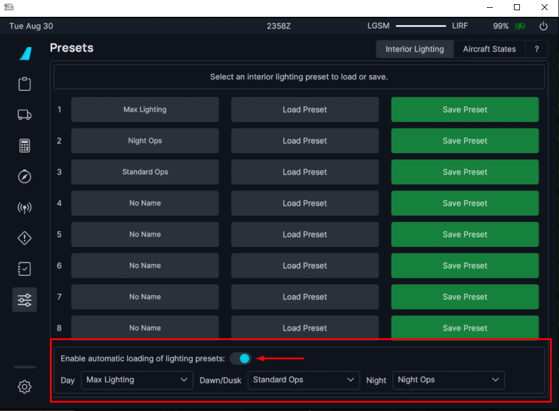
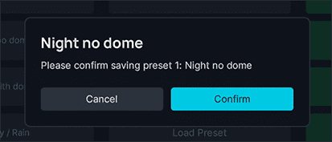

<link rel="stylesheet" href="/stylesheets/efb-interactive.css">

# Interior Lighting and Aircraft Presets

## Interior Lighting Presets

    
    <a href="../dashboard/">   
Dashboard
</a>
    <a href="../dispatch/">    
Dispatch
</a>
    <a href="../ground/">      
Ground
</a>
    <a href="../performance/"> 
Performance
</a>
    <a href="../charts/">      
Navigation & Charts
</a>
    <a href="../online-atc/">  
Online ATC
</a>
    <a href="../failures/">    
Failures
</a>
    <a href="../checklists/">  
Checklists
</a>
    <a href="../presets/">     
Presets
</a>
    <a href="../settings/">    
Settings
</a>
    Click on the menu icons in this image to see other flyPad pages.

### Usage

The Interior Lighting Presets page allows you to save and load up to 8 presets for lighting levels of all internal 
lights and display brightness settings. 

Lighting presets can be loaded [manually](#manual) or [automatically](#automatic).

!!! tip "Lighting Preset can only be loaded and saved when the aircraft is powered." 

#### Changing Preset Name

To change a preset's name, click on the current name of the preset and change the name to any string up to 16 characters. When you leave the input field, a confirmation dialog will ask you to confirm the name change. Press `Confirm` to save the new name.   

#### Load a Preset

##### Manual

To load a preset, please click on the "Load Preset" button. The aircraft must be powered for the buttons to be enabled. 

---

##### Automatic

You can also configure the aircraft to set your lighting preset automatically depending on the time of day. There are three configurable settings based on the simulator's time of day.

!!! warning ""
    Using the automatic preset only sets the aircraft lighting once (when enabled or aircraft power is switched on). This feature will not automatically change your flight deck lighting as time progresses during your flight.

Select a preset from the dropdown menu and ensure that you enable the feature using the toggle.

#### Save a Preset

To save a preset, please click on the "Save Preset" button. The aircraft must be powered for the buttons to be enabled.

A confirmation dialog will appear to prevent you from accidentally overwriting existing presets. 

## Aircraft Presets

Aircraft presets allow you to automatically let a virtual co-pilot set up your aircraft to the requested preset state. 

When loading a preset, the virtual co-pilot will perform all necessary setup tasks in real time. Therefore, systems like ADIR alignment, APU start, Engine starts will take the usual time to start up. 

You as the pilot can use the time to set up the FMGC (MCDU), Flight Control Unit (FCU), Transponder-Ident and radios.

!!! warning "It is important that you still set up the MCDU and FCU correctly for a successful flight."

!!! tip "Aircraft presets can only be used on the ground."

!!! tip "Interference While Loading a Preset" 
    You can interfere with the setup of the virtual co-pilot any time, but it will be your own responsibility to make sure the setup is correct after the virtual co-pilot has finished setting up. Also, there is the risk that the virtual co-pilot will wait for certain steps to complete forever if you interrupt these steps before they complete. 

    E.g., if the virtual co-pilot started the APU and you turn it off before the procedure is complete it can happen that the virtual co-pilot waits in vain for this step to complete. In this case, you must cancel the loading with the `Cancel` button. 

### Loading a Preset

    
    <a href="../dashboard/">   
Dashboard
</a>
    <a href="../dispatch/">    
Dispatch
</a>
    <a href="../ground/">      
Ground
</a>
    <a href="../performance/"> 
Performance
</a>
    <a href="../charts/">      
Navigation & Charts
</a>
    <a href="../online-atc/">  
Online ATC
</a>
    <a href="../failures/">    
Failures
</a>
    <a href="../checklists/">  
Checklists
</a>
    <a href="../presets/">     
Presets
</a>
    <a href="../settings/">    
Settings
</a>
    Click on the menu icons in this image to see other flyPad pages.

To load a preset, click on the corresponding preset button. 

    
    <a href="../dashboard/">   
Dashboard
</a>
    <a href="../dispatch/">    
Dispatch
</a>
    <a href="../ground/">      
Ground
</a>
    <a href="../performance/"> 
Performance
</a>
    <a href="../charts/">      
Navigation & Charts
</a>
    <a href="../online-atc/">  
Online ATC
</a>
    <a href="../failures/">    
Failures
</a>
    <a href="../checklists/">  
Checklists
</a>
    <a href="../presets/">     
Presets
</a>
    <a href="../settings/">    
Settings
</a>
    Click on the menu icons in this image to see other flyPad pages.

To avoid accidentally loading a preset, a confirmation dialog will appear. 

    
    <a href="../dashboard/">   
Dashboard
</a>
    <a href="../dispatch/">    
Dispatch
</a>
    <a href="../ground/">      
Ground
</a>
    <a href="../performance/"> 
Performance
</a>
    <a href="../charts/">      
Navigation & Charts
</a>
    <a href="../online-atc/">  
Online ATC
</a>
    <a href="../failures/">    
Failures
</a>
    <a href="../checklists/">  
Checklists
</a>
    <a href="../presets/">     
Presets
</a>
    <a href="../settings/">    
Settings
</a>
    Click on the menu icons in this image to see other flyPad pages.

During the loading, the status bar will show the currently executed step. 

    
    <a href="../dashboard/">   
Dashboard
</a>
    <a href="../dispatch/">    
Dispatch
</a>
    <a href="../ground/">      
Ground
</a>
    <a href="../performance/"> 
Performance
</a>
    <a href="../charts/">      
Navigation & Charts
</a>
    <a href="../online-atc/">  
Online ATC
</a>
    <a href="../failures/">    
Failures
</a>
    <a href="../checklists/">  
Checklists
</a>
    <a href="../presets/">     
Presets
</a>
    <a href="../settings/">    
Settings
</a>
    Click on the menu icons in this image to see other flyPad pages.

It will also show when the execution pauses for certain steps to complete. For example, ADIR alignment, the APU start and the engines start.

    
    <a href="../dashboard/">   
Dashboard
</a>
    <a href="../dispatch/">    
Dispatch
</a>
    <a href="../ground/">      
Ground
</a>
    <a href="../performance/"> 
Performance
</a>
    <a href="../charts/">      
Navigation & Charts
</a>
    <a href="../online-atc/">  
Online ATC
</a>
    <a href="../failures/">    
Failures
</a>
    <a href="../checklists/">  
Checklists
</a>
    <a href="../presets/">     
Presets
</a>
    <a href="../settings/">    
Settings
</a>
    Click on the menu icons in this image to see other flyPad pages.

### Canceling Loading a Preset

You can cancel loading of a preset any time by pressing the `Cancel` button. The currently executed step will be completed, and the aircraft will be in between presets in the state up to the last executed step. You can then either complete the setup manually or simply click another preset (or the same) to be loaded.   

### Aircraft States Overview

| State               | System                         |                                                  |
|---------------------|--------------------------------|--------------------------------------------------|
| Cold & Dark         | All Systems Off                |                                                  |
|                     |                                |                                                  |
| POWERED_CONFIG_ON   | BAT1 On                        | SOP: PRELIMINARY COCKPIT PREPARATION             |
|                     | BAT2 On                        |                                                  |
|                     | EXT PWR On                     |                                                  |
|                     | APU Fire Test On               | If no Ext Pwr is available, we start the APU here |
|                     | APU Fire Test Off              |                                                  |
|                     | APU Master On                  |                                                  |
|                     | APU Start On                   |                                                  |
|                     | Waiting on AC BUS Availability |                                                  |
|                     | Crew Oxy On                    | SOP: COCKPIT PREPARATION                         |
|                     | GND CTL On                     |                                                  |
|                     | CVR Test On                    |                                                  |
|                     | CVR Test Off                   |                                                  |
|                     | ADIRS 1 Nav                    |                                                  |
|                     | ADIRS 2 Nav                    |                                                  |
|                     | ADIRS 3 Nav                    |                                                  |
|                     | Strobe Auto                    |                                                  |
|                     | Nav & Logo Lt On               |                                                  |
|                     | SEAT BELTS On                  |                                                  |
|                     | NO SMOKING Auto                |                                                  |
|                     | EMER EXT Lt Arm                |                                                  |
|                     | Waiting on FWC Initialization  |                                                  |
|                     | Waiting...                     |                                                  |
|                     | APU Fire Test On               | APU fire test                                    |
|                     | APU Fire Test Off              |                                                  |
|                     | APU Master On                  | After the fire test, we start the APU                 |
|                     | APU Start On                   |                                                  |
|                     | ENG 1 Fire Test On             | ENG fire test                                    |
|                     | ENG 1 Fire Test Off            |                                                  |
|                     | ENG 2 Fire Test On             |                                                  |
|                     | ENG 2 Fire Test Off            |                                                  |
|                     | Waiting on APU Availability    |                                                  |
|                     | APU Bleed On                   |                                                  |
|                     |                                |                                                  | 
| PUSHBACK_CONFIG_ON  | EXT PWR Off                    | SOP: BEFORE PUSHBACK OR START                    |
|                     | Beacon On                      |                                                  |
|                     | FUEL PUMP 2 On                 |                                                  |
|                     | FUEL PUMP 5 On                 |                                                  |
|                     | FUEL PUMP 1 On                 |                                                  |
|                     | FUEL PUMP 4 On                 |                                                  |
|                     | FUEL PUMP 3 On                 |                                                  |
|                     | FUEL PUMP 6 On                 |                                                  |
|                     | COCKPIT DOOR LCK               |                                                  |
|                     | Await ADIRS 1 Alignment        |                                                  |
|                     | Await ADIRS 2 Alignment        |                                                  |
|                     | Await ADIRS 3 Alignment        |                                                  |
|                     | TAXI_CONFIG_ON                 |                                                  |
|                     | ENG MODE SEL START             | SOP: ENGINE START                                |
|                     | ENG 2 ON                       |                                                  |
|                     | Await ENG 2 AVAIL              |                                                  |
|                     | ENG 1 ON                       |                                                  |
|                     | Await ENG 1 AVAIL              |                                                  |
|                     | ENG MODE SEL NORM              | SOP: AFTER START                                 |
|                     | APU Bleed Off                  |                                                  |
|                     | APU Master Off                 |                                                  |
|                     | Spoiler Arm                    |                                                  |
|                     | Rudder Trim Reset              |                                                  |
|                     | Flaps 1                        |                                                  |
|                     | NOSE Lt Taxi                   | SOP: TAXI                                        |
|                     | RWY TURN OFF Lt L On           |                                                  |
|                     | RWY TURN OFF Lt R On           |                                                  |
|                     | PWS Auto                       |                                                  |
|                     | Transponder On                 |                                                  |
|                     | ATC ALT RPTG On                |                                                  |
|                     | TCAS TRAFFIC ABV               |                                                  |
|                     | Autobrake Max                  |                                                  |
|                     | TERR ON ND Capt. On            |                                                  |
|                     | T.O. Config                    |                                                  |
|                     |                                |                                                  |
| TAKEOFF_CONFIG_ON   | WX Radar On                    | SOP: TAXI                                        |
|                     | WX Radar Mode                  |                                                  |
|                     | TCAS Switch TA/RA              | SOP: BEFORE TAKEOFF                              |
|                     | Strobe On                      |                                                  |
|                     | Cabin Ready                    |                                                  |
|                     | NOSE Lt Takeoff                | SOP: TAKE OFF                                    |
|                     | LL Lt L On                     |                                                  |
|                     | LL Lt R On                     |                                                  |
|                     |                                |                                                  |
| TAKEOFF_CONFIG_OFF  | LL Lt L Off                    |                                                  |
|                     | LL Lt R Off                    |                                                  |
|                     | NOSE Lt Takeoff                |                                                  |
|                     | Strobe Auto                    |                                                  |
|                     | TCAS Switch TA/RA              |                                                  |
|                     | WX Radar Mode                  |                                                  |
|                     | WX Radar Off                   |                                                  |
|                     |                                |                                                  |
| TAXI_CONFIG_OFF     | TERR ON ND Capt. Off           |                                                  |
|                     | Autobrake Off                  |                                                  |
|                     | TCAS TRAFFIC ABV               |                                                  |
|                     | ATC ALT RPTG Off               |                                                  |
|                     | Transponder Off                |                                                  |
|                     | PWS Off                        |                                                  |
|                     | RWY TURN OFF Lt L Off          |                                                  |
|                     | RWY TURN OFF Lt R Off          |                                                  |
|                     | NOSE Lt Taxi                   |                                                  |
|                     | Flaps 0                        |                                                  |
|                     | Rudder Trim Reset              |                                                  |
|                     | Spoiler Disarm                 |                                                  |
|                     | ENG 1 Off                      |                                                  |
|                     | ENG 2 Off                      |                                                  |
|                     | ENG 1 N1 <3%                   |                                                  |
|                     | ENG 2 N1 <3%                   |                                                  |
|                     |                                |                                                  |
| PUSHBACK_CONFIG_OFF | COCKPIT DOOR OP                |                                                  |
|                     | FUEL PUMP 2 Off                |                                                  |
|                     | FUEL PUMP 5 Off                |                                                  |
|                     | FUEL PUMP 1 Off                |                                                  |
|                     | FUEL PUMP 4 Off                |                                                  |
|                     | FUEL PUMP 3 Off                |                                                  |
|                     | FUEL PUMP 6 Off                |                                                  |
|                     | Beacon Off                     |                                                  |
|                     |                                |                                                  |
| POWERED_CONFIG_OFF  | NO SMOKING Off                 |                                                  |
|                     | EMER EXT Lt Off                |                                                  |
|                     | GND CTL Off                    |                                                  |
|                     | SEAT BELTS Off                 |                                                  |
|                     | Strobe Off                     |                                                  |
|                     | Nav & Logo Lt Off              |                                                  |
|                     | Crew Oxy Off                   |                                                  |
|                     | ADIRS 3 Off                    |                                                  |
|                     | ADIRS 2 Off                    |                                                  |
|                     | ADIRS 1 Off                    |                                                  |
|                     | APU Bleed Off                  |                                                  |
|                     | APU Master Off                 |                                                  |
|                     | EXT PWR Off                    |                                                  |
|                     | BAT2 Off                       |                                                  |
|                     | BAT1 Off                       |                                                  |
|                     | AC BUS Off Check               |                                                  |
|                     | CVR Test Reset                 |                                                  |
|                     | APU Fire Test Reset            |                                                  |
|                     | ENG 1 Fire Test Reset          |                                                  |
|                     | ENG 2 Fire Test Reset          |                                                  |
|                     | FWC Init Reset                 |                                                  |

## Quick Help

For convenience, there is also a summarized help page in the flyPad for your reference. 

    
    <a href="../dashboard/">   
Dashboard
</a>
    <a href="../dispatch/">    
Dispatch
</a>
    <a href="../ground/">      
Ground
</a>
    <a href="../performance/"> 
Performance
</a>
    <a href="../charts/">      
Navigation & Charts
</a>
    <a href="../online-atc/">  
Online ATC
</a>
    <a href="../failures/">    
Failures
</a>
    <a href="../checklists/">  
Checklists
</a>
    <a href="../presets/">     
Presets
</a>
    <a href="../settings/">    
Settings
</a>
    Click on the menu icons in this image to see other flyPad pages.

