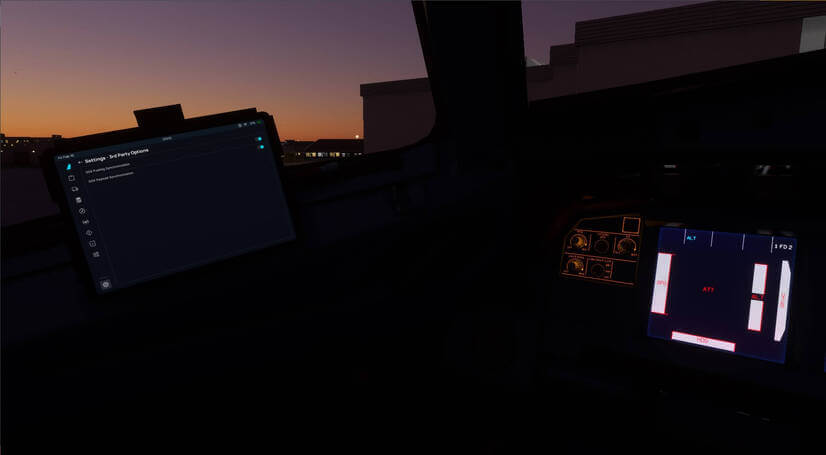

<link rel="stylesheet" href="/stylesheets/efb-interactive.css">
<link rel="stylesheet" href="../../../../stylesheets/toc-tables.css">

# GSX Integration

## Description

!!! warning "Please Note"
    This guide covers GSX Integration and the features available in the latest FlyByWire [Development Version](../../../install/fbw-versions.md#development-version-recommended).

    If you use the FlyByWire Stable version, you might not have all features available. This will be appropriately flagged throughout our doucmentation.

!!! danger "Support"
    The FlyByWire team does not take responsibility for bugs encountered while using GSX. 
    
    If you're experiencing issues with GSX, please refer to the FSDreamTeam's forums or their discord. The GSX Integration feature provided is regarding GSX interacting with FlyByWire and nothing more.

!!! abstract "FSDreamteam: [GSX](https://www.fsdreamteam.com/products_gsxpro.html){target=new}:"

    One of the most popular add-ons is back with a brand-new version, optimized for MSFS 2020. 
    
    GSX improves all Ground Services like Pushback, Catering, Refueling, Baggage Loading and Marshalling, and adds entirely new services not available as standard, such as Visible Animated Passengers, Cargo Loading, FollowMe Cars, Towbar Pushback, De-icing, Underground Refueling, Walk-in Gates, VGDS Docking Systems and more.

This integration allows you as a user to allow GSX to provide some sense of usefulness outside visual aids to the aircraft. 

This documentation takes you through all pages and functions of GSX Integration.

[//]: # (TODO need to add a picture here)

## General Usage

GSX Integration is currently limited to payload and fuel synchronization. Please refer to the quick links below or in the sidebar for more information on these features.

Enabling GSX Integration is split into the various features that GSX offers that are useful to the A32NX. They are split to provide the user with the freedom on what they want to enable. Please refer to the [Third-Party Settings](../../../common/flypados3/settings.md#3rd-party-options) page on how to enable GSX Integration.

The add-on comes with a developer-configured GSX profile. Please refer to [here](profile.md) for more information.

## GSX Pages

|                      Quick Links                       |
|:------------------------------------------------------:|
|            [Payload](payload.md)                       |
|             [Fuel](fuel.md)                            |
|               [Profile](profile.md)                    |
