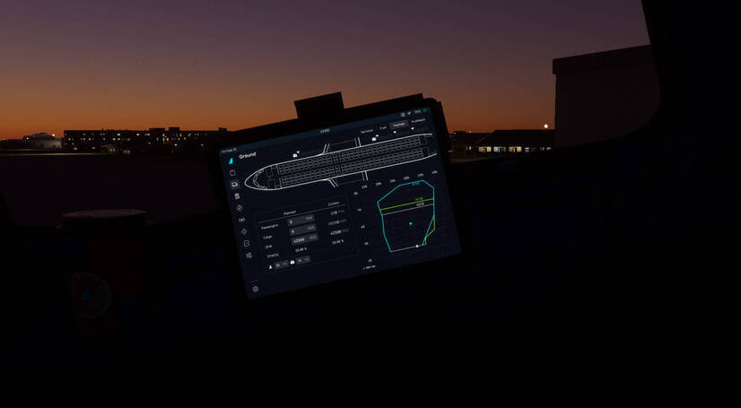

# Payload Synchronization

!!! warning ""
    You must enable [Payload Sync](../flypados3/settings.md#3rd-party-options) in order for this to function.

This page goes over how to use payload synchronization as-well as any caveats you should be aware of when using it.

## Caveats
!!! danger "READ ME"
    Please read these caveats in full to better understand what is and isn't possible regarding GSX integrations.

    Failure to understand these caveats can result in you having to disable integration to amend mistakes and possibly restarting the Couatl Engine.

- You won't witness passengers boarding the aircraft until physical passengers from GSX enter the aircraft. You'll notice this when you request boarding through the GSX menu, but nothing appears to happen in the EFB just yet.
- Due to limitations with events emitted by GSX, cargo/baggage loading is less granular and the aircraft's own weight systems will load in large chunks rather than much more fine-grained steps.
- The aircraft's own boarding sounds are disabled, as GSX has its own sound profile for boarding/deboarding. This excludes passenger ambience sounds.
- Once boarding has started, you can no longer edit the fields in the payload screen.
  
## General Usage

You may notice the payload page is slightly different, with the Play/Stop button missing. This is because boarding is now managed by GSX and thus triggering these states is done by you, the user, through the GSX Menu.

In the future, when the GSX API expands, we aim to reduce the dependency on the GSX Menu and allow you to do everything from the EFB.

1. Boarding
      - Load the aircraft as per normal, following the instructions defined in, [Setting Up Payload](../flypados3/ground.md#setting-up-payload) in the EFB.
      - Before proceeding, ensure you've set *everything* to your preferences, this is the point of NO return. 
      - Select `Request Boarding` from the GSX Menu.
      - The payload page will now enter a disabled state, where you can no longer modify anything until ***after deboarding*** has completed.
      - Continue with your pre-flight setup and/or observe on the payload page as the aircraft is boarded with passengers and cargo.

2. Deboarding
      - Once you've arrived at the gate, as per normal, Select `Request De-Boarding` from the GSX Menu.
      - Observe on the payload page the aircraft is deboarded and cargo removed.
      - Once the deboarding is complete, the payload page should once again become editable.