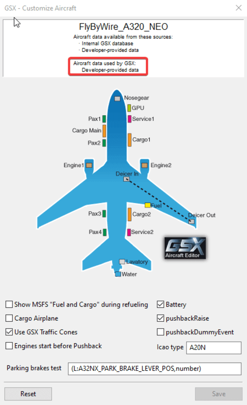
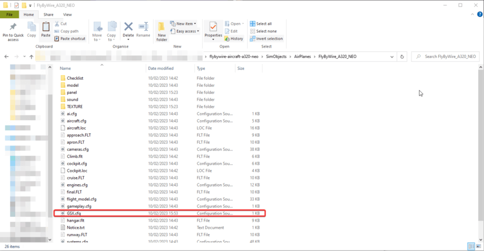
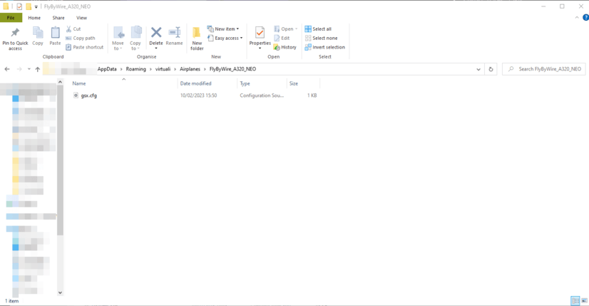

# Profile

A32NX comes with its own developer provided `GSX.cfg`, there is no action required by you as a user in order for GSX to pick up this profile automatically.

## Overview

There are a few things in the developer profile that the team felt were best to adjust to have the most seamless experience. Below you can find those alterations made.

### Entry-ways
The following doors were disabled as they cannot be opened on the current A32NX Model. When we release our custom model, this will, of course, be reflected in the developer profile.

- FWD Service Door
- AFT Cargo Door
- AFT Passenger Door

### Parking Brake Test
The correct SimVar was set to ensure that GSX correctly detects the parking brake is set.

### Payload/Fuel Window
This option has been disabled due to our custom payload and fuel systems.

### Traffic cones
As the A32NX's cones and chocks are disabled with enabling GSX Integration, this option is enabled to provide the user with cones.

## Troubleshooting
Currently, GSX may not correctly detect the developer profile as shown in [overview](#overview). To circumvent this, you can manually copy the developer profile to GSX's profile folder.

You can try restarting the flight or restarting Couatl. If there's still no success, then try the below solution.

### Manual profile overriding

To do this, please copy the `GSX.cfg` file from the add-on folder in: `flybywire-aircraft-a320-neo\SimObjects\AirPlanes\FlyByWire_A320_NEO`

and paste it as `gsx.cfg` in `%appdata%\virtuali\Airplanes\FlyByWire_A320_NEO`

## Modification

Feel free to modify the profile as you see fit. This is done through the `Customise Airplane` option in the GSX Menu. GSX will automatically create this custom CFG. You may want to do this, for example, to re-enable doors that were otherwise disabled by the developer profile.