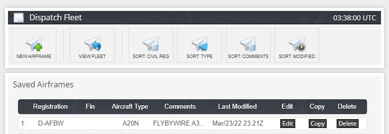
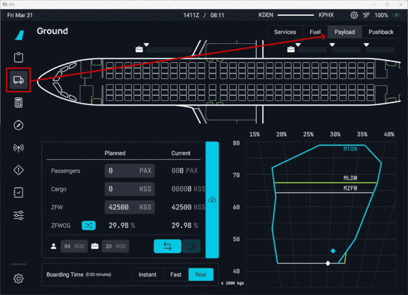
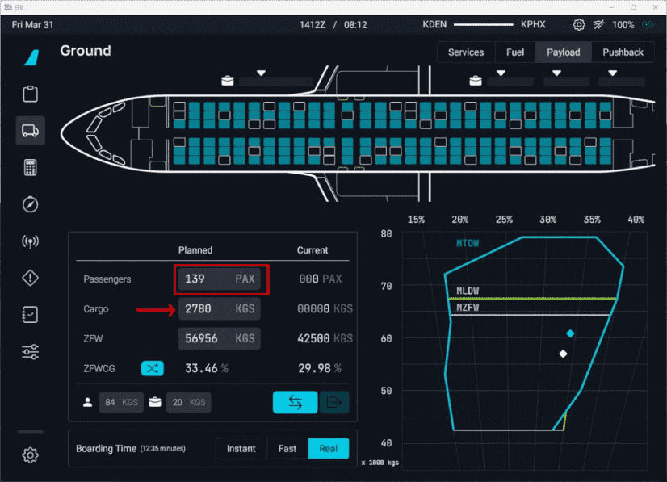
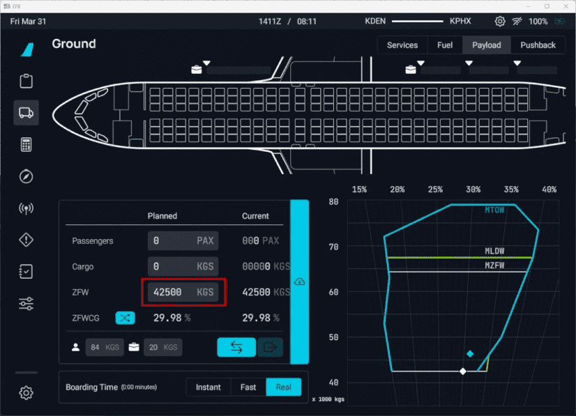
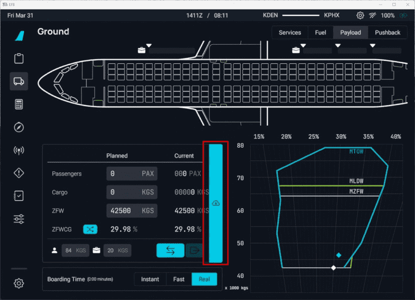
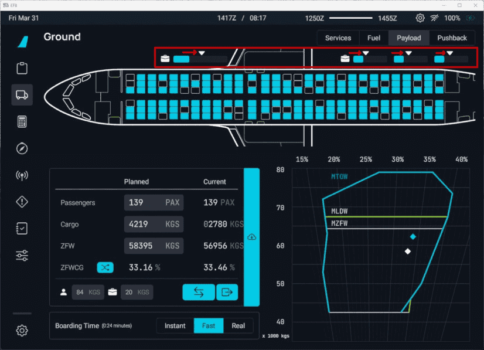
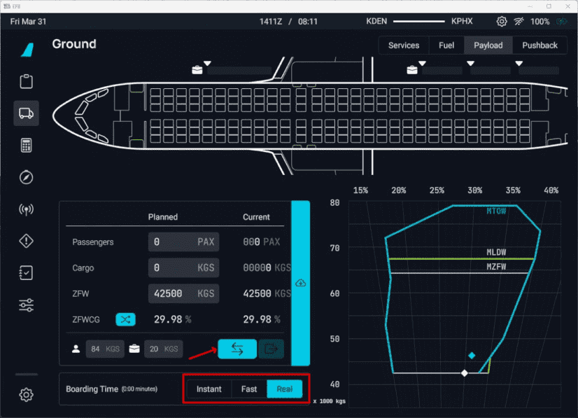
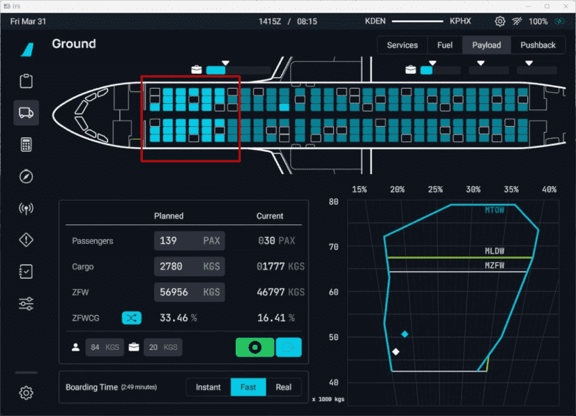

# Fuel and Weight

<link rel="stylesheet" href="/../../stylesheets/fuel-weight.css">

This section provides information on the A32NX weight configuration and insight on how to utilize and reference onboard/sim features to configure the aircraft appropriately for departure.

[//]: # ({==)

[//]: # ()
[//]: # (There are differences when using our Stable version vs. Development version.<br/>)

[//]: # (Please select the correct version below.)

[//]: # ()
[//]: # (==})

[//]: # ()
[//]: # ([Development Version]&#40;#development-version&#41;{ .md-button })

---

??? info "General Fuel and Weight Information (Click to expand)"
    ## General Fuel and Weight Information

    ### Operating Empty Weight
    
    It is important to understand that the term "operating empty weight" can seem a little generic. OEW is typically calculated as "manufacturer's empty weight + standard items + operator items". These items can be the following (not all-inclusive):
    
    - Crew members
    - Manuals
    - Food and Beverage
    - Emergency Equipment
    - and any equipment/supplies considered standard by the operator
    
    When considering your ZFW below, please keep into consideration the above information with OEW with particular regard that this weight does include the flight crew.
    
    ### Zero Fuel Weight
    
    In simple terms, the zero fuel weight (ZFW) = OEW + payload.
    
    Payload is defined as passengers, baggage, and cargo.
    
    In a situation where your payload would be approximately 14 000 kg - *based on our new airframe:* your ZFW would total - 56 500 kg (42 500 kg + 14 000 kg)
    
    You can reference this against any OFP you may have generated through simBrief. For usage of our simBrief integration - [read here](simbrief.md).
    
    ### Zero Fuel Weight Center of Gravity
    
    The A32NX will auto-calculate the ZFW and ZFWCG on the INIT B page once the aircraft and associated payload is loaded into the simulator.
    
    !!! warning "This is not your Center of Gravity for trimming."
    
    - See our [Weights and Balance](loading-fuel-weight.md#weights-and-balance) section in the simBrief integration feature guide.
    - You can read about INIT B configuration [here](../../pilots-corner/beginner-guide/preparing-mcdu.md#init-b).
    
    ### Center of Gravity
    
    An acceptable range for takeoff CG in the A32NX is between 16-40%. The CG is balanced during the passenger loading process.

    Trimming the aircraft for takeoff is usually optional and technically not required. Please reference our the [FBW Checklist](../../pilots-corner/SOP.md) to set the appropriate trim should you wish to.
    
    Anything less than 25 % CG is considered FWD load, and anything more than 25 % is considered an AFT load. While opting to choose between either CG configuration (aft/fwd), please consider the information below.
    
    !!! info "Notes on Differing CG Configurations"
    
    There are a few arguments worth considering when it comes to favoring an AFT CG or FWD CG. Generally, an AFT CG would provide for better aircraft performance (lower stall speed, drag, and angle of attack for a given lift coefficient) but generally worse for pitch stability.

    For a smaller aircraft as the A320neo, most operators would favor an AFT CG loading for fuel consumption benefits when considering the lifetime of the fleet and how easy the benefits can be obtained.

??? info "Aircraft CG Envelopes (Click to Expand)"
    ## Aircraft CG Envelopes

    Our dynamic CG and payload chart provides the relevant visual information during the planning and execution of passenger/cargo loading. Fully understanding how the 
    longitudinal CG envelope affects the aircraft can be difficult. Below is a great primer on understanding the chart and what the information provided indicates.

    <iframe src="https://vdocuments.net/embed/v1/aircraft-cg-envelopes.html" frameborder="0" marginwidth="0" marginheight="0" scrolling="no" style="border:1px solid #CCC;
    margin-bottom:5px;max-width: 100%; overflow: hidden; width: 100%; height: 600px;" allowfullscreen></iframe>`

---

## A32NX Configuration

Make sure you have our latest [simBrief Profile](../../install/installation.md#simbrief-airframe)

!!! danger "MSFS Fuel & Weights window in the toolbar"
    We have blocked the UI elements in the MSFS fuel and weights window. However, the sliders in the MSFS window are movable but in a matter of 1-3 seconds the fuel and payload levels should return to the initial value.

    {--

    **PLEASE NOTE** we have changed fuel and payload loading.

    --}

    - Fuel: Now done via the [EFB](flypados3/dispatch.md#fuel-page).
    - Payload: Done through the Payload tab on the EFB. See [Weights and Balance](#weights-and-balance)

### Weights
- OEW (Empty Weight): 42 500 kg (93 697 lb)
    - Also referred to as DOW (Dry Operating Weight) which can be seen in other simBrief OFP formats such as EZY
- MZFW (Max Zero Fuel Weight): 64 300 kg (141 757 lb)
- MTOW (Max Takeoff Weight): 79 000 kg (174 165 lb)
- MLW (Max Landing Weight): 67 400 kg (148 591 lb)

!!! tip "FMS Gross Weight (FMS GW)"
    Gross weight is calculated as: 

    !!! info ""
        Fuel Quantity (directly from the simulator's fuel system) + ZFW input in the MCDU.

    The Gross Weight (GW) value on the ECAM will appear only when certain conditions are satisfied:

    - The (INIT FUEL PRED page) has a ZFW/ZFWCG value. **Reminder:** After engines are started, INIT FUEL PRED changes to the FUEL PRED page.
    - At least one engine is running.

### Fuel
- Max Fuel Capacity: 19 046 kg (41 989 lb)
- Fuel tanks: 5
    - 2x Outer Tanks: 693 kg (1528 lb) each
    - 2x Inner Tanks: 5519 kg (12 167 lb) each
    - 1x Center Tank: 6622 kg (14 599 lb)

### Passengers
- Max Passenger Capacity: 18 096 kg (174 seats * 104 kg) (39 900 lb)
- Passenger Weight: 104 kg
    - 84 kg for passenger (including clothing and carry-on bags)
    - 20 kg for checked baggage
    - These default values can be overwritten by changing the used simBrief airframe. See [Changing Default Weights Using simBrief](#changing-default-weights-using-simbrief).
- Passenger compartments: 4
    - ECONOMY ROWS 1-6 (seats: 36 max: 3024 kg (6670 lb))
    - ECONOMY ROWS 7-13 (seats: 42 max: 3530 kg (7780 lb))
    - ECONOMY ROWS 14-21 (seats: 48 max: 4032 kg (8880 lb))
    - ECONOMY ROWS 22-29 (seats: 48 max: 4032 kg (8880 lb))

### Cargo
- Max Cargo Capacity: 9435 kg (20 800 lb)
- Cargo Compartments: 4
    - FWD BAGGAGE/CONTAINER (max: 3402 kg (7500 lb))
    - AFT CONTAINER (max: 2426 kg (5350 lb))
    - AFT BAGGAGE (max: 2110 kg (4650 lb))
    - AFT BULK/LOOSE (max: 1497 kg (3300 lb))

## Changing Default Weights Using simBrief

The A32NX uses the following default weights for passengers and their baggage.

- 84 kg for passenger (including clothing and carry-on bags)
- 20 kg for checked baggage

These default weights cannot be changed in the aircraft at the moment. It is planned to provide an option to change these defaults with a future weights and balance flyPad EFB page.

It is possible to change these defaults by changing the simBrief airframe.

To accomplish this, open your simBrief airframe on the simBrief website under "MY FLEET" by clicking the Edit button.



Scroll down to find the entries for Passenger Weight and Baggage Weight.


Change the default weights as required, and make sure you select Save Aircraft at the bottom of the page. The A32NX will use these new values the next time you import an operational flight plan based on this airframe.

!!! warning "Do Not Overload the Aircraft"
    It is the responsibility of the pilot to make sure the aircraft is not overloaded and within the specified limits.

    Especially important are:

    - MZFW (Max Zero Fuel Weight): 64 300 kg (141 757 lb)
    - Maximum payload (passengers, baggage, freight) is determined by the lowest of these calculations:
        - MZFW - OEW, or  64 300 kg - 42 500 kg = 21 800 kg
        - MTOW  - empty weight - (fuel load - taxi out fuel), or 79 000 kg - 42 500 kg - (fuel load - taxi out fuel)
        - MLW - empty weight - (all reserve/contingency fuel + extra fuel) , or 67 400 kg - 42 500 kg - (all reserve fuel/contingency/extra fuel).
    - When manually loading the payload, the MLW and MTOW limits are currently not checked and are the responsibility of the pilot.
    - Simbrief does manage payload limits by reducing the number of bags or passengers automatically. This is picked up by the aircraft correctly then.
    
    !!! danger ""
        If you manually specify a custom number of passengers that exceeds aircraft weight limitations, please be aware that the OFP will still reflect the user-selected number of passengers.

        This is in part because at the time when the OFP was generated, it interprets the passenger count as "booked passengers" and not current passengers on board the aircraft.

## Loading Fuel and Weight

!!! danger "MSFS Fuel & Weights window in the toolbar"
    We have blocked the UI elements in the MSFS fuel and weights window. However, the sliders in the MSFS window are movable but in a matter of 1 - 3 seconds the fuel and payload levels should return to the initial value.

    {--

    **PLEASE NOTE** we have changed fuel and payload loading.

    --}

    - Fuel: Now done via the [EFB](flypados3/dispatch.md#fuel-page).
    - Payload: Done through the Payload tab on the EFB. See [Weights and Balance](#weights-and-balance)

### Fuel

Fuel loading is now exclusively done via our EFB, which has a great UI to see the status of fuel tanks and other options. [Guide Here](../../common/flypados3/ground.md#fuel-page).

### Weights and Balance

We have introduced a new flight model paired with a new weight and balance payload method that incorporates seat rows and the correct center of gravity.

Get our [simBrief Profile](../../install/installation.md#simbrief-airframe).

!!! info "Please Note the Following"
    - The cargo hold field now depicts either metric tons or thousands of pounds, depending on the unit selected in the EFB Settings for aircraft configuration.
    - **Highly recommend** ensuring that you select the same weights (kg or lb) in the EFB and in simBrief's OFP/Airframe before importing to prevent any mismatch in values.

!!! warning "Cold and Dark Startup"
    
    When starting the aircraft from a **Cold and Dark** state, please be aware of the following important information:
    
    - **INIT FUEL PRED** must be completed before departure. (This is detailed in our [beginner guide](../../pilots-corner/beginner-guide/preparing-mcdu.md#init-fuel-pred). Please ensure that you complete this step when preparing the MCDU.)
    - Failure to complete the `INIT FUEL PRED` page before starting an engine will display `INITIALIZE WEIGHT/CG` in amber on the MCDU Scratchpad.    
    - When there is a GW mismatch of more than 7 tonnes between the values calculated aerodynamically and the value calculated using the inputted ZFW and fuel flow `CHECK 
    WEIGHT` will be displayed in amber on the MCDU Scratchpad.
    
    See [flyPadOS 3 - Development Version](flypados3/settings.md#aircraft-options--pin-programs) settings page if you wish to change the weight unit used by the aircraft systems.

#### Loading Guide

!!! warning "Fuel, Weights, and Balance When Not Starting Cold & Dark"
    The process described in this section is for starting the flight at a gate/ramp in a cold and dark state.

    If you start your flight on the runway or in the air, the loading process will only work if the Boarding Time [settings](flypados3/settings.md#sim-options) in the flyPad EFB are set to `Instant`. This is deliberate, as simulating the entire fueling or boarding process when starting from the runway does not make sense.

##### Finding the Payload Screen

The payload section can be found in the Ground Services Page on the EFB and selecting the Payload tab.



Once on this page, you will be presented with the following:

- A top-down model of the A32NX seating configuration
- Entry fields to configure PAX and Cargo
- Per passenger weight and baggage weight entry
- Boarding time settings
- Dynamic CG and payload chart - [Learn More Above](#aircraft-cg-envelopes).

!!! tip "Minimum Landing Weight (MLDW)"
    This will autopopulate on the CG envelope chart once you complete the `INIT FUEL PRED` page on the MCDU. MLDW is represented by a 3rd dot on the chart in green. However, 
    please note that this is placeholder logic since more accurate fuel prediction will require accurate fuel burn predictions, which are currently not yet available.

##### Passengers and Cargo Configuration

To begin boarding, you must first enter a value in the passenger entry field or the ZFW entry field. To achieve this, click on the respective entry field you wish to modify and input the value you plan or have been allocated via your OFP. This method is the simplest and will calculate appropriate values. The A32NX seat configuration will also display in cyan seats that are filled. 

!!! tip "Passenger or ZFW Field"
    It is important to note that when first entering a value in the Passenger field, it will auto-calculate the ZFW. This is conversely true if you enter a value first into the 
    ZFW field. Please utilize only a single field for your planning purposes.

This can be seen in the examples below:

!!! block ""
    {loading=lazy} 
    {loading=lazy}

If you have imported your simBrief information from the main page on our EFB, you can also automatically fill in the planned values for your passengers and cargo by clicking on 
the import button in the Payload UI.

{loading=lazy}

!!! tip "Additional Features"
    ##### Additional Features    
    
    **Extra Cargo**

    After planning your cargo and passengers or using the simBrief import function, you can add additional cargo by modifying the calculated cargo value. 

    !!! warning ""
        Please ensure you alter this value AFTER entering either your passenger or ZFW values.

    **Cargo Sliders**

    {loading=lazy}

    You can also interact with the sliders above the wireframe aircraft to fill the cargo bays. While this may be not as accurate, it does allow modification of the physical distribution of the cargo in the aircraft. The actual numerical weight of the cargo planned will update automatically.

    - Each slider represents one baggage compartment. The rear has a bulkhead and loose item storage.
    - The white arrows in the image above indicate how much cargo to fill into each respective hold.

    ---

    **Custom Passenger Allocation**

    You can also interact with the A32NX model to assign passenger seats and influence the layout of your passengers on board.

    ---

    **ZFW MAC %/CG and GW/GWCG**

    When utilizing the cyan switch button you can see the ZFW MAC %/CG and corresponding GW/GWCG reflect the correct percentage based on the appropriate calculation. 

    !!! tip ""
        In the example below you can note that the fields for ZFW and ZFWCG have been swapped to GW and GWCG respectively.

    {loading=lazy}

    GW/GWCG is the Gross Weight and Gross Weight Center of Gravity and can be used to set the trim for takeoff. We plan to extend this feature at a later time to include TOCG.

    For more information, please see the [Center of Gravity](#center-of-gravity) section above.

##### Boarding Passengers

Once you are happy with the passenger count and weights calculated, you can start boarding by pressing the cyan "Boarding" button in the boarding time section. This field also allows 
you to customize how quickly passengers enter the aircraft. 

{loading=lazy}

After boarding has started, the "Boarding" button will turn green, and you will start seeing passengers enter the aircraft, weight values changing in both the dynamic chart and the 
configuration section's current values.

The seats will also change colors from a dark to lighter cyan, indicating which seats passengers are currently occupying.

{loading=lazy}

---

## Fuel Persistence

After completing a flight, the A32NX saves the amount of fuel on board to a special directory when at least one engine is off. This feature is tied to the aircraft registration 
found in `atc_id` in the `acft.cfg`. 

If you decide to exit the simulator after your flight, loading back in at a later time with the same livery and associated registration will use the same amount of fuel from your previous flight.

These files are saved in our Work folder under `AircraftStates` alongside other files we store. The work folder can be found using this guide - [here](../../support/index.md).

!!! tip ""
    Reminder: This file is created/updated **ONLY** on the ground and with at least an engine off.

    If no registration is found, the default value is ASX320.

`AircraftStates/ASX320.ini` example:

```ini title="ASX320.ini"
[fuel]
fuel_center_quantity = 0.000000
fuel_left_quantity = 364.437298
fuel_right_quantity = 343.734621
fuel_left_aux_quantity = 228.000000
fuel_right_aux_quantity = 228.000000
```