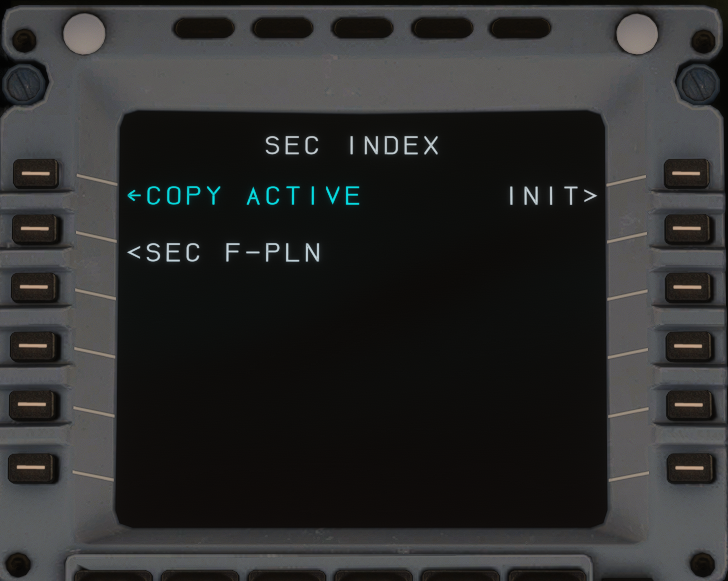

# Secondary Flight Plan

!!! info "Available On Development Version"

The A32NX now supports creating a secondary flight plan. This is a flight plan that exists in parallel with the primary flight plan.
It can be used to plan diversions, runway changes, or emergency scenarios in advance and can be activated when needed. In this section of the guide, we will go over an example use case for this feature.

!!! warning "Not Yet Implemented"
    Note that predictions are not yet computed for the secondary flight plan in the A32NX. This will be added in a future update.

## Engine-out Departure Procedure
### Preparation

In real life, one of the most common use cases for the secondary flight plan is programming an alternative departure procedure in case of an engine failure at takeoff. For this guide, we assume that the FMS has been set up for a flight from Zurich (LSZH) to Munich (EDDM). In the primary flight plan, we have planned a departure from runway 28 following the DEGES 3W SID.

{loading=lazy}

Due to the terrain in the vicinity of the airport, we cannot follow our planned SID in the event of an engine failure. Instead, we follow an alternative procedure.
We wish to climb to 2,850 ft on runway heading, then turn left to follow the 270° radial outbound from KLO. At 15 DME KLO, we turn right to GIPOL and enter a holding pattern.

To program this in the secondary flight plan, we start by creating a copy of the active flight plan using the COPY ACTIVE option on the SEC F-PLN page. This is one way to create a secondary flight plan. Another option is to create one from scratch using the INIT option. After copying the active plan, the secondary flight plan is displayed in white on the MCDU and as a white line on the ND.

{loading=lazy}

First, we change the SID to NO SID. Notice that this modification—as well as any other modifications to the secondary flight plan—does not create a temporary flight plan. This is because it is not linked to the flight guidance and therefore does not require confirmation before insertion.

{loading=lazy}

After reaching 2,850 ft, we turn left onto the 270° radial from the KLO VOR until reaching 15 DME. We can do this using a [Place-Bearing-Distance](../../../pilots-corner/a32nx/a32nx-advanced-guides/data-management.md#format-place-bearing-distance-pbd) point. We enter `KLO/270/15` into the scratchpad and select the left LSK3 next to the discontinuity. After selecting the correct KLO VOR, we insert GIPOL after PBD01. At GIPOL, we insert a holding pattern with an inbound course of 077° and right turns. This allows us to troubleshoot the issue before returning to land at LSZH.

{loading=lazy}

We can prepare the arrival back into Zurich by performing a lateral revision at GIPOL after the holding pattern. There, we type LSZH into the scratchpad and enter it as NEW DEST. Then, we select an ILS approach to runway 14 via the GIP14 transition. At this point, we have a rough flight plan programmed, and we can review the ND to confirm that it makes sense.

{loading=lazy}

To be fully prepared for our return, we also want to set up the PERF page for the approach into Zurich. To do this, we use the SEC F-PLN key on the MCDU to return to the main secondary flight plan menu. Compared to the first time, we can now access the PERF page via the right LSK2. From there, we navigate to the APPR page and enter the weather and approach data for Zurich as we would for a normal approach.

We are now well prepared for a quick return to Zurich should it be required.

### Activating the Secondary Flight Plan

We now wish to activate the secondary flight plan to guide us safely clear of terrain and into the holding pattern at GIPOL while we troubleshoot the issue. Thanks to our preparation, all we have to do is go to the SEC F-PLN page and select ACTIVATE SEC.

!!! warning "Activation of the Secondary Flight Plan"
    The ACTIVATE SEC and SWAP ACTIVE options do not appear unless the active plan and the secondary plan have the same active leg, or the aircraft is in HDG mode. If you do not see the ACTIVATE SEC option, switch to HDG mode. After activating the plan, you can re-engage NAV by performing a direct-to to a suitable waypoint.

After activating the secondary plan, all prepared entries—including route and performance data—are transferred into the active flight plan. The data that was previously in the active plan is overwritten. In some cases, you may wish to retain the original active plan; in such cases, you can swap between the active and secondary plans using the SWAP ACTIVE option.