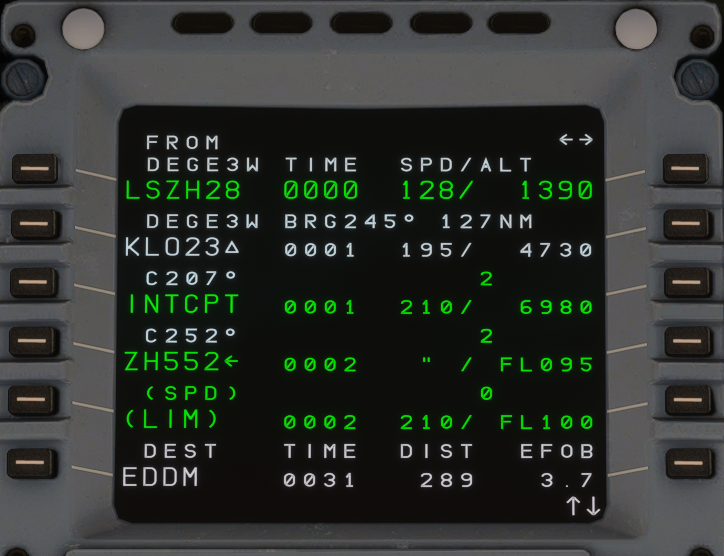
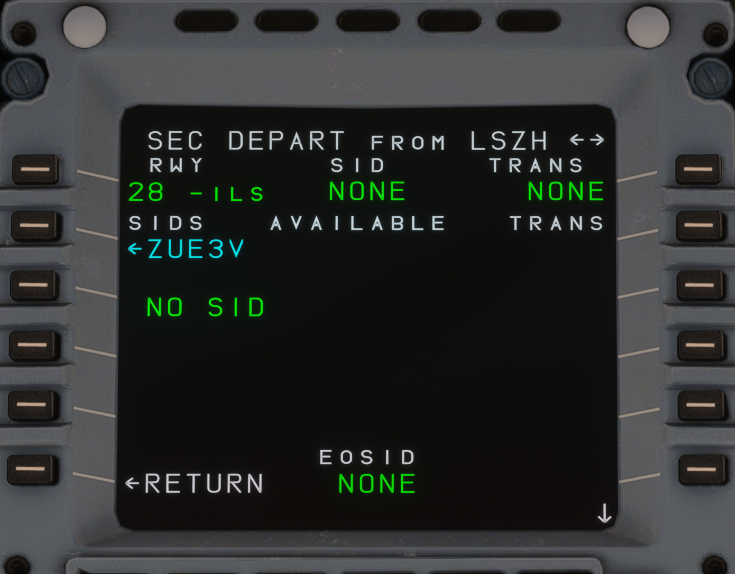
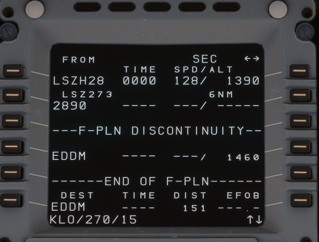
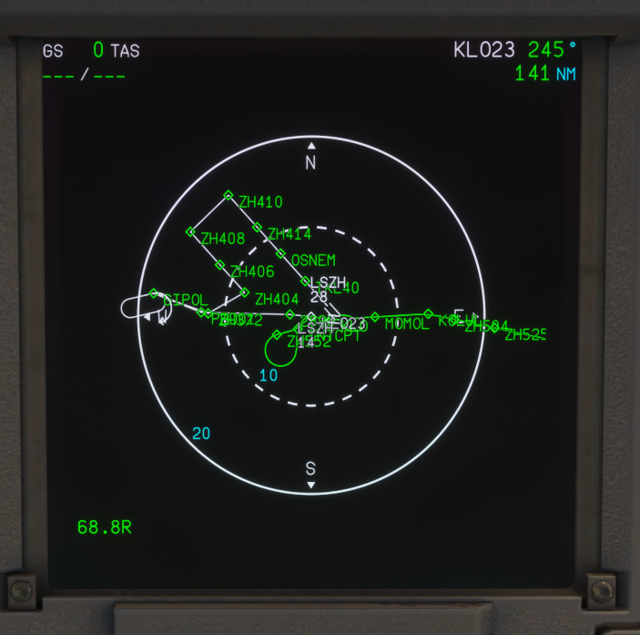

<link rel="stylesheet" href="/../../stylesheets/reported-issues.css">

# Secondary Flight Plan

The A32NX now supports making a secondary flight plan. This is a flight plan that exists in parallel to the primary flight plan.
It can be used to plan diversions, runway changes, or emergency scenarios to be prepared in advance and be activated when needed.

In this section of the guide, we will go over a few example use-cases for this feature.

## Engine-out departure procedure

In real-life, one of the most common cases for the secondary flight plan is to program an alternative departure procedure in case of an engine failure at takeoff. For this guide, we assume that the FMS has been set up for a flight from Zurich (LSZH) to Munich (EDDM). We have planned for a departure from runway 28 to follow the DEGES 3W SID.

{loading=lazy}

Due to the terrain in the vicinity of the airport, we cannot follow our planned SID if we have an engine failure. For this reason, we have to follow an alternate procedure.
We wish to climb to 2850 ft on runway heading, then turn left to follow the 270 radial outbound KLO. At 15 DME KLO, we turn right to GIPOL and hold.

To program this in the secondary flight plan, we start by creating a copy of the active flight plan. The secondary flight plan is displayed in white on the MCDU and as a white line on the ND.
First, we will change the SID to be NO SID. Notice that this modification - as well as any other modifications - to the secondary flight plan does not create a temporary flight plan. This is because it is not linked to the flight guidance and therefore does not require confirmation before insertion.

{loading=lazy}

After reaching 2850 ft, we will turn left onto a radial of 270° from the KLO VOR until reaching 15 DME. We can do this with a place-bearing-distance (TODO LINK) point. We enter `KLO/270/15` into the scratchpad and click the left LSK3 next to the discontinuity. After selecting the correct KLO VOR, we can finally insert GIPOL after the PBD01. At GIPOL, we insert a holding pattern with an inbound course of 077° and right turns. This would allow us to troubleshoot our issue before coming back to land at LSZH.

{loading=lazy}

We can prepare the arrival back into Zurich by performing a lateral revision at GIPOL after the holding pattern. There, we can type LSZH into the scratchpad and enter it as NEW DEST. Then, we will select an ILS approach to runway 14 with the GIP14 VIA. At this point, we have a rough flight plan programmed in, we can have a look at the ND to confirm that this makes sense.

{loading=lazy}

To be really well prepared for our return, we want to set up the PERF page for the approach into Zurich as well. To do this, we use the SEC F-PLN key on the MCDU to go to the main secondary flight plan menu. Compared to the first time, we can now access the PERF page via the right LSK2. Then click through the APPR page where we can enter the weather and approach data for Zurich as we would for a normal approach.