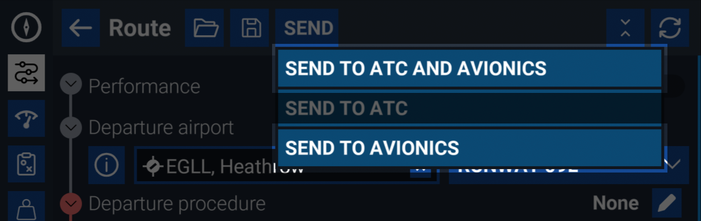
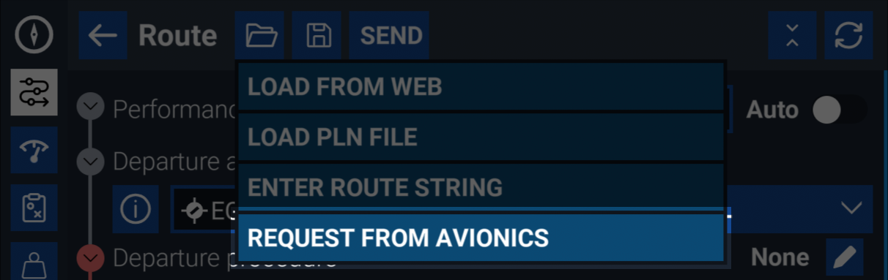
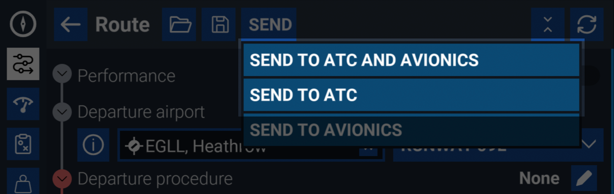

# Flight Planning With MSFS

## Overview

Depending on which simulator you use, there are different flight planning tools to your disposal and their level of compatibility and integration vary. MSFS 2020 offers a built-in World Map flight planner, ATC system, and VFR Map. However, these features are simplified and may not fully align with the capabilities of complex aircraft like the FlyByWire A32NX and A380X.

MSFS 2024 introduced significant improvements to the built-in flight planning and ATC systems, enhancing their compatibility with complex aircraft. However, some limitations may still exist.

## MSFS 2024

Flight planning integration with MSFS 2024 revolves around the built-in EFB. This is different from our in-aircraft EFB, the [flyPad](../flypados3).

### Loading a route from the EFB into the aircraft

1. Plan your route in the MSFS EFB
2. Select the "SEND" menu at the top of the Route page
3. Select either "SEND TO AVIONICS" or "SEND TO AVIONICS AND ATC" depending on whether you want to [file the flight plan with ATC](#filing-a-flight-plan-with-atc) as well.

{loading=lazy}

??? note "Loading the EFB route automatically"
    If you want the route to automatically load into the aircraft's FMS when spwaning in, enable the "Automatically Load MSFS Route" option in the flyPad "Sim Options" page. ADD LINK

### Loading a route from the online flight planner

Loading a route from the [online flight planner](https://planner.flightsimulator.com/) into the aircraft's FMS is done by first loading the route into the EFB, then following the steps to load a route from the EFB into the aircraft.

### Retrieving a route from the aircraft into the EFB

1. Select the "OPEN" (folder icon) menu at the top of the Route page in the EFB
2. Select "REQUEST FROM AVIONICS"

{loading=lazy}

!!! note "Limitations of retrieved routes"
    As with real-world equivalents, there are limitations to the type of information that can be transmitted between flight planning systems and aircraft. Notably,
    a lot of modifications made in the aircaft FMS cannot be represented, such as adding holds, offsets, modifying/cutting procedures, adding fly-overs, and more.
    
    While our FMS tries its best to convert a full flight plan into a route description, some information may be lost in translation. Always double-check the route for accuracy and completeness.

### Filing a flight plan with ATC

Planning a route in the MSFS EFB or retrieving it from the aircraft does not automatically file it with ATC.

1. Plan your route in the MSFS EFB or retrieve it from the aircraft
2. Select the "SEND" menu at the top of the Route page
3. Select "SEND TO AVIONICS AND ATC" or "SEND TO ATC" depending on whether you want to also [load the route into the aircraft's FMS](#loading-a-route-from-the-efb-into-the-aircraft) as well.

{loading=lazy}

## MSFS 2020

!!! warning "Synchronization Issues Expected"
    The aircraft's custom Flight Management System provides better accuracy and features over the default flight plan manager in Microsoft Flight Simulator which results in issues syncing the flight plan from the MCDU back into the simulator. Do not expect it to work properly in all cases.
