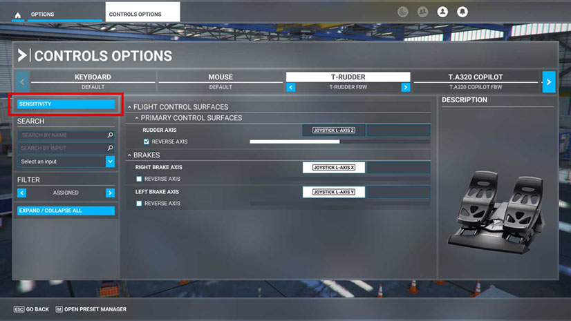
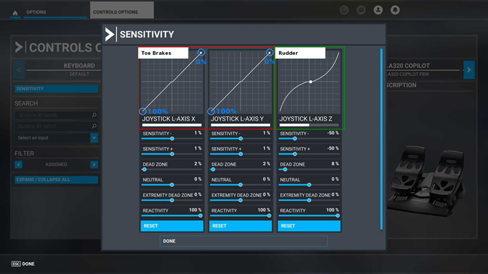
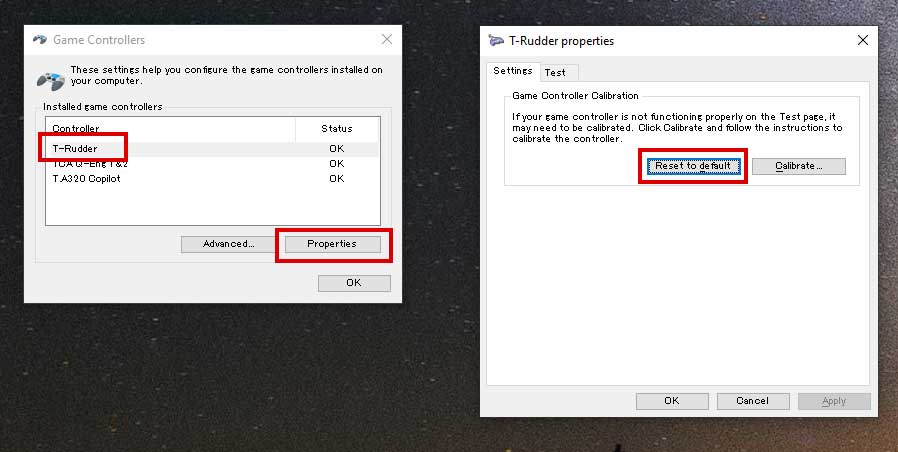
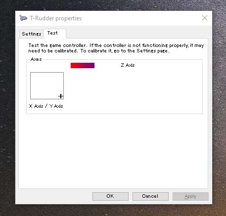
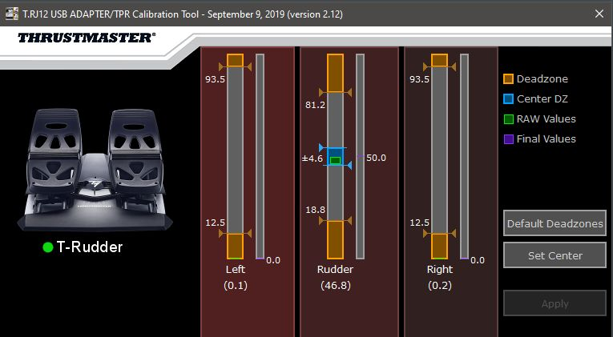

# Thrustmaster T.Flight Rudder Pedal Settings

## Introduction

This guide will help you set up your pedals for use with the FlyByWire A32NX.

!!! tip ""
    You do not need to install the **`Unified Drivers Package - 2018.FFD.2`** driver as it will make the reset/calibration dialog unavailable. If you accidentally installed it, the driver can be removed from **`Add or remove programs`** in the Windows Start menu.

## Microsoft Flight Simulator Control Options

### 1. Open Control Options

Open **`Control Options`**, choose your pedals and click on the **`Sensitivity`** button.

{loading=lazy}

### 2. Confirm Calibration

Check that the mappings are correct. If you push the pedals forwards ("toe brakes"), the Joystick L-Axis X and Joystick L-Axis Y indicators should move from top right (0% brakes applied) to bottom left (100% brakes applied). If the Joystick L-Axis X/Y indicators behave differently, you will need to calibrate your pedals.

{loading=lazy}

### 3. Reset and Calibrate (Optional)

1. From the Windows Start menu or the Control Panel, search for **`Set up USB game controllers`**.
2. Your game controllers should be displayed. Select your pedals (i.e., **`T-Rudder`**) from the list. Click the **`Properties`** button. {loading=lazy}
3. From the **`Settings`** tab, click on **`Reset to default`**.
4. Click on the **`Test`** tab to confirm the settings. The cursor should be displayed in the bottom-right corner (0% brakes applied) or top-left corner (100% brakes applied), while the Z-Axis indicator should be at 50% if the rudder is centered. {loading=lazy}

### 4. Define Deadzones (Optional)

If you experience rudder twitching, your deadzones might not be configured correctly.

1. Download and install the Advanced Calibration Software from the [Thrustmaster Support Page](https://support.thrustmaster.com/en/product/tfrp-en/).
2. Adjust the deadzones in the Calibration Tool until the flickering from the pedal sensors are contained. {loading=lazy}
