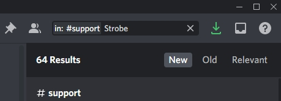
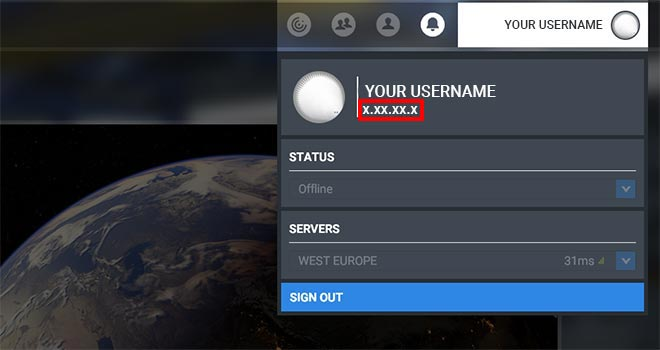
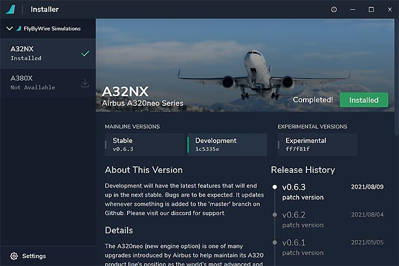
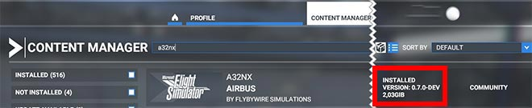
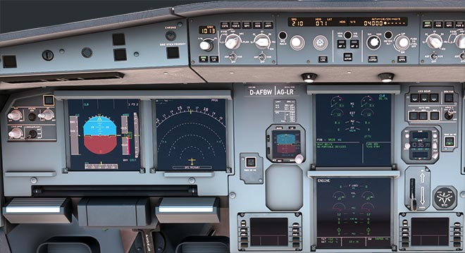

<link rel="stylesheet" href="../../stylesheets/toc-tables.css">

# Support Guide

Microsoft Flight Simulator 2020 is still a rather young flight simulator and many issues still need to be addressed.

The FlyByWire A32NX tries to address many of these issues, but it is of course also likely to have issues and bugs itself now and then.

This guide shall help you how to identify and solve these issues by guiding you through a systematic troubleshooting process. There are several sources of information you can check if you experience an issue with the FBW A32NX add-on. We will describe each of them in more detail below.

##  Index

| Quick Links                                                                |
|:---------------------------------------------------------------------------|
| 1. [Learn how to fly the A32NX](#1-learn-how-to-fly-the-a32nx)             |
| 2. [How to Troubleshoot](#2-how-to-troubleshoot)                           |
| 3. [Research Known Issues](#3-research-known-issues)                       |
| 4. [Report Issue on Discord](#4-report-issue-on-discord)                   |
| 5. [Report Issue on the A32NX GitHub](#5-report-issue-on-the-a32nx-github) |
| 6. [Collecting Support Information](#collecting-support-information)       |

## 1. Learn How to Fly the A32NX

!!! warning "IMPORTANT"

The FBW A32NX aims to become a realistic simulation of a real Airbus A320neo. Accordingly, as with real pilots, some reading, and learning is required to gain the knowledge to competently fly this aircraft, even in a simulator. Our support channels are not meant to and cannot replace this learning process for you.

A good place to start learning to fly and operate the FlyByWire A32NX is our [Beginner Guide](../../pilots-corner/a32nx/a32nx-beginner-guide/overview.md).

Further help can be found on our [:fontawesome-brands-discord:{: .discord } - **Discord Link**](https://discord.gg/flybywire){target=new} in the channel #flight-school .

Please make sure you have acquired the knowledge to distinguish a software issue within the A32NX from lack of knowledge on your part. You will help keep our support channel effective for other users reporting actual issues.

## 2. How to Troubleshoot

!!! warning "Before reporting an issue on the FlyByWire Discord or on GitHub, please follow these troubleshooting steps first."

Please follow the steps below. If you can't reproduce the issue until the last item in the list, then it is most likely NOT a FlyByWire A32NX issue.

1. Read [3. Research Known Issues](#3-research-known-issues)
- **Make sure the issue is reproducible!**<br/>
    Issues which happen only once can have many causes. These usually cannot be investigated or fixed, as they can't be reproduced by the FlyByWire team. To do so, restart the sim and try to create the same situation again (e.g., same airports, route, livery, time of day, weather, etc.).
- If the issue is reproducible, do a **test in a different situation** (different airports, route, weather, etc.).
- If the issue is still reproducible, please do a **test with another aircraft** (preferably a default Microsoft Flight Simulator aircraft). If the issue is reproducible with other aircraft, it is most likely **not** a FlyByWire A32NX issue. If it is not reproducible with other aircraft, follow the next steps.
- To make sure the issue you are experiencing is not caused by a conflict with other add-ons or liveries ***remove everything (really everything!) from your [Community Folder](#community-folder-content)** and perform a [clean reinstall](../install/installation.md#clean-install-steps) of the A32NX with the [FlyByWire Installer](https://api.flybywiresim.com/installer){target=new}.
- Also **ensure no other 3rd party software** such as FSUIPC, SPAD.neXt, YourControls, FS2Crew, etc. **is running** while you are troubleshooting.
- If the issue is not already known and is reproducible, please** take screenshots or a video clearly showing your issue** and continue with chapter [4. Report Issue on Discord](#4-report-issue-on-discord).

!!! warning "Please really do this as >90% of all reported issues are caused by conflicts with other mods and liveries, etc. Unfortunately, Microsoft Flight Simulator 2020 is very sensitive to conflicts between mods and liveries."

##  3. Research Known Issues

Read the [Reported Issues](reported-issues.md) section - most issues users encounter are already on this list.

If you have a GitHub account, please also see [Issues](https://github.com/flybywiresim/aircraft/issues){target=new} there. Please also use the search for your particular issue.

Join our Discord server [:fontawesome-brands-discord:{: .discord } - **Discord Link**](https://discord.gg/flybywire){target=new} in channel #a32nx-support and do the following:

- Read the Pinned Messages for commonly reported issues

    

- Read the Sticky Messages, which are automatically posted after each message.

    

- Search in the #a32nx-support channel for similar issues other users have reported.

    

!!! warning "Please do this research before you post any questions or report any issues."

## 4. Report Issue on Discord

If you can't solve or find your issue with the above steps, you can use our [:fontawesome-brands-discord:{: .discord } - **Discord**](https://discord.gg/flybywire){target=new} **#a32nx-support** channel to get further help.

Please prepare the following before reporting any issues:

- [MSFS Version](#msfs-version)
- [A32NX Version](#a32nx-version)
- [Community Folder Content](#community-folder-content)
- [Screenshot of Cockpit](#screenshot-of-cockpit)

With this information at hand, go to our Discord  [:fontawesome-brands-discord:{: .discord } - **Discord**](https://discord.gg/flybywire){target=new} **#a32nx-support** channel and
describe your issue and respond to the questions our support team might have.

!!! warning "Please do some research (see [above](#3-research-known-issues) ) before you post any questions or report any issues."

## 5. Report Issue on the A32NX GitHub

[:fontawesome-brands-github:{: .github } - **Issues / Feature Requests**](https://github.com/flybywiresim/aircraft/issues){target=new}

Follow the issue template as good as you can. The more information you provide, the easier it is for our team to understand and reproduce your issue.

Provide at least the following so that our team can reproduce the issue:

- [MSFS Version](#msfs-version)
- [A32NX Version](#a32nx-version)
- Clearly describe the issue in a way a third person can fully understand and reproduce it!
- Include references like screenshots or videos

!!! warning "Be aware that issues that do not follow the template or provide insufficient information might get ignored or closed without any response."

## Collecting Support Information

### MSFS Version

The version of Microsoft Flight Simulator 2020 you are using can be found via several ways:

- In the MSFS main menu, you can click on your username in the upper-right corner. This will display your version.

    

- Using ++alt+tab++ to see all open windows.

    

- Using the MS Store Update dialog.

    

### A32NX Version

#### Stable or Development

You can determine which version of the FBW A32NX you use by looking at:

- the FlyByWire Installer

    

- the Microsoft Flight Simulator Content Manager

    

#### Build Info

To get the actual build number of your installed A32NX, go into your Community folder and open this A32NX file with Notepad:

<your-Community-Folder>\flybywire-aircraft-a320-neo\build_info.json

This should contain something like this:
```json title="build_info.json"
{
  "built": "2021-08-11T07:29:20+00:00",
  "ref": "master",
  "sha": "1c5335ec13ec6b7d29319db3371299da5e4fb880",
  "actor": "developername",
  "event_name": "manual"
}
```

### Community Folder Content

Make sure that before reporting any issues that your [Community Folder](../install/installation.md#community-folder) is completely empty, except for the FlyByWire add-on (folder name `flybywire-aircraft-a320-neo`).

Make a screenshot of the Community Folder if requested by our support team.

### Screenshot of Cockpit

Quite often, when issues during flight are reported, a screenshot of the Cockpit will be request by our support team. A good screenshot should contain all screens and the FCU in a sufficient resolution to help the support team to recognize details on the PFD, ND or ECAMs.

#### Example

{loading=lazy}

#### How to Take a Good Screenshot

Position yourself in the cockpit using arrow keys (default key mapping) to look straight at the front instrument panel as in the example above, and then use the Windows Snipping Tool ([Instructions Here](https://support.microsoft.com/en-us/windows/open-snipping-tool-and-take-a-screenshot-a35ac9ff-4a58-24c9-3253-f12bac9f9d44)) to take a screenshot of all screens and the FCU.

### FDR Files

The FlyByWire A32NX has a built-in data collection system to help with development, debugging, and user support.

The idea is taken from real aircraft and their flight data recorder and helps to analyze issues and performance of the simulated aircraft.

These files are stored in your [work folder](#work-folder), and you will find the FDR files for the last 10 flights you did.

You should recognize the correct one by the filename, which is the date and time of the flight. For a long flight, it might have been split into several files.

Example: 2021-11-15-12-57-13.fdr

Compress/Zip the file(s) and upload them to a sharing site (e.g., [Swisstransfer.com](https://www.swisstransfer.com/){target=new} ) as these files are likely to be very large.

### Work Folder

Microsoft Flight Simulator allows mods like FlyByWire A32NX to store configuration and other data in a folder called "**work**": This folder is located in different places for the **MS Store version** and the **Steam version** of Microsoft Flight Simulator. The folder's location is described in the next paragraphs.

!!! info ""
    If you can't find the folders, these folders might be hidden from you by Windows. Follow the directions on ["View hidden files and folders in Windows 10" on Microsoft's support site](https://support.microsoft.com/en-us/windows/view-hidden-files-and-folders-in-windows-10-97fbc472-c603-9d90-91d0-1166d1d9f4b5){target=new}.

#### Microsoft Store Version

The folder can be found here:

`%LOCALAPPDATA%\Packages\Microsoft.FlightSimulator_8wekyb3d8bbwe\LocalState\packages\flybywire-aircraft-a320-neo\work`

!!! warning ""
    This is not your community directory

#### Steam Version

The folder can be found here:

`%APPDATA%\Microsoft Flight Simulator\Packages\flybywire-aircraft-a320-neo\work`

!!! warning ""
    This is not your community directory

