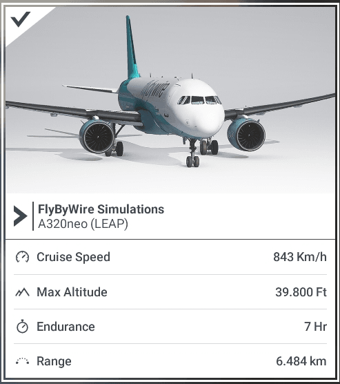
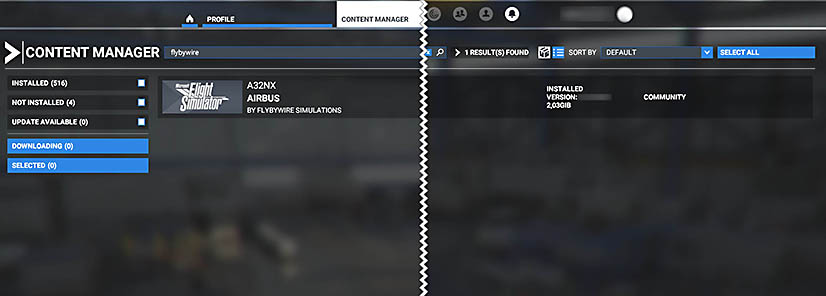

!!! danger "STOP"
    [Read this first before reporting any issues on Discord or GitHub.](index.md#read-this-first)

## Use the Browser's Search Function

On Desktop, press ++ctrl+'F'++ to search for an issue within the current page.

## Legend

!!! bug "Breaking Issue / Bug"
!!! warning "Non-Breaking Issue / Inconvenience"
!!! tip "Config Issue / Usage Issue"

---

<!--
TEMPLATE

??? issue "Issue Headline"
    ### Issue Headline

    !!! tip ""
        *Affected versions: Stable, Development*

    ^^Description^^
    ^^Root Cause^^
    ^^Possible Solution or Workaround^^
    ^^Additional Information^^
-->

## A32NX Known Issues
The following list of issues are commonly reported on our Discord support channel. Please check these before reporting 
any other issue on Discord.

??? bug "Invisible Aircraft"
    ### Invisible Aircraft

    !!! tip ""
        *Affected versions: Stable, Development*

    ^^Description^^

    The aircraft can be selected but is invisible in the Hangar and after starting the flight. 

    ^^Possible Solution or Workaround^^
    
    See [Remove Old Marketplace Installation](#remove-old-marketplace-installation)

??? bug "Infinite Loading Times"
    ### Infinite Loading Times

    !!! tip ""
        *Affected versions: Stable, Development*

    ^^Description^^

    While loading into a flight, the loading never stops and the flight never starts. 

    ^^Possible Solution or Workaround^^
    
    Try these solutions:

    - Wait at least 20 - 30 min, as loading after an aircraft update can take a very long time because the sim compiles the so-called wasm files 
    - [Remove Old Marketplace Installation](#remove-old-marketplace-installation)
    - [Clean Install](#clean-install)
    - [Use the Latest Version of MS Flight Simulator](#use-the-latest-version-of-ms-flight-simulator)
    - [Enable Windows UTF-8 Support](#enable-windows-utf8-support)
    - [Test With Only the A32NX Add-on in Community](#test-with-only-the-a32nx-add-on-in-community)

??? bug "Broken Systems, Black Screens, Broken Cockpit Layout"
    ### Broken Systems, Black Screens, Broken Cockpit Layout

    !!! tip ""
        *Affected versions: Stable, Development*

    ^^Description^^

    After loading into a flight, some systems like electricity are broken, the cockpit displays are black, the cockpit layout is broken.

    ^^Possible Solution or Workaround^^
    
    Try these solutions:

    - [Test With Only the A32NX Add-on in Community](#test-with-only-the-a32nx-add-on-in-community)
    - [Clean Install](#clean-install)
    - [Remove Old Marketplace Installation](#remove-old-marketplace-installation)
    - [Enable Windows UTF-8 Support](#enable-windows-utf8-support)
    - [Use the Latest Version of MS Flight Simulator](#use-the-latest-version-of-ms-flight-simulator)

??? bug "Outdated Systems And Missing Features, Although Current Version Installed"
    ### Outdated Systems And Missing Features, Although Current Version Installed

    !!! tip ""
        *Affected versions: Stable, Development*

    ^^Description^^

    The flyPad EFB or other systems are outdated and missing features compared to what is documented. 

    ^^Possible Solution or Workaround^^
    
    Try these solutions:

    - [Make Sure You Have the Latest Version of the A32NX Add-on](#make-sure-you-have-the-latest-version-of-the-a32nx-add-on)
    - [Test With Only the A32NX Add-on in Community](#test-with-only-the-a32nx-add-on-in-community)
    - [Clean Install](#clean-install)

??? bug "Cockpit Lights and Display Are Erratically On"
    ### Cockpit Lights and Display Are Erratically On

    !!! tip ""
        *Affected versions: Stable, Development*

    ^^Description^^

    After loading into a flight, the cockpit lights and displays are partly on and partly off.

    ^^Possible Solution or Workaround^^
    
    Try these solutions:

    - [Test With Only the A32NX Add-on in Community](#test-with-only-the-a32nx-add-on-in-community)
    - [Clean Install](#clean-install)
    - [Remove Old Marketplace Installation](#remove-old-marketplace-installation)
    - [Enable Windows UTF-8 Support](#enable-windows-utf8-support)
    - [Use the Latest Version of MS Flight Simulator](#use-the-latest-version-of-ms-flight-simulator)

??? bug "Unexpected Engines Shut Down"
    ### Unexpected Engines Shut Down

    !!! tip ""
        *Affected versions: Stable, Development*

    ^^Description^^

    The aircraft is unexpectedly shutting down the engines. This is usually caused by either a conflicting controller mapping triggering the engine shutdown, e.g., when using the keyboard or controller when retracting the gear or flaps.

    Another common cause is users forgetting to fuel the aircraft. 

    - Remove the conflicting mapping (e.g. "Auto Start Engine" or similar)
    - Follow the correct fueling procedure for the A32NX: 
    [Fuel and Weight](../../a32nx/feature-guides/loading-fuel-weight.md#loading-fuel-and-weight)

??? bug "MSFS Freezes After 'Ready To Fly'"
    ### MSFS Freezes After 'Ready To Fly'

    !!! tip ""
        *Affected versions: Stable, Development*

    ^^Description^^

    If your username on your Windows machine (not Xbox gamertag) contains any Unicode characters, it may cause MSFS to freeze after selecting `Ready to Fly`.

    Sample characters (not all-inclusive): **ë** or **õ**

    ^^Root Cause^^

    Unicode Characters in Windows Username.

    Under Investigation.

    ^^Possible Solution or Workaround^^

    Change your windows username and remove any Unicode characters present. [Guide Here](https://www.windowscentral.com/how-change-account-name-windows-10-sign-screen){target=new}

    ^^Additional Information^^

    Also see [UTF-8 Support](../../install/settings.md#utf-8-support) 

??? bug "MSFS Performance Degradation In-Flight"
    ### MSFS Performance Degradation In-Flight

    !!! tip ""
        *Affected versions: Stable, Development*

    ^^Description^^

    Reports in the MSFS forums detail issues impacting FPS performance in the sim. Notably, this occurs during flights that are longer than 2 hours but is not contained to this metric. You may see your normal FPS drop to < 10 FPS as a result of this issue.

    ^^Additional Information^^

    Follow the MSFS Forums Discussion - [here](https://forums.flightsimulator.com/t/after-playing-a-few-hours-fps-drops-from-40-to-5fps/389603/941).

??? warning "CPDLC with Hoppie on IVAO"
    ### CPDLC with Hoppie on IVAO

    !!! tip ""
        *Affected versions: Development*

    ^^Description^^

    The answer-transmission of ATC instructions cannot be sent and the DCDU shows "SYSTEM BUSY" or does not send the message. It is not possible to send answers, close or delete ATC instructions.

    ^^Root Cause^^

    The IVAO ATC software Aurora sends wrong message IDs in instructions. In the message handling of the A32NX, this causes the wrong interpretation and association of messages.

    ^^Possible Solution or Workaround^^

    Do not use CPDLC on IVAO.

    ^^Additional Information^^

    We are working with IVAO on a bugfix.

??? warning "Fuel Prediction Too Low"
    ### Fuel Prediction Too Low

    !!! tip ""
        *Affected versions: Development*

    ^^Description^^

    Fuel prediction on the MCDU may not calculate enough fuel for the duration of your flight.

    ^^Root Cause^^

    We are working on more realistic simulation of various involved systems, e.g., engines. The fuel predication will be inaccurate until we have updated the fuel planning feature on the MCDU. *Under Investigation*

    ^^Possible Solution or Workaround^^

    When using the MCDU fuel planning feature, take more fuel than what is calculated for you - especially for longer flights.

??? warning "Autopilot: Unwanted Disconnection"
    ### Autopilot: Unwanted Disconnection

    !!! tip ""
        *Affected versions: Stable, Development

    ^^Description^^

    There are several common reasons for an autopilot disconnection, most of them are typically caused by user/pilot error.

    One common cause is input from controllers. Make sure your controllers are working correctly and do not send unwanted input. Use the MSFS deadzone controller settings to prevent unwanted input.

    Another common cause is the A320 protections for High Speed, High Angle of Attack incl. Alpha Floor. 
    See our dedicated documentation for the A320 protections:
    [A320 Protection Documentation](../../../pilots-corner/a32nx/a32nx-advanced-guides/protections/overview.md)

??? warning "ADIRS Not Aligned When Starting at Runway or in the Air"
    ### ADIRS Not Aligned When Starting at Runway or in the Air

    !!! tip ""
        *Affected versions: Development*

    ^^Description^^

    ADIRS may not be aligned when spawning anywhere except cold & dark at a gate (*intermittent issue*)

    ^^Root Cause^^

    Initialization timing issue of MSFS.

    ^^Possible Solution or Workaround^^

    Workaround: Restart the flight

??? warning "Unexpected Out of Fuel - No Fuel Transfer From Outer Tanks"
    ### Unexpected Out of Fuel - No Fuel Transfer From Outer Tanks

    !!! tip ""
        *Affected versions: Stable, Development*

    ^^Description^^

    Occasionally, the sim will "*miss*" the trigger point being reached for outer tank fuel transfer to initialize.
    This may happen if the sim is "busy" working on something else OR the initial FOB at the start of the flight is below the trigger point.

    ^^Root Cause^^

    Intermittent Issue / Under Investigation

    ^^Possible Solution or Workaround^^
    
    Add enough fuel to get past the trigger point of 239 gallons before departing.

    Use the flyPad fuel page to add fuel to the aircraft: 
    [Fuel Page](../../a32nx/feature-guides/loading-fuel-weight.md#loading-fuel-and-weight)

??? warning "TCA Throttle Autobrake Disengages While Looking Around"
    ### TCA Throttle Autobrake Disengages While Looking Around

    !!! tip ""
        *Affected versions: Stable, Development*

    ^^Description^^

    MSFS blocks all other inputs when using freelook with the mouse button pressed. The TCA knob for Autobrake setting will be lost if this block lasts longer than 1.5sec.

    ^^Root Cause^^

    See the root cause here: [Controls Freeze up While Looking Around](#controls-freeze-up-while-looking-around)

    ^^Possible Solution or Workaround^^

    Do not look around the cockpit for > 1.5 s

??? warning "Can't Start Engines When Using TCA Throttle"
    ### Can't Start Engines When Using TCA Throttle

    !!! tip ""
        *Affected versions: Stable, Development*

    ^^Description^^

    MSFS default mappings for TCA Throttle are not working. 

    ^^Root Cause^^

    Wrong default mapping in MSFS. 

    ^^Possible Solution or Workaround^^

    1)

    - Open the controls menu
    - REMOVE:
        - “Toggle Engine 2 Fuel Valve” - Set to Joystick Button 4
        - “Toggle Engine 1 Fuel Valve” - Set to Joystick Button 3
    - KEEP or SET:
        - “Set Engine 2 Fuel Valve” - Set to Joystick Button 4
        - “Set Engine 1 Fuel Valve” - Set to Joystick Button 3
        

    2) 

    - Set the value `Joystick Button 8` for both the values shown below.
    - Set the ACTION TYPE for SET ENGINE NORM MODE to `ON RELEASE` shown below.

    {loading=lazy}

    {loading=lazy}

    ^^Additional Information^^

    Also see our [Throttle Calibration Guide](../../common/flypados3/throttle-calibration.md)

??? warning "Ice Building Up on Cockpit Windows"
    ### Ice Building Up on Cockpit Windows

    !!! tip ""
        *Affected versions: Stable, Development*

    ^^Description^^

    Icing occurs (windshield, engines, wings) although Anti-Ice is turned on.

    ^^Root Cause^^

    There is actually no anti-ice capability in MSFS, and Asobo currently has no plans to add it in the near future.

    The anti-ice systems therefore work as deice systems (after the fact) rather than anti-ice systems (preventive).

    ^^Possible Solution or Workaround^^

    No workaround, but flights should not be impacted too much by this.

    ^^Additional Information^^

     The consequence of this MSFS behavior is that the auto-probe/windshield heat will not always prevent ice from forming on the windshield or the pitot probe. Although the ice should melt fairly quickly (and no need to switch from auto to on), the windshield can still freeze over, and you can lose airspeed information upon first entering icing conditions if they are severe enough.

    The same goes for wing and engine anti-ice - turning them on before ice actually forms may not prevent ice from forming there, but it should melt fairly quickly.

??? warning "Refueling/Boarding Buttons Missing/Disabled on EFB Fuel/Payload Page"
    ### Refueling/Boarding Buttons Missing/Disabled on the EFB Fuel/Payload Page

    !!! tip ""
        *Affected versions: Stable, Development*

    ^^Description^^

    You may find the 'play' button (that is used to initialise the refueling process) or the 'boarding' button (used to 
    initiate boarding of passengers) is missing or disabled on the 'Fuel' or 'Payload' page of the EFB (flyPad). This 
    occurs when [GSX Synchronization](../../common/flypados3/settings.md#3rd-party-options) is enabled. 

    GSX is a third-party software developed and sold by FSDreamteam, which you can purchase and install to enhance ground
    operations at airports.

    ^^Possible Solution or Workaround^^
    
    - If you are **not** using GSX, then you will need to disable both options on the [GSX Synchronization](../../common/flypados3/settings.md#3rd-party-options) page on the EFB, under Settings -> 3rd Party Options.
    
    - If you do use GSX, then much of the boarding and refueling process is completed through GSX itself, while also 
    still requiring some interaction with the A32NX EFB. This is explained in detail in our 
    [GSX Integration Guide](https://docs.flybywiresim.com/fbw-a32nx/feature-guides/gsxintegration).

??? warning "Pop-out Feature Not Working"
    ### Pop-out Feature Not Working

    !!! tip ""
        *Affected versions: Stable, Development*

    ^^Description^^

    The MSFS pop-out feature is not working for certain screens in the A32NX flight deck. 

    While this is an MSFS issue, it can cause problems if you regularly enjoy popping out various screens for use with external hardware or another monitor.

    ^^Root Cause^^

    MSFS off-screen pop-out issue when your monitor setup may have changed between Sim Updates. This data is reportedly stored locally and in the cloud.

    ^^Possible Solution or Workaround^^

    !!! tip ""
        Please note that you should first check the following before trying any workarounds.

        - You can see the **magnifying glass** when attempting to pop out the panel. 

    You can try using the MSFS Pop Out Panel Manager application to restore the position if you suspect the pop-out is off-screen. 

    [Download MSFS Pop Out Panel Manager](https://github.com/hawkeye-stan/msfs-popout-panel-manager)

    For more information on how to actually solve the issue, please reference the following GitHub issue for more information:

    [MSFS Popout Workaround / Pop out panel manager issue](https://github.com/hawkeye-stan/msfs-popout-panel-manager/issues/73){target=new .md-button}

??? tip "Rudder or Toe Brake Operation Issues"
    ### Rudder or Toe Brake Operation Issues

    !!! tip ""
        *Affected versions: Stable, Development*

    ^^Description^^

    Experience problems like brakes getting stuck while taxiing or twitching rudders, or taxiing is erratic. 

    ^^Root Cause^^

    - MSFS Assistance settings (esp. AUTO_RUDDER) are activated. These need to be **deactivated** for the A32NX.
    - Rudder setup is not correct.

    ^^Possible Solution or Workaround^^
    
    - Deactivate [MSFS Assistance Features](../../install/settings.md#deactivate-msfs-assistance-features)
    - Rudder Settings: See the correct settings for rudder using the T.Flight Rudder Pedals as an example: 
      [T.Flight Rudder Pedals Settings](../detail-pages/rudder.md)

??? tip "++ctrl+'E'++ - Engine Start Unsupported"
    ### ++ctrl+'E'++ - Engine Start Unsupported

    !!! tip ""
        *Affected versions: Stable, Development*

    ^^Description^^

    The auto-start shortcut via ++ctrl+'E'++ will not work.

    Currently, you need at least the APU Avail and APU Bleeds to be switched on, as well as the fuel pumps to be on for a normal engine start. (Crossbleed starts will be implemented at a later time).

    ^^Root Cause^^

    Our custom systems and realistic simulation of onboard systems requires the proper engine start procedure for the A320neo.

    ^^Possible Solution or Workaround^^

    We highly suggest learning how to start the engines manually by reading our beginner guide. 
    [Beginner Guide - Engine Start Section](../../../pilots-corner/a32nx/a32nx-beginner-guide/engine-start-taxi.md#engine-start).

??? tip "flyPad EFB Missing in Cockpit"
    ### flyPad EFB Missing in Cockpit

    !!! tip ""
        *Affected versions: Stable, Development*

    ^^Description^^

    No EFB (flyPad) visible in the cockpit.

    ^^Root Cause^^

    Default Asobo A320 aircraft selected instead of the FlyByWire A32NX.

    ^^Possible Solution or Workaround^^

    Select the **^^FlyByWire Simulations A320neo (LEAP)^^** in the aircraft selector instead of the Asobo one.

    {width=50% align=left loading=lazy}

??? tip "Incompatible Keyboard Mapping for Pause Function"
    ### Incompatible Keyboard Mapping for Pause Function

    !!! tip ""
        *Affected versions: Stable, Development*

    ^^Description^^

    If the `Pause` function is mapped to any key other than ++esc++ this other key will trigger `Pause` when typing it into input fields of the EFB or the MCDU when using the keyboard input mode.

    ^^Root Cause^^
    
    This is an MSFS limitation for Coherent driven JavaScript instruments. 

    ^^Possible Solution or Workaround^^

    Make sure that the `Pause` function is only mapped to the ++esc++ key and not to any other keys.

??? tip "Aircraft Not Following Flight Plan Route"
    ### Aircraft Not Following Flight Plan Route

    !!! tip ""
        *Affected versions: Stable, Development*

    ^^Description^^
    
    This is typically caused by flying into a discontinuity or an incomplete setup of the aircraft. 

    ^^Read the documentation about Discontinuities^^

    - [Discontinuities](../../../pilots-corner/a32nx/a32nx-advanced-guides/flight-planning/disco.md)

## Solutions to Commonly Reported Issues
The following list of solutions solves most reported issues on our Discord support channel.
Please try these before reporting any other issue on Discord.

??? tip "Remove Old Marketplace Installation"
    ### Remove Old Marketplace Installation

    !!! tip ""
        *Affected versions: Stable, Development*

    ^^Description and Symptoms^^

    If you have the following issues, you are **most likely on an outdated stable**, or you have an **installation conflict**:

    - Invisible Aircraft
    - Infinite loading times
    - White EFB screen
    - PFD is missing bank angle protection indicators
    - `NOT IN DATABASE` MCDU error
    - External lights are not working

    ^^Root Cause^^

    Double installation of the add-on and conflict with very old, unsupported versions.

    ^^Possible Solution or Workaround^^

    Go to your content manager and filter for "flybywire" as you see in the following image.

    {loading=lazy}

    If you see old versions (e.g., v0.6.1) or if you have multiple installations of the A32NX, please uninstall them in the Content Manager and restart the sim. Reinstall development version from our [installer](https://flybywirecdn.com/installer/release/FlyByWire-Installer-x64.exe){target=new}.

    ^^Additional Information^^

    Information on how to install with the FlyByWire Installer can be found here: [Installation Guide](../../install/installation.md).

??? tip "Sync MSFS Flight Plan with the A32NX Flight Plan"
    ### Sync MSFS Flight Plan with the A32NX Flight Plan

    See [Sync to MSFS Flight Plan](../../a32nx/feature-guides/cFMS.md#sync-mcdu-to-msfs)

## Incompatible and Problematic Add-ons/Mods

The following add-ons and mods are known to be incompatible and cause issues with the A32NX. We recommend you uninstall 
these before starting the sim and flying with the A32NX, especially if you experience issues with the aircraft.

??? bug "Weather Radar Mod"
    ### Weather Radar Mod

    !!! tip ""
        *Affected versions: Development*
    
    ^^Description^^
    
    Aircraft systems may no longer function appropriately when the Weather Radar Mod for FBW A320 Neo is installed. 

    ^^Root Cause^^

    This addon overwrites the entire Navigation Display.

    ^^Possible Solution or Workaround^^

    Uninstall the mod.

    ^^Additional Information^^

    The author of this mod specifically states that, if any issues are present with our aircraft, then this mod should be removed when flying.

??? bug "Lights Addons"
    ### Lights Addons

    !!! tip ""
        *Affected versions: Stable, Development*

    ^^Description^^

    If you are experiencing issues with the lights in the cockpit we have found some addons create breaking conflicts with the A32NX.

    You may experience various cockpit lights to not illuminate the cockpit appropriately or refuse to turn on at all.

    **Note: This issue is separate from the UTF8 issues and strictly affects lighting only.**

    We have identified the following addon to be the main offender:

    !!! warning ""
        New Light (enhancement taxi, landing light and other extrior light) | by nicottine

    Please be aware there may be other lights addons that may also cause this issue.

    ^^Root Cause^^

    It isn't currently possible to seamlessly modify lights on planes via mods. Creators would instead have to replace the whole airplane systems definition - which breaks everything when we 
    update it ourselves.

    ^^Possible Solution or Workaround^^

    - Uninstall the mod
    - Use an add-on linker to ensure the mod is only installed when you plan to use it.

??? bug "LVFR A321neo Compatibility Mod"
    ### LVFR A321neo Compatibility Mod

    !!! tip ""
        *Affected versions: Stable, Development*
    
    ^^Description^^

    This Add-on is known to cause severe issues with the A32NX.

    This compatibility mod is available on flightsim.to and may overwrite our systems / EFB, resulting in outdated systems or missing features in our EFB when the mod is installed.

    ^^Possible Solution or Workaround^^

    - Uninstall the mod
    - Use an add-on linker to ensure the mod is only installed when you plan to use it.

??? bug "Co-Pilot Add-ons"
    ### Co-Pilot Add-ons

    !!! tip ""
        *Affected versions: Stable, Development*
    
    ^^Description^^

    The Co-Pilot Add-ons are known to cause severe issues with the A32NX.
    
    ^^Possible Solution or Workaround^^
    
    - Uninstall the add-ons

??? bug "3rd Party Interior Textures - Black Screens"
    ### 3rd Party Interior Textures Black Screens

    !!! tip ""
        *Affected versions: Development*
    
    ^^Description^^

    3rd party interior textures mods are breaking the state of our custom instruments. This is similar to the older 
    `panel.cfg` livery issue that created systems conflicts.

    We have identified the following texture pack to be the main offender:

    !!! warning ""
        Improved Textures Mod - A32NX & A320neo | by FlightFlow

    {--

    Please do not install add-ons that modify files or overwrite files inside the `flybywire-aircraft-a320-neo` folder.

    --}

    ^^Root Cause^^

    Conflict with our own handcrafted textures.

    ^^Possible Solution or Workaround^^

    Remove the offending 3rd party interior texture.

??? bug "Your Controls Performance Issues"
    ### Your Controls Performance Issues

    !!! tip ""
        *Affected versions: Stable, Development*

    ^^Description^^

    If you have this 3rd party add-on installed, but it is not in use for your flight, you may experience degraded performance (FPS) in the simulator.

    ^^Possible Solution or Workaround^^

    - Remove the add-on from your community folder if it will not be in use for your flight.

??? bug "Toolbar Pushback Add-on Issues"
    ### Toolbar Pushback Add-on Issues

    !!! tip ""
        *Affected versions: Stable, Development*

    ^^Description^^

    This 3rd party addon may have the following intermittent issues:

    - Stuck aircraft
    - Unable to taxi
    - Unable to turn nosewheel
    - Performance degradation

    ^^Possible Solution or Workaround^^

    - Remove the add-on from your community folder or wait for developer to update or see next item.
    - Keep the add-on but remove it from the toolbar once you have pushed back
    - Use our EFB which has built in pushback controls or another add-on.

---
