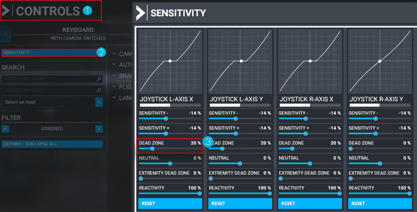

## Solutions to Commonly Reported Issues
The following list of solutions solves most reported issues on our Discord support channel.
Please try these before reporting any other issue on Discord.

??? tip "General Troubleshooting Steps"
    ### General Troubleshooting Steps

    ^^Description^^

    Most issues with the A32NX or A380X can be solved by following the below steps.  
    Try these first before you report an issue on Discord or GitHub. 

    ^^Troubleshooting Steps^^
   
    - [Test With Only the A32NX or A380X Add-on in Community](#test-with-only-the-a32nx-add-on-in-community)
    - [Clean Install](#clean-install)
    - [Enable Windows UTF-8 Support](#enable-windows-utf-8-support)
    - [Make Sure to Use the Latest Version of MS Flight Simulator](#use-the-latest-version-of-ms-flight-simulator)

??? tip "Test With Only the A32NX or A380X Add-on in Community"
    ### Test With Only the A32NX or A380X Add-on in Community

    !!! danger "**This is the most important troubleshooting step for Microsoft Flight Simulator!!**"

    To make sure the issue you are experiencing is not caused by a conflict with other add-ons or liveries 
    **remove everything (really everything!) from your [Community Folder](#community-folder-content)** and perform a 
    [clean reinstall](../../install/installation.md#clean-install-steps) of the A32NX or the A380X with the 
    [FlyByWire Installer](https://flybywirecdn.com/installer/release/FlyByWire-Installer-x64.exe){target=new}.

    An easy way to do this without deleting your add-ons and liveries is to rename the current Community folder to 
    "Community.old" and then create a new Community folder, which is empty. You can then use the FlyByWire Installer 
    to reinstall the A32NX or A380X. 

??? tip "Use the Latest Version of MS Flight Simulator"
    ### Use the Latest Version of MS Flight Simulator

    The A32NX and A380X only work with the latest version of MS Flight Simulator. Please make sure that your simulator
    is up to date.   

??? tip "Use the Latest Version of the Aircraft"
    ### Use the Latest Version of the Aircraft

    The A32NX and A380X are continously being improved and extended. New features, changed features, and bug fixes are 
    constantly being added. Because of this, it is important to make sure that you have the latest version of the 
    aircraft.

    The latest fixes and features are available in the Development version of the add-on.

    Use our Installer to check availability of new updates and keep your installation as current as possible.

??? tip "Clean Install"
    ### Clean Install

    See [Clean Install](../../install/installation.md#clean-install-steps)

??? tip "Enable Windows UTF-8 Support"
    ### Enable Windows UTF-8 Support

    See [UTF8 Support](../../install/settings.md#utf-8-support)

??? tip "Turn Off All MS Flight Simulator Assistance Features"
    ### Turn Off All MS Flight Simulation Assistance Features

    Deactivate [MSFS Assistance Features](../../install/settings.md#deactivate-msfs-assistance-features)

??? tip "Performance Issues / FPS Issues"
    ### Performance Issues / FPS Issues

    ^^Description^^

    Experiencing low FPS or stuttering while using the A32NX.

    Sim performance is a very complex topic, and it is usually  very specific to a user's hardware and configuration. 
    There are often no general solutions to these issues and users need to configure their system in a way it can handle complex custom aircraft like the A32NX.  

    Be aware that the A32NX is not a finished product, and many systems are not yet optimized for performance. We will continue to improve this during the ongoing development of the A32NX. 

    The Stable and Development versions of the A32NX are working well for most of our users. If you encounter problems, you might need to tune your system to handle the complexity of the A32NX (see solutions below).

    ^^Possible Solution or Workaround^^

    - [Do Not Use DX12](#do-not-use-dx12)
    - [Toolbar Pushback Add-on Issues](#toolbar-pushback-add-on-issues)
    - [Your Controls Performance Issues](#your-controls-performance-issues)
    - [Test With Only the A32NX Add-on in Community](#test-with-only-the-a32nx-add-on-in-community)
    - Make sure MSFS is configured for optimal performance 
        - See this article: [Graphic Settings in MSFS](https://forums.flightsimulator.com/t/how-to-graphics-settings-and-performance-guide-su5-complete-retest-8-2-2021/132407)
        - Tip: better to be GPU bound than CPU bound

??? tip "Use the Correct Airframe for SimBrief"
    ### Use the Correct Airframe for SimBrief

    See [SimBrief Airframe](../../install/installation.md#simbrief-airframe)

??? tip "Check your MSFS Uses the Correct Community Folder"
    ### Check your MSFS Uses the Correct Community Folder

    See [Community Folder](../../install/installation.md#community-folder)

??? tip "Throttle Calibration"
    ### Throttle Calibration

    See our [Throttle Calibration Guide](../../common/flypados3/throttle-calibration.md)

??? tip "Setup Your Controller Deadzones"
    ### Setup Your Controller Deadzones

    In certain situations, your hardware maybe causing unwanted inputs when attempting to fly the aircraft. Increasing 
    the deadzone setting for your controller can help prevent these inputs.

    - Go to your settings
    - Controls and select your yoke/joystick/controller.
    - After that, click the sensitivity button on the top left, which should take you to the menu where you can adjust 
      your deadzones.
    
    Start with 20 % deadzone, if the problem persists, keep increasing it. If it's fine with 20 % you can then slowly 
    decrease it too.

    {loading=lazy}

??? tip "Understand Discontinuities"
    ### Understand Discontinuities

    See [Discontinuities Guide](../../../pilots-corner/a32nx/a32nx-advanced-guides/flight-planning/disco.md)

??? tip "Cockpit Interaction System"
    ### Cockpit Interaction System

    ^^Description^^

    Switches, knobs, and dials can't be used with simple mouse clicks as before. (Can't push or pull knobs).

    ^^Root Cause^^

    Asobo

    ^^Possible Solution or Workaround^^

    We recommend the legacy (previous) method of the Cockpit Interaction System:

    - Go to Menu
    - General Options
    - Accessibility
    - Find the `Cockpit Interaction System` setting
    - Change to `legacy`

    ^^Additional Information^^

    Using **New** Cockpit Interaction System

    - Highlight a control (like a knob).
    - Hold ++"Left Click"++ to lock to that control. Now, your mouse will not affect any other controls or other mouse bindings.
    - Move the mouse left to turn the knob left, move it right to turn the knob right (with the ++"Left Click"++ held down)
    - You can also use the scroll wheel while holding ++"Left Click"++ down to turn the knob left or right.
    - To push a control / knob in, lock to the control using ++"Left Click"++ and then ++"Right Click"++.
    - To pull a control / knob out, hold ++"Left Click"++ and then click your scroll wheel ++"Middle Mouse"++.
        - Note: If you already use the ++"Middle Mouse"++ button to activate freelook this may not work. Check your keybinds, so this feature does not conflict.

    !!! tip ""
        This list is based on our testing and feedback. For more information, see the [MSFS Release Notes](https://forums.flightsimulator.com/t/microsoft-flight-simulator-available-today-on-xbox-series-x-s-and-xbox-game-pass/425795) - Cockpit Interactions.

    Direct your support questions and feedback on this feature to Asobo.

??? tip "Unable to Move or Taxi"
    ### Unable to Move or Taxi

    ^^Description^^

    The aircraft is unable to move or taxi. The ECAM is showing a "NW STRG DISC" warning. 
    This is caused by an invisible tug which is still connected to the aircraft.
    This is an MSFS issue as the visual representation of the tug and the connection to the aircraft can get out of 
    sync.

    If you are using rudders/pedals like the Thrustmaster T.Flight Rudder Pedals, make sure they are correctly set up and calibrated. Otherwise the toe brakes may be impeding taxiing.

    ^^Possible Solutions or Workarounds^^

    - [Disconnect the Tug](#disconnect-the-tug)
    - [Toolbar Pushback Add-on Issues](#toolbar-pushback-add-on-issues)
    - [Rudder/Pedal Settings](#rudder-or-toe-brake-operation-issues)

??? tip "Disconnect the Tug"
    ### Disconnect the Tug

    If you have the "NW STRG DISC" message on the upper ECAM display, but you can't see a tug, please press 
    ++shift+'P'++ on your keyboard to disconnect the invisible pushback tug.
    
    This is an MSFS issue sometimes triggered by pushback tools like Toolbar Pushback Add-on and the flyPad pushback 
    system.  

??? tip "Do Not Use DX12"
    ### Do Not Use DX12

    Do not use DX12 in your MS Flight Simulator as it causes massive performance issues for many users. 

??? tip "Crash To Desktop (CTD)"
    ### Crash To Desktop (CTD)

    ^^Description^^

    With the current state of the sim, it is basically impossible to analyze CTDs, let alone fix them, as MSFS does not provide any tools or logs for analyzing CTDs.

    If we can reliably reproduce a CTD in our aircraft, we will try to fix it or at least work around it. But most CTDs are very unpredictable and can be caused by many things:

    - Add-ons and mods
        - Liveries (flightsim.to just removed 1000s of them because of that)
        - Airports
        - Basically any add-on and mod that may be outdated or have conflicting files
    - MSFS itself (e.g., Rolling Cache is often a cause)
    - Hardware (GFX Card and Driver, Overclocking, etc.)
    - Controllers and Drivers
    - Any third-party application that connects to MSFS

    Unfortunately, just using the sim's API functions might trigger a CTD, so the trigger could be the aircraft, but the root cause would be the sim.

    If you can reproduce it reliably, please share this information with us on Discord or our GitHub, so we can try to reproduce it as well. This would be the first step to fixing anything.

    ^^Possible Solution or Workaround^^

    There currently is no known guaranteed solution for all cases; However, users have found success with by trying the following:

    1. Remove everything from the Community folder - **really everything**! [Test With Only the A32NX Add-on in 
    Community](#test-with-only-the-a32nx-add-on-in-community)
    1. [Enable Windows UTF-8 Support](#enable-windows-utf-8-support)
    1. Perform a [Clean Install](../../install/installation.md#clean-install-steps)
    1. Stop any third-party application which connect to MSFS 
       FSUIPC, YourControls, Fs2Crew, GSX, SPAD.next, ...
    1. Run without live weather and/or live traffic.
    1. Check your content manager for missing packages
    1. Delete your rolling cache in the sim and create a new one.
    1. Delete any manual cache in the sim and create new ones.
    1. Run the game as Administrator.
    1. Visit and read the [MSFS Known Issues Page](https://flightsimulator.zendesk. com/hc/en-us/articles/360016027399-KNOWN-ISSUES-Last-update-July-28-2021-) OR [MSFS Troubleshooting & Support](https://flightsimulator.zendesk.com/hc/en-us/sections/360004475200-Troubleshooting-Support-Windows-10-PC)

    ^^Additional Information^^

    Please also search in the MSFS Discord and Forum for CTD causes and solutions.

    [MSFS Zendesk Safe-Mode-FAQ](https://flightsimulator.zendesk.com/hc/en-us/articles/4405893759378-PC-versions-Safe-Mode-FAQ){target=new}

    [MSFS Zendesk CTDs-issues-Basic-Troubleshooting](https://flightsimulator.zendesk.com/hc/en-us/articles/4406280399250-All-versions-Crashing-CTDs-issues-Basic-Troubleshooting){target=new}

    [MSFS Zendesk CTDs-issues-Advanced-Troubleshooting](https://flightsimulator.zendesk.com/hc/en-us/articles/4406280653202-All-versions-Crashing-CTDs-issues-Advanced-Troubleshooting){target=new}

    [MSFS Forum ctd-analysis-by-community](https://forums.flightsimulator.com/t/kadw-andrews-ctd-analysis-by-community-contributions/465405){target=new}

    !!! info "Peripherals"
        This is an important snippet from MSFS known issues.

        If you are getting CTDs, it could be one of your peripherals disconnecting sometime during the flight, which then causes the sim to CTD.

        It could be anything from a USB drive to a controller. Please try to minimize how many peripherals you have connected.

??? tip "Nav Data Issues"
    ### Nav Data Issues

    ^^Description^^

    The A32NX and A380X use the sim's nav data. So, any nav data issues will usually also be present in other default 
    aircraft and the World Map.

    You can test these issues by using the MSFS World Map. If the required nav data (waypoint, SID, STAR, APPR, Rwy, 
    Airport, etc.) is missing in the World Map as well, then it is a general nav data issue and not an issue with the 
    aircraft. 

    Most common nav data issues come from flight planning tools (e.g., SimBrief, etc.) which use outdated nav data 
    versions (so called AIRAC). These often cost free tools are limited to generating routes using obsolete AIRAC 
    cycles, while MSFS regularly updates to the latest AIRAC available. This can lead to route incompatibilities and 
    various error messages when you import or enter the flight plan to the MCDU (A32NX) or MFD (A380X), including 
    "NOT ALLOWED", "NOT IN DATABASE", and "AWY/WPT MISMATCH".

    Any of these errors during route import could mean that your route is no longer valid in the current cycle, and 
    cannot be properly used as a valid flight plan in the sim. 

    ^^Possible Solution or Workaround^^

    To avoid this, we recommend a Navigraph subscription, which will make sure SimBrief and the sim have identical nav 
    data. Also, you would have the matching Navigraph charts at your disposal.

    If you have a Navigraph subscription but still have issues with the nav data, try a re-installation of the 
    navigation data by removing and installing the data with the Navigraph Data Center tool.

??? tip "No Weather Radar"
    ### No Weather Radar

    ^^Description^^

    The A32NX or A380X currently do not have an operating weather radar. This is due to the lack of a weather API in
    MSFS. The team is currently waiting on a weather API to be implemented to make a radar that is as realistic as
    possible. You can read the MSFS forum here.

    [MSFS Feature Request for Weather API](https://forums.flightsimulator.com/t/implement-weather-and-terrain-api-s-for-aircraft-developers-to-implement-accurate-radar-predictive-windshear-egpws-and-metar-wind-uplink/442016)

??? tip "Flypad Can’t Be Used in External View"
    ### Flypad Can’t Be Used in External View

    ^^Description^^

    Due to a sim limitation, the flyPad cannot be used in the external view. 

??? tip "Lost Use of Mouse After Typing in a flyPad Input Field"
    ### Lost Use of Mouse After Typing in a flyPad Input Field

    !!! tip ""
        *Affected versions: Stable, Development*

    ^^Description^^

    In certain situations, if you have selected an input field on the EFB and changed your view away from the EFB, you
    may no longer have use of your mouse cursor.

    ^^Root Cause^^

    Under Investigation.

    ^^Possible Solution or Workaround^^

    Try pressing ++ctrl+z++.

    If this didn't help, please follow the steps below to bypass this issue:

    1. Open your browser (i.e., Chrome / Firefox)
    - In the URL field, type - `localhost:19999`
    - Click on any link
    - Go to the `Console Tab` shown in the browser. (**Note:** This is not the DevTools of your browser. The page you 
      are on already has a console tab at the top.)
    - At the bottom type in - `Coherent.call('UNFOCUS_INPUT_FIELD')`
    - Press ++enter++

??? tip "Refueling/Boarding Buttons Missing/Disabled on EFB Fuel/Payload Page"
    ### Refueling/Boarding Buttons Missing/Disabled on the EFB Fuel/Payload Page

    ^^Description^^

    You may find the 'play' button (that is used to initialise the refueling process) or the 'boarding' button (used to 
    initiate boarding of passengers) is missing or disabled on the 'Fuel' or 'Payload' page of the EFB (flyPad). This 
    occurs when [GSX Synchronization](../../common/flypados3/settings.md#3rd-party-options) is enabled. 

    GSX is a third-party software developed and sold by FSDreamteam, which you can purchase and install to enhance ground
    operations at airports.

    ^^Possible Solution or Workaround^^
    
    - If you are **not** using GSX, then you will need to disable both options on the [GSX Synchronization](../../common/flypados3/settings.md#3rd-party-options) page on the EFB, under Settings -> 3rd Party Options.
    
    - If you do use GSX, then much of the boarding and refueling process is completed through GSX itself, while also 
    still requiring some interaction with the flyPad EFB. This is explained in detail in our 
    [GSX Integration Guide](https://docs.flybywiresim.com/fbw-a32nx/feature-guides/gsxintegration).

??? tip "Ground Services on the flyPad Are Out of Sync"
    ### Ground Services on the flyPad Are Out of Sync

    !!! tip ""
        *Affected versions: Stable, Development*
    
    ^^Description^^
    
    The ground services on the flyPad are out of sync with the ground services on the aircraft/airport.

    As an aircraft in MSFS has no access to the ground service's real state, it is possible that the flyPad is out of 
    sync with the actual state of the ground services. E.g., a door is open, but the corresponding door button is grayed 
    out. 
    
    ^^Possible Solution or Workaround^^
    
    Please do a hard reset on the flyPad by either using the hardware power button or pressing and holding the software 
    button. See [flyPad General Usage](../../common/flypados3/index.md#general-usage) for more information.

??? tip "Hard To Control the Aircraft during Taxi, TakeOff, or Landing"
    ### Hard To Control the Aircraft during Taxi, TakeOff, or Landing

    !!! tip ""
        *Affected versions: Stable, Development*

    ^^Description^^

    The aircraft is hard to control during taxi, takeoff, or landing.

    ^^Possible Solution or Workaround^^

    - [Deactivate MSFS Assistance Features](../../install/settings.md#deactivate-msfs-assistance-features)

??? tip "Difficulty Accurately Clicking Controls"
    ### Difficulty Accurately Clicking Controls

    !!! tip ""
        *Affected versions: Stable, Development*

    ^^Description^^

    Click spots for different controls in the virtual cockpit may seem "misaligned" or generally difficult to accurately select.

    ^^Root Cause^^

    Sim Update 7 Issues

    ^^Possible Solution or Workaround^^

    Turn off *Lens Correction* in the MSFS graphics settings.

    

??? tip "Controls Freeze up While Looking Around"
    ### Controls Freeze up While Looking Around

    !!! tip ""
        *Affected versions: Stable, Development*

    ^^Description^^

    Using freelook with the right mouse button may causes controls to freeze.

    ^^Root Cause^^

    MSFS blocks all other inputs when using freelook with the mouse button pressed.

    ^^Possible Solution or Workaround^^

    Try setting `TOGGLE COCKPIT FREELOOK` to your mouse ++middle-button++

    ^^Additional Information^^

    Reference: [MSFS Forum Post](https://forums.flightsimulator.com/t/freelook-with-mouse-causes-controls-to-freeze-after-su5/426349/15){target=new}
---

