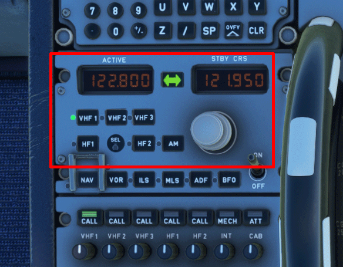
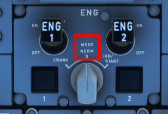
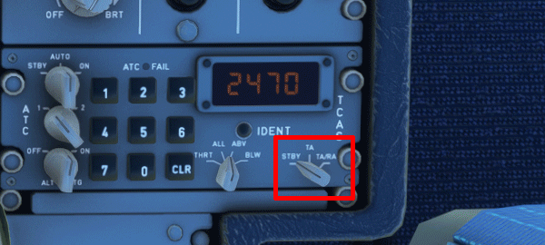
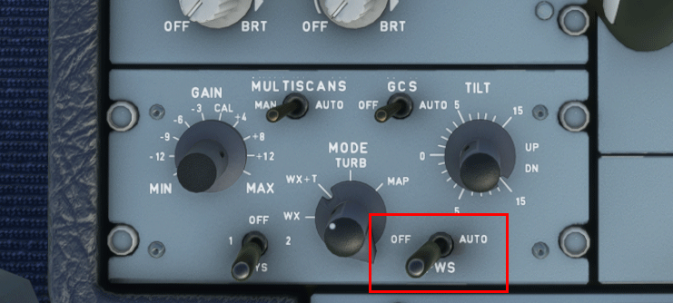
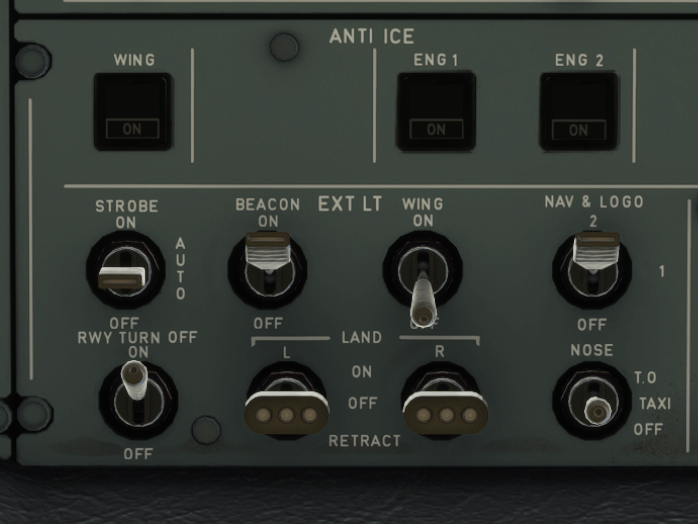
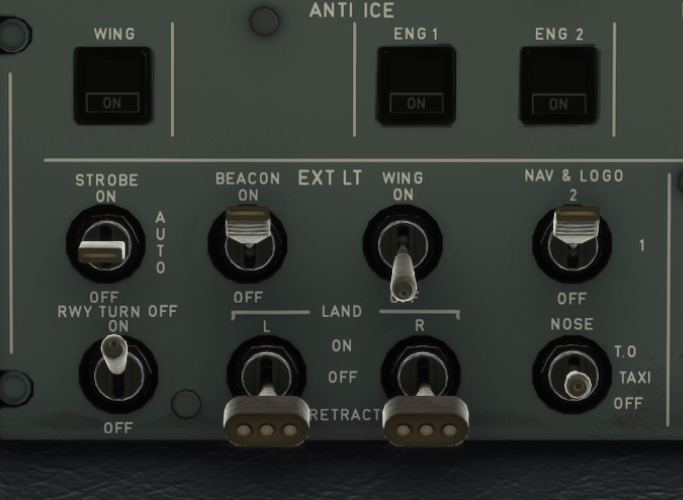
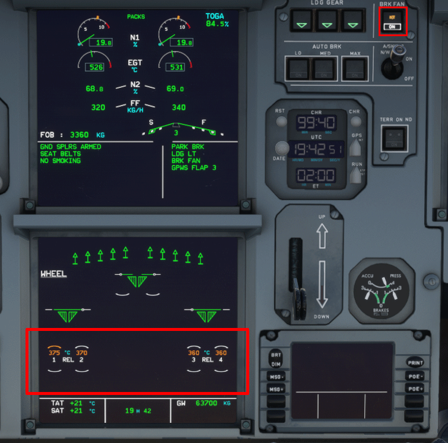
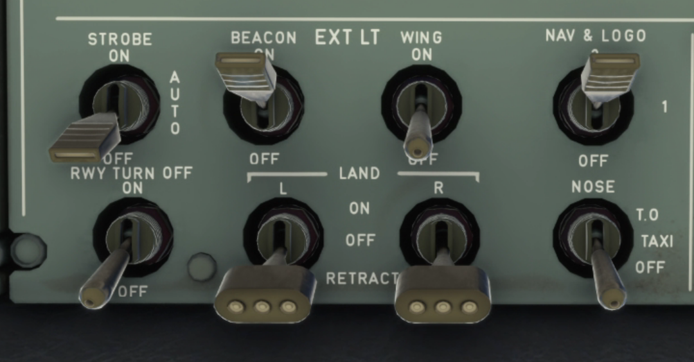

### Lower Pedestal

The following actions should be performed on the lower pedestal

=== "Left Side Lower Pedestal"

    * Set your radio frequency to the one assigned by ATC

        * ATC is set in accordance with airport requirements 
        
        

    * Disarm the spoilers by pushing down on the lever

    * Set your ENG mode selector to NORM 
        
        

=== "Right Side Lower Pedestal"

    * Retract your flaps to ZERO

    * Set your TCAS to STANDBY

        

    * Set your radar OFF

    * Set your predictive windshear system OFF

        

### Overhead Panel + Center Instrument Panel

The following actions should be performed on the overhead panel and the center instrument panel. Make note of the ECAMs when checking for brake temperature.

=== "Left Side Overhead Panel"

    Set your exterior lights:

    * Set your noise wheel light to TAXI

    * Set Runway turn-offs ON

    * Set your strobe lights to AUTO/OFF
        (If you are crossing runway keep them ON until you vacate the runway)

    * For landing lights, you can choose to retract them or turn them off

    Your lights should look like one of the following:

    ^^**Lights Setup 1**^^

    

    ^^**Lights Setup 2**^^

    

=== "Right Side Overhead Panel"

    * Start your APU by clicking the APU master button then the APU start button

    * Turn OFF your anti-ice if it is not required

    * Turn the brake fan on if you get a hot brakes ECAM warning

    

=== "Turning Into Gate"

    * When turning into the gate turn off your nose wheel light and your runway turn off lights

    

    Continue with the [Powering Down](#) steps
