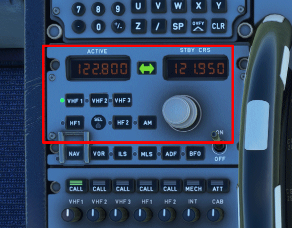
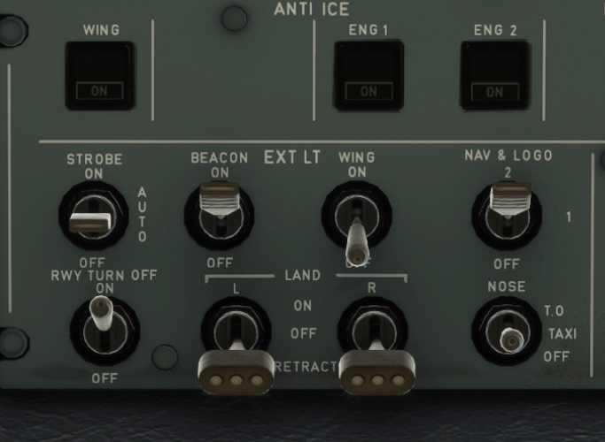

# After landing and taxi to gate

This guide will explain the correct procedures after we have landed and vacated the runway and then taxiing to the designated gate.

!!! warning "Disclaimer"
    The level of detail in this guide is meant to get a FlyByWire A320neo beginner from the runway to the designated destination gate.

    A *beginner* is defined as someone familiar with flying a GA aircraft or different types of airliners. Aviation terminology and know-how is a requirement to fly any airliner even in Microsoft Flight Simulator.

    Further reading: [A320 Autoflight](https://www.smartcockpit.com/aircraft-ressources/A319-320-321-Autoflight.html) 
    Also you will find many great videos on YouTube on how to fly the FlyByWire A32NX. 
    Check out the FlyByWire YouTube Channel as well: [FlyByWire on YouTube](https://www.youtube.com/c/FlyByWireSimulations/playlists)

---

## Pre-requisites

Aircraft has vacated the runway completely and has been brought to a stop on the taxiway as per previous chapters.

Download the [FlyByWire Checklist](../assets/FBW_A32NX_CHECKLIST.pdf) here.

## Chapters / Phases

This guide will cover these phases:

1. After Landing
2. Taxi to gate

---

### 1. After Landing

**Situation:**

-

This concludes *After Landing*

### 2. Taxi to Gate

**Situation:**

-

This concludes *Taxi to Gate*

### Lower Pedestal

The following actions should be performed on the lower pedestal

=== "Left Side Lower Pedestal"

    * Set your radio frequency to the one assigned by ATC

        * ATC is set in accordance with airport requirements 
        
        

    * Disarm the spoilers by pushing down on the lever

    * Set your ENG mode selector to NORM 
        
        

=== "Right Side Lower Pedestal"

    * Retract your flaps to ZERO

    * Set your TCAS to STANDBY

        

    * Set your radar OFF

    * Set your predictive windshear system OFF

        

---

### Overhead Panel + Center Instrument Panel

The following actions should be performed on the overhead panel and the center instrument panel. Make note of the ECAMs when checking for brake temperature.

=== "Overhead Panel"

    * Start your APU by clicking the APU master button then the APU start button

    * Turn OFF your anti-ice if it is not required

    Set your exterior lights:

    * Set your noise wheel light to TAXI

    * Set Runway turn-offs ON

    * Set your strobe lights to AUTO/OFF
        (If you are crossing runway keep them ON until you vacate the runway)

    * For landing lights, you can choose to retract them or turn them off

    Your lights should look like one of the following:

    ^^**Lights Setup 1**^^

    

    ^^**Lights Setup 2**^^

    

=== "ECAM + Landing Gear Panel"

    * Turn the brake fan on if you get a hot brakes ECAM warning

    

=== "Turning Into Gate"

    * When turning into the gate turn off your nose wheel light and your runway turn off lights

    

    Continue with the [Powering Down](#) steps
