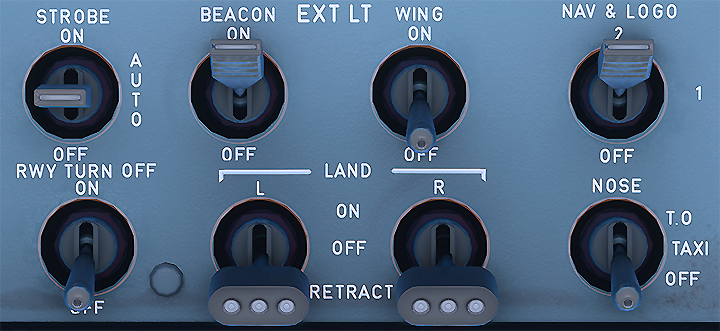

# After landing and taxi to gate

This guide will explain the correct procedures after we have landed and vacated the runway and then taxiing to the designated gate.

!!! warning "Disclaimer"
    The level of detail in this guide is meant to get a FlyByWire A320neo beginner from the runway to the designated destination gate.

    A *beginner* is defined as someone familiar with flying a GA aircraft or different types of airliners. Aviation terminology and know-how is a requirement to fly any airliner even in Microsoft Flight Simulator.

    Further reading: [A320 Autoflight](https://www.smartcockpit.com/aircraft-ressources/A319-320-321-Autoflight.html)<br/>
    Also you will find many great videos on YouTube on how to fly the FlyByWire A32NX.<br/>
    Check out the FlyByWire YouTube Channel as well: [FlyByWire on YouTube](https://www.youtube.com/c/FlyByWireSimulations/playlists)

---

## Pre-requisites

Aircraft has vacated the runway completely and has been brought to a stop on the taxiway as per previous chapters.

Download the [FlyByWire Checklist](../assets/FBW_A32NX_CHECKLIST.pdf) here.

## Chapters / Phases

This guide will cover these phases:

1. After Landing
2. Taxi to gate

---

### 1. After Landing

**Situation:**

- Aircraft has vacated the runways completely and has come to a complete stop on the taxi way as per previous chapters.
- Flaps and Speedbrake are still deployed.
- ATC has been informed that we vacated the runway.

As already stated in the last chapter in real live the A320 will have two pilots which can actually do things in parallel. Talking to ATC, taxing the aircraft and do the after landing tasks.

In the simulation we are typically alone so it is absolutely ok to stop once we have fully vacated the runway and do these things one after the other.

ATC Tower will usually hand us off to ATC Ground and they will give us taxi instructions for our destination gate. Write them down and read them back as usual but you don't have to move immediately unless ATC explicitly tells you to. Online ATC understand that after landing task do take some time.

**Immediate steps after vacating the runway:**

- Set your radio frequency to the one assigned by ATC.
    - ATC is set in accordance with airport requirements.

        

- Disarm the `Speed Brake` lever (Ground Spoilers) by pushing down on the lever.

- Set your `ENG MODE` selector to NORM in case you had set it to IGN/START before.

    

- Retract your `FLAPS` to 0.

- Set your `TCAS` to STANDBY.

    

- Set your `RADAR` to OFF.

- Set your Predictive Windshear System (`PWS`) to OFF.

    

- Start your APU by clicking the APU master button then the APU start button.

- Turn OFF your anti-ice if it is not required.

- Set your exterior lights:
    - Set your noise wheel light to TAXI
    - Set Runway turn-offs ON
    - Set your strobe lights to AUTO/OFF (If you are crossing runway keep them ON until you vacate the runway)
    - For landing lights, you can choose to retract them or turn them off

        {width=320}

- Turn the brake fan on if you get a hot brakes ECAM warning.

    

- Complete the **After Landing** checklist.
    ```
    FLAPS: RETRACTED
    SPOILERS: DISARMED
    APU: START
    RADAR: OFF
    PREDICTIVE WINDSHEAR SYSTEM: OFF        
    ```

This concludes *After Landing*

### 2. Taxi to Gate

**Situation:**

- Aircraft on taxiway directly after runway.
- **After Landing** checklist is completed.
- ATC Ground has given taxi instructions

**Taxiing**

Make sure to also read the Taxi section of the [Engine Start and Taxi](/engine-start-taxi/#taxi) chapter.

Use your charts to follow the ATC taxi instructions to the designated gate.

**Crossing a Runway**

When approved to cross a runway (active or not) perform the following actions:

- Look out the windows and visually ensure that there are no visible aircraft to your left and right.
- Turn on extra lights to ensure your aircraft is visible when crossing:
    - Strobe lights - `Set to ON`
- Inform ATC you have vacated the runway if required.

!!! warning
    Never cross a runway without express permission from ATC and providing a read back of said instructions. Always ensure maximum safety when crossing.

**Turning into the Gate**

 When turning into the gate turn off your nose wheel light and your runway turn off lights to not blind the ground personnel. This of course is only done if enough lighting is available to safely park into the gate. Turn them off if they were used to assist in parking.



This concludes *Taxi to Gate*


