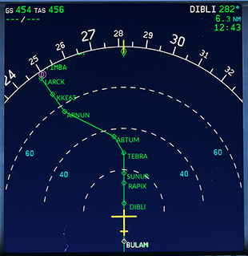
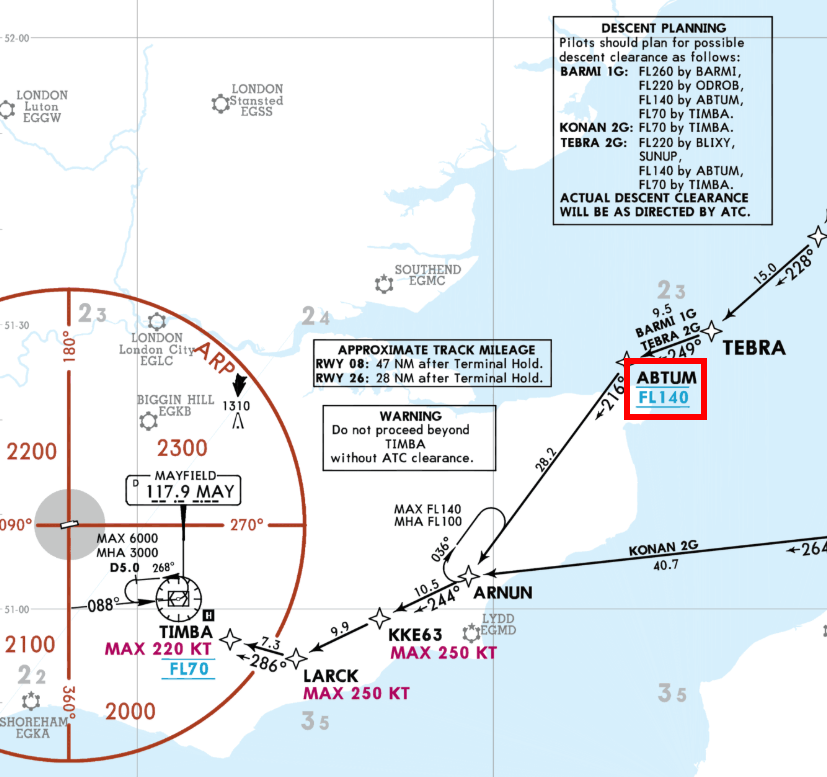

# Descent Planning and Descent

This guide will explain the correct procedures to plan and fly a descent
from cruise altitude through STAR and Instrument Approach up to the final approach.

The actual final approach (ILS approach) will be covered by a separate chapter.

!!! warning "Disclaimer"
    The level of detail in this guide is meant to get a FlyByWire A320neo
    beginner safely from cruise level to the IlS glideslope

    A *beginner* is defined as someone familiar with flying a GA aircraft 
    or different types of airliners. Aviation terminology and know-how is 
    a requirement to fly any airliner even in Microsoft Flight Simulator.
    
    Further reading: [A320 Autoflight](https://www.smartcockpit.com/aircraft-ressources/A319-320-321-Autoflight.html)<br/>
    Also you will find many great videos on YouTube on how to fly the FlyByWire A32NX.<br/>
    Check out the FlyByWire YouTube Channel as well: [FlyByWire on YouTube](https://www.youtube.com/c/FlyByWireSimulations/playlists)

---

## Pre-requisites

Aircraft is in CRUISE state as per previous chapters

Download the [FlyByWire Checklist](../assets/FBW_A32NX_CHECKLIST.pdf) here.

## Chapters / Phases

This guide will cover these phases:

1. [Descent Planning](#1-descent-planning)
2. Starting the Descent
3. Flying the STAR and Approach
4. Intercepting ILS

---

## Base knowledge: Route, Star and Approach

- __Basics__<br/>
  As we have learned in previous chapters a flight route begins with an origin airport and a SID to safely guide the aircraft away from the airport to the first waypoint on their actual route. Similar to a SID the arrival to an airport is done via a STAR (Standard Terminal Arrival Route) and an IAP (Instrument Approach, often APPR) to safely bring the aircraft into a position to land on the destination airport with as little ATC communication as possible.

- __STAR__<br/>
  A Standard Terminal Arrival Route (STAR) ensures safe and efficient traffic from the last en-route waypoint to the initial approach fix (IAF) of the Instrument Approach (IAP). It separates aircraft and avoids conflicts through specific routing, levels/altitudes, speed restrictions and checkpoints often with holding areas.

    One main objective is, to do this with a minimum of communication between the ATC controller and the pilot. As the STAR is part of the flight plan a pilot can simply continue from the normal route into the STAR if ATC has not given any other instructions. Sometimes ATC might give an explicit clearance for the STAR or change the STAR to manage traffic and landing situation (different runways, etc.).

    Often a STAR contains a clearance point which can't be passed without explicit clearance by ATC. If clearance is not given then usually a holding must be flown.

    The STAR which a pilot intends to use is usually included in the ATC flight plan and described in detail in navigational charts.

    Please also have a look at our airliner guide's SIDs and STAR section [SIDS and STARS](../airliner-flying-guide/navigation.md#sids-and-stars)

    Find a good overview over charts in our airliner guide: [Reading a Chart](../airliner-flying-guide/navigation.md#reading-a-chart)

- __Approach__<br/>
  The Instrument Approach (IAP or APPR) has similar objectives as a SID or STAR - safely bring aircraft into a position to land while ensure separation between aircraft.

    IAP are often designed for handling maximum traffic in even bad weather conditions. With only little traffic and good weather it is quite common that ATC instructs the pilot to leave the approach route by giving the pilot heading vectors for a more direct route to the final approach fix (FAF, also called final approach point).

    When flying with Online ATC (VATSIM, IVAO, PilotEdge, ...) expect being vectored to the FAF quite often.

    Find a commented ILS approach chart here: [Approach Chart](../airliner-flying-guide/navigation.md#chart-sample-1)

- __ILS__<br/>
  The Instrument Landing System (ILS) is one of several modern forms of helping an aircraft during its final approach to land even in not optimal weather situations. ILS uses a localizer for lateral guidance and a glideslope for vertical guidance from the final appraoch fix down to a minimum at which the pilots need perform the final landing sequence visually.
  Modern airlines like the A320 are even able to use the ILS to land fully automatically as long as the runway's ILS supports it.

    Find a commented ILS approach chart here: [Approach Chart](../airliner-flying-guide/navigation.md#chart-sample-1)

!!! info "Microsoft Flight Simulator and navigation charts"
    Although Microsoft Flight Simulator allows some flight planning through the user interface it is highly recommended to use navigational charts when flying airliners. MSFS' flight planning does not provide sufficient information to correctly fly a STAR or an approach.

    There are several good sources for charts - free or subscription based. A good free solution is [Chartfox](https://chartfox.org/) which only requires a VATSIM account. One of the most known subscription based sources for charts is [Navigraph](https://navigraph.com/home). It is planned to integrate both solutions into the FlyByWire A32NX FlyPad in the future. 
    
    Often a simple Internet search will do the trick: Search for "<airport icao code> charts": E.g., "EDDM charts"  

---

<!-- Here we could use content tabs. But as I loose my editor's markup
plugin functionality when indenting everything within a content tab
I will do this as the very last step -->

### 1. Descent Planning

!!! info "Pilot's responsibility"
    It is the sole responsibility of us pilots to conduct proper flight planning and especially proper descent planning. It is not at all ATCs task to do descent planning for us pilots by giving descent instructions. On the other hand ATC often actually give descent instructions, especially on common routes, as they want the aircraft in their responsibility to be at certain altitudes when approaching the destination airport. Nevertheless we pilots must know when we need to descent the latest and if necessary we need to pro-actively request clearance to descent from ATC.

    Good descent planning is the foundation for a successful landing. It has to be done early during the flight or even before the flight.

#### Important data points for descent planning:

- **Cruise Flight Level:** The higher we fly the earlier we need to start descending. Also for short flights a too high cruising altitude can make it impossible to actually descent to the destination airport in time.
- **Flight Plan Constraints:** STARs often have flight level (FL) constraints which we must adhere to. We must plan our descent so we can meet these altitude constraints even when they are still far away from the destination airport.
- **Speed**: STARs also regularly have speed constraints which we need to take into consideration as slowing down will cost time and is hard while descending. If we start our descent too late we might not be able to slow down in time as required by a constraint.
- **Aircraft capability and passenger comfort:** Although not a big concern in the A320, general aircraft capabilities and passenger comfort also come into play. Descending with -4000ft/min is no fun for a passenger.

#### Step by step guide for descent planning:

1. Read the STAR chart and determine if there are altitude and/or speed constraints which we need to consider.
2. Consider the STAR and APPR route as optional and do not count on them to be flown and available for descending. ATC might want to vector us to a different runway or at least shortcut our approach. But they won't be able to if we are still too high for the final approach.<br/>
3. Determine the first descent point you need to meet. This could be a STAR waypoint with an altitude constraint, the final approach fix altitude or the airport elevation itself.
4. Calculate the required distance needed to descent to that waypoint with a standard descent rate of 3%. We can use the FlyByWire FlyPad in the cockpit or a simple rule of thumb calculation. (Details below)
5. Use the MCDU PROG page's DIST function to read out the current distance to this waypoint. It is also possible to use the ECAM flight plan, maps or the NDs distance rings to help determining the current distance.

    {width=310 align=left}

    {width=310 align=right}

#### How to calculate the required distance for descent

**Example data:**

- Flight to EGKK via STAR TEBRA 2G
- Flight level FL320
- STAR constraint at waypoint ABTUM "at FL140"

**Example chart:**

<br/>
Copyright © 2021 Navigraph / Jeppesen<br/>
"Navigraph Charts are intended for flight simulation use only, not for navigational use."

**Using the FlyPad:**

Standard calculation with 3° descent path:


Calculation with a specific distance to calculate the required descent velocity (V/S):


**Using "Rule of Thumb":**

```
Distance = "Altitude difference" * 3 / 1000 + 10%margin**

Altitude difference: 32000 - 14000 = 18000<br/>
Times 3:             18000 * 3 = 54000<br/>
Divided by 1000:     54000 / 1000 = 54<br/>
Plus margin (~10%):  59 NM
```

Margin can be lower when headwind and larger for tailwind.

As can be seen on the chart there will be a further descent to TIMBA at FL70 and after that (not visible on the chartabove) there will be a descent to the final approach which will be at 2000ft at the Final Approach Fix FF26L.

The same methodology/calculation as our initial descent can be applied to these descents as well but they are much easier as they are usually designed in a way that an aircraft with a 3° descent path can make these descents with ease.

ATC will quite often instruct certain altitudes within the STAR and APPR which deviate from the STAR and APPR charts. So expect such instructions at any time.

This concludes descent planning.

---

### 2. Starting the Descent

---

### 3. Flying the STAR and Approach

---

### 4. Intercepting ILS


