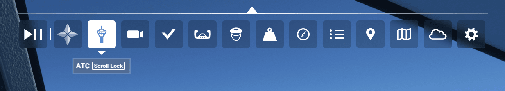
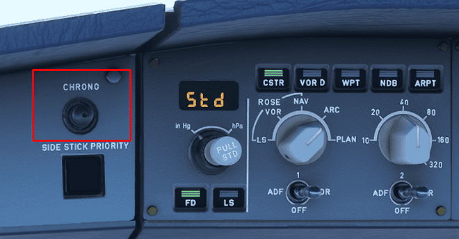
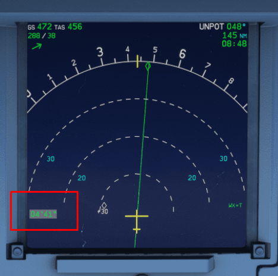

# Engine Start and Taxi

This guide will explain the correct procedures to accomplish a pushback with engine start and perform a safe taxi to the departure runway. 

---

## Pre-requisites

- BEFORE START checklist completed
- IFR clearance obtained
- The aircraft is secure
- EXT power has been disconnected
- APU MASTER SW - `Set to ON` and the APU is available
- APU BLEED - `Set to ON`
- Beacon light - `Set to ON`
  
At this time you may request for clearance to push and start from ATC.  

[Download FlyByWire Checklist](../assets/FBW_A32NX_CHECKLIST.pdf){ .md-button }

---

## Pushback

There are several options available to you in MSFS to achieve a successful pushback. 

- The flyPad (EFB) ground control screen
- MSFS built in ATC pushback controls
- Third party pushback addons

For the purposes of this guide we will use the default MSFS built in ATC.

1. Open the ATC menu using the toolbar at the top of your screen. 
   
2. Locate `GROUND SERVICES` and select it.
3. Select `REQUEST PUSHBACK`.
    - You should hear your virtual pilot request pushback and ATC respond confirming. At this time the pushback tug should slowly make its way to your nose wheel. 
    - You will notice a slight "jerk" as it connects with your nose wheel. Verify NWS STRG DISC is listed on the ECAM memos.
4. Release your parking brake.
5. In the ATC window use `REQUEST PUSHBACK STEER TO THE LEFT` OR `REQUEST PUSHBACK STEER TO THE RIGHT` to turn the aircraft.
    
!!! info "Steering Commands"
    Please note when selecting other option this will "steer" the tail towards the specified direction. 

    For example, if your external camera is directly behind the aircraft and you request `STEER TO THE LEFT` the tail of your aircraft will be "steered" to the left. 

6. Select `REQUEST PUSHBACK STOP` to end pushback when you are satisfied with your position on the taxiway.

---

## Engine Start

Once you are clear of the terminal and/or the ground crew has notified you it is clear to start engines you can proceed with the following steps. 

Start the chronometer above the ND to help you monitor the start up time of your engines. 

!!! info "Using the Chronometer"
    The chrono button has three states depending on how many times you have pushed the button:

    1. First Push - Starts the timer on the ND
    2. Second Push - Stops the timer on the ND
    3. Third Push - Removes the timer from the ND

    Time is represented as *minutes*' *seconds*" i.e. 04'41" equates to 4 minutes and 44 seconds.

    Location on the ND:

    

Using the tabs below begin by starting engine 1. 

=== "Start Engine 1"
    1. Set the `ENG` mode selector to `IGN/START`
        - You should hear the packs turn off.
        - The lower ECAM should automatically display the engine parameters screen. 
    2. Set `ENG 1` Master to the ON position.
        - Pay attention to your ECAMs and note your engine parameters as ENG 1 starts up. 
        - The engine should take roughly 1 minute to complete its start up sequence - use the chronometer you started earlier to time this.
    
    Engine 1 will have successfully started when the following applies (at ISA sea level):

    - N1 is at roughly 19%
    - N1 reported `AVAIL`  
    - N2 is at roughly 68%
    - EGT settles at about 520°C
    - FF is at roughly 290 kg/h

=== "Start Engine 2"
    1. Set `ENG 2` Master to the ON position.
        - Pay attention to your ECAMs and note your engine parameters as ENG 2 starts up.
        - The engine should take roughly 1 minute to complete its start up sequence - use the chronometer you started earlier to time this.

    Engine 2 will have successfully started when the following applies (at ISA sea level):

    - N1 is at roughly 19%
    - N1 reported `AVAIL`  
    - N2 is at roughly 68%
    - EGT settles at about 520°C
    - FF is at roughly 290 kg/h

---

## After Engine Start

Complete the after start flow:

- Set the `ENG` mode selector to `NORM`
- FLAPS - `Set`
    - As defined in the MCDU Preparation guide.
- GROUND SPOILERS - `Arm`
- APU BLEED - `Set to OFF`
- APU MASTER SW - `Set to OFF`
- ANTI ICE - `As required`
    - Consider when temperatures are less than 10C and visible moisture.
- PITCH TRIM - `Check`
- RUDDER TRIM - `Zero`

Configure your lights for taxi:

- RWY TURN OFF - `Set to ON`
- NOSE - `Set to Taxi`

Perform the AFTER START checklist.

---

## Taxi

!!! info "Taxi Speed + Engine Thrust"
    The A32NX is perfectly capable taxiing with idle thrust and even gradually accelerate. In certain situations it may be required to provide some thrust to begin rolling. 

    Standard behavior is to allow the aircraft to reach 30kts and apply brakes to 10kts. Repeat as necessary. 

### Performing Taxi

Having charts or diagrams of the airport you are currently in will help you navigate efficiently and safely. There are many resources and applications available online that are either free or paid which you can utilize. 

For additional information on signs and markings on the ground please see [General Resources](#general-resources) below.

!!! info "Before Moving the Aircraft"
    Ensure the following has been accomplished before moving the aircraft:

    - Taxi clearance obtained
    - Lights set to the correct position (discussed earlier)

Once you have your routing from ATC and have read back your taxi clearance you are now free to taxi to the runway. For this portion of the guide we will assume that you have pushed back onto a serviceable taxiway parallel to the terminal.

- Verify the ground crew is safely away.
- Look to your left and right to ensure clearance from other aircraft or vehicles.
- Release your parking brake.

At this point the aircraft may start rolling. Depending on your weight you may need to add a little power to the engines to get going. Increase power to roughly ~25-30% N1. Be mindful that you are not blasting N1 towards or around the terminal.

- Leave a bit of thrust on and perform a quick brake check to ensure hydraulics and brakes are fully functioning.
    - You don't need to come to a complete stop but merely check the brake pressure status when performing the brake check.

If you need to perform a sharp turn immediately you may need more than ~25-30% N1 and should set your thrust accordingly. Try not to perform the brake check while in a turn as you don't want to come a complete stop while turning.

While underway to the runway perform a pre-flight briefing/check:

- Flight controls checked.
- Check your FMA modes are correct for departure. 
- Perf page on the MCDU has the correct runway, V speeds, and performance factors.
- Check your stop altitude (initial climb altitude).
- Turn on the weather radar if required.
- Set TCAS to TA/RA.
- AUTO BRK - `Set to MAX`

!!! info "Performing a Flight Controls Check"
    Using the ECAM control panel press the `F/CTL` button to switch the lower ECAM to the flight controls. Ensure all flight controls are displayed in green.

    The `F/CTL` ECAM page shows you a white scale and green index for the following positions:

    - Left and right ailerons position
    - Left and right elevator position

    Fully deflect your sidestick in all directions and observe that full range of motion is represented on the ECAM page. You should note the upward arrows in the `SPD BRK` area when moving the ailerons and ensure those are displayed when deflecting your side stick. 

    Move your rudders and pay attention to the rudder symbol to ensure it moves all the way to the left or right. 

    **Sidestick right full deflection:**

    

#### Speed While Taxiing

Pay attention to your ground speed (visible on the ND) while you taxi. This will provide you with your knots on the ground. 

- Straight Line
    - Anything up to 30kts is reasonable, but some airports may carry their own local restrictions that you should be mindful of. This is not an absolute rule and is usually typical SOP for airlines in a straight line.
- 90° (Sharp) Turns
    - A good speed would be around 10kts. This provides safety for the flight crew as they perform their safety demonstration/checks.
- Regular Turns
    - Around 15kts is an acceptable speed with a similar concept to providing safety as described above. 

#### Handy Tips While Taxiing

- Maintaining Center Line
    - You can use the grey vertical bar in between the PFD and ND as a reference point and keep the taxi line in between the two screens.  
- Turning
    - Using the same bar mentioned above try to "over steer" (keep the nose wheel slightly ahead of the line while you turn). This helps keep you centered while performing a turn.
    - Slow down while turning!
    
#### Crossing a Runway

When approved to cross a runway (active or not) perform the following actions:

- Look out the windows and visually ensure that there are no visible aircraft to your left and right. 
- Turn on extra lights to ensure your aircraft is visible when crossing:
    - Strobe lights - `Set to ON`
- Inform ATC you have vacated the runway if required.

!!! warning
    Never cross a runway without express permission from ATC and providing a read back of said instructions. Always ensure maximum safety when crossing.

---

## General Resources

This section provides you with information on understanding the different signs and markings you may see while taxiing at the airport.

### Airport Signage and Markings

!!! info "Scenery / Accuracy Issues"
    Please be aware that the default scenery or 3rd party sceneries may not be entirely accurate with the posted signage on the ground. However, this guide will explain how to read and understand them.

#### FAA Quick Reference Guide

The FAA has a handy guide available for download that contains images of all the pertinent signs you may encounter, their purpose, and location at the airport. 

[Download FAA Guide](https://www.faa.gov/airports/runway_safety/publications/media/QuickReferenceGuideProof8.pdf){ .md-button }

---

There are two types of signage at airports - operational guidance signs and mandatory instruction signs. 

#### Operational Guidance Signs 

^^Location Signs^^

- These signs are yellow text on a black background. Typically, indicates a specific taxiway or runway your aircraft is on or entering.

^^Direction/Runway Exit Signs^^
  
- Black text on a yellow background. These will have an arrow indicating direction to turn which helps pilots identify what taxiways they are approaching or runway exits towards a specified runway.

    

^^Stop Bar Signs^^

- White text on a blue background. These are non-standard signs that may appear at some airports usually indicating which taxiway a stop bar is positioned. Airports usually use more conventional traffic signs you may see on the road such a regular stop sign. See the [FAA Guide](#faa-quick-reference-guide) for samples. 

    

#### Mandatory Instruction Signs

^^Runway Signs^^ 

- White text on a red background. These signs inform pilots that a runway intersection is ahead.

^^Holding Position Signs / Markings^^

There are typically three very important holding position signs / markings that appear on the ground at airports. At various airports that operate with low visibility these positions are also paired with a line of red lights across a taxiway to help visually indicate the holding positions. 

1. Runway Holding Position
    - Two sets of solid yellow lines and two sets of dashed yellow lines indicate a holding position for a runway ahead. These **must never be crossed** without express permission from ATC.   
2. Taxiway Holding Position
    - Single dashed yellow line. If this is present along your taxi route it will indicate a position that ground control may request you stop and hold short prior to another taxiway.
3. ILS Critical Area
    - Solid yellow lines that look like a railroad or ladder. These are another form of hold short point but indicate a critical area where your aircraft would violate the ILS approach airspace while on the ground.

---

### Taxiway Lighting

Taxiway lighting helps the flight crew and ground crew navigate the airport at night or in low visibility and stop at the appropriate locations as given by ATC. 

There are usually two types of lighting on taxiways - centerline and edge. Depending on the airport operator the lightning may differ if the airport operates in low visibility conditions. 

- Centerline lighting is green on the principal taxiways located along the taxiway centerline. These lights can alternate between green and yellow when a taxiway crosses a runway or highlight a "lead-off" taxiway from a runway to join a taxiway. 
- Edge lighting is typically blue and characteristically appears at the edges of a taxiway. Spacing can range from 50 - 200ft apart usually condensing in distance when approaching an intersection. 

John Murphy, [CC BY-SA 2.0](https://creativecommons.org/licenses/by-sa/2.0)

