# Final Appraoch and ILS Landing

This guide will explain the correct procedures to fly a final approach and conduct an ILS landing.

!!! warning "Disclaimer"
    The level of detail in this guide is meant to get a FlyByWire A320neo
    beginner on approach to intercept the ILS and land the aircraft safely on the runway.

    A *beginner* is defined as someone familiar with flying a GA aircraft 
    or different types of airliners. Aviation terminology and know-how is 
    a requirement to fly any airliner even in Microsoft Flight Simulator.
    
    Further reading: [A320 Autoflight](https://www.smartcockpit.com/aircraft-ressources/A319-320-321-Autoflight.html) 
    Also you will find many great videos on YouTube on how to fly the FlyByWire A32NX. 
    Check out the FlyByWire YouTube Channel as well: [FlyByWire on YouTube](https://www.youtube.com/c/FlyByWireSimulations/playlists)

---

## Pre-requisites

Aircraft is on approach shortly before intercepting the ILS and is still in phase and state `DES` as per previous chapters.

[Download FlyByWire Checklist](../assets/FBW_A32NX_CHECKLIST.pdf){ .md-button }

## Chapters / Phases

This guide will cover these phases:

1. [Intercepting the ILS Localizer](#1-intercepting-the-ils-localizer)
2. [Intercepting the ILS Glideslope](#2-intercepting-the-ils-glideslope)
3. [Preparation and Checklist for Landing](#3-preparation-and-checklist-for-landing)
4. [Landing](#4-landing)
5. [Vacate Runway](#5-vacate-runway)

---

## 1. Intercepting the ILS Localizer

**Situation:**

- Aircraft is in `DES` phase
- Aircraft is setup for flight <10,000ft (`seat belt signs` on, `landing lights` on, etc.)
- We are either within the IAP (Instrument Approach) and at the correct altitude and speed or at a heading vector, altitude and speed instructed by ATC

At the end of the Instrument Approach (or by ATC vectoring) we will be on a path to the Final Approach Fix and/or intercepting the ILS localizer and eventually the ILS glideslope.

As a last instruction from ATC Approach we usually are instructed to contact Tower ATC when fully established on the ILS localizer.

To intercept the ILS Localizer follow the following steps:

- Verify that the correct ILS frequency is tuned in the `MCDU-RNAV` page. We find the correct frequency on the approach chart 

    === "Check ILS frequency"

        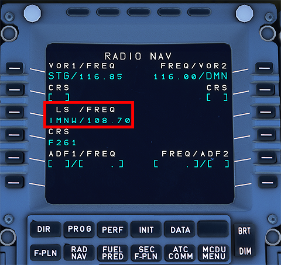{align=right width=300}

        {align=left width=300} 
        *Copyright © 2021 Navigraph / Jeppesen 
        "Navigraph Charts are intended for flight simulation use only, not for navigational use."*

- Turn on the `ILS localizer and glideslope scales` with the `ILS` button on the glareshield.

    === "Turn on ILS scales"

        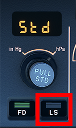{align=left width=100}
      
        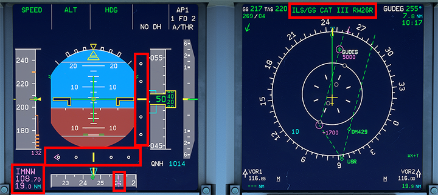{align=right width=520}  

- Make sure we are on the correct altitude and we should not have an approach angle larger than 30°. 

     
    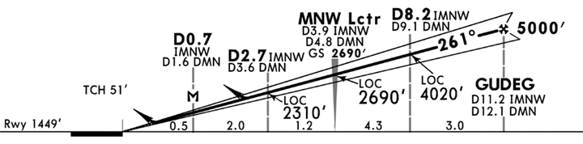

- Optional: Turn on `ILS Mode` for the `ND` (can also be on F.O.'s side)

    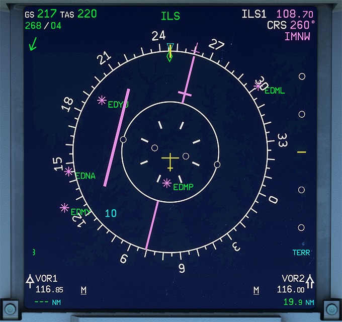{width=360}

- Activate the `APPR` phase in the `MCDU-PERF` page (if not already on automatically)

    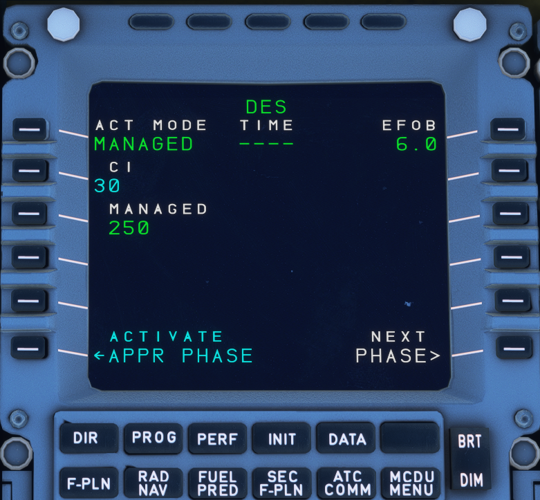{width=360}

- Set `SPEED` to `Managed Speed Mode` (push the `Speed Selector`)
- Set `FLAPS` to 1 when speed is below V~FE~ for the first slat/flap configuration

    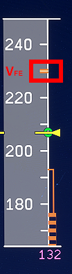

- Turn on `LOC` in the `FCU` to command the aircraft to intercept the ILS localizer. The aircraft will keep the current heading until the localizer guides the aircraft towards the runway. The `lateral ILS localizer scale` shows the `deviation marker` moving towards the middle of the `lateral deviation scale`. Also the lateral `FMA` shows `LOC` in blue (armed).

    

    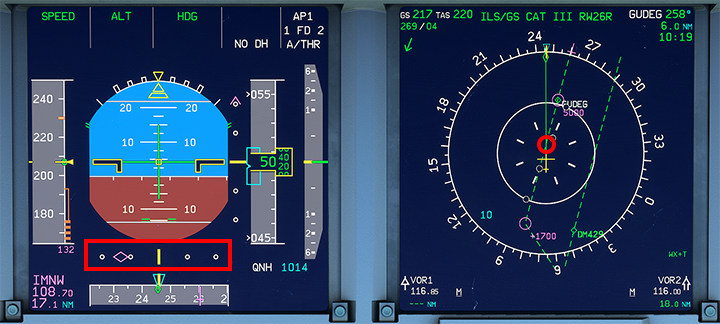

- When we are established on the ILS localizer (the lateral `FMA` shows `LOC` in green) we will contact Tower ATC and report that we are established on the ILS localizer (including call sign and runway).

    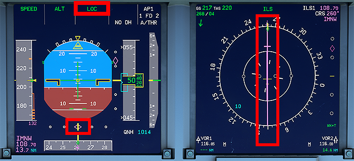

Tower ATC will the give us clearance for ILS approach for the target runway. This is the actual clearance that we are allowed to also descent along the ILS glideslope.

**Do not descent without explicit clearance from ATC.**

This concludes *Intercepting the ILS Localizer*

---

## 2. Intercepting the ILS Glideslope

**Situation:**

- Aircraft is established on ILS localizer
- Flaps are set to 1

After ATC has given us clearance for ILS approach we can also start descending using the ILS glideslope.

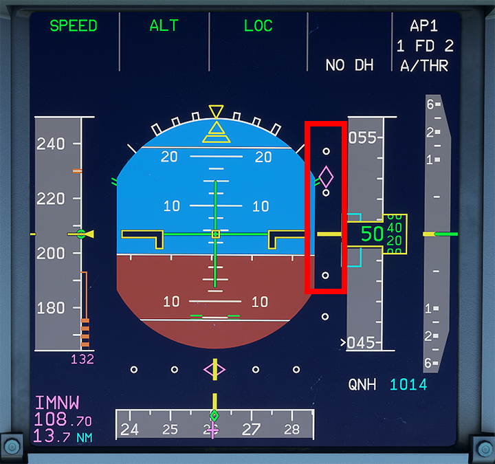{width=360}

Press the APPR button on the FCU to arm the ILS glideslope descent mode.

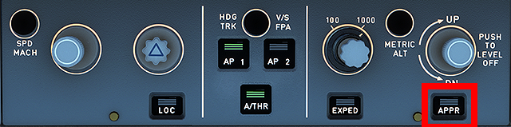

The vertical `FMA` will now show `G/S` (glideslope) in blue.

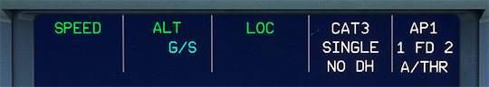{width=360}

 This is a good time to set `Flaps 2` (check that the speed is below the V~FE~ for the next flap setting) as slowing down once descending along the glideslope can be difficult. We need drag from the flaps if we do not want to let the gear down too early (which also would help us slowing down).

The aircraft will start descending when the deviation marker is in the middle (we are on the glideslope). The vertical `FMA` will then say `G/S` in green.

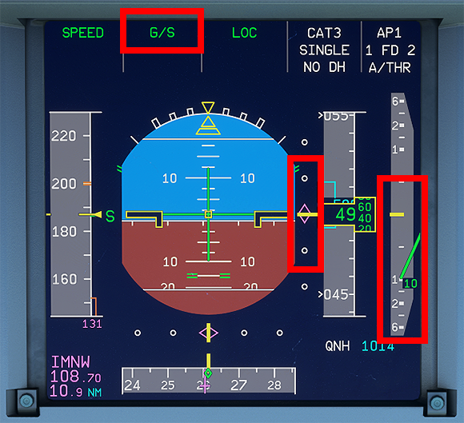{width=360}

We will now descent along the glideslope until the radio altimeter comes alive which happens at 2,500ft above the ground.

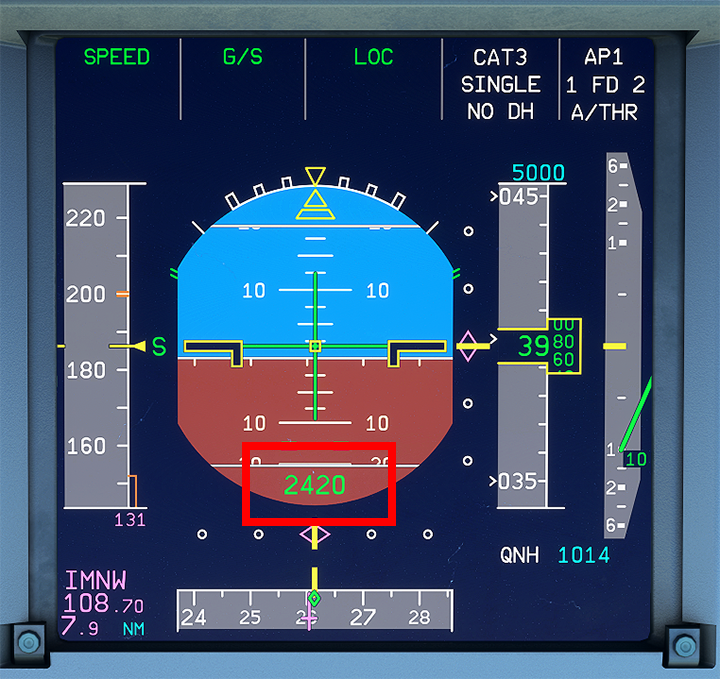{width=360}

This concludes *Intercepting the ILS Glideslope*

---

## 3. Preparation and Checklist for Landing

**Situation:**

- Aircraft is established on ILS localizer and glideslope
- Flaps are set to 2

Prepare the aircraft for a Go-Around at this point by setting the Go-Around altitude in the FCU (Detailed Go-Around preparation and procedure are not covered by this beginner guide)

For the final approach do the following steps:

- `Gear down`: Sometime between 2,500ft and 1,000ft , typically around 5-6NM from runway.
- Set `Flaps 3` and shortly after `Flaps FULL` (always check speed before setting flaps otherwise you get an overspeed alarm).
- Arm `Auto Brakes` (`Low` when dry, `Med` in rain or snow or a short runway)
- Arm `Speed Break`

We need to be fully setup at 1,000ft above the ground.

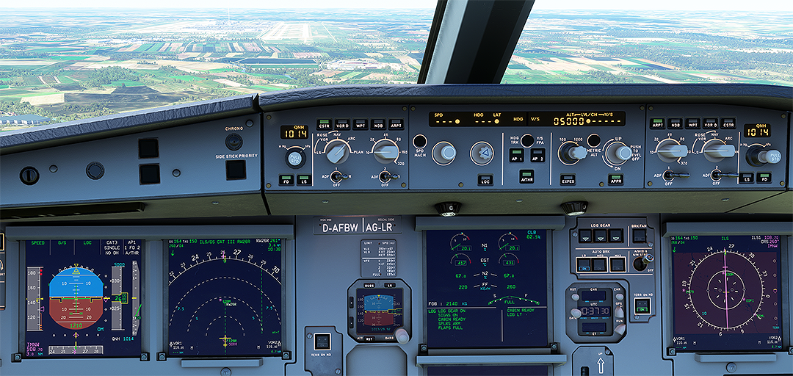

Complete the **Landing Checklist**

- Cabin Crew: advised
- A/THR: SPEED or OFF
- Auto Brake: LO or MED
- ECAM Memo: LDG no blue
      - LDG GEAR DN
      - SIGNS ON
      - CABIN READY
      - SPLRS ARM
      - FLAPS SET

For the landing we have our hand on the thrust levers for a potential go-around so we can quickly push the levers forward into TOGO. **We do not move the levers until the last seconds before landing.**

This concludes *Preparation and Checklist for Landing*

---

## 4. Landing

**Situation:**

- Aircraft is fully setup for landing as per previous chapters
- Flaps are set to FULL
- Aircraft is at about 1,000ft above the ground
- Wind is calm (no cross wind)

Although the A320 can do an automatic landing (**Autoland**) we will do the more common manual landing.

We **MUST** get landing clearance from ATC before we actually are allowed to land. Without landing clearance we must do a go-around (not part of this beginner guide). Usually ATC will have given us clearance at this point. Late clearance is rare and usually communicated to the us before hand. If we have Minima we need to get clearance before reaching the minimum. With no minimum as in our example we need to get clearance shortly before touchdown otherwise do a go-around.

For this we turn of the **Autopilot** at about 500ft above the ground by pressing the `AP1` button on the `FCU`. We leave the **Autothrust** on so we don't have to worry about thrust and speed at all. Leaving **Autothrust** on for landing is common for the Airbus.

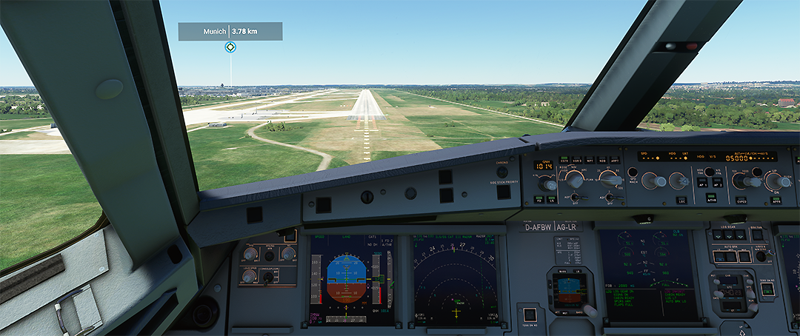

Now look at the PAPIs which guide us vertically down to the correct touchdown point.  We want two white lights and 2 red lights.

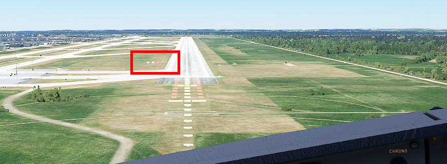

See also [Wikipedia:PAPI](https://en.wikipedia.org/wiki/Precision_approach_path_indicato)

We correct our pitch only very carefully when too high (3-4 white) or too low (3-4 red). We don't need a lot of input to the sidestick to correct.

Also we hold the center line of the runway in a way that it points directly under us.

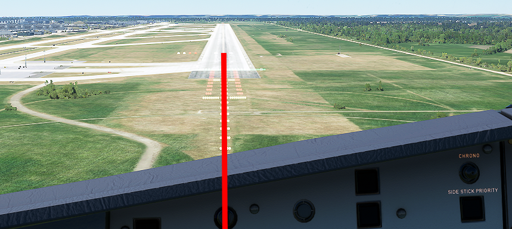

Also correct your final heading and bank very carefully. We should not need to correct much at this point.

!!!info "Crosswind landings"
    Crosswind landings are beyond the scope of this beginner guide. There many good videos for A320 crosswind landings on Youtube.

 Once over the runway threshold we look to the end of the runway to better judge our pitch especially for the so called **Flare**.

 At the runway threshold we should be about 50ft above ground and prepare to set the thrust levers to idle and flare.

At about 30ft we start our flare by pulling back on the sidestick carefully. We only need a few degrees in positive pitch and hold the aircraft there. Too much flare will cause us to float down the runway, too little will cause a had landing.

At about 10-20ft we pull back the thrust levers to idle (the aircraft also sounds the callout "Retard retard ...") so the we are at idle **before** we touch the ground.

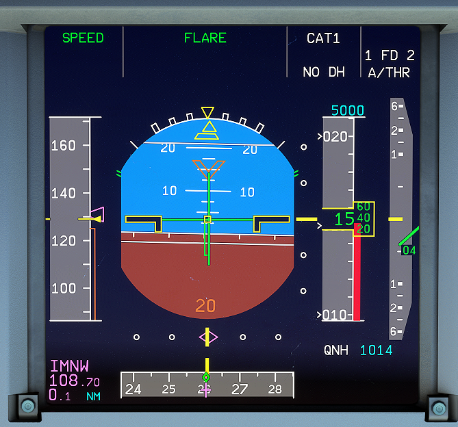{width=360}

We hold the aircraft until it settles on the ground. Do not push the sidestick forward (nose down) once flared - let the aircraft settle to the runway while holding the pitch.

On touchdown the `Speed Brakes` will deploy automatically (we have armed them earlier) and we can pull the thrust levers into the reverse position.

We let the front gear settle on the runway (don't slam it down) and hold the center line of the runway while we are loosing speed. This can be checked on the `PFD` speedband.

The `Auto Brakes` should now have began to decelerate the aircraft further.

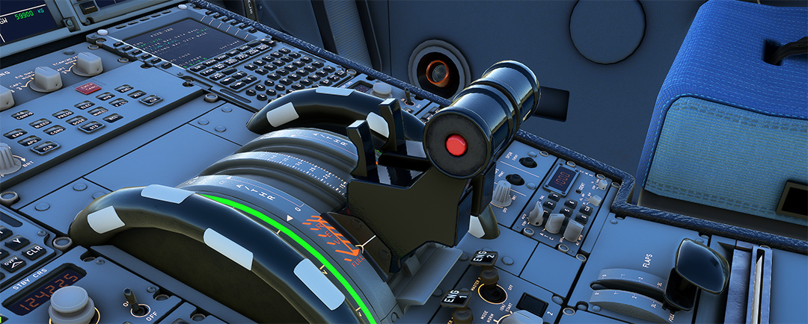

The ECAM should now show the engines in reverse mode (`REV`) and the `Speed Brake` deployed. Also you should notice that the brakes actually get hotter.

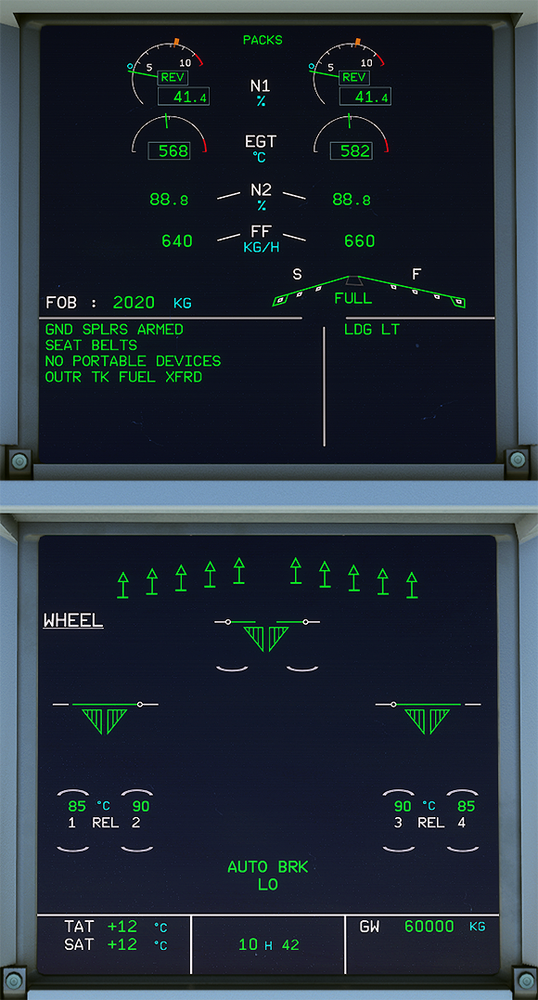{width=360}

At about 60knots we put the thrust levers back to idle and at about 40knots we release the `Auto Brakes` by braking manually which deactivates the `Auto Brake`.

This concludes *Landing*

---

## 5. Vacate Runway

TODO

This concludes *Vacate Runway*

Please continue with [After Landing Steps](after-landing-steps.md)
