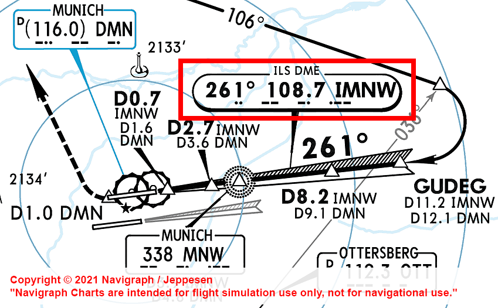
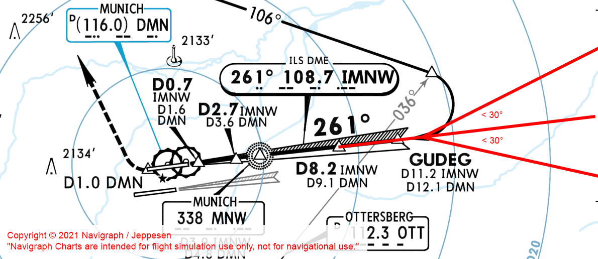
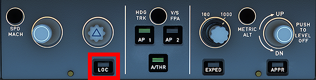

# Final Appraoch and ILS Landing

This guide will explain the correct procedures to fly a final approach and conduct an ILS landing.

!!! warning "Disclaimer"
    The level of detail in this guide is meant to get a FlyByWire A320neo
    beginner on approach to intercept the ILS and land the aircraft safely on the runway.

    A *beginner* is defined as someone familiar with flying a GA aircraft 
    or different types of airliners. Aviation terminology and know-how is 
    a requirement to fly any airliner even in Microsoft Flight Simulator.
    
    Further reading: [A320 Autoflight](https://www.smartcockpit.com/aircraft-ressources/A319-320-321-Autoflight.html) 
    Also you will find many great videos on YouTube on how to fly the FlyByWire A32NX. 
    Check out the FlyByWire YouTube Channel as well: [FlyByWire on YouTube](https://www.youtube.com/c/FlyByWireSimulations/playlists)

---

## Pre-requisites

Aircraft is on approach shortly before intercepting the ILS and is still in phase and state `DES` as per previous chapters.

[Download FlyByWire Checklist](../assets/FBW_A32NX_CHECKLIST.pdf){ .md-button }

## Chapters / Phases

This guide will cover these phases:

1. [Intercepting the ILS Localizer](#1-intercepting-the-ils-localizer)
2. [Intercepting the ILS Glidescope](#2-intercepting-the-ils-glidescope)
3. [Preparation and Checklist for Landing](#3-preparation-and-checklist-for-landing)
4. [Landing](#4-landing)
5. [Vacate Runway](#5-vacate-runway)

---

## 1. Intercepting the ILS Localizer

**Situation:**

- Aircraft is in `DES` phase
- Aircraft is setup for flight <10,000ft (`seat belt signs` on, `landing lights` on, etc.)
- We are either within the IAP (Instrument Approach) and at the correct altitude and speed or at a heading vector, altitude and speed instructed by ATC

At the end of the Instrument Approach (or by ATC vectoring) we will be on a path to the Final Approach Fix and/or intercepting the ILS localizer and eventually the ILS glidescope.

As a last instruction from ATC Approach we usually are instructed to contact Tower ATC when fully established on the ILS localizer.

To intercept the ILS Localizer follow the following steps:

- Verify that the correct ILS frequency is tuned in the `MCDU-RNAV` page. We find the correct frequency on the approach chart 
     
     *Copyright © 2021 Navigraph / Jeppesen 
    "Navigraph Charts are intended for flight simulation use only, not for navigational use."* 
    (TODO: MCDU RNAV page image)
- Turn on the `ILS localizer and glidescope scales` with the `ILS` button in the FCU (TODO: screenshot button and PFD)
- Make sure we are on the correct altitude and we should not have an approach angle larger than 30°. 
     
    *Copyright © 2021 Navigraph / Jeppesen 
    "Navigraph Charts are intended for flight simulation use only, not for navigational use."*
- Optional: Turn on `ILS Mode` for the `ND` (can also be on F.O.'s side)
    (TODO: screenshot)
- Activate the `APPR` phase in the `MCDU-PERF` page (if not already on automatically)
    (TODO: image)
- Set `SPEED` to `Manages Speed Mode` (push the `Speed Selector`)
- Set `FLAPS` to 1 when speed is below V~FE~ for the first slat/flap configuration 
    (TODO: image PFD speedband)
- Turn on `LOC` in the `FCU` to command the aircraft to intercept the ILS localizer. The aircraft will keep the current heading until the localizer guides the aircraft towards the runway. The `lateral ILS localizer scale` shows the `deviation marker` moving towards the middle of the `lateral deviation scale`. 
    
    (TODO: images ILS scales)

When we are established on the ILS localizer we will contact Tower ATC and report that we are established on the ILS localizer (including call sign and runway). (TODO: image of PDF)

Tower ATC will the give us clearance for ILS approach for the target runway. This is the actual clearance that we are allowed to also descent along the ILS glidescope.

**Do not descent without explicit clearance from ATC.**

OPEN QUESTIONS:
* when Landing checklist
* when instructing cabin to take specialist
* when flaps exactly
* ....

This concludes *Intercepting the ILS Localizer*

---

## 2. Intercepting the ILS Glidescope

This concludes *Intercepting the ILS Glidescope*

---

## 3. Preparation and Checklist for Landing

This concludes *Preparation and Checklist for Landing*

---

## 4. Landing

This concludes *Landing*

---

## 5. Vacate Runway

This concludes *Vacate Runway*

Please continue with [After Landing Steps](after-landing-steps.md)
