# Preparing the MCDU

This guide will help you prepare the MCDU in the A32NX for your departure. It includes a simple route that you can use to follow along easily and replicate in the simulator.

!!! warning "Disclaimer"
    The level of detail in this guide is meant to provide a FlyByWire A320neo beginner the ability to adequately program the MCDU to conduct and complete a flight.

    A *beginner* is defined as someone familiar with flying a GA aircraft
    or different types of airliners. Aviation terminology and know-how is
    a requirement to fly any airliner even in Microsoft Flight Simulator.

    You will find many great videos on YouTube on how to fly the FlyByWire A32NX. 
    Check out the FlyByWire YouTube Channel as well: [FlyByWire on YouTube](https://www.youtube.com/c/FlyByWireSimulations/playlists)

The simBrief route used in this guide

[Download simBrief OFP](../assets/beginner-guide/mcdu/sample-ofp.pdf){ .md-button }

***

## Pre-requisites

Below are a few pre-requisites before programming the MCDU.

Visit [Starting the Aircraft](starting-the-aircraft.md) to learn more.

* Make sure the aircraft is powered up.
    * External Power OR APU
* Make sure the ADIRS are set to NAV.
* Have a valid flight plan.
* Ensure IFR clearance has been obtained.

!!! info "Requesting IFR Clearance"
    Before departing for the flight, we must obtain an IFR clearance from ATC. The clearance may be obtained from clearance delivery or another specific frequency, depending on the airport and available services.

    If you are not flying on network and are using the built in ATC menu, simply find the appropriate selection in the menu and request for IFR clearance. 

    Clearances will usually provide the following information below. As a pilot you would need to readback the clearance correctly or acknowledge it if using the built in ATC menu.

    - Cleared to the destination via specified route in the filed flight plan.
    - Initial cleared altitude after departure.
    - Assigned SID for departure OR radar vectors
    - Assigned departing runway.
    - Transponder/squawk code.
    - Departure frequency.

    Additional reading material: [The CRAFT mnemonic](https://en.wikipedia.org/wiki/CRAFT_(aviation))

***

## Chapters / Phases

This guide will cover the following topics:

1. [Understanding the MCDU](#understanding-the-mcdu)
2. [MCDU Programming](#mcdu-programming)
    * Section 1 - [DATA - INIT A - FLIGHT PLAN](#section-1)
    * Section 2 - [FUEL PRED - SECONDARY FLIGHT PLAN - RADNAV](#section-2)
    * Section 3 - [INIT B - PROG - PERF](#section-3)
3. [A32NX simBrief Integration](#a32nx-simbrief-integration)

***

## Understanding the MCDU

During the course of this guide we will be referring to a few key terms which are defined below.

=== "Line Select Key (LSK)"

    `LSK` for short. These keys are on the left and right hand side of the MCDU screen. They are highlighted in the image below. 

    * Left hand keys are referenced (in descending order) as `LSK1L - LSK6L`. 
    * Right hand keys are referenced (in descending order) as `LSK1R - LSK6R`.

    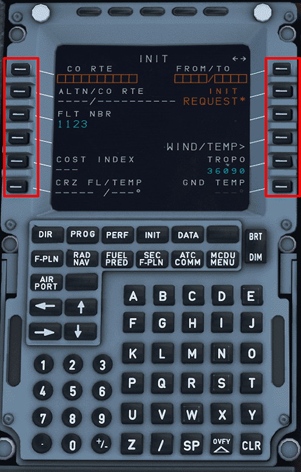

=== "Slew Keys"

    These keys are referenced below. 

    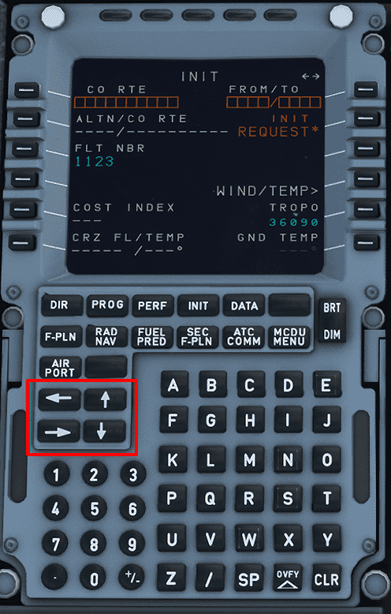{ align = right }

    !!! info

        === "Horizontal Slew Keys"

            These keys scroll between certain pages i.e. `INIT A` and `INIT B` when the INIT page is selected. 

        === "Vertical Slew Keys"

            These keys scroll vertically on certain pages i.e. `F-PLN` page. 

***

## MCDU Programming

**D.I.F.F.S.R.I.P.P.**

Pilots commonly use the acronym above when programming the MCDU. It represents the following:

`DATA - INIT A - FLIGHT PLAN - FUEL PRED - SECONDARY FLIGHT PLAN - RADNAV - INIT B - PROG - PERF`

For simplicity's sake this portion of the guide will be split into three sections.

* Section 1 - [DATA - INIT A - FLIGHT PLAN](#section-1)

* Section 2 - [FUEL PRED - SECONDARY FLIGHT PLAN - RADNAV](#section-2)

* Section 3 - [INIT B - PROG - PERF](#section-3)

The simBrief route used in this guide - [Available Here](../assets/beginner-guide/mcdu/sample-ofp.pdf)

***

### Section 1

=== "DATA"

    This MCDU page provides various data for the pilots. It has two pages (accessed by using the horizontal slew keys). It will not be used for this tutorial. 

    DATA includes the pages below:

    * Position Monitor
    * IRS Monitor
    * GPS Monitor
    * A/C Status
    * Closest Airports
    * Equitime Point
    * Waypoints
    * NavAids
    * Runways
    * Routes

=== "INIT A"

    ^^FROM/TO Field^^ 

      * Using the keypad type in `EGFF/EGCC`
      * Once this is in the scratch pad press LSK1R.
      * This following screen would show "company routes". Since there are none stored select `Return` using LSK6L.

    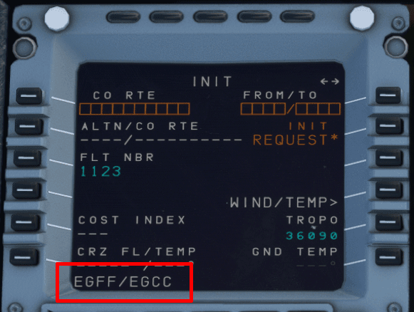

    ^^FLT NBR^^

    * Using the keypad type in `EZY123` and press LSK3L. Feel free to use your own flight number here!
    * If you have the Free Text module enabled for your flight, this will enable other users flying the A32NX to send you messages. This will not be covered in this guide. 

    ^^COST INDEX^^

    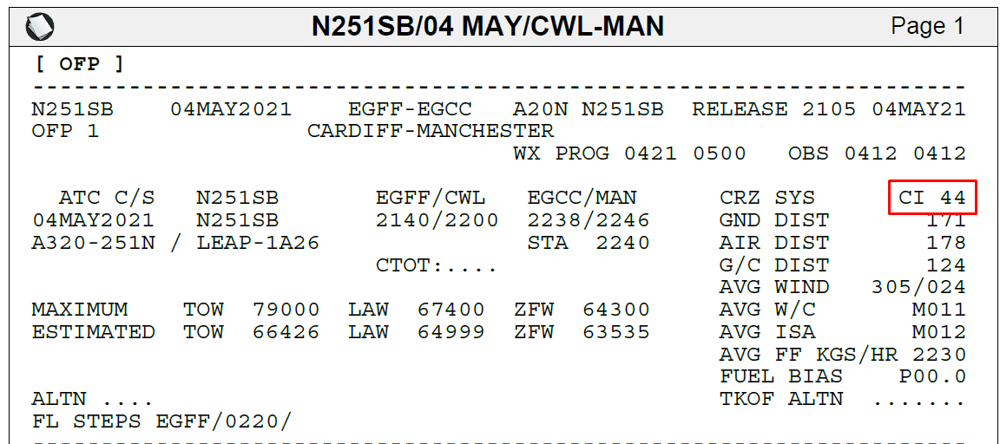

    The cost index can be found in the image above.

    * Using the keypad type in `44`
    * Press LSK5L. 

    ^^CRZ FL/TEMP^^

    

    Input the desired cruise flight level in this field. On our OFP this is listed as `0220` or `FL220`. 

    * Using the keypad type in `220`
    * Press LSK6L

    This will input FL220 and the temperature as well. 

    [Top of Section 1](#section-1)

=== "FLIGHT PLAN"

    Upon loading the flight plan page there will be three entries. Departure airport, `(DECEL)`, and arrival airport. 

    Our route for this flight can be found on the 2nd page of the OFP

    !!! info "Routing Disclaimer"
        Note, that waypoints, STARs, and SIDs may be called differently due to different nav-databases or different AIRAC cycles between simBrief and the simulator.

    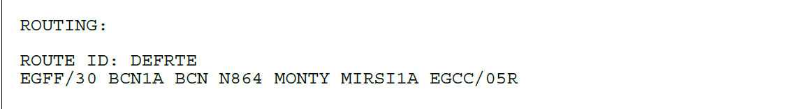

    `EGFF/30 BCN1A BCN N864 MONTY MIRSI1A EGCC/05R`

    ^^Inputting a SID^^

    !!! info "SID"
        Standard Instrument Departure Route

        These are procedures that are defined and published that takes a flight from the take-off phase to the enroute phase. 
    
        Also see: [SIDS and STARS](../airliner-flying-guide\navigation.md#sids-and-stars)   

    To program the Standard Instrument Departure (SID):

    * Press LSK1L or EGFF (the departure airport)
    * Select `DEPARTURE` shown next to LSK1L
    * Select the runway we are departing from. In this case `30` using LSK3L
    * On the list of SIDs select the `BCN1A` departure

    The MCDU should now show at the top of the screen in yellow what is selected for our departure from EGFF. 

    

    * Press `INSERT` using LSK6R to program this into the flight plan. 

    Our flight plan should now have the associated waypoints for the `BCN1A` SID. We can scroll through the flight plan using the vertical slew keys. The SID terminates at `BCN` and this is where we can begin to fill out the rest of the flight plan. 

    !!! info "BCN1A ILS Frequency"
        When selecting a departure SID that pairs with a LOC/ILS frequency, the respective frequency will be auto-populated in RADNAV provided it is available from the navdata. 

    ^^Enroute Flight Plan^^

    * Press the LSK that matches the location of `BCN` on the MCDU screen.
    * Select `AIRWAYS` using LSK5R.
    * Using the keypad type in `N864` *(the airway)* and press LSK1L.
    * Using the keypad type in `MONTY` *(waypoint)* and press LSK1R. 
        * Remember: Airways are on the left and waypoints are on the right.

    

    ^^Planning the Arrival^^

    For the purposes of this guide we will preplan our arrival into EGCC via the `MIRSI1A` STAR into 05R. 

    !!! info "STAR"
        Standard Terminal Arrival Route

        Similar to the SID, these are procedures that are defined and published that takes a flight from the last point in a route *(in our case `MONTY`)* to the first point in the approach or the initial approach fix (IAF). 
    
        Also see: [SIDS and STARS](../airliner-flying-guide\navigation.md#sids-and-stars)       

    Find `EGCC` in green in flight plan OR select `EGCC` in white under `DEST` using the corresponding LSK. 

    * Select `ARRIVAL` using LSK1R
        * We will be shown the approaches available designated by `Type` `Rwy`. 
        * For this guide we will shoot for an ILS to keep it simple. 
    * Use the vertical slew keys to find `ILS05R` and select it using the corresponding LSK.
    * Again use the vertical slew keys to find the STAR for this flight `MIRSI1A` and select it using the corresponding LSK.
    * We won't have any vias for this flight. Select `NO VIAS` using LSK2L. On the following page we can choose transitions if available, but for this flight we don't.
        * *Note:* Due to the default MSFS flight plan manager we maybe directed to proceed via the `MCT` waypoint anyways for the arrival. 
    * Insert this STAR into the flight plan using LSK6R.

    

    Verify the flight plan by using the vertical slew keys to scroll through it. 

    !!! info "Viewing Flight Plan on ND"
        We can also verify the route looks correct by selecting `Plan` on the EFIS control panel and watching the ND as we scroll through.

    !!! warning "USR Waypoints"
        One thing to note are the USR waypoints the sim inputs into the flight plan. These are pseudo waypoints the simulator creates to draw the flight plan. 

        There is a small bug in the simulator where the USR waypoint on arrival may bug out and proceed direct to runway. Please be aware and use selected HDG to mitigate this issue. 

    [Top of Section 1](#section-1)

***

### Section 2

=== "FUEL PRED"

    On this page, we can input our zero fuel weight (ZFW) and zero fuel weight center of gravity (ZFWCG).

    !!! warning "Important Info"
        Fuel and payload have to be set in the simulator before ZFW/CG for the end result to be correct. (Unless you want to use the default fuel and weight).

        To learn how see [Load Fuel and Payload](#load-fuel-and-payload) in the simBrief integration below.

    The A32NX can auto populate this information.

    * Press LSK3R to load in the calculated ZFW/ZFWCG into the scratch pad at the bottom of the MCDU. 
    * Press LSK3R a second time to input the above calculation into the MCDU. (The empty orange boxes should now be filled in by the scratch pad entry). 

    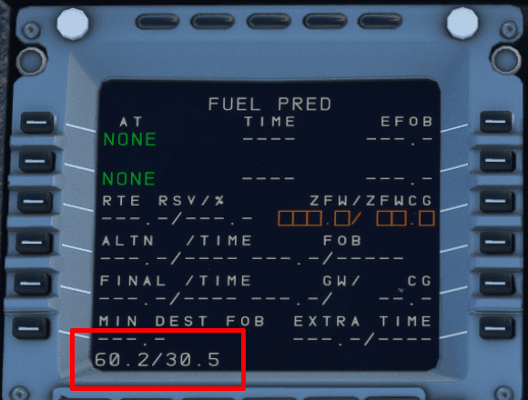

    At this time a few extra fields will appear filled in. Starting from the top:

    * Departure Airport - EGFF
    * Fuel on Board - FOB
    * ZFW + FOB = Gross Weight - GW 
    * Center of Gravity - CG

    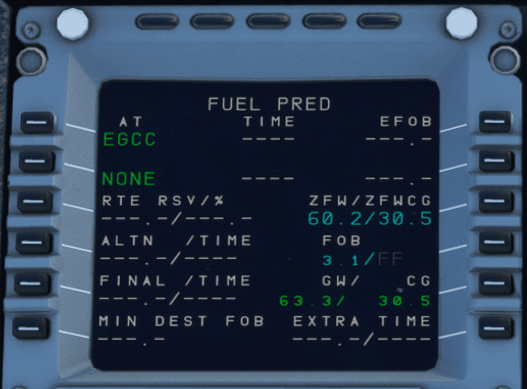

    [Top of Section 2](#section-2)

=== "SECONDARY FLIGHT PLAN"

    This page will allow us to input a secondary flight plan. This page is currently inoperable in the A32NX. We will update this portion of the guide when it is usable. 

=== "RADNAV"

    On this page, we would set any frequencies or identifiers needed for the departure and subsequently later enroute those required for the arrival. 

    For the purposes of this guide we will be using frequencies in the RADNAV page. 

    If we would like to have additional navaids for the departure, we can input the runway localizer for runway centerline guidance on the PFD and the initial procedure turn, including the BRECON VOR (BCN) to verify the track enroute to BCN. This is a little bit more advanced than this guide allows for but we will cover how to input frequencies. 

    ^^VOR^^

    On this departure we have the BCN VOR with a frequency of `117.45`

    * Using the keypad type in `117.45` and press LSK1L. This will auto populate the identifier of the VOR when within range. 
    * We can also set the desired course to track `031` and press LSK2L to input it. 

    ^^Departure ILS^^

    When selecting the SID earlier in the flight plan section, the A32NX should have auto-populated the ILS/LOC frequency. If it hasn't we can manually insert it for centerline guidance on take off. 

    Our departure runway is EGFF/30 (runway 30) which has a frequency of `110.7`. When inputting a frequency and we are in range of the ILS it will auto populate the indentifier and course. There is no need to fill these fields.

    * Using the keypad type in `110.7` and press LSK3 to input it.

    ^^Arrival ILS^^

    With an ILS or LOC approach selected, the arrival ILS frequency should be automatically tuned correctly whenever the aircraft is at climb phase or greater and within 250 NM of destination. **Ensure** that we verify the ILS frequency when we reach the arrival phase of the flight - see [Approach and Landing (ILS)](landing.md). 

    Remember our arrival airport/rwy is `EGCC/05R` with ILS05R having a frequency of `111.55`. When inputting a frequency and we are in range of the ILS it will auto populate the indentifier and course. There is no need to fill these fields. 

    * Using the keypad type in `111.55` and press LSK3 to input it. 

    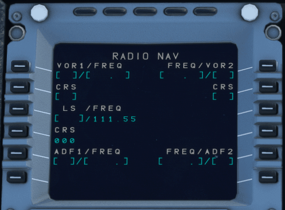

    ^^ADF^^

    This works much in the same way as the examples above. 

    [Top of Section 2](#section-2)

***

### Section 3

=== "INIT B"

    To navigate to the `INIT B` page we first have to select the `INIT` button. Once on `INIT A` use the horizontal slew keys to switch the page to `INIT B`. 

    Once here, we'll notice that the ZFW/ZFWCG has been copied over from the `FUEL PRED` page. Now we can add our fuel on board (FOB). The amount we input in this field can be done in one of three ways:

    * Indicated FOB on the upper ECAM.
    * we can have the MCDU plan the amount of fuel required.
    * The amount indicated in the OFP.

    !!! info "Loading Fuel"

        We can load fuel two ways:

        * Via the AOC - [Learn How](#load-fuel-and-payload)
        * Via the EFB (not covered in this guide)

    ^^ECAM FOB^^

    Look at the upper ECAM and note the FOB indicated. Let's say that amount is `3091 KG`. When inputting the block fuel into the MCDU it is referenced in "Tons" and we should round to the closest decimal point. 

    * Using the keypad type in `3.1` and press LSK2R.

    ^^MCDU Planning^^

    We can choose to have the MCDU provide a recommended amount of fuel for the planned flight. 

    * Press LSK3R to compute an amount of fuel. 
    
    The `Block` field will be populated with a calculated fuel amount. 

    * Press LSK3R again to confirm the fuel. 
    * We should load this amount of fuel via the EFB or AOC option.

    ^^SimBrief OFP^^

    We can use the planned block fuel stated on the OFP which in this case is `3091 KG`. 

    * Using the keypad type in `3.1` and press LSK2R
    * We should load this amount of fuel via the EFB or AOC option.

    

    [Top of Section 3](#section-3)

=== "PROG"

    On this page we can see details about the flight data pertaining to the current phase of flight. 

    The CRZ level that was inputted on `INIT A` will appear here, alongside optimal CRZ level and the REC MAX. We can also change the CRZ level on this page as well. 

=== "PERF"

    The performance page changes based on the relative stages of flight until we land the aircraft. When programming the MCDU on the ground we start on the take-off performance page. 

    For this flight we will be taking off with a `1+F` flaps configuration. 

    * Using the keypad type in `1` and press LSK3R

    !!! info ""
        **Entry of the THS field is subject to airline SOP and may not be required.**

    The THS field is where we enter the stabilizer trim for takeoff based on the aircraft's CG. As shown in [Section 2](#section-2) the FUEL PRED page provides an autocalculated CG of 30.5. 

    Take a look at your throttle quadrant and look for the CG markings on next to the trim wheel. We need to set a nose down trim of about 0.8.

    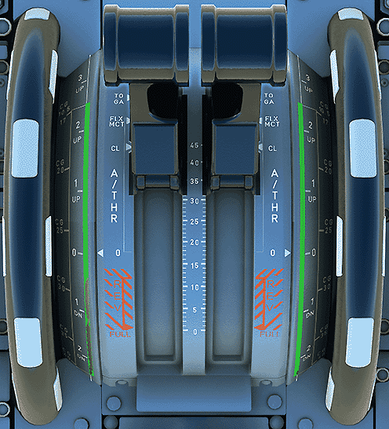{: style="width:424.4px;height:467.6px;" }

    * Using the keypad type in `/DN0.8` and press LSK3R

    !!! info ""
        Other valid entires for THS include:

        - With flaps setting example: `1/DN0.8`
        - Nose up example: `/UP0.5`
        
    
    We can also choose to set a `FLEX TO TEMP` for the flight. The example we are using today is 60 degrees. (This will normally be calculated via a pilot's company EFB or other tools). 

    * Using the keypad type in `60` and press LSK4R

    Our SID chart mentions that the TRANS ALT for this departure is 6000ft. 

    * Using the keypad type in `6000` and press LSK4L

    The A32NX can calculate the Vspeeds automatically. To do this simply:

    * Press LSK1L to have the calculated V1 speed appear in the scratchpad.  

    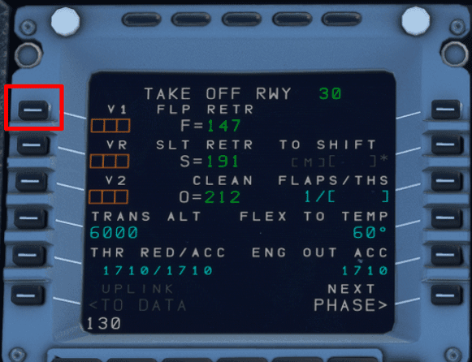

    * Press LSK1L again to have 130 inputted into the V1 speed. 
    * Repeat this procedure for VR and V2. 

    The performance page should now look like this:

    

    [Top of Section 3](#section-3)

***

## A32NX simBrief integration

We've included a quick method to have your simBrief OFP automatically loaded into the MCDU. Please do not select an arrival airport on the MSFS world menu otherwise the integration will not work.

This portion of the guide assumes that you understand how to generate a simBrief OFP.

### ^^SimBrief MCDU Setup^^

Enter your simBrief username. Upon entering your username the MCDU will convert it into an ID number. Please ensure you have no special characters in your username OR use the ID number found before generating your OFP.

* Click on `MCDU MENU`
* Click on `OPTIONS`
* Click on `AOC`
* Click on `SIMBRIEF`

### ^^Request data from simBrief^^

* Return to `MCDU MENU`
* Click on `ATSU`
* Click on `AOC MENU`
* Click on `INIT/PRESS`
* Click on `INIT DATA REQ`

This will prepare the MCDU to input the flight plan.

### ^^Load Fuel and Payload^^

Go back to the AOC menu.

* Click on `PERF/W&B`

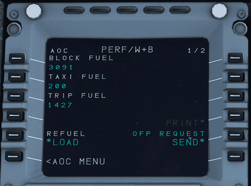

Here you can automatically load your fuel + passenger / cargo weights. You are presented with the `Fuel Page` first then the `Weights and Balance` page.

* Press LSK5L to instantly load your planned simBrief fuel. (The load button will flash momentarily).
* You can verify fuel has loaded by looking at your upper ECAM FOB.

Using the horizontal slew keys you can switch to the weights and balance page.

* Again press LSK5L to instantly load your planned payload and pax.
* You can verify the weight has changed by looking at the lower ECAM towards the lower right hand side.

!!! info "Customizing Fuel and Weights"

    You can adjust the amount of fuel or payload weight manually on these pages. Type in your desired amounts and press the relevant LSK to input it into that field. 

    When you are happy with your changes press `LOAD` using LSK5L to load your custom fuel and weight.

### ^^Initialize Flight Plan^^

Head over to the `INIT A` page.

* Select `INIT REQUEST` by pressing LSK2R

This will load your flight plan from simBrief directly into the MCDU

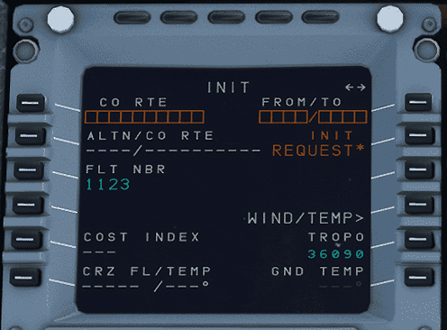

Continue with [Engine Start and Taxi](engine-start-taxi.md)
