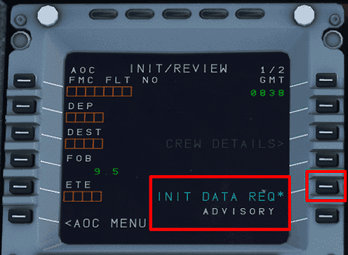

# Preparing the MCDU

This guide will help you prepare the MCDU in the A32NX for your departure. It includes a simple route that you can use to follow along easily and replicate in the simulator.

The simBrief route used in this guide - [Available Here](../assets/beginner-guide/mcdu/sample-ofp.pdf)

***

## Pre-requisites 

Below are a few pre-requisites before programming the MCDU. 

Visit [Starting the Aircraft](#) to learn more. 

* Make sure the aircraft is powered up.
    * External Power OR APU
* Make sure the ADIRS are set to NAV. 
* Have a valid flight plan. 

***
  
## Understanding the MCDU

During the course of this guide we will be referring to a few key terms which are defined below. 

=== "Line Select Key (LSK)"

    `LSK` for short. These keys are on the left and right hand side of the MCDU screen. They are highlighted in the image below. 

    * Left hand keys are referenced (in descending order) as `LSK1L - LSK6L`. 
    * Right hand keys are referenced (in descending order) as `LSK1R - LSK6R`.

    

=== "Slew Keys"

    These keys are referenced below. 

    { align = right }

    !!! info

        === "Horizontal Slew Keys"

            These keys allow you to scroll between certain page i.e. `INIT A` and `INIT B` when the INIT page is selected. 

        === "Vertical Slew Keys"

            These keys allow to scroll vertically on certain pages i.e. `F-PLN` page. 

***

## MCDU Programming 

**D.I.F.F.S.R.I.P.P.**

Pilots commonly use the acronym above when programming the MCDU. It represents the following:

`DATA - INIT A - FLIGHT PLAN - FUEL PRED - SECONDARY FLIGHT PLAN - RADNAV - INIT B - PROG - PERF`

For simplicity's sake this portion of the guide will be split into three sections.

* Section 1 - [DATA - INIT A - FLIGHT PLAN](#section-1)

* Section 2 - [FUEL PRED - SECONDARY FLIGHT PLAN - RADNAV](#section-2)

* Section 3 - [INIT B - PROG - PERF](#section-3)

The simBrief route used in this guide - [Available Here](../assets/beginner-guide/mcdu/sample-ofp.pdf)

***

### Section 1

=== "DATA"

    This MCDU page provides various data for the pilots. It has two pages (accessed by using the horizontal slew keys). It will not be used for this tutorial. 

    DATA includes the pages below:

    * Position Monitor
    * IRS Monitor
    * GPS Monitor
    * A/C Status
    * Closest Airports
    * Equitime Point
    * Waypoints
    * NavAids
    * Runway
    * Route

=== "INIT A"

    ^^FROM/TO Field^^ 

      * Using the keypad type in `EGFF/EGCC`
      * Once this is in the scratch pad you can press LSK1R.
      * This following screen would should you "company routes". Since there are none stored select `Return` using LSK6L.

    

    ^^FLT NBR^^

    * Using the keypad type in `EZY123` and press LSK3L. Feel free to use your own flight number here!
    * If you have the Free Text module enabled for your flight, this will enable other users flying the A32NX to send you messages. This will not be covered in this guide. 

    ^^COST INDEX^^

    

    Your cost index can be found in the image above.

    * Using the keypad type in `44`
    * Press LSK5L. 

    ^^CRZ FL/TEMP^^

    

    Input your desired cruise flight level in this field. On our OFP this is listed as `0220` or `FL220`. 

    * Using the keypad type in `220`
    * Press LSK6L

    This will input FL220 and the temperature for you as well. 

    [Top of Section 1](#section-1)

=== "FLIGHT PLAN"

    Upon loading the flight plan page you should see three entries. Departure airport, `(DECEL)`, and arrival airport. 

    Our route for this flight can be found on the 2nd page of the OFP

    

    `EGFF/30 BCN1A BCN N864 MONTY MIRSI1A EGCC/05R`

    ^^Inputting a SID^^

    !!! info "SID"
        Standard Instrument Departure Route

        These are procedures that are defined and published that takes a flight from the take-off phase to the enroute phase. 

    To program the Standard Instrument Departure (SID):

    * Press LSK1L or EGFF (your departure airport)
    * Select `DEPARTURE` shown next to LSK1L
    * Select the runway you are departing from. In this case `30` using LSK3L
    * On the list of SIDs select the `BCN1A` departure

    The MCDU should now show you at the top of the screen in yellow what you have selected for your departure from EGFF. 

    

    * Press `INSERT` using LSK6R to program this into your flight plan. 

    Your flight plan should now have the associated waypoints for the `BCN1A` SID. You can scroll through your flight plan using the vertical slew keys. The SID terminates at `BCN` and this is where we can begin to fill out the rest of the flight plan. 

    ^^Enroute Flight Plan^^

    * Press the LSK that matches the location of `BCN` on the MCDU screen.
    * Select `AIRWAYS` using LSK5R.
    * Using the keypad type in `N864` *(the airway)* and press LSK1L.
    * Using the keypad type in `MONTY` *(waypoint)* and press LSK1R. 
        * Remember: Airways are on the left and waypoints are on the right.

    

    ^^Planning Your Arrival^^

    For the purposes of this guide we will preplan our arrival into EGCC via the `MIRSI1A` STAR into 05R. 

    !!! info "STAR"
        Standard Terminal Arrival Route

        Similar to the SID, these are procedures that are defined and published that takes a flight from the last point in a route *(in our case `MONTY`)* to the first point in the approach or the initial approach fix (IAF). 

    Find `EGCC` in green on your flight plan OR select `EGCC` in white under `DEST` using the corresponding LSK. 

    * Select `ARRIVAL` using LSK1R
        * You will be shown the approaches available designated by `Type` `Rwy`. 
        * For this guide we will shoot for an ILS to keep it simple. 
    * Use the vertical slew keys to find `ILS05R` and select it using the corresponding LSK.
    * Again use the vertical slew keys to find the STAR for this flight `MIRSI1A` and select it using the corresponding LSK.
    * We won't have any vias for this flight. Select `NO VIAS` using LSK2L. On the following page you can choose transitions if you have them, but for this flight we don't.
        * *Note:* Due to the default MSFS flight plan manager you maybe directed to proceed via the `MCT` waypoint anyways for your arrival. 
    * Insert this STAR into your flight plan using LSK6R.

    

    Verify your flight plan by using the vertical slew keys to scroll through it. 

    !!! info "Viewing Flight Plan on ND"
        You can also verify the route looks correct by selecting `Plan` on the EFIS control panel and watching the ND as you scroll through.

    !!! warning "USR Waypoints"
        One thing to note are the USR waypoints the sim inputs into your flight plan. These are pseudo waypoints the simulator creates to draw the flight plan. 

        There is a small bug in the simulator where the USR waypoint on arrival may bug out and take you direct to runway. Please be aware and use selected HDG to mitigate this issue. 

    [Top of Section 1](#section-1)

***

### Section 2

=== "FUEL PRED"

    On this page, we can input our zero fuel weight (ZFW) and zero fuel weight center of gravity (ZFWCG). 

    The A32NX can auto populate this for you. 

    * Press LSK3R to load in the calculated ZFW/ZFWCG into the scratch pad at the bottom of the MCDU. 
    * Press LSK3R a second time to input the above calculation into the MCDU. (The empty orange boxes should now be filled in by the scratch pad entry). 

    

    At this time a few extra fields will appear filled in. Starting from the top:

    * Departure Airport - EGCC
    * Fuel on Board - FOB
    * ZFW + FOB = Gross Weight - GW 
    * Center of Gravity - CG

    

    [Top of Section 2](#section-2)

=== "SECONDARY FLIGHT PLAN"

    This page will allow you to input a secondary flight plan. This page is currently inoperable in the A32NX. We will update this portion of the guide when it is usable. 

=== "RADNAV"

    On this page, you would set any frequencies you would need for the departure and subsequently later enroute the frequencies required for your arrival. 

    If you'd like to have additional navaids for your departure you can input the runway localizer for the initial procedure turn and the BRECON VOR (BCN) to verify your track enroute to BCN. This is a little bit more advance than this guide allows for but we will cover how to input frequencies. 

    ^^VOR^^

    On this departure we have the BCN VOR with a frequency of `117.45`

    * Using the keypad type in `117.45` and press LSK1L. This will auto populate the identifier of the VOR when within range. 
    * You can also set the desired course to track `031` and press LSK2L to input it. 

    ^^ILS^^

    In a similar fashion you can also input the ILS/LOC frequency on this page if it hasn't been inputted already. Remember our arrival airport/rwy is `EGCC/05R` with ILS05R having a frequency of `111.55`

    When inputting a frequency and you are in range of the ILS it will auto populate the indentifier and course for you there is no need to fill these fields. 

    * Using the keypad type in `111.55` and press LSK3 to input it. 

    

    ^^ADF^^

    This works much in the same way as the two above. 

    [Top of Section 2](#section-2)

***

### Section 3

=== "INIT B"

    To navigate to the `INIT B` page you first have to select the `INIT` button. Once on `INIT A` use the horizontal slew keys to switch the page to `INIT B`. 

    Once here, you'll notice that your ZFW/ZFWCG has been copied over from the `FUEL PRED` page. Now we can add our fuel on board (FOB). The amount you input in this field can be done in one of three ways:

    * Indicated FOB on the upper ECAM.
    * You can have the MCDU plan the amount of fuel required for you.
    * The amount indicated in your OFP.

    !!! info "Loading Fuel"

        You can load fuel two ways:

        * Via the AOC - [Learn How](#A32NX-simBrief-integration)
        * Via the EFB (not covered in this guide)

    ^^ECAM FOB^^

    Look at your upper ECAM and note the FOB indicated. Let's say that amount is `3091 KG`. When inputting the block fuel into the MCDU it is referenced in "Tons" and you should round to the closest decimal point. 

    * Using the keypad type in `3.1` and press LSK2R.

    ^^MCDU Planning^^

    You can choose to have the MCDU provide a recommended amount of fuel for your planned flight. 

    * Press LSK3R to compute an amount of fuel. 
    
    The `Block` field will be populated with a calculated fuel amount. 

    * Press LSK3R again to confirm the fuel. 
    * You should load this amount of fuel via the EFB or AOC option.

    ^^simBrief OFP^^

    You can use the planned block fuel stated on your OFP which in this case is `3091 KG`. 

    * Using the keypad type in `3.1 and press LSK2R
    * You should load this amount of fuel via the EFB or AOC option.

    

    [Top of Section 3](#section-3)

=== "PROG"

    On this page you can see details about the flight data pertaining to the current phase of flight. 

    Your CRZ level that was inputted on `INIT A` will appear here, alongside optimal CRZ level and the REC MAX. You can also change your CRZ level on this page as well. 

=== "PERF"

    The performance page changes based on the relative stages of flight until you land the aircraft. When programming the MCDU on the ground you start on the take-off performance page. 

    For this flight we will be taking off with a `1+F` flaps configuration. 

    * Using the keypad type in `1` and press LSK3R
    
    You can also choose to set a `FLEX TO TEMP` for the flight. The example we are using today is 60 degrees. (This will normally be calculated via a pilot's company EFB or other tools). 

    * Using the keypad type in `60` and press LSK4R

    Our SID chart mentions that the TRANS ALT for this departure is 6000ft. 

    * Using the keypad type in `6000` and press LSK4L

    The A32NX can calculate your Vspeeds for you automatically. To do this simply:

    * Press LSK1L to have the calculated V1 speed appear in the scratchpad.  

    

    * Press LSK1L again to have 130 inputted into the V1 speed. 
    * Repeat this procedure for VR and V2. 

    Your performance page should now look like this:

    

    [Top of Section 3](#section-3)

***

## A32NX simBrief integration

We've included a quick method to have your simBrief OFP automatically loaded into the MCDU. Please do not select an arrival airport on the MSFS world menu otherwise the integration will not work. 

This portion of the guide assumes that you understand how to generate a simBrief OFP. 

### ^^Step One^^

Enter your simBrief username. Upon entering your username the MCDU will convert it into an ID number. Please ensure you have no special characters in your username OR use the ID number found before generating your OFP. 

* Click on `MCDU MENU`
* Click on `OPTIONS`
* Click on `AOC`
* Click on `SIMBRIEF`

### ^^Step Two^^

* Return to `MCDU MENU`
* Click on `ATSU`
* Click on `AOC MENU`
* Click on `INIT/PRESS`
* Click on `INIT DATA REQ`

This will prepare the MCDU to input the flight plan. 

### ^^Step Three^^

Go back to the AOC menu. 

* Click on `PERF/W&B`

Here you can automatically load your fuel + passenger / cargo weights. You are presented with the `Fuel Page` first then the `Weights and Balance` page. 

* Press LSK5L to instantly load your planned simBrief fuel. (The load button will flash momentarily).
* You can verify fuel has loaded by looking at your upper ECAM FOB. 

Using the horizontal slew keys you can switch to the weights and balance page.

* Again press LSK5L to instantly load your planned payload and pax. 
* You can verify the weight has changed by looking at the lower ECAM towards the lower right hand side. 

!!! info "Customizing Fuel and Weights"

    You can adjust the amount of fuel or payload weight manually on these pages. Type in your desired amounts and press the relevant LSK to input it into that field. 

    When you are happy with your changes press `LOAD` using LSK5L to load your custom fuel and weight.

### ^^Step Four^^

Head over to the `INIT A` page. 

* Select `INIT REQUEST` by pressing LSK2R

