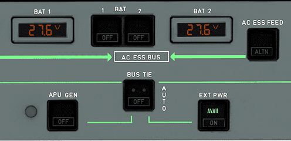
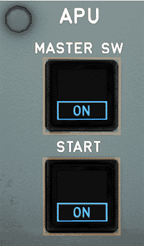
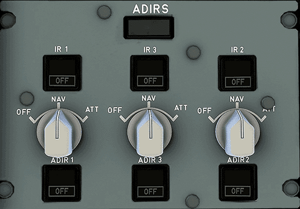
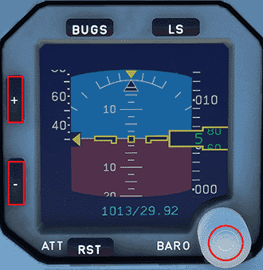
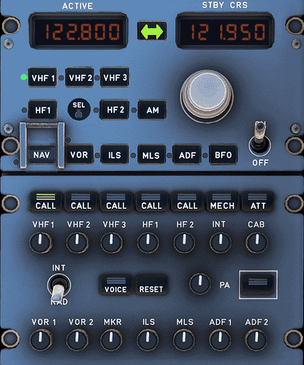

# Starting the Aircraft

This guide will assist you with starting your aircraft. It includes images to assist you with understanding the locations of all buttons and switches.

!!! warning "Disclaimer"
    The level of detail in this guide is meant to teach a FlyByWire A320neo beginner to start the aircraft correctly.

    A *beginner* is defined as someone familiar with flying a GA aircraft
    or different types of airliners. Aviation terminology and know-how is
    a requirement to fly any airliner even in Microsoft Flight Simulator.

    You will find many great videos on YouTube on how to fly the FlyByWire A32NX. 
    Check out the FlyByWire YouTube Channel as well: [FlyByWire on YouTube](https://www.youtube.com/c/FlyByWireSimulations/playlists)

---

## Chapters / Phases

This guide will cover these chapters in order:

1. [Overhead Panel](#overhead-panel)
2. [Main Panel](#main-panel)

## Pre-Requisites
To start off, we will begin by doing a few pre-checks in all areas of the cockpit to ensure the aircraft is in an normal position before turning on the batteries.

Begin by looking down at the **bottom pedestal**.

- Place the parking brake handle in the `OFF` position
- Ensure the speed brakes have been disarmed/retracted
- Flaps are retracted
- Weather radar is switched off
- Engine masters 1 and 2 are in the `OFF` position
- Engine mode selector is set to `NORM`
- Thrust levers are idle

After ensuring everything is set on the bottom pedestal, direct your attention to the **main panel** and make sure the following are set:

- Gear lever is down

Then look up to and view the **overhead panel**. Make sure the following are in the set position before moving on to starting the aircraft:

- Wiper selectors are in the `OFF` position

[Download FlyByWire Checklist](../assets/FBW_A32NX_CHECKLIST.pdf){ .md-button }

---

## Overhead Panel

### Electrical section

Begin by, turning on batteries `1 AND 2`. After pushing these buttons, check to see on both sides that there is voltage. You will also hear chimes indicating the batteries are on.

To give power to the aircraft we will use the "Ground Power Unit". If ground power isn't available we can also use the APU.

=== "Ground Power"
    If ground power is available, you should see a green `AVAIL` light on the `EXT PWR` button. Push on this button to give power to the aircraft.

    

=== "APU"
    If ground power isn't available, turn on the APU. To do this, simply push on the APU `MASTER SW` and `START`. The APU should be on within one minute.

    

After powering the aircraft, turn on the crew oxygen supply by pushing on the button, diminishing the white `OFF` light.

### ADIRS alignment

To align the Inertial Reference System (or IRS), turn the 3 knobs to the `NAV` position. This will then start the IRS alignment which you can view the progress on the ECAM display.

### Lighting

#### Exterior

To indicate that the aircraft is powered from the exterior, turn on the `NAV & LOGO` light. 

Following, set the `STROBE` light to the `AUTO` position. 

#### Cockpit

If your having trouble looking around the cockpit you can turn on a few lights to help with visibility inside.

- The `DOME` light has 3 settings to choose from. You can set it into the `OFF` position, the `DIM` position, or even the `BRT` position.
- The `OVHD INTEG LT` will allow you to see the outlines of the overhead panel. Turning the knob will allow you to adjust its brightness.

Once our lighting is in the correct state, we can then turn on the **seat belts sign and no smoking sign**.

To arm the emergency exit lights, simply put the switch in the `ARM` position. You will also see that the white `OFF` light to the left of the switch will disappear.

Looking up just a bit you will find the `LDG ELEV` knob. This simply means the landing elevation which you should set in the `AUTO` position.

Managing the temperatures of the cabin is necessary as well. To do this, simply rotate the 3 knobs as needed. 

### Hydraulic and Fuel section

Looking up to the **hydraulic panel**, ensure that there are no white lights visible.

!!! warning "Fire Tests"
    To perform a APU and Engine fire test, hold down on the `TEST` button for each of them for 5 seconds minimum to ensure the lights and aural warnings are working as expected. Checking the ECAM during the test will also show if the ECAM is performing as expected during a fire.

Just below the hydraulic panel, you will find the **fuel panel**. Turn on all 6 fuel pumps until the white `OFF` light is no longer visible.

---

## Main Panel

### Displays

If your having a hard time viewing any of the displays, lets show you how to raise the brightness for each display.

For the PFD and ND, the knobs are in the same location. Look left (or right if you are positioned in the first officer seat) of the PFD and you will find the brightness knobs for them. Simply turn both knobs until you are satisified with the brightness on both screens.

For the ECAM upper and lower display, look just in front of the throttles and you will find the brightness knobs. Just like the PFD and ND knobs, rotate them to your liking.

For the ISIS display brightness (just left of the upper ECAM), use the `+` and `-` buttons until the brightness is suitable. While you are at the ISIS display, set the current QNH.

---

### Radio Panel
Look down the the **radio panel.**

Set the `RMP 1` to the active **ATIS** frequency and set the standby frequency to the **ground** frequency. 

After setting correct frequencies, look at the **glareshield** and locate the `BARO` reference. You can set the barometer in either `IN HG` or `HPA`. Just below the barometer reference, turn on the `FD`. You should see a green light indicate it has been turned on.

### ECAM Fuel Page

Verify that on the ECAM fuel page that your aircraft has enough fuel for the flight.

If you do not have enough fuel for the flight you can refuel via Microsoft Flight Simulator's hovering menu bar or through the flyPad.

---

At this point you would have completed 5/7 task on the `Before Start` section on the FlyByWire A32NX checklist.

This concludes the *Starting the Aircraft* guide.

