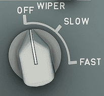
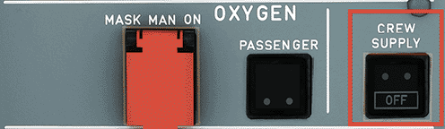
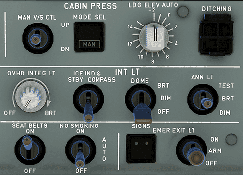
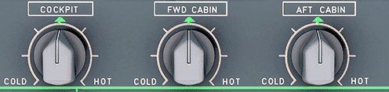
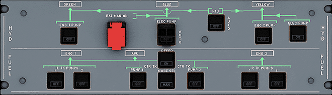
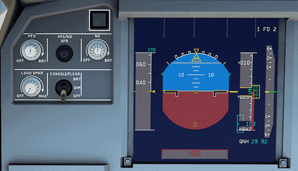
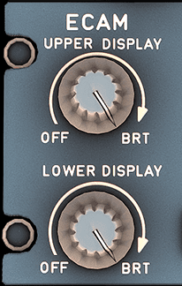
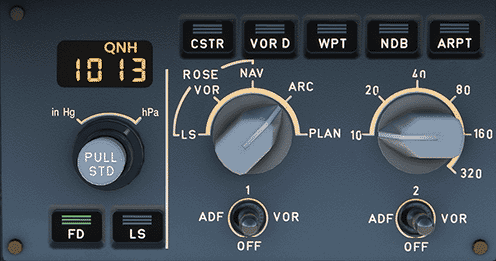
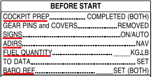

# Starting the Aircraft

This guide will assist you with starting your aircraft. It includes images to assist you with understanding the locations of all buttons and switches.

!!! warning "Disclaimer"
    The level of detail in this guide is meant to teach a FlyByWire A320neo beginner to start the aircraft correctly.

    A *beginner* is defined as someone familiar with flying a GA aircraft
    or different types of airliners. Aviation terminology and know-how is
    a requirement to fly any airliner even in Microsoft Flight Simulator.

    You will find many great videos on YouTube on how to fly the FlyByWire A32NX. 
    Check out the FlyByWire YouTube Channel as well: [FlyByWire on YouTube](https://www.youtube.com/c/FlyByWireSimulations/playlists)

---

## Chapters / Phases

This guide will cover these chapters in order:

1. [Overhead Panel](#overhead-panel)
2. [Main Panel](#main-panel)

## Pre-Requisites

Aircraft is in a cold and dark state at a gate.

[Download FlyByWire Checklist](../assets/FBW_A32NX_CHECKLIST.pdf){ .md-button }

## Cockpit Preparation

To start off, we will begin by doing a few pre-checks in all areas of the cockpit to ensure the aircraft is in an normal position before turning on the batteries.

We begin by looking down at the **bottom pedestal**.

- Place the parking brake handle in the `ON` position
- Ensure the speed brakes have been disarmed/retracted
- Flaps are retracted
- Weather radar is switched off
- Engine masters 1 and 2 are in the `OFF` position
- Engine mode selector is set to `NORM`
- Thrust levers are idle

This is how the pedestal should look like:

After ensuring everything is set on the bottom pedestal, we direct our attention to the **main panel** and make sure the following are set:

- Gear lever is down

Then we look up to and view the **overhead panel**. Make sure the following are in the set position before moving on to starting the aircraft:

- Wiper selectors are in the `OFF` position

---

## Overhead Panel

### Electrical section

We begin with turning on batteries `BAT 1 AND 2`. After pushing these buttons, we check to see on both sides that there is voltage. We will also hear chimes indicating the batteries are on.

To give power to the aircraft we will use the "Ground Power Unit". If ground power isn't available we can also use the APU.

=== "Ground Power"
    If ground power is available, we should see a green `AVAIL` light on the `EXT PWR` button. Push on this button to give power to the aircraft.

    

=== "APU"
    If ground power isn't available, we turn on the APU. To do this, we simply push on the APU `MASTER SW` and `START`. The APU should be on within one minute.

    {width=25%}

After powering the aircraft, we turn on the crew oxygen supply by pushing on the button, diminishing the white `OFF` light.

### ADIRS alignment

To align the Inertial Reference System (or IRS), we turn the 3 knobs to the `NAV` position. This will then start the IRS alignment for which we can view the progress on the ECAM display.

 

### Lighting

#### Exterior

To indicate that the aircraft is powered from the exterior, we turn on the `NAV & LOGO` light.

Following this, we set the `STROBE` light to the `AUTO` position.

#### Cockpit

We can turn on a few lights to help with visibility inside if it is too dark inside the cockpit.

- The `DOME` light has 3 settings to choose from. We can set it into the `OFF` position, the `DIM` position, or even the `BRT` position.
- The `OVHD INTEG LT` will allow us to see the outlines of the overhead panel. Turning the knob will adjust its brightness.

Once our lighting is in the correct state:

- Seat belts sign - `Set to ON`
- No smoking sign - `Set to AUTO`

To arm the emergency exit lights, simply put the switch in the `ARM` position.The white `OFF` light to the left of the switch will disappear.

Looking up just a bit we find the `LDG ELEV` knob. This simply means the landing elevation which should be in the `AUTO` position.

Managing the temperatures of the cabin is necessary as well. Simply rotate the 3 knobs as needed.

### Hydraulic and Fuel section

Looking up to the **hydraulic panel**, we ensure that there are no white lights visible.

!!! warning "Fire Tests"
    To perform a APU and Engine fire test, hold down on the `TEST` button for each of them for 5 seconds minimum to ensure the lights and aural warnings are working as expected. Checking the ECAM during the test will also show if the ECAM is performing as expected during a fire.

Just below the hydraulic panel, we find the **fuel panel**. Turn on all 6 fuel pumps until the white `OFF` light is no longer visible.

---

## Main Panel

### Displays

The brightness for each display can be adjusted to make them better readable.

For the PFD and ND, the knobs are in the same location. Look left (or right when in  first officer seat) of the PFD and find the brightness knobs for them. Simply turn both knobs as required.

For the ECAM upper and lower display, look just in front of the throttles and find the brightness knobs. Just like the PFD and ND knobs, rotate them as required.

{ width:30% }

For the ISIS display brightness (just left of the upper ECAM), use the `+` and `-` buttons until the brightness is suitable. While we are at the ISIS display, set the current QNH.

---

### Radio Panel

Looking down to the **radio panel.**, set the `RMP 1` to the active **ATIS** frequency and set the standby frequency to the **ground** frequency.

{ width:70% }

After setting correct frequencies, locate the `BARO` reference on the **glareshield** . We can set the barometer in either `IN HG` or `HPA`. Just below the barometer reference, turn on the `FD`. A green light indicates it has been turned on.

{ width:90% }

### ECAM Fuel Page

Verify that on the ECAM fuel page that your aircraft has enough fuel for the flight.

If we do not have enough fuel for the flight we can refuel via Microsoft Flight Simulator's hovering menu bar or through the flyPad.

---

At this point we would have completed 5/7 task on the `Before Start` section on the FlyByWire A32NX checklist.

This concludes the *Starting the Aircraft* guide.

Continue with [Preparing the MCDU](preparing-mcdu.md).

