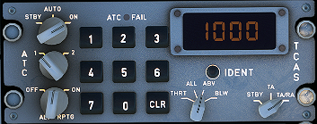
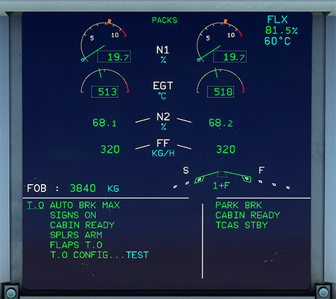
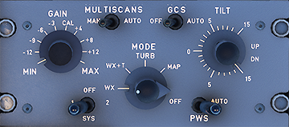
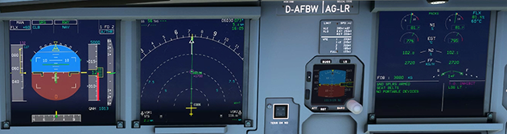
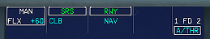
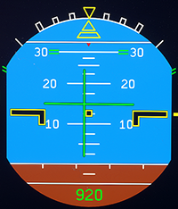
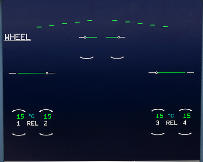
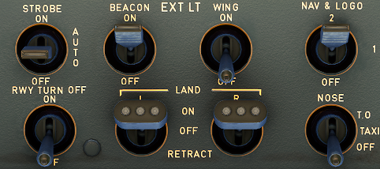
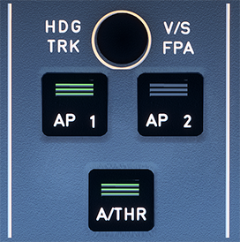

# Take off, climb and cruise

This guide will explain the correct procedures to accomplish take off, climb and establish cruise altitude.

!!!note
    The level of detail in this guide is meant to get a beginner safely up
    in the air and to cruise level under normal conditions while simplifying
    details which are not (yet) important for a beginner. 
    A *beginner* is defined as someone familiar with flying a GA aircraft
    or different types of airliners. Aviation terminology and knowhow is a
    requirement to fly any airliner even in Microsoft Flight Simulator. 
    Further reading:
    [A320 Autoflight](https://www.smartcockpit.com/aircraft-ressources/A319-320-321-Autoflight.html) 
    Also you will find many great videos on YouTube on how to fly the FlyByWire A32NX. 
    Check out the FlyByWire YouTube Channel as well: [FlyByWire on YouTube](https://www.youtube.com/c/FlyByWireSimulations/playlists)

---

## MSFS start from gate or runways

Microsoft Flight Simulator allows you to start your flight from cold & dark
at a gate or directly from the runway with the aircraft ready for takeoff.

For this guide we assume you started cold & dark at the gate and taxied to
the runway holding point as per the previous chapters of this beginner guide.

If you did start on the runway you can skip the first part (Line-up) and
directly continue reading Takeoff.

## Pre-requisites

- Aircraft is in taxi state (checklist TAXI completed)
- Aircraft is at runway holding point, parking breaks are set

Download the [FlyByWire Checklist](../assets/FBW_A32NX_CHECKLIST.pdf) here.

## Chapters / Phases

This guide will cover these phases:

1. [Lineup](#1-lineup)
2. [Takeoff](#2-take-off)
3. [Initial climb](#3-initial-climb)
4. [Climb](#4-climb)
5. [Cruise](#5-cruise)

---

## Base knowledge about the Airbus A320 for flight
This list is focussed on differences to other non-Airbus airliners a user
might be used to.

- __Fly-by-wire system__ 
Traditional mechanical and hydro-mechanical flight control systems use a
series of levers, rods, cables, pulleys and more, which pilots move to
adjust control surfaces to aerodynamic conditions. Their "hands on" design
gives pilots a direct, tactile feel for how the aircraft is handling
aerodynamic forces as they fly. On the other hand, mechanical systems
are also complicated to operate, need constant monitoring, are heavy and
bulky, and require frequent maintenance.

In fly-by-wire systems when the pilot moves flight controls, those movements
are converted into electronic signals, which are then interpreted by the
aircraft's  Electrical Flight Control System (EFCS) to adjust actuators that move
flight control surfaces. Computers also monitor sensors throughout the
aircraft to make automatic adjustments that enhance the flight. 

Because fly-by-wire is electronic, it is much lighter and less bulky than
mechanical controls, allowing increases in fuel efficiency and aircraft
design flexibility, even in legacy aircraft. And to prevent flight critical
failure, most fly-by-wire systems also have triple or quadruple redundancy
back-ups built into them. [source: BAE Systems](https://www.baesystems.com/en-us/definition/what-are-fly-by-wire-systems)

See also: [Fly-by-wire Wikipedia](https://en.wikipedia.org/wiki/Fly-by-wire)

- __Autotrim__ 
The A320 has a feature called "Autotrim", which makes it unnecessary to
hold the sidestick or use the trim wheel for holding the current pitch. This
system is always active, even when the __Autopilot__ is off (in Normal Law which
means under normal circumstances with a fully functional aircraft).

- __Autothrust__ 
The A320 has __Autothrust__ which is similar to Autothrottle (e.g., in a Boeing),
but it does not move the thrust levers. Basically the thrust levers are only
moved by the pilot and never move on their own. The thrust levers act as a
maximum allowed power setting for the autothrust system. During normal flight
(after take off) the levers stay in the CL climb detent, and the Autothrust
system will set engine power accordingly.

- __Autopilot__ 
The A320's __Autopilot__ system works a bit differently from other manufacturer's
systems. The A320 FCU controls allows setting certain values and then push
or pull the knobs. Pushing usually means automatic control (Managed Mode)
and pulling will use the manually selected value (Selected Mode).

    

    !!!note
        In Microsoft Flight Simulator pushing is clicking the knob "UP" and pulling
        is clicking the knob "DOWN" 
        

- __Flight phases__ 
The A320 uses flight phases to manage different parts of a flight. These are
preflight, take off, climb, cruise, descent, approach, go around, done. They
match the PERF pages in the MCDU (see [Preparing the MCDU](preparing-mcdu.md)).

- __Protections__ 
The A320 includes many protections for the pilot which make it nearly
impossible to stall or overspeed the aircraft. It's beyond this beginner-guide
to go into details (Normal law, Alternate Law, ...)

---

<!-- Here we could use content tabs. But as I loose my editor's markup
plugin functionality when indenting everything within a content tab
I will do this as the very last step -->

### 1. Lineup
**Situation:** 
ATC (Ground or Tower)  has instructed us to hold at a runway holding point
and wait until we are cleared to "line up" or "take off". 
Aircraft is still in TAXI state (see previous chapters) and parking brakes
are set.

Typically, it is here at the latest that we are asked to switch to Tower ATC
frequency for take off clearance.

#### Preparation and checklist pre-clearance
While approaching the runway holding point or at the latest at the runway
holding point the "Before take off checklist" needs to be completed.

__*The following steps from TAXI setup need to be done and checked:*__

1. Check OVHD panel: APU off, no lights visible under normal circumstances 
  (exception: Pack 1+2 might be OFF if part of procedure)
  

- Check Flight Controls

- Check Flight Instruments
  

- Check correct FLAPS setting (must be in line with PERF TAKE OFF page)

- Check V1, VR, V2 speeds and also, if required, FLX temperature setting (PERF page)

- Check Squawk
    - check squawk ID number
    - Set to AUTO or On
    - Set ALT RPTG to ON

- Check TCAS
    - Set to TA or TA/TR and traffic to All or ABV) 

    

- Check COM frequency
    - Tip: set the second frequency to the Departure frequency to be able
      to quickly change after take off

- Check ECAM - no blue writing should be visible for these:
    - AUTO BRK MAX
    - SIGN ON
    - CABIN READY
    - SPLRS ARM
    - FLAPS TO
    - TO CONFIG NORMAL
    - 

- Press T.O. Config button below the ECAM to check take off configuration (last blue text "TEST" should disappear)

- Check ENG MODE SEL as required (should be on MODE NORM)

- Check PACKS as required 
  (some airlines take off with Packs OFF to allow more power to thrust
  and save fuel - not necessarily required)

We can/should also do the following steps:

- Set Weather Radar to Sys 1 to show weather on ND 
  

#### Preparation post-clearance
After ATC (Tower) gives clearance to "line up" or "take off" we are allowed
to enter the runway.

"Line up" means that we roll onto the runway and stop at our starting point.
We __MUST__ wait for ATC to give us "take off clearance" before we can continue.

"Cleared for take off" means we are allowed to actually start the take off
when aligned with the runway.

Before we start rolling onto the runway we do the following steps:

- Turn on landing lights and check if Strobe light is in AUTO or ON

#### Entering runway
Before we start rolling we visually check that no other aircraft
is on final approach. We can also use TCAS on the ND to check for aircraft
in the vicinity.

If everything is clear we release the parking brake and slowly roll onto the
runway in the direction of take off and come to a stop on the
runway's center line.

There is also a *running start* where we would not stop but directly apply
thrust for take off once we are straight on the runway. But, as a beginner,
a full stop is recommended, so we can double-check everything.

When we reached our starting point we stop and set the parking brakes.

If we were only cleared for "line up" we wait here until we get clearance for *take off*.

This concludes *line up*.

### 2. Take off
**Situation:** 
Aircraft is on runway and fully setup for take off as per previous chapters.

After ATC has given clearance for take off we can actually start our roll.

**A typical standard take off follows these steps:**

1. Release parking brake and hold down manual brakes.

- Apply thrust slowly to about 50% thrust until both engines are stabilized
(N1 stays constant at around 50%) while still holding the brakes.

- Push Sidestick forward to about -10° on the PFD to put pressure on the front gear
  

- Release brakes and apply FLX/MCT or TO GA power. 
  (depending on if have configured a FLEX temperature, and the runway is long
  enough for a FLEX start)
  

- The PFD Flight Mode Annunciator (FMA) now shows several things which we
  should check when aircraft starts rolling: 
  

    From the left:

    - Thrust: set to MAN FLX +60
    - Vertical guidance:
        - Active (green): SRS (pitch guidance to maintain V2+10)
        - Armed (blue): CLB mode (is next after SRS is done)
    - Lateral guidance:
        - Active: RWY (automatic runway axis follow up through ILS use)
        - Armed: NAV (navigation guidance according to HDG knob)
    - __Autopilot__, Flight Director, Autothrust:
        - Autopilots are off
        - Flight Director 1 and 2 are ON
        - A/THR (Autothrust) is armed (not active yet)

    Vertical and lateral guidance are **only shown** via Flight Director as we
    have not turned on the __Autopilot__ yet and need to be followed manually by the pilot.

    

- Keep the aircraft on the center line while accelerating down the runway.

    !!!note
        There are three important speeds for take off which we have configured
        earlier when programming the MCDU's PERF page for take off. These are
        shown in blue on the PFD's speed tape.

        **V1**: The speed beyond which takeoff should no longer be aborted.
        
        **VR**: Rotation speed. The speed at which the pilot begins to apply control inputs to cause the aircraft nose to pitch up, after which it will leave the ground
        
        **V2**: Takeoff safety speed. The speed at which the aircraft may safely climb with one engine inoperative
        
        On a long enough runway V1 and VR are often very close together and can't be
        clearly distinguished on the PFD speed tape.

- At about 80 knots slowly release the forward pressure on the sidestick until
about 100 knots when the sidestick should be in neutral position.

- The throttle hand remains on the thrust levers until reaching V1 to be
  able to quickly abort the start. Remove the hand from the thrust levers
  at V1 to avoid accidentally aborting after V1.

- At VR gently pull back on the Sidestick and try to get a 10-15° climb angle.
  Use the green horizontal flight director line as reference.

    

- Once we have confirmed "positive climb" we retract the landing gear.

    .
    

- We confirm that the landing gear is up by looking at the landing gear
annunciators, and the lower ECAM Wheels page.

     
    

- Now we turn off the TAXI and RWY TURN OFF lights. We do this as they are sitting
on the front gear and are now within the gear housing getting hot.

    

- Last step of this part is disarming the SPEED BRAKE.

This concludes *take off*.

### 3. Initial Climb
**Situation:** 
Aircraft has left the ground and is climbing at about 15°. 
Gear is up. 
Thrust levers are in FLX MCT or TO GA detent.  
Flaps are still in T.O. position.

After take off the aircraft will use FLX/MCT or TO GA thrust until
thrust reduction altitude is reached (typically ~1500ft above runway,
this is part of the MCDU setup)

After reaching thrust reduction altitude the PFD FMA now shows a flashing
*LVR CLB* message to instruct the pilot to move thrust levers to the CLB detent.

**Pull the throttle back into the CL detent.**

This activates the __Autothrust__ system (FMA shows A/THR in white now).
In the A320 (and most Airbus models) we will not touch the thrust levers again
before final approach and landing (under normal flight conditions).

The aircraft will now climb to the altitude selected in the FCU (in our
case 5.000ft).

Activate the __Autopilot__ at this point by pressing the AP1 button on the FCU.

The FMA now shows AP1 in white in the upper right corner.

!!!note
    The FCU (Flight Control Unit) shows three important values: 
    SPD "---" : means the __Autopilot__ is in Managed Speed mode (e.g. 250knots
    <1000ft, 290 above). 
    If we pull the SPD knob we can select a speed which the __Autopilot__ will
    then apply. 
    HDG "---" : means the lateral navigation is in Managed HDG Mode and the
    __Autopilot__ follows the planned route. 
    Dialing the HDG knob will let us select a heading and by pulling the knob
    we tell the __Autopilot__ to fly this heading (Selected Heading Mode). 
    ALT "5000" : means the selected altitude is 5000ft 

When reaching VS speed retract flaps (assuming we took off with FLAPS 1).
VS speed is signified with an S next to the speed band in the PFD.

Now complete the "After Take Off checklist"

1. Landing gear up
- Flaps retracted
- Packs on
- Check Baro setting: above transition altitude (defined in the ECAM PERF page)
  set it to STD by pulling the baro knob. A flashing baro value in the PFD
  will remind us in case we forgot.

This is usually a good time to contact ATC Departure to check in with your
current altitude. In most cases ATC will now give us a higher climb altitude.
If we did not receive a higher altitude we have to level off at the previously
cleared altitude (cleared by ATC or navigational charts). If we have the
__Autopilot__ activated it will level off automatically at the Selected Altitude.

This concludes the *Initial Climb*.

### 4. Climb
**Situation:** 
Aircraft is climbing to or is at our initially cleared climb altitude. 
*After take off checklist* is completed. 
ATC has given us clearance for further climb.

Dial the newly cleared altitude into the FCU. (e.g., 12000ft)

The aircraft will now continue climbing while managing thrust and pitch level.
The __Autopilot__ ensures that the aircraft stays at the Selected or Managed
Speed setting and climbs to the new altitude while managing thrust automatically.

The PFD's FMA now shows: 

Thrust level is "THR CLB", vertical mode is "CLB" (ALT mode armed), lateral
mode is NAV.

Typically, the climb to the flight plan's cruise level (e.g., FL210) happens
in several steps (step climbs). Each to be instructed and cleared by ATC.

**Passing 10,000ft** 
Turn off landing lights and when the aircraft is stable (weather, no turn,
etc.) you can turn off the seatbelt signs. The aircraft will now accelerate
to CLB speed (defined in MCDU PERF CLB page).

Repeat the climb process above until cruise level (e.g. FL210) is reached.

This concludes the *Climb*.

### 5. Cruise
**Situation:** 
Aircraft has leveled of at designated cruise level. 
Speed is cruise speed as per ECAM PERF CRZ page.
__Autopilot__ is ON.< 
Speed is in Managed Mode. 

This is usually the quietest time of the flight.
It allows time to double-check the systems by going through all ECAM pages, etc.

Regular ATC frequency changes with altitude and position checkins are common.

At some point (200-300NM from destination) we would start with descent-planning  
and setting up the aircraft for descent and approach.

Descent, Approach and Landing will be covered in the next chapters of this
beginner-guide.

This concludes the *cruise*.

