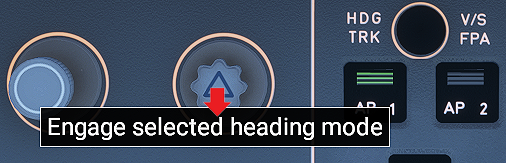
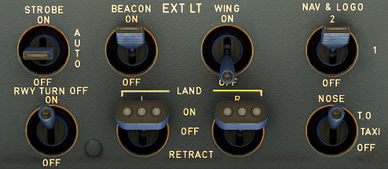
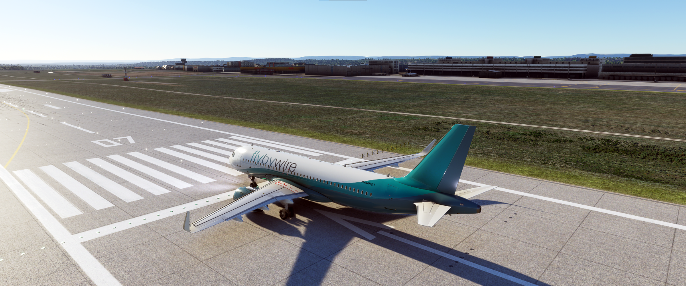
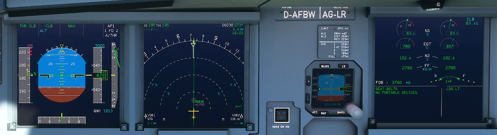

# Take off, climb and cruise

This guide will explain the correct procedures to accomplish take off, climb and establish cruise altitude.

---

## MSFS start from gate or runways

Microsoft Flight Simulator allows you to start your flight from cold & dark
at a gate or directly from the runway with the aircraft ready for takeoff.

For this guide we assume you started cold & dark at the gate and taxied to
the runway holding point.

If you did start on the runway you can skip the first part (Line-up) and
directly continue reading Takeoff.

## Pre-requisites

- Aircraft is in taxi state (checklist TAXI completed)
- Aircraft is at runway holding point, parking breaks are set

[Possible Checklist Download](#) or screenshot of before start items

## Chapters / Phases

This guide will cover these phases:

1. [Lineup](#1-lineup)
2. [Takeoff](#2-takeoff)
3. [Initial climb](#3-initial-climb)
4. [Climb](#4-climb)
5. [Cruise](#5-cruise)

!!!note
    The level of detail in this guide is meant to get a beginner safely up
    in the air under normal conditions while simplifying details which are
    not (yet) important for a beginner. Further reading:  
    [A320 Autoflight](https://www.smartcockpit.com/aircraft-ressources/A319-320-321-Autoflight.html)

---

## Base knowledge about the Airbus A320 for flight
This is in comparison to other airliners a user might be used to.

- Fly-by-wire system. 
Traditional mechanical and hydro-mechanical flight control systems use a
series of levers, rods, cables, pulleys, and more which pilots move to
adjust control surfaces to aerodynamic conditions. Their "hands on" design
gives pilots a direct, tactile feel for how the aircraft is handling
aerodynamic forces as they fly. On the other hand, mechanical systems
are also complicated to operate, need constant monitoring, are heavy and
bulky, and require frequent maintenance.

In fly-by-wire systems when the pilot moves flight controls, those movements
are converted into electronic signals, which are then interpreted by the
aircraft's  Electrical Flight Control System (EFCS) to adjust actuators that move
flight control surfaces. Computers also monitor sensors throughout the
aircraft to make automatic adjustments that enhance the flight. 

Because fly-by-wire is electronic, it is much lighter and less bulky than
mechanical controls, allowing increases in fuel efficiency and aircraft
design flexibility, even in legacy aircraft. And to prevent flight critical
failure, most fly-by-wire systems also have triple or quadruple redundancy
back-ups built into them. [source: BAE Systems](https://www.baesystems.com/en-us/definition/what-are-fly-by-wire-systems)

See also: [Fly-by-wire Wikipedia](https://en.wikipedia.org/wiki/Fly-by-wire)

- Autotrim 
The A320 has a feature called "Autotrim", which makes it unnecessary to
hold the stick or even use the trim wheel for holding current pitch. This
system is always active, even when the autopilot is off (in Normal Law).

- Autothrust 
The A320 has Autothrust which is similar to Autothrottle (e.g., in a Boeing),
but it does not move the thrust levers. Basically the thrust levers are only
moved by the pilot and stay there until moved. The thrust levers act as a
maximum allowed power setting for the autothrust system. During normal flight
(after take off) the levers stays in the CL climb) dedent, and the Autothrust
system will set engine power accordingly.

- Autopilot 
The A320's Autopilot system works a bit differently from other manufacturer's
systems. The A320 FCU controls allows to set certain values and then push
or pull the knobs. Pushing usually means automatic control( managed mode)
and pulling will use the manually selected value (selected mode).

    

    !!!note
        In Microsoft Flight Simulator pushing is clicking the knob "UP" and pulling
        is clicking the knob "DOWN"
        

- Flight phases 
The A320 uses flight phases to manage different parts of a flight. These are
preflight, take off, climb, cruise, descent, approach, go around, done. They
match the PERF pages in the MCDU (see [Preparing the MCDU](preparing-mcdu.md) ).

- Protections 
The A320 includes many protections for the pilot which make it nearly
impossible to stall or overspeed  the aircraft. It's beyond this beginner-guide
to go into details (Normal law, Alternate Law, ...)

---

<!-- Here we could use content tabs. But as I loose my editor's markup
plugin functionality when indenting everything within a content tab
I will do this as the very last setp -->

### 1. Lineup
Situation: ATC (Ground or Tower)  has instructed us to hold at runway holding point and wait until we are
cleared to "line up" or "take off". Aircraft is still in TAXI state and parking brakes are set.

Typically, it is latest here that we are asked to switch to Tower ATC frequency for take off clearance.

#### Preparation and checklist pre-clearance
While approaching the runway holding point or latest at runway holding point the
"Before take off checklist" needs to be completed.

The following steps from TAXI setup need to be done and checked:

- Check OVHD panel: APU off, no lights under normal circumstances (exception: evtl. Pack 1+2 OFF)
    - 

- Check Flight Controls

- Check Flight Instruments
    - 

- Check correct FLAPS setting (must be in line with PERF TAKE OFF page)

- Check V1, VR, V2 speeds and also, if required, FLX temperature setting (PERF page)

- Check Squawk
    - check squawk ID number
    - Set to AUTO or On
    - Set ALT RPTG to ON

- Check TCAS
    - Set to TA or TA/TR and traffic to All or ABV)
    - 

- Check COM frequency
    - tip: set the second frequency to the Departure frequency to be able to quickly change after take off

- Check ECAM - no blue writing must be visible
    - AUTO BRK MAX
    - SIGN ON
    - CABIN READY
    - SPLRS ARM
    - FLAPS TO
    - TO CONFIG NORMAL
    - 

- Press T.O.Config below ECAM to check take off configuration (last blue text "TEST" should disappear)

- Check ENG MODE SEL as required

- Check PACKS as required (some airlines start with Packs off to allow more power to thrust
and save fuel - not necessarily required)

You can/should also do the following steps:

- Set Weather Radar to Sys 1 to show weather on ND
    - 

#### Preparation post-clearance
After ATC (Tower) gives clearance to "line up" or "take off" we are allowed the runway.

"Line up" means that we roll onto the runway and stop at or starting point. We MUST wait
for ATC to give us "take off clearance" before we can continue.

"Cleared for take off" means we are allowed to actually start the take off.

Before we start rolling onto the runway we do the following steps:

- Turn on landing lights and check of Strobe is AUTO or ON

#### Entering runway
Before we start rolling we visually double-check that no other aircraft
is on final approach. We can also use TCAS on the ND to check for aircrafts
in the vicinity.

If everything is clear we release the parking brake and slowly roll onto the
runway in the direction of take off and come to s stop in the middle of the
runway in line with the middle runway line.

There is also a "running start" where we would not stop but directly apply
thrust for take off once we are straight on the runway. But as a beginner
a stop is recommended, so you can double-check everything.

When we reached our starting point we stop and set the parking brakes.

If we were only cleared for "line up" we wait here until we get clearance.

### 2. Take off
Situation: Aircraft is on runway and fully setup for take off.

After ATC has given clearance for take off we can actually start our roll.

A typical standard take off follows these steps:

Release parking brake and hold down brakes.

Apply thrust slowly to about 50% thrust until both engines are stabilized
(N1 stays constant at around 50%) while still holding the brakes.

Push Sidestick forward to about -10° on the PFD to put pressure on the front gear

Release brake and apply FLX/MCT or TO GA power

(depending if have configured a FLEX temperature, and the runway is long
enough for a FLEX start)

The PFD Flight Mode Annunciator (FMA) now shows several things which you
should check when aircrafts starts rolling:

From the left:

- Thurst: set to MAN FLX +60
- Vertical guidance:
    - Active (green): SRS (pitch guidance to maintain V2+10)
    - Armed (blue): CLB mode (is next after SRS is done)
- Lateral guidance:
    - Active: RWY (automatic runway axis follow up through ILS use)
    - Armed: NAV (navigation guidance according to HDG knob)
- Autopilot, Flight Director, Autothrust:
    - Autopilots are off
    - Flight Director 1 and 2 are ON
    - A/THR (Autothrust) is armed (not active yet)

Vertical and lateral guidance are only shown via Flight Director as we
have not turned on the Autopilot yet and need to be followed manually by the pilot.

Keep the aircraft on the center line while accelerating down the runway.

!!!note
    There are three important speeds for take off which you have configured
    earlier when programming the MCDU's PERF page for take off.

    **V1**: The speed beyond which takeoff should no longer be aborted.
    
    **VR**: Rotation speed. The speed at which the pilot begins to apply control inputs to cause the aircraft nose to pitch up, after which it will leave the ground
    
    **V2**: Takeoff safety speed. The speed at which the aircraft may safely climb with one engine inoperative
    
    On a long enough runway V1 and VR are often very close together and can't be
    clearly distinguished on the PFD speed tape.

At about 80 knots release the forward pressure on the sidestick until
about 100 knots when the sidestick should be neutral.

When reaching V1 remove your hand from the thrust levers.

At VR pull gently back on the Sidestick and try to get a 10-15° climb angle.
Use the green horizontal flight director line as reference.

Once we have confirmed "positive climb" we can retract the gear

.

We confirm that the landing gear is up by looking at the landing gear
annunciators, and the lower ECAM Wheels page.

Now we turn off TAXI and RWY TURN OFF lights. We do this as they are sitting
on the front gear and are now within the gear housing getting hot.

Last step of this part is disarming the SPEED BRAKE.

### 3. Initial Climb
Situation: Aircraft has left ground and is climbing at about 15°. Gear is up.
Thrust levers are in FLX MCT or TO GA detent. Flaps still in T.O. position.

After take off the aircraft will use FLX/MCT or TO GA thrust until
thrust reduction altitude is reached (typically ~1500ft above runway).

The PFD FMA now shows a flashing LVR CLB message which instructs the pilot
to reduce thrust to CLB thrust.

**Pull the throttle back into the CL detent.**

This activates the Autothrust system (FMA shows A/THR in white now).
In the A320 (and most Airbus models) under normal flight conditions
you will not touch the thrust levers again before final approach and landing.

The aircraft will now climb to the altitude selected in the FCU (in our case 5.000ft).

Activate Autopilot at this point by pressing the AP1 button on the FCU.

The FMA should now show AP1 in white in the upper right corner,

!!!note
    The FCU (Flight Control Unit) shows three important values:
    SPD: --- : means the autopilot is managing speed (e.g. 250knots <1000ft, 290 above)
    If you pull the SPD knob you can select a speed which the autopilot will then apply.
    HDG: --- : means the lateral navigation is in managed mode and the autopilot follows the route.
    Dialing the HDG knob let you select a heading and by pulling the knob you tell the autopilot to fly this heading.
    ALT: 5000 : means the selected altitude is 5000ft

When reaching VS speed retract flaps (assuming we took off with FLAPS 1).
VS speed is signified with an S next to the speed band in the PFD.

Complete "After Take Off checklist"

- Landing gear up
- Flaps retracted
- Packs on
- check Baro setting: above transition altitude set it to STD by pulling
the baro knob. The flashing baro value in the PFD
will remind you in case you forgot.

This is usually a good time to contact ATC Departure with your current altitude.
In most cases they would now give you a higher climb altitude.
If not you have to level off at the selected altitude. If you have the Autopilot
activated it will level off automatically.

This concludes the Initial Climb.

### 4. Climb
Situation:

### 5. Cruise
Situation:

