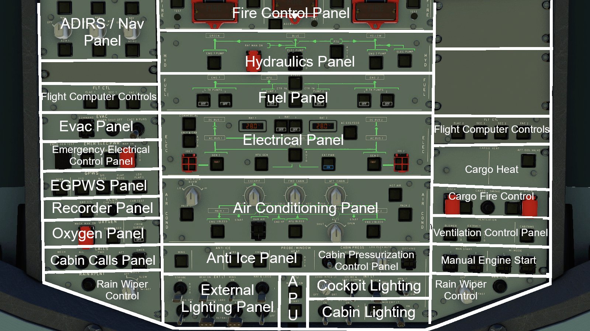
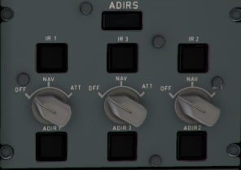
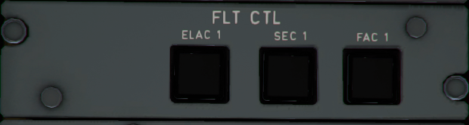
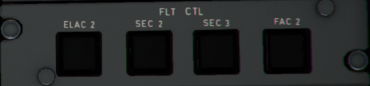
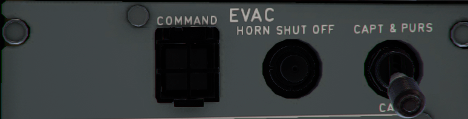
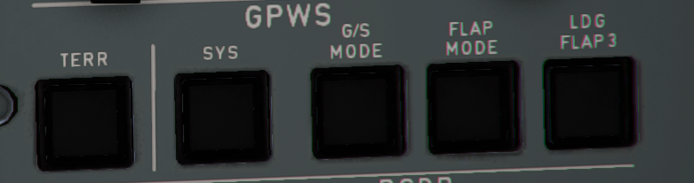

# The Overhead Panel

  

 Let's break down each panel and section, going from the top left downwards.

---
### The ADIRS/ NAV Panel:

Pretty simple, but an important panel. When you first start the aircraft up, you will turn the switches from "OFF" to "NAV", and wait up to 7 minutes for the aircraft to (quite literally) figure out where in the world it is.

The label under the ADIRS decal will display "ON BATT" when it is powered by the on board batteries.

---

### Flight Computer Control Panels 1 & 2

- Elevator Aeileron Computers. (ELAC 1 & ELAC 2).
    - These control pitch and roll in normal, alternate and direct laws. 
- Spoiler Elevator Computers (SEC 1, SEC 2 & SEC 3)
    - These control the spoilers for roll control in normal law, and the speed brakes / ground spoilers. 

- Flight Augmentation Computers (FAC 1 & FAC 2)
    - These are responsible for rudder trim, yaw damper, speed calculations and windshear detection.

All of these computers can be reset by....turning them off and on again. Yes, really. We have no idea why you would want to turn them off other than to see what happens.

---
### Emergency Evacuation Panel

- "Command" issues the evacuation command to the cabin. Pressing it again cancels the alarm.
- "Horn Shutoff" also cancels the evacuation command.
- "CAPT & PURS" switch. In real A320s, there is an evacuation option on both the foward and aft flight attendant panels. When the switch is in "CAPT & PURS" the evacuation command can be issued from either the cabin or cockpit. When it is in "CAPT" mode, the command can only come from the cockpit.

---
### Emergency Electrical Control Panel

- EMER GEN TEST: Tests the emergency generator. This is usually used by maintenance on the ground.

- GEN 1 LINE: Illuminates "SMOKE" when smoke is detected in the avionics bay. When avionics smoke is detected, part of the procedure is to turn this switch off.  This removes AC power from all non-essential systems, without removing power from the fuel pumps, wheras just turning off GEN 1 would also shut off fuel pumps.

- RAT & EMER GEN: (needs information)

- MAN ON: manually extends the Ram Air Turbine (RAT) and force connects the emergency generator.
---

### Enhanced Ground Proximity Warning System (EGPWS) Panel:

