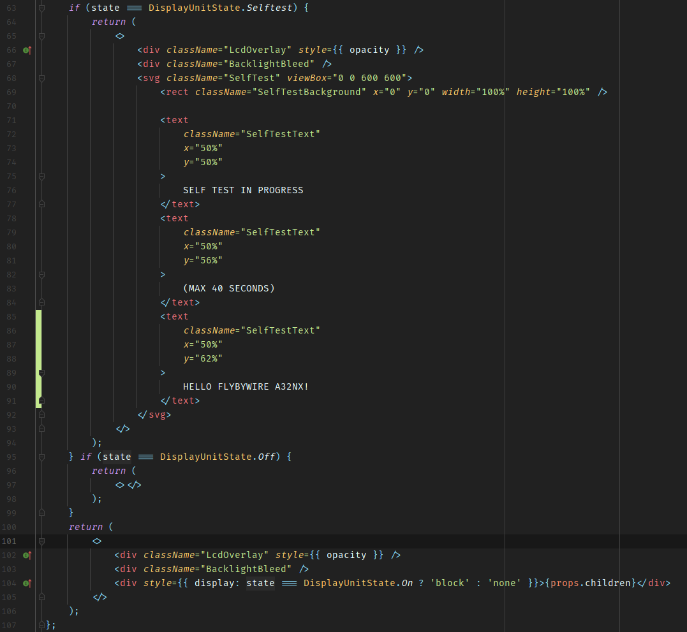
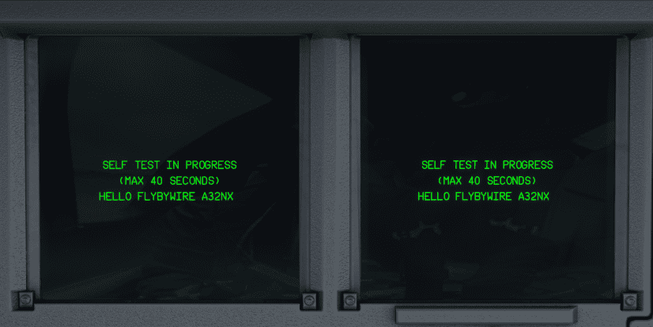

# Development Environment

## Required Software, Tools and libraries

### Git and Github

To access our source code a GitHub account is required.

Also some git client is necessary to interact with the GitHub repository.

Either use a standalone git client (terminal or UI based) or one integrated into your editor.

Make sure you are familiar with the basics of working with git/GitHub. The GitHub [Quickstart](https://docs.github.com/en/get-started/quickstart){target=new} documentation is a great help.

### Docker

FlyByWire provides a preconfigured docker container that has all necessary tools included and preconfigured to compile the aircraft.

To use this you need to download and install [Docker](https://docs.docker.com/get-docker/){target=new} here.

Use either WSL2 or HyperV backend work, but the latter is faster.

### Editor or IDE

Most of our team works with either Visual Studio Code or IntelliJ IDEA-based IDEs for development. Obviously, your choice is yours as long as the resulting code conforms to our standards.

## Getting the source code

To work on the A32NX project you need to create a fork ( [GitHub fork](https://docs.github.com/en/get-started/quickstart/fork-a-repo){target=new)}) of the [a32nx repository](https://github.com/flybywiresim/a32nx).

Clone this fork to your local environment. You can use the command line git or a UI based git to do this. On the command line go to your projects folder and clone it into that folder.

```
git clone https://github.com/flybywiresim/a32nx.git
```

You have now a copy of the a32nx repository on your local machine to review and change the source code.

## Compiling the source

To compile the source code into a package you can install into the Microsoft Flight Simulator Community folder we have prepared a few scripts you need to run which in turn use the Docker container mentioned above to compile the aircraft add-on.

```
cd a32nx
.\scripts\dev-env\run.cmd ./scripts/setup.sh
.\scripts\dev-env\run.cmd ./scripts/build.sh
```

The setup.sh is configuring the build process and is sometimes necessary when you changed branches which for example use a different Nodes configuration.

The build.sh is actually using the docker container to compile and build the add-on into the folder `flybywire-aircraft-a320-neo`.

!!! note "Compiling on Linux (incl. WSL)"
    You should use run.sh instead of run.cmd if you are on Linux/WSL.

    If you are using WSL, ensure that the Vmmem process is not memory limited. At least 10GB of memory is the recommended setting. This can be configured in C:\<user>\.wslconfig.

!!! tip "Create working branches"
    We recommend when making changes on your fork, you create a new branch, titled with the change you're looking to make or something similar.

After a successful build it is possible to copy the `flybywire-aircraft-a320-neo` folder into your Community folder and use the compiled A32NX in your simulator. See next chapter for more convenient way to update the add-on after a compile.

!!! warning "Important step!"
    Make sure you remove any existing copy of the aircraft from your community folder before doing this.

## Linking Dev folder to Community folder

To avoid having to copy the `flybywire-aircraft-a320-neo` folder after every compile it is possible to use a so called symlink from your Community folder to your compiled `flybywire-aircraft-a320-neo` folder.

To create your symlink, open your command terminal and run the below command, substituting the correct file paths with your community folder, and the 'flybywire-aircraft-a320' folder from your new project.

!!! warning "Important step!"
    Make sure you remove any existing copy of the aircraft from your community folder before doing this.

```
mklink /J [MSFS Community folder/flybywire-aircraft-a320-neo] [Project folder path]
```

Example:
```
mklink /J C:\Users\USERNAME\AppData\Local\Packages\Microsoft.FlightSimulator_8wekyb3d8bbwe\Community\flybywire-aircraft-a320-neo C:\Users\USERNAME\IdeaProjects\a32nx\flybywire-aircraft-a320-neo
```

If this works, you'll receive the response:

"Junction created for \[Community folder] \[Project Folder]" from the terminal.

Now you've compiled and symlinked your Github fork to your community folder, you should be able to load into the aircraft as normal.

!!! attention ""
    Open MSFS and check everything is working with your compiled branch before progressing.

## Hello World Example

Before changing anything we recommend to create a new branch from the master branch:

```
git checkout -b test-branch master
```

Open this file in the editor/IDE:
`src/instruments/src/Common/displayUnit.tsx`

Go to line 84 and add the following:

```
<text
    className="SelfTestText"
    x="50%"
    y="62%"
>
    HELLO FLYBYWIRE A32NX!
</text>
```

After you save it should look like this:



Now recompile your branch:

```
.\scripts\dev-env\run.cmd ./scripts/build.sh --no-cache
```

The optional `--no-cache` option makes sure everything is recompiled.

After the successful compile start the sim and load the FlyByWire A32NX cold & dark at a gate.

When turning on power to the aircraft the screens will do a self test. See if you can spot your code change there.



**Congratulations! You have successfully made a code change and deployed the new add-on to the simulator.**
