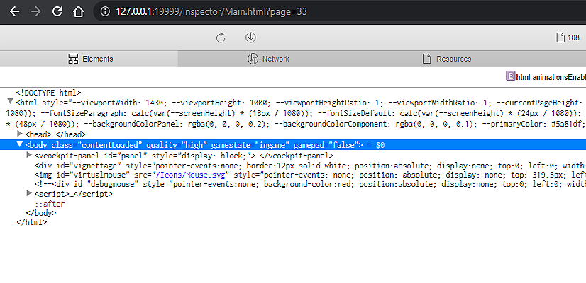

# flyPad Development Guide

## Quick Reloading the flyPad

As the aircraft in your project folder is now connected to your MSFS community folder via the Symlink you created in the previous step, each time you load in to the A32NX on MSFS, any changes you've made since the sim was last opened should be updated.

Rather than reloading MSFS each time you wish to test your changes, you can enable quick reloading directly from your code editor/IDE, then with each change you make in the code, you can save and reload only the flyPad, and keep MSFS running throughout.

!!!info ""
    From here on, if you're coming back to continue working on your flyPad project, you would only need to run the following quick reload steps again to get everything up and running again!


To start quick reloading the project:

- In your code editor/IDE, run the command:

```
npx rollup -wc src/instruments/buildSrc/simulatorBuild.mjs
```

- Navigate to **[http://127.0.0.1:19999](http://127.0.0.1:19999)** in your browser. You should see several options appear, select the following option:

```
VCockpit16 - EFB_TEMPLATE [coui://html_UI/Pages/VCockpit/Core/VCockpit.html]
```

- A page similar to the below should be shown. The refresh button at the top of the page will reload your flyPad, causing the display to switch off for a few moments. Once turned back on, any changes made and saved in your EFB project file will be updated to the EFB in your simulator session.

{loading=lazy}

## Getting Started with the EFB Code

Now you're set up with your own fork, which you can reload instantly and test in MSFS, you're ready to get started making changes. When getting started it's a good idea to spend some time looking around the project and wrapping your head around the structure.

- You'll find the main EFB content under ` src/instruments/src/EFB ` of your Github fork, try making small changes at first to test, such as changing the colour of an icon, or changing a few words to make sure the reloading is working.
- Take a look at previous commits made to the flyPad on the [A32NX Github Repository](https://github.com/flybywiresim/a32nx/commits/master){target=new} and see what changes were made to get the desired result.

!!!info "Top tip!"
    When working on your project, make sure to reload the flyPad and test regularly to catch issues as soon as they happen.
    If many changes are made between tests, it may be difficult to find the cause of any problems that arise.

## Troubleshooting

If there is anything wrong with the code/files in your local branch, when reloading the flyPad, several issues may occur:

- The flyPad will turn on, but switch off and remain off when clicking on an affected page (Reloading the build in the browser will bring this back).
- Everything may show as normal but none of your changes have been applied.
- The flyPad doesn't turn on at all.

This would generally indicate an issue with the code in your project.
In these cases, it's best to take a look back through changes you've made so far and track down the cause, or revert the last change made if that was the cause.

!!! warning "Unique Error"
    If you receive the error `Ineffective mark-cmpacts near heap limit Allocation failed - Javascript heap out of memory` when attempting the npx rollup command, run the below command to increase Node's memory limit.
    This should enable you to continue with the quick reloading process.

    ```
    $env:NODE_OPTIONS='--max_old_space_size=8192
    ```
