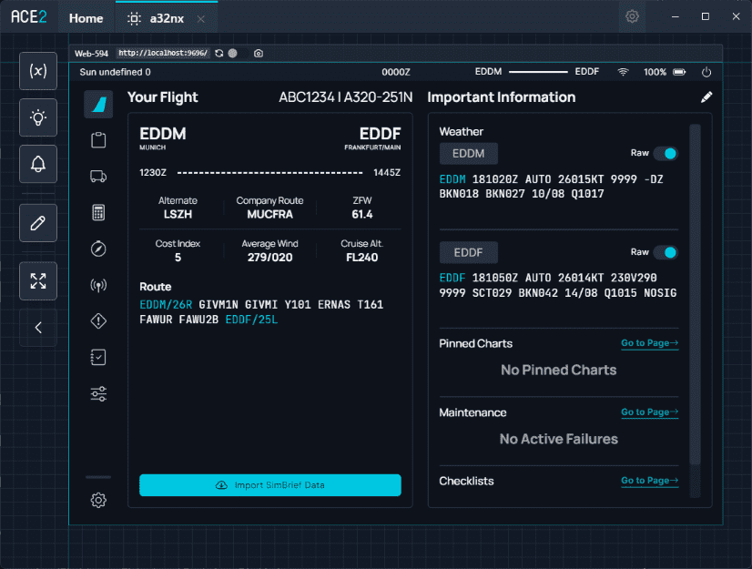

#  Advanced Cockpit Emulator 

`ace`, or Advanced Cockpit Emulator, is a project aiming to provide a complete avionics development environment for Microsoft Flight Simulator aircraft.



{--

`ace` is meant to be used by developers and is not a finished or polished product. It is a work in progress and is not meant to be used by end users.

We do not provide support for `ace` at this time. You can ask on our Discord's 
[#dev-support](https://discord.com/channels/738864299392630914/747622836381810739){target=new} channel, but we cannot
guarantee a response.

--}

## Features

### Cockpit panel display

`ace` can display cockpit panels in the browser, with nearly identical rendering.

### SimVar support

Simulation Variables and Local Variables exist for instruments to read and write to.

### Coherent API mocking

The MSFS CoherentGT engine API is emulated in `ace`, including the `call`, `trigger` and `on` functions.

## Setup

1. Clone [https://github.com/flybywiresim/ace](https://github.com/flybywiresim/ace) locally
2. Go to the clone's folder and do `npm i --force`
3. Run ace with `npm start`
4. After running the program, select New Project and choose the locations of all your folders. (see [below] (#example-config))
5. Add a Web Instrument to localhost:9696 (right-click on the project canvas)
6. Open a new terminal and go to your `aircaft` clone folder and run: `npm run serve:efb`
     This allows to see any changes to the instrument's code nearly instantaneously. 

To interact with the EFB via mouse, you need to click enter to turn on interactive mode.

### Example Config

```json title="Example Configuration for ace"
{
	"name": "a32nx",
	"paths": {
		"instrumentSrc": "src\\instruments\\src",
		"bundlesSrc": "src\\instruments\\aceBundles",
		"htmlUiSrc": "flybywire-aircraft-a320-neo\\html_ui"
	}
}
```

Troubleshooting:

- flyPad: remember to press Enter for Interactive Mode to turn on the flyPad

## Instrument Setup

Each instrument's config.json should use this format:
```json title="Example Instrument Configuration"
{
  "index": "./index.tsx",
  "isInteractive": true,
  "name": "DU3",
  "dimensions": {
    "width": 1480,
    "height": 1100
  }
}
```

Your rollup should output to a bundles folder within your project using this structure:
``` title="Example Folder Structure"
- bundles
  - MFD
    - bundle.js
    - bundle.css
  - PFD
    - bundle.js
    - bundle.css
```


