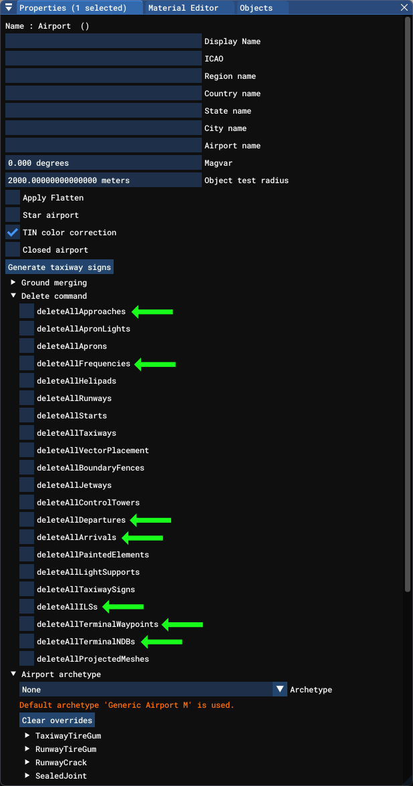
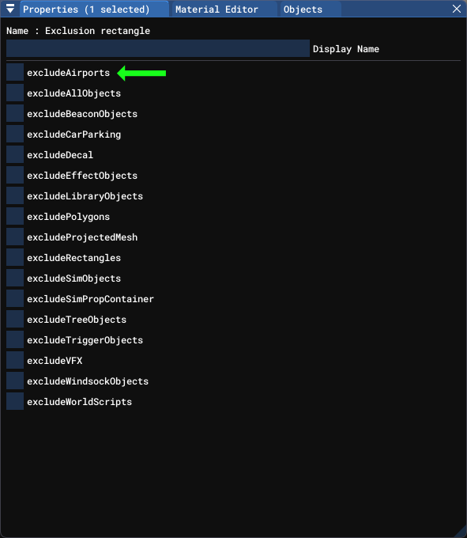
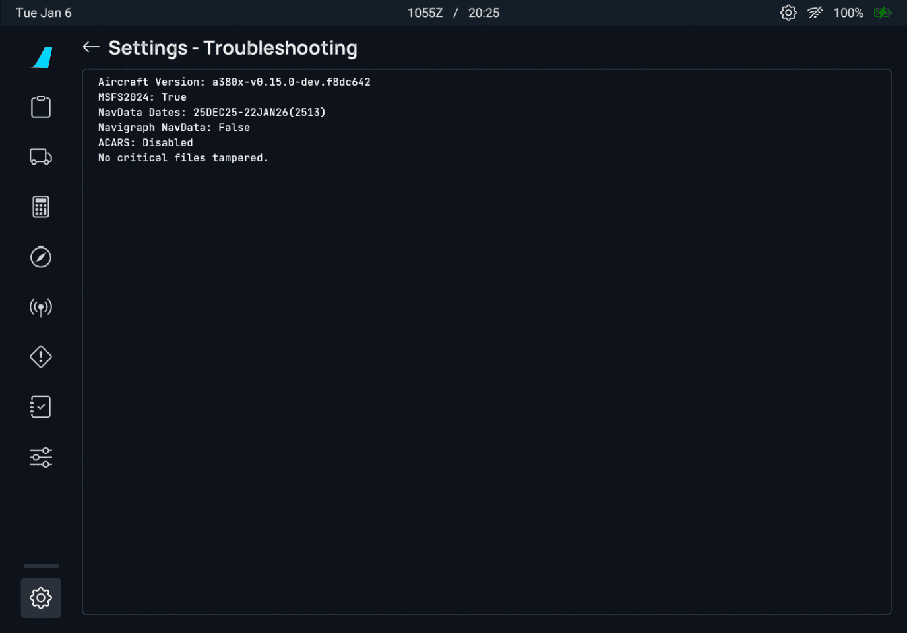

# Tips for Scenery Developers

## Navigation Data

In general, it's best to stay away from navigation data in scenery packages, as the default navdata from NAVBLUE is kept up-to-date each cycle, and third-party solutions like Navigraph can provide good service when their data isn't overridden.

When creating an airport scenery project, it is possible to unintentionally delete all navdata related to an airport. The following options are to be avoided as they will trigger a deletion of navdata in the sim.

### 1. Airport Properties - Delete Commands

Make sure the following options are not ticked as they will delete the navdata related to the airport including SIDs and STARs waypoints.

### 2. Exclusion Rectangles

When using exclusion rectangles, do not check the option labelled "excludeAirports" as this will delete all navigation data such as SIDs, STARs, and any approaches associated with the airport. If you are compiling with the MSFS2020 SDK, do not check the "excludeAllObjects" option as the "excludeAirports" option is nested under it in the MSFS2020 SDK. It is best to only exclude the specific objects needed instead of the "all" option. 

More information can be found in the [MSFS2024 SDK](https://docs.flightsimulator.com/msfs2024/html/2_DevMode/Scenery_Editor/Objects/ExclusionRectangle_Objects.htm#:~:text=excludeAirports) and the [MSFS2020 SDK](https://docs.flightsimulator.com/html/Developer_Mode/Scenery_Editor/Objects/ExclusionRectangle_Objects.htm).

## Verification of Navdata Integrity

There are two methods to verify the integrity of the navdata with your scenery. The first method uses the EFB of either FlyByWire aircraft while the second method uses the BGLExplorer in the MSFS SDK Tools. 

### 1. Verifying navdata integrity with the FlyByWire EFB

With your scenery loaded, load into any FlyByWire aircraft with the systems powered on. You can skip to this state by using a runway start. In the MCDU (A32NX) or MFD (A380X), setup your airport as the origin and destination airport. This will trigger the aircraft to process and load the navdata for the airport. On the EFB, click on Settings -> About -> Troubleshooting. You can look for navdata errors on this screen, they will appear as waypoints missing errors. If there are no errors reported, all the waypoints for the SIDs and STARs are intact for the origin and destination airports.

### 2. Verifying navdata integrity using BGLExplorer

The BGLExplorer is a tool provided in the MSFS SDK for exploring the contents of a BGL file. It can be located in your MSFS SDK folder -> Tools -> bin. Drag and drop your airport bgl file onto the BglExplorer.exe file to scan your bgl file with it. In the output of the BGLExplorer, you are looking for an commands that tells the sim to delete navdata such as waypoints, VORs, NDB, etc. Look for commands such as `FAC_TYPE_DELETE_NAV_AT_AIRPORT` which can be caused by either the airport delete commands or exclusion triangles documented above. 

You can find more information on the [BGL Explorer](https://docs.flightsimulator.com/msfs2024/html/8_SDK_Tools/BGL_Explorer.htm) in the MSFS SDK. 

## ILS Auto-Tuning

The A32NX relies on the navigation data from MSFS to link ILS to runways. This depends on runway definitions in the scenery. To ensure full functionality in FlyByWire aircraft (and other MSFS avionics), make sure your `<Runway />` definitions have an [`<IlsReference />`](https://docs.flightsimulator.com/html/Content_Configuration/Environment/Airports_And_Facilities/Runway_Definition_Properties.htm#h8) linking them to the runway-aligned localizer specified in the official AIP.
