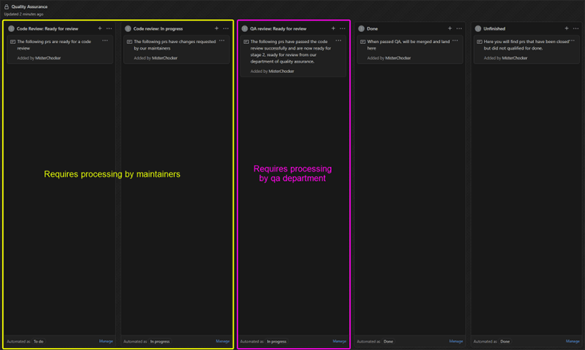
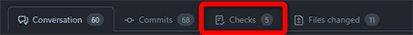
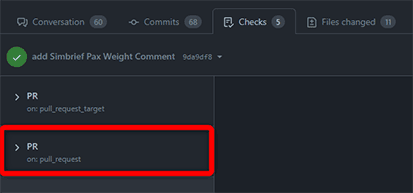
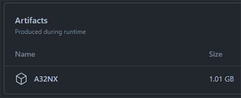
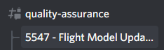

# Quality Assurance Process

## QA at FlyByWire

FlyByWire Simulations aims to maintain professional standards as well as industry-wide best practices in order to maximize developer productivity and deliver high-quality, tested products.

This is why we adopt a set of rules and practices that create a strong framework, not only around the usage of git but also surrounding code quality.

Therefore, every change or addition to the code of our aircraft goes through a multi-step development and quality assurance process.

This documentation describes the FlyByWire QA Process and tools in detail to make sure, we can efficiently and effectively deliver the highest quality in our products.

## What you need

To QA test for FlyByWire you need the following prerequisites:

- Having read and understood this page!
- Microsoft Flight Simulator (PC)
- GitHub Account and access to our [Pull Requests](https://github.com/flybywiresim/a32nx/pulls){target=new}
- Discord Account and joined our server [FlyByWire Simulations](https://discord.gg/flybywire)
- A QA Trainee or QA Tester Discord role

## Becoming a QA Tester

We try to keep the number of QA testers at a reasonable and manageable level to ensure quality and sufficient PRs to test for each QA team member.

If you'd like to apply for the QA Trainee role we recommend to actually
conduct a few tests as described below without submitting any reports to GitHub!

Send an application message and your test reports to the [Contact(s)](#contacts) at the bottom of this page via DM and the QA leaders will decide if you are eligible for a QA Trainee role (provided there are open positions).

!!! attention ""
    **Please do not submit reports to GitHub without having a QA Discord role.**

## What to Test

The FlyByWire development process provides a constant stream of new Pull Requests to be tested as each and every single code change goes through this workflow. All commits to the master branch (Development Version) are therefore code-reviewed and QA-tested.

To manage this process we use the GitHub Project feature.

This is a simple Kanban board where items move from the left to the right. For QA tests the third column is relevant ("QA Team Review: Ready to Test")

{loading=lazy}<br/>[QA Project Board on GitHub](https://github.com/flybywiresim/a32nx/projects/4){target=new}

If you have gotten a grasp on the above instructions, pick a PR to test from the list.

Read the description and testing instructions of the PR carefully and make sure you have the required skills and the necessary time available to conduct the test in a high quality fashion.

## How to get PR Builds

Every pull request to the master branch triggers a build of the add-on with the changes made by that PR. This build can be downloaded and manually installed to your Community folder.

How to download the PR for QA

1. Open the PR in a browser window (press ++ctrl+lbutton++ on PR link).
2. Go to the "Checks" tab in the PR.

    

3. On the left side click on the PR label saying `on: pull_request`.

    

4. Download the zipped Artifact at the bottom.

    

5. Unzip the file and place the "flybywire-aircraft-a320-neo" folder into your Community.

!!! attention "PR Builds only for FlyByWire QA Team"
    The PR builds are only meant for QA testing and not for daily use. Outside of the FlyByWire QA Team we do not provide any support or answer any questions in regards to these builds.

## How to Test

### QA Tiers for PRs

The FlyByWire developers are required to categorize their PRs into two test tiers to indicate the complexity or importance of the PR.

More complex features or features vital for the stability of the add-on will need considerably more testing than a simple change of a button text.

The developer, developer leader and QA leader determine the tier of testing required and how many successful tests must be reported before a PR can be accepted and merged into the master branch.

#### Tier 1

- Extensive and careful testing is expected but no full flight is required.
- Providing media is not required.
- Of course you can always do a full flight and provide media but the test is valid without it.

#### Tier 2

- At least one full flight is required to test Tier 2.
- Providing media (screenshots/videos) is a requirement especially for any issues that might arise.
- Tests without a full flight or media are not valid and will require another tester to still do a full tier 2 test.

### Clean Community Folder

It is important that the QA tests are done on a clean system with no other add-ons or liveries installed. These could create false issues and render the whole test meaningless.

Remove everything from your Community folder apart from the "flybywire-aircraft-a320-neo".

Typically, it is ok to keep your Navigraph data installed.

!!! tip "Tip: Use MSFS Addons Linker"
    An easy way to manage add-ons in the Community folder is the [MSFS Addons Linker](https://flightsim.to/file/1572/msfs-addons-linker){target=new} tool from [flightsim.to](https://flightsim.to/).

    It allows you to create presets to easily switch between different sets of installed add-ons. You can create a preset with only the "flybywire-aircraft-a320-neo" folder left in the Community folder.

### Focus on the PR Test Instructions

Read the test instructions of the PR carefully. Focus only on what is requested and part of this PR. Do not bloat your reports with many additional observations.

If you find additional issues which are not part of the PR, reproduce and test them with the latest Development version and then create a [GitHub Issue](https://github.com/flybywiresim/a32nx/issues) for them.

### Ask on Discord

If the test instructions are unclear or any questions come up regarding the test or the outcome please ask on the Discord "quality-assurance" channel for support.

Look in "quality-assurance" if a discussion thread already exists for this issue (thread title starting with PR#), and if it does ask your questions directly there.

!!! block ""
    Example:<br/>
    

If no dedicated thread exists for the PR please provide the #PR number and title in the "quality-assurance" channel and ask your question or describe your issue.

### Communication

It is good practice if you are starting a test on a certain PR to announce it on the Discord "quality-assurance" channel.<br/>
(Example: Starting test on PR #1234 <PR-title>)

Also reporting the PR# and test result after completing a report is common practice and helps others to see which PR have been tested and if there were issues.<br/>
(Example: Tested PR #1234 <PR-title>: passed.)

## Reporting on Tests

To report test results on GitHub please use the template below:

```
Quality Assurance Tester/Trainee Report

Discord          : (name#1234)
Object of testing: (#PR Number)
Tier of Testing  : (1/2)
Date             : (DD/MM/YYYY)

Testing Process: 
(Detail is needed)

Negatives:       
(Any issues, doubts. - type N/A if none are found)

Testing Results: 
(Passed/Not Passed)

Conclusions: 
(Notes made, the positives in the PR, and anything extra you would like 
to mention - Delete Line if Nothing Extra is to be mentioned)

Media:       
(Pictures/videos if applicable - delete line if not applicable)

```

!!! tip "Tip: Look at closed PRs"
    To better understand what a report should look like, you can look at closed PRs on GitHub to see how others approach this.

    Link to Closed PR list: [Closed PRs](https://github.com/flybywiresim/a32nx/pulls?q=is%3Apr+is%3Aclosed){target=new}

!!! tip "Tip: Using GitHub Save for Template"
    We suggest using the "Saved Replies" feature of GitHub for the QA Template. You can set them up as follows:

    1. Click on your profile picture in the top right corner and click on Settings
    2. Click on Saved replies
    3. Give your saved reply a name and paste the QA template.

    Then when writing a QA report, click on the arrow in the top right corner of the comment field. Select your saved reply and insert the necessary data.

    Alternatively you can use the keyboard shortcut CTRL+. CTRL+1 -> note that the number represents your saved replies so if you have multiple and your QA template is the third one you would have to use CTRL+3.

## Discord Roles

To manage the QA team and focus on quality the FlyByWire QA Team currently has two levels of QA testers: **QA Trainee** and **QA Testers**.

After being accepted as QA tester (see [Becoming a QA Tester](#becoming-a-qa-tester)) you will get the QA Trainee role.

!!! info "QA Roles"
    **QA Trainees**

    Should focus on Tier 1 tests at the beginning until the quality of tests and test reports has been established.

    Moving from QA Trainee to QA Tester will be based on a combination of report numbers, quality of reports and handling of more in-depth/Tier 2 reports.

    ---

    **QA Testers**

    Free to test all available Pull Requests ready to test. The high standard they have proven as a QA Trainee will continue to be expected from them.

In general to maintain your QA Team status a minimum of one test every two weeks is required. You can announce in the quality-assurance Discord channel if you need to take a break from testing to retain your status although not submitting any test reports.

Special QA requests to IRL pilots will be made in the #pilot-feedback channel.

## Contacts

QA Team leader contact on Discord: Mico#3145

