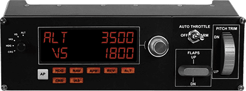

# Common Hardware Controllers and Setup

## General

~~these are examples~~

~~all based on SPAD - other software solution should work equally~~

## Logitech Switch Panel

{target=new}

## Logitech Multi Panel

{target=new}

## Thrustmaster TCA Quadrant Airbus Edition

## Thrustmaster TCA Throttle Add-On TCA Quadrant Add-on Airbus Edition

## Thrustmaster TCA Sidestick Airbus Edition

## Thrustmaster T.16000M FCS

## Thrustmaster TWCS Throttle

