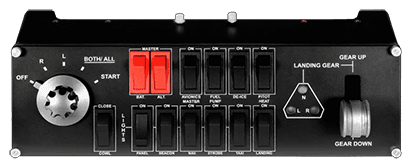
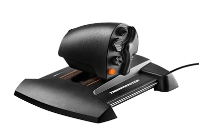

# Common Hardware Controllers and Setup

This page shows you a collection of common flight simulation hardware which can be used together with Microsoft Flight Simulator and the FlyByWire A32NX.

To make these controllers fully compatible you need to replace their default drivers with an appropriate software. See [here](index.md#solutions).

The examples below are configured via SPAD.neXt and the configuration documentation is linked below each controller.

With SPAD.neXt you can also download complete profiles for aircraft and hardware controllers. For the controllers below this downloadable profile is used:

{loading=lazy}

Find the complete documentation for these controllers in this single file: SPAD FlyByWire A32NX Profile Documentation: [A32NX FBW MSFS2020.pdf](../assets/api-guide/A32NX%20FBW%20MSFS2020.pdf)

This profile is maintained by Cdr_Maverick#6475.

### Logitech Switch Panel

{loading=lazy}

{target=new}

[A32NX FBW MSFS2020 Pro Switch Panel.pdf](../assets/api-guide/A32NX%20FBW%20MSFS2020%20Pro%20Switch%20Panel.pdf)

### Logitech Multi Panel

{loading=lazy}

{target=new}

[A32NX FBW MSFS2020 Multi Panel.pdf](../assets/api-guide/A32NX%20FBW%20MSFS2020%20Multi%20Panel.pdf)

### Thrustmaster TCA Quadrant Airbus Edition

{loading=lazy}

[A32NX FBW MSFS2020 TCA-Q Addon.pdf](../assets/api-guide/A32NX%20FBW%20MSFS2020%20TCA-Q%20Addon.pdf)

### Thrustmaster TCA Throttle Add-On TCA Quadrant Add-on Airbus Edition

{loading=lazy}

[A32NX FBW MSFS2020 TCA-Q Addon.pdf](../assets/api-guide/A32NX%20FBW%20MSFS2020%20TCA-Q%20Addon.pdf)

### Elgato Stream Deck

{loading=lazy}

[A32NX FBW MSFS2020 Stream Deck XL.pdf](../assets/api-guide/A32NX%20FBW%20MSFS2020%20Stream%20Deck%20XL.pdf)

### Thrustmaster TCA Sidestick Airbus Edition or T.16000M FCS

!!! block ""

    {loading=lazy align=left width=46%}

    {loading=lazy align=right width=46%}

### Thrustmaster TWCS Throttle

{loading=lazy}
