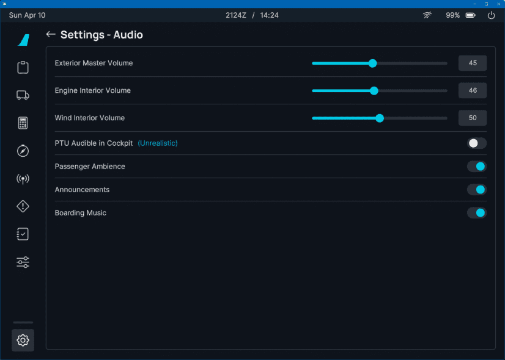

# Audio Configuration

This page provides an overview of the various audio settings available in the A32NX and their respective functions.

These settings can be found on the EFB:

For information on the other settings available on the EFB, visit our [flyPad Settings](flypados3/settings.md) page.

## Passenger Simulation

!!! warning "Cockpit Door"
    The cockpit door in the A32NX simulates a real A320 cockpit door, which in consequence dampens most of the sounds from the passenger cabin. 

    If you want to enjoy the Passenger Ambience sounds, make sure it is open.

We have included various settings that simulate flight crew interactions with passengers on board.

### Passenger Ambience
If this setting is enabled, the following ambience sounds are played:

- Boarding and deboarding sounds are triggered via the Payload tab on the Ground Services page on the EFB.
- Once passengers are on the plane, a constant passenger ambience background sound plays.

### Announcements

!!! warning "Customizations"
    Due to limitations with MSFS audio configurations, adding user customizable announcements/sounds is not easily possible.

If this setting is enabled, the following crew announcements are played.

| Trigger                                    | Audio Played                                    |     Speaker      |
|:-------------------------------------------|:------------------------------------------------|:----------------:|
| Boarding Completed                         | "Boarding Completed" announcement               | Flight Attendant |
| Boarding Completed + 30 s                  | Captain makes a "Welcome on Board" announcement |     Captain      |
| Beacon Light set to `ON`                   | "Arm Doors" Announcement                        | Flight Attendant |
| "Arm Doors" Announcement + 30 s            | Safety Demo                                     | On-Board System  |
| TCAS mode switched to `TA` OR `TA/RA`      | "Prepare for Takeoff" Announcement              |     Captain      |
| Enter **Cruise Phase** + 30 s              | "Cruise" Announcement                           |     Captain      |
| Enter **Descent Phase** + 30 s             | "Descent" Announcement                          |     Captain      |
| Gear Down + **Approach Phase** Active      | "Prepare for Landing" Announcement              |     Captain      |
| **Done Phase** + Beacon Light set to `OFF` | "Disarm Doors" Announcement                     | Flight Attendant |

### Boarding Music
If enabled, music will be played during boarding.

## Realism Settings

### PTU

The PTU is generally not heard in the cockpit. As a passenger, we understand people may be used to this sound as it is very audible in the passenger cabin.

We have added a toggle to allow the PTU to be heard in the cockpit, which in real life is not the case. 

## Engine and Wind

- Exterior Master Volume:
    - Volume for sounds audible when in external views.

- Engine Interiors Sounds:
    - Volume for engine sounds when in interior views.

- Wind Interior Volume:
    - Volume for wind sounds when in interior views.
