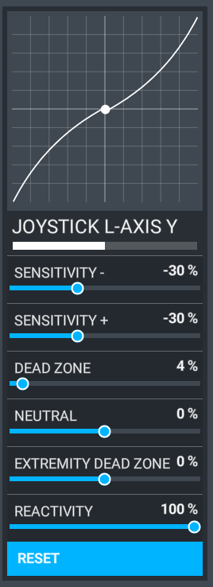

# Custom Autopilot / Fly-By-Wire

!!! warning "Important"

    * The custom autopilot system needs at least stable 17 fps to work properly. Any lower performance may result in unexpected behaviour.
    * The A32NX forces the __^^modern flight model^^__ and selection in the MSFS settings is not necessary.
    * It's crucial for the Autothrust system to have properly setup detents. Ensure that you have enough dead zone around the detents.
    * Typical issues when this is not done properly: constantly flashing "LVR CLB", FLX / TOGA not engaging or ATHR not holding speed correctly (the latter can also happen when in CLB/OP CLB or DES/OP DES and flying manually -> in that case you need to take care of holding speed with pitch)
    * Any mod or add-on that changes the physics or has impact on the flight model are **not supported**

***

## Recommended Sensitivity Settings

{==

Sensitivity settings are highly hardware depended and can be different for each controller. The below recommendations are therefore initial starting points and it might be necessary to adapt these for your controller and your preference.

==}

We **highly recommend** using a sensitivity setting of `-30%` to better simulate the increased force you need to push or pull the real sidestick in the aircraft. Please see the screenshot below for an example:



## Reporting issues

When reporting issues please take the following into account:

* Read the known and typical issues to be sure it's not already known or can be solved that way.
* Have a look at your fps.
* Note down which flight condition you are (in flight, on ground).
* Note down what the FMA showed (or even better: take a screenshot or make a video).
* You can press the DFDR button (right of the throttle levers and above the TCAS panel) to mark an event.
* If you ask for support you might be asked for a FDR file, those can be found in the work folder (see below).

***

### Work Folder Location

#### Microsoft Store Version

The work folder can be found here:

`%LOCALAPPDATA%\Packages\Microsoft.FlightSimulator_8wekyb3d8bbwe\LocalState\packages\flybywire-aircraft-a320-neo\work\`

#### Steam Version

The work folder can be found here:

`%APPDATA%\Microsoft Flight Simulator\Packages\flybywire-aircraft-a320-neo\work\`

***

## Custom Autopilot and Autothrust System incl. new Engine model

⚠️ This is work in progress, there are still issues, see the [Known Issues](#known-issues)

⚠️ When throttle sensitivity is changed, the throttle configuration needs to be adapted in most cases.

:information_source: It is recommended to use a linear sensitivity for the throttle axis.

:information_source: The throttle configuration can be adapted using the EFB.

### Typical Issues and How to Solve Them

???+ info "FMA keeps blinking with message `LVR CLB`"

    If this is the case your throttle calibration is not properly. The values of the throttle axis range from -1.0 to 1.0 independently if you're using reverse on axis or not. When the current throttle position is larger or equal then the start position and smaller or equal than the end position of a detent, the throttles are considered to be in that detent.

    Ensure that:

    * detents are large enough defined so hardware inaccuracy is taken into account (i.e. detents on the Thrustmaster TCA are not that hard and values can quite differ even one thinks it's in the detent
    * there is enough range between the detents (meaning end position of detent and start position of next detent are at least wide as the detents)

    **Important**: if you have issues, don't look at the animation part to check if it's in the detent. Check the values in the EFB, those are relevant and not the animation.

??? info "Autothrust does not hold target speed in manual flight"

    Important rule is to always monitor the FMA. If you're in manual flight and you're in `CLB`, `OP CLB`, `DES` or `OP DES` the autothrust applies either `THR CLB` (limited by the throttle levers) or `THR IDLE`. The speed needs to be controlled by pitch and in manual flight the pilot is responsible to do so by following the flight director orders.

    If this is not your desired mode, you can do two things:

    * engage another vertical mode (i.e. V/S or FPA)
    * disengage both flight directors, this will force the Autothrust into SPEED mode

    **Reminder**: Speed is only controlled properly using thrust when Autothrust is engaged and active, thrust levers are in detent CLB, active FMA mode is `SPEED` or `MACH`.

??? info "`SRS` does not engage on take-off"

    `SRS` mode needs at least a V2 entered on TO PERF page. Additionally it does only engage when the detents are set properly. If no FLX temperature is set, this needs to be TOGA. If a FLX temperature is set, it's FLX/MCT or TOGA.

    Other conditions:

    * plane needs to be at least 30 s on ground
    * Flaps extended at least in position 1+F

??? info "`RWY` does not engage on take-off"

    There is currently no auto-tune available for the LOC on take-off. You need to enter the right frequency manually. Beside that `RWY` mode only engages with the following conditions:

    * LOC signal valid
    * LOC deviation smaller than 1/2 dot
    * Deviation between plane heading and LOC bearing is < 20°
    * Plane needs to be at least 30 s on ground
    * Flaps extended at least in position 1+F

??? info "`LVR CLB` flashes immediately after lift-off"

    Ensure that both thrust reduction and acceleration altitude on TO PERF page are properly setup.

??? info "`LAND` mode does not engage"

    Before reaching 400 ft radio altitude the FMA needs to show `LOC` and `G/S`. If one of them is still in capture mode (`LOC*` or `G/S*`) you need to perform a go around maneuver or land manually, LAND will not engage that way.

??? info "Autoland does not perform as expected"

    The Autoland system is quite complex and is dependent on multiple environmental conditions to work properly, such as:

    * LOC accuracy in terms of
      * alignment of heading to runway heading
      * alignment on runway centerline
      * availability down to 0 ft and also during roll-out
    * G/S accuracy in terms of
      * alignment to correct height (50 ft over runway threshold)
      * availability down to 50 ft
    * ground in front of runway threshold needs to be more or less stable (no fast raising terrain) beginning 200 ft radio altitude

    **Reminder:** If the autoland warning light goes on it's IRL procedure to go around!

    Unfortunately a lot of runways (either using Navigraph or not) have issues for LOC and/or G/S, either in terms of alignment or availability. On many runways you loose the LOC during `ROLL OUT`. In that case the roll out has to be performed manually by disengaging the AP.

??? info "Flight controls are not working after reload of the sim or airplane"

    Ensure that no `SimConnect.cfg` is in the Documents folder of your user profile. An older version of Kinetic Assistant installed that file and it's causing issues with SimConnect connection between our custom systems and the sim.

??? info "Autopilot is oscillating on approach or in flight"

    Ensure that you get enough frames per second (see on top).

??? info "Climb performance is not satisfying or plane drops or increases nose heavily on approach"

    Ensure that you don't have any mods or add-ons installed that have influence on the flight model or other physics.

??? info "Autopilot oscillates when using time compression"

    In most cases a time compression up to 4x is safe to use. Nevertheless depending on environmental conditions and the performance of your computer osciallations can still occur.

    The reason why it can work for some and not for others is how time compression is working. For example when using time compression of 2x for the custom systems it's like having 1/2 of your displayed fps, when you're using 4x it's like 1/4 of it. So taking into account the 17 fps requirement it means you need ~ 30 fps and ~ 45 fps for 4x to work somehow, at least for smooth cruise.

    When you encounter heavy turbulence it might be needed that time compression is reduced.

??? info "Use RUDDER AXIS PLUS and RUDDER AXIS MINUS binding with normal axis instead of Xbox-Controller"

    In MSFS there is a special binding for rudder available for use with Xbox-Controllers (it's bound by default). This binding is Rudder Axis Plus and Rudder Axis Minus. In case of a Xbox-Controller the rudder in centered when both axis (Plus and Minus) are in the middle of the range. When using a "normal" axis with those two bindings this can cause issues because usual axes use the full range.

    In order to enable the use with normal axes, the following needs to be done.

    Put a file named `ModelConfiguration.ini` into the work folder (see "Work folder location" on this page) that has the following option set to true:
    ```ini title="ModelConfiguration.ini"
    [flight_controls]
    disable_xbox_compatibility_rudder_axis_plus_minus = true
    ```

***

### Known Issues

#### Requirements and Incompatibilities

* ❌ Minimum performance requirement is stable 17 fps
* ❌ No support for AI copilot
* ❌ Proper throttle calibration via EFB required

#### Not Solved or Missing (This List is Not Conclusive)

##### Fly-By-Wire
* ❌ Alternative Law
* ❌ Direct Law (in flight)
* ❌ Simulation of hydraulic system with impact on flight model

##### Flight Management

* ❌ Due to lack of VNAV, DES mode is currently only using SPD/MACH
* ❌ Due to lack of VNAV, RNAV approaches are not supported yet

##### Autopilot

* ❌ Engine out operations are not fully considered yet
* ❌ Autoland with one engine out is not supported

##### Autothrust

* ❌ N1 cannot be achieved in certain situations; an update of the engine model is in the works

##### Autothrust

* ❌ Secondary parameters are not finished yet and are wrong

***

### Mapping of Events to Control Autopilot / Autothrust

⚠️ Not all events are working and it's also difficult to map all default events because there is no 100% match.

The recommendation is to use a combination of default events and the custom events to trigger the FCU. This has been tested with the Honeycomb Bravo Throttle using SPAD.next or FSUIPC.

:information_source: An event file is required for FSUIPC. This needs to be placed in the FSUIPC folder beside the ini-file to be recognized. Then you can select those custom events for button press (for FS Control).

:information_source: A profile xml is required for SPAD.neXt. This needs to be placed in your configured SPAD.neXt profile folder. Then you can create a new profile based on that or by editing the XML files you can take-over the custom events in your existing profile.

You can grab the required files with the links below.

[:fontawesome-brands-github:{: .github } FSUIPC Event File](https://github.com/flybywiresim/a32nx/tree/master/docs/FSUIPC){ .md-button target=new} [:fontawesome-brands-github:{: .github } SPAD.neXt Profile](https://github.com/flybywiresim/a32nx/tree/master/docs/SPAD.neXt){ .md-button target=new}

***

#### Default Events

| Event                      | Function                                              |
| ---:                       | ---                                                   |
| AP_MASTER                  | Toggles AP 1 master                                   |
| AUTOPILOT_OFF              | Disconnect AP (like red button on sidestick)          |
| AUTOPILOT_DISENGAGE_TOGGLE | Same as AP_MASTER                                     |
| AP_SPD_VAR_INC             | Clockwise dial Speed knob on FCU                      |
| AP_SPD_VAR_DEC             | Anti-clockwise dial Speed knob on FCU                 |
| HEADING_BUG_INC            | Clockwise dial Heading knob on FCU                    |
| HEADING_BUG_DEC            | Anti-clockwise dial Heading knob on FCU               |
| AP_ALT_VAR_INC             | Clockwise dial ALT knob on FCU                        |
| AP_ALT_VAR_DEC             | Anti-clockwise dial ALT knob on FCU                   |
| AP_VS_VAR_INC              | Clockwise dial V/S knob on FCU                        |
| AP_VS_VAR_DEC              | Anti-clockwise dial V/S knob on FCU                   |
| AP_APR_HOLD                | Push APPR button on FCU                               |
| AP_LOC_HOLD                | Push LOC button on FCU                                |
| AUTO_THROTTLE_ARM          | Push A/THR button on FCU                              |
| AUTO_THROTTLE_DISCONNECT   | Disconnect A/THR (like red button on throttle levers) |
| AUTO_THROTTLE_TO_GA        | Apply TOGA thrust                                     |

#### Custom Events

| Event                          | Function                                                                                           |
| ---:                           | ---                                                                                                |
| A32NX.FCU_AP_1_PUSH            | Push AP1 on FCU                                                                                    |
| A32NX.FCU_AP_2_PUSH            | Push AP2 on FCU                                                                                    |
| A32NX.FCU_AP_DISCONNECT_PUSH   | Disconnect AP (like red button on sidestick)                                                       |
| A32NX.FCU_ATHR_PUSH            | Push A/THR on FCU                                                                                  |
| A32NX.FCU_ATHR_DISCONNECT_PUSH | Disconnect A/THR (like red button on throttle levers)                                              |
| A32NX.FCU_SPD_INC              | Clockwise dial Speed knob on FCU                                                                   |
| A32NX.FCU_SPD_DEC              | Anti-clockwise dial Speed knob on FCU                                                              |
| A32NX.FCU_SPD_SET              | Set Speed value on FCU (when in MACH mode 78 == M0.78)                                             |
| A32NX.FCU_SPD_PUSH             | Push Speed knob on FCU                                                                             |
| A32NX.FCU_SPD_PULL             | Pull Speed knob on FCU                                                                             |
| A32NX.FCU_SPD_MACH_TOGGLE_PUSH | Push SPD/MACH toggle on FCU                                                                        |
| A32NX.FCU_HDG_INC              | Clockwise dial Heading knob on FCU                                                                 |
| A32NX.FCU_HDG_DEC              | Anti-clockwise dial Heading knob on FCU                                                            |
| A32NX.FCU_HDG_SET              | Set Heading value on FCU                                                                           |
| A32NX.FCU_HDG_PUSH             | Push Heading knob on FCU                                                                           |
| A32NX.FCU_HDG_PULL             | Pull Heading knob on FCU                                                                           |
| A32NX.FCU_TRK_FPA_TOGGLE_PUSH  | Push TRK/FPA toggle on FCU                                                                         |
| A32NX.FCU_ALT_INC              | Clockwise dial Altitude knob on FCU (parameter 0 = use FCU increment, 100 = 100, 1000 = 1000)      |
| A32NX.FCU_ALT_DEC              | Anti-clockwise dial Altitude knob on FCU (parameter 0 = use FCU increment, 100 = 100, 1000 = 1000) |
| A32NX.FCU_ALT_INCREMENT_TOGGLE | Toggle Altitude increment on FCU                                                                   |
| A32NX.FCU_ALT_INCREMENT_SET    | Set Altitude increment on FCU (parameter 100 or 1000)                                              |
| A32NX.FCU_ALT_SET              | Set Altitude value on FCU                                                                          |
| A32NX.FCU_ALT_PUSH             | Push Altitude knob on FCU                                                                          |
| A32NX.FCU_ALT_PULL             | Pull Altitude knob on FCU                                                                          |
| A32NX.FCU_VS_INC               | Clockwise dial V/S knob on FCU                                                                     |
| A32NX.FCU_VS_DEC               | Anti-clockwise dial V/S knob on FCU                                                                |
| A32NX.FCU_VS_SET               | Set Speed value on FCU (when in TRK/FPA mode 10 == 1.0°)                                           |
| A32NX.FCU_VS_PUSH              | Push V/S knob on FCU                                                                               |
| A32NX.FCU_VS_PULL              | Pull V/S knob on FCU                                                                               |
| A32NX.FCU_LOC_PUSH             | Push LOC button on FCU                                                                             |
| A32NX.FCU_APPR_PUSH            | Push APPR button on FCU                                                                            |
| A32NX.FCU_EXPED_PUSH           | Push EXPED button on FCU                                                                           |

#### FCU Variables

The following gives an overview of the used variables in relation to the FCU. For more detailed explanation of the values please refer to this page:

[:fontawesome-brands-github:{: .github } SimVars Documentation](https://github.com/flybywiresim/a32nx/blob/master/docs/a320-simvars.md){ .md-button }

##### Common

| Variable                     | Function                                           |
| ---:                         | ---                                                |
| L:A32NX_AUTOPILOT_1_ACTIVE   | Indicates if Autopilot 1 is engaged                |
| L:A32NX_AUTOPILOT_2_ACTIVE   | Indicates if Autopilot 2 is engaged                |
| L:A32NX_AUTOTHRUST_STATUS    | Indicates the current status of the ATHR system    |
| L:A32NX_FCU_LOC_MODE_ACTIVE  | Indicates if LOC button on the FCU is illuminated  |
| L:A32NX_FCU_APPR_MODE_ACTIVE | Indicates if APPR button on the FCU is illuminated |
| L:A32NX_TRK_FPA_MODE_ACTIVE  | Indicates if TRK/FPA mode is active                |

##### Speed

| Variable                         | Function                                                                              |
| ---:                             | ---                                                                                   |
| L:A32NX_AUTOPILOT_SPEED_SELECTED | Selected Speed in FCU (can be knots or mach)                                          |
| AUTOPILOT AIRSPEED HOLD VAR      | Current Airspeed target (can be selected or managed)                                  |
| L:A32NX_FCU_SPD_MANAGED_DASHES   | Indicates if managed speed/mach mode is active and a numerical value is not displayed |
| L:A32NX_FCU_SPD_MANAGED_DOT      | Indicates if managed speed/mach mode is active                                        |

##### Heading

| Variable                           | Function                                                                           |
| ---:                               | ---                                                                                |
| L:A32NX_AUTOPILOT_HEADING_SELECTED | Selected Heading in FCU                                                            |
| L:A32NX_FCU_HDG_MANAGED_DASHES     | Indicates if managed heading mode is active and a numerical value is not displayed |
| L:A32NX_FCU_HDG_MANAGED_DOT        | Indicates if managed heading mode is active or armed                               |

##### Altitude + V/S

| Variable                       | Function                                           |
| ---:                           | ---                                                |
| AUTOPILOT ALTITUDE LOCK VAR:3  | Selected Altitude in FCU                           |
| L:A32NX_FCU_ALT_MANAGED        | Indicates if managed altitude mode is active (dot) |
| L:A32NX_AUTOPILOT_FPA_SELECTED | Selected FPA in FCU                                |
| L:A32NX_AUTOPILOT_VS_SELECTED  | Selected V/S in FCU                                |
| L:A32NX_FCU_VS_MANAGED         | Indicates if managed VS/FPA mode is active         |
| L:A32NX_FMA_EXPEDITE_MODE      | Indicates if expedite mode is engaged              |
