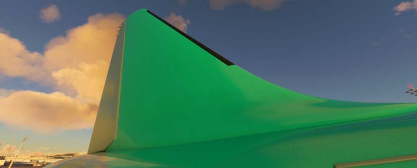
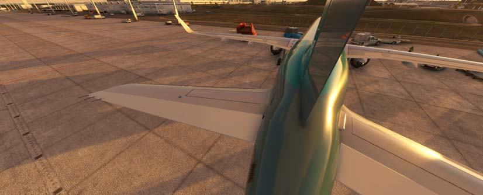
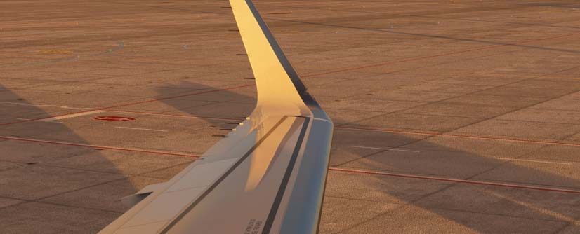
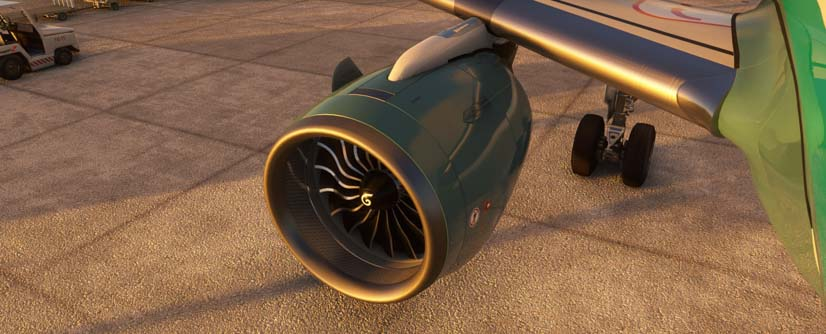
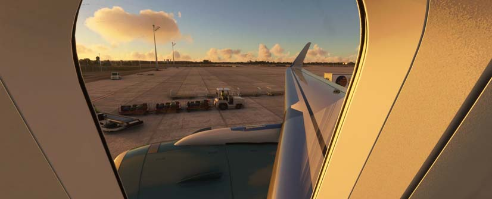
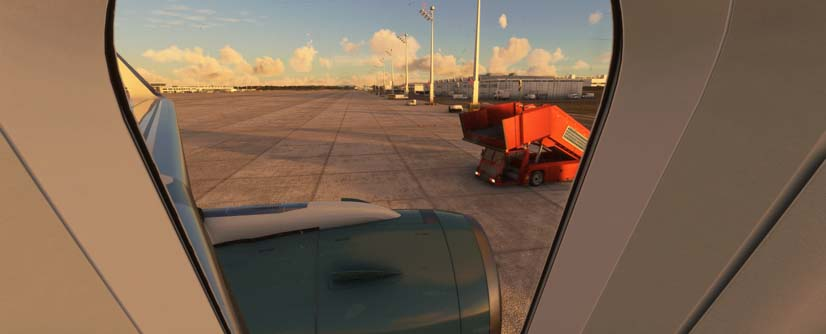
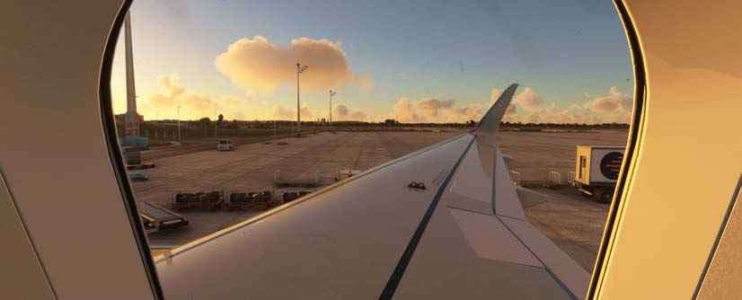
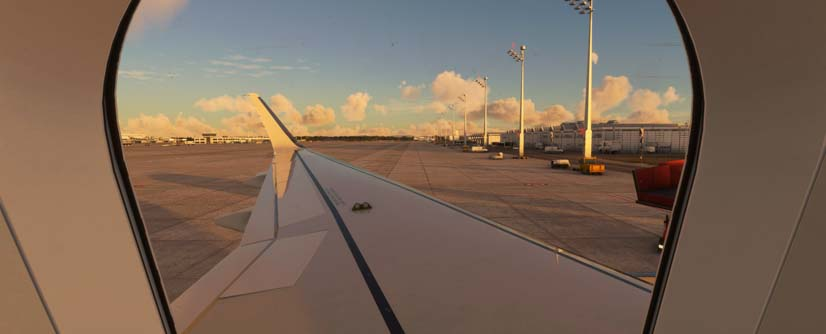
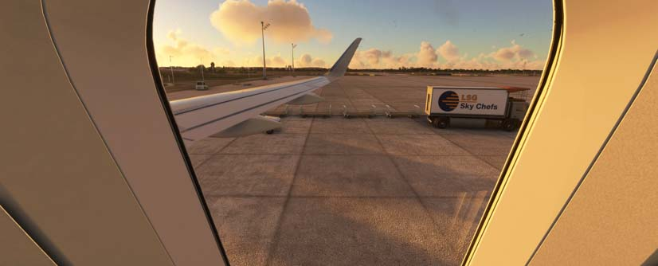
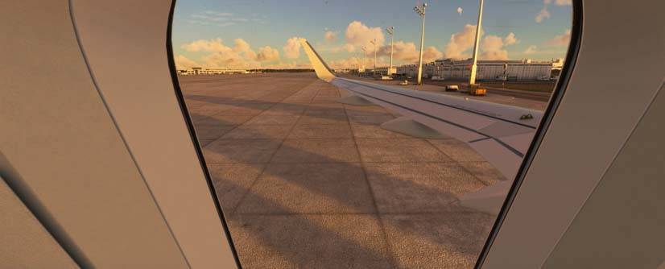

# Custom Camera Views

The FlyByWire A32NX comes with some built in pre-configured custom camera views.

This guide will give an overview of the custom camera views and how to use them.

## How to Activate Custom Camera Views

### Using the Camera Menu Bar

{loading=lazy}

### Using Keyboard Shortcuts

{loading=lazy}

These views can therefore also be mapped to any button on a controller for quick access.

## List of Custom Camera Views

!!! info "All Views (use keyboard arrows to navigate)"

    === "1"

        {loading=lazy}

    === "2"

        {loading=lazy}

    === "3"

        {loading=lazy}

    === "4"

        {loading=lazy}

    === "5"

        {loading=lazy}

    === "6"

        {loading=lazy}

    === "7"

        {loading=lazy}

    === "8"

        {loading=lazy}

    === "9"

        {loading=lazy}

    === "10"

        {loading=lazy}

    === "11"

        {loading=lazy}

    === "12"

        {loading=lazy}

    === "13"

        {loading=lazy}

    === "14"

        {loading=lazy}

    === "15"

        {loading=lazy}

    === "16"

        {loading=lazy}

    === "17"

        {loading=lazy}

    === "18"

        {loading=lazy}

    === "19"

        {loading=lazy}

