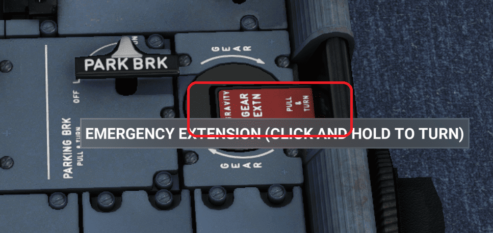

# Custom Hydraulics

## Gear system
Our new gear system aims at replicating its real counterpart even in the slightest details. While more improvements will come, the current system already features:

- Rigid body physics of gears and doors
- Hydraulic actuators simulation with "push to retract" main gears and "push to extend" nose gear. 
- All proximity sensors, one set per LGCIU computer
- LGCIU computers monitoring, sequence control state machine and their change-over mechanism
- Safety valve / Shut off valve / Vent valves controls
- Gear lever baulk lock mechanism powered by LGCIUs
- Emergency extension system

!!! warning "Not Yet Implemented"
    Non-exhaustive list of features yet to come:

    - Doors animations
    - Aerodynamic effects
    - Complete fault monitoring and BITE tests of LGCIUs
    - Complete set of failures
    - Animated emergency gear crank handle
    - Ability to start with gear already up

### Functionality
Using the gear system should not be different from before. Selecting gear up will switch to the next available LGCIU computer available, and will start the retracting sequence. Gear down will start the extension sequence same as before.

However, because it's now closer to the real system under the hood, you have to be aware of some subtleties of the gear system.

First of all, as all of the hydraulics are simulated, the behaviour of the system will highly depend on the hydraulic status of the plane. Even in nominal conditions, gear system is 
such a high flow consumer that it can impact the green system pressure. In turn this will also trigger the PTU to help provide hydraulic power from the yellow side. 

Be aware that any degraded condition will impact the behaviour of the retraction/extension sequence. PTU being off will cause green system pressure to reach lower pressure level during the sequence, while using only yellow electric pump for the gear sequence might cause LGCIU faults as the sequence can get quite a long time to perform.

Be aware that there's a safety valve that will cut off any hydraulic supply to the gear system above approximately 260kts. This safety system is independent of LGCIU computers, and if you use the gear while crossing that speed limit, strange behaviour and ECAM faults are to be expected.

If such a situation happens:

- Get your speed below 260kts (which is already too high!!)
- Getting the gear lever back to down position, then to up will hopefully switch on the second LGCIU computer and save the day.

!!! tip "Always check your speed when using gear system, and everything will be ok!"  

### Failures
Some first failures are provided, and while ECAM information impact is a temporary placeholder, consequences on the gear system are fully modeled.

- LGCIU power input failure will cause complete electrical loss of the computer and its outputs. Other LGCIU will take control to ensure gear control. 

!!! tip "Power failure on LGCIU1 will cause the gear light indicator to be lost."
!!! tip "A failed LGCIU can be reset by toggling this fault on and off, as would a circuit breaker cycle do."

- LGCIU internal error failure will cause the LGCIU to fail its internal continuous tests. It will declare a fault and other LGCIU will take control to ensure gear control. Power input in that case is still present, so an internal error on LGCIU1 will still maintain the gear light indicator.

- Proximity sensor failure are physical issues on the considered LGCIU sensors. Those cannot be electrically detected by the computer, so it may cause gear retraction or extension sequence to fail and get stuck. A LGCIU fault will finally be declared because of too long sequence time. A gear lever recycling down to up will switch gear control to the other computer to complete current sequence.

!!! tip "Only issues on LGCIU1 proximity sensors will show erroneous information on gear light indicator."

### Gravity Extension
Gravity extension is already fully supported by our gear system. However, user experience is not perfect yet due to current 3D model limitations.

While this feature will eventually be perfectly supported with a moving crank handle, for now gravity extension can be used by two means:

- Clicking and holding left mouse button on the red part of the crank handle.
{loading=lazy}
- Using the ingame binding "EMERGENCY GEAR TOGGLE" by holding it. You may set this to a keybind of your choice.
{loading=lazy}
  
Using either of those above methods, you need to click and hold until gear is released. 

If not holding long enough, you will end up with crank handle only doing one or two turns, which will have the following consequences:

- After 1 turn, hydraulic supply to gear system is closed
- After 2 turns, doors uplocks will be released and door will stay opened

To revert the process and stow the crank handle back into its place, just click and hold again (provided you already reached 3 turns).

!!! warning "Before Using Gravity Extension"
    Have the plane correctly stabilized before using this procedure. Remember that gears are physically simulated, and are really heavy. Bank angle and/or load factor WILL have 
    impacts on:

    - The extension time  
    - Asymmetry  
    - Ability to reach downlock position

### Known Issues

{--

**Please Note:** Gear system can only be used through in game binding events or in-cockpit lever. Writing to simvars to control gear is not supported.

--}

- Gear always starts in downlocked state, even when spawning in the air. Have to manually raise gear after spawn (check speed below 260kts!!).
- If a hardware input is set to GEAR UP or GEAR DOWN, in-cockpit lever cannot be clicked or mouse dragged.
- Aerodynamic effects are not implemented yet, so gravity extension can have difficulties to lock the gear down, especially if plane is not stabilized during the procedure.

- Door visual position is not modeled yet due to 3D model issues. Their actual position is however fully simulated internally.

  Because of that last point:
  
   - Gear doors will start to visually open with a 2 to 3s delay, because actual doors are in fact already opening during those 2-3s while you cannot see them.
   - Gear doors will visually close at end of gear extension even if actual doors stay open (for example after gravity extension).
   - Visual movement of doors is only coming from gear movement, thus causing strange door oscillations in some cases that are not real.

