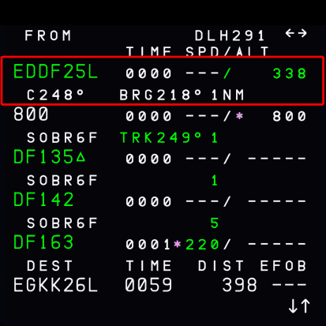
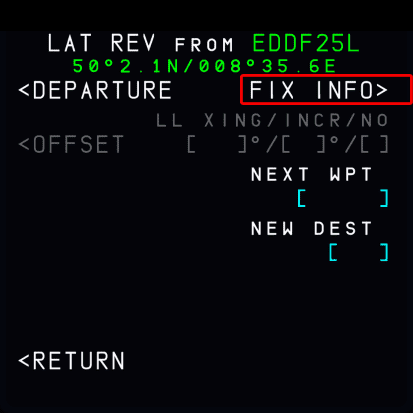
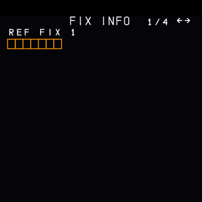
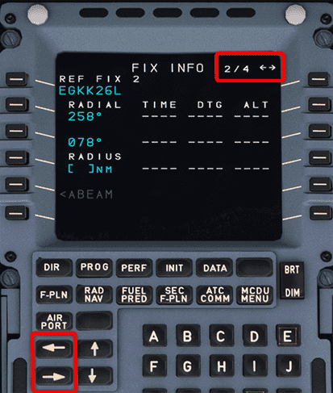
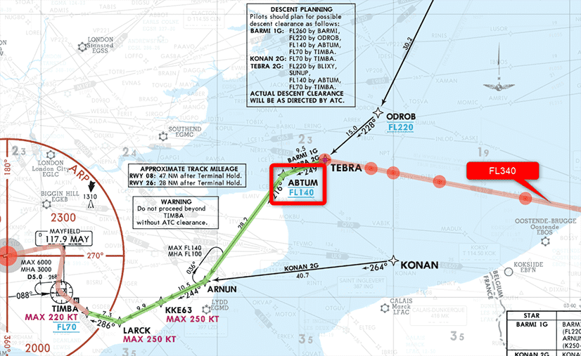
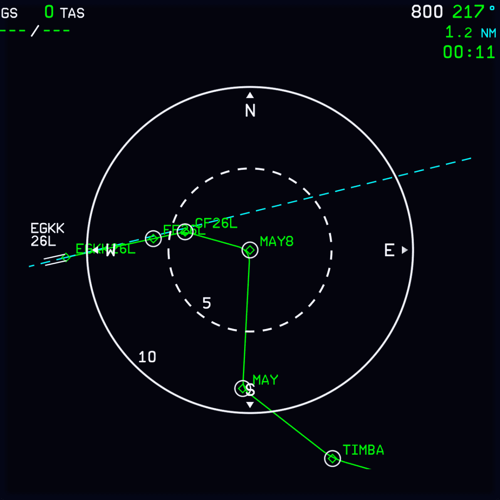
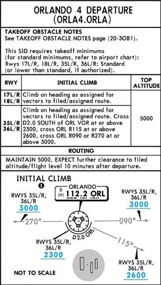

# Fix Info

!!! warning "Only available in the Experimental Version"

## Overview

The MCDU FIX INFO page is used to create radial lines and distance circles around a database navigation fix.

It  displays these lines or circles on the ND and also uses them to compute intercept waypoints.

The A32NX has implemented the display of these lines and circles on the ND. The computed intercept waypoints are not yet available.

## Use Cases

Fix info is a powerful supplemental tool for pilots to improve situational awareness and easier, more precise navigation.

Common use case are:

- Top of descent circle, to display the exact point on the lateral path when to start a descent into a specific fix.
- ILS localizer extension line, to easier identify where the localizer beam should be in extension from the runway
- VOR intercepting
- Go Around procedure aid

## Step by Step Guide

### 1) Where is the FIX INFO page?

You will find the option to select the FIX INFO page on the top most waypoint of your active flight plan.

For this go to the MCDU F-PLN page and select the top most waypoint with the left LSK (line select key).

{loading=lazy}

This brings up the lateral revision page for this waypoint and also displays the FIX INFO page option. Press the right LSK next to `FIX INFO`

{loading=lazy}

### 2) Enter a Navigation Fix

{loading=lazy}

### 3) Enter Radial or Radius

{loading=lazy}

With radius 63NM around the waypoint ABTUM:

{loading=lazy}

### 4) Additional Fix Info Pages

You can define up to 4 different fixes by selecting the lateral skew navigation button to go to the next page.

{loading=lazy}

## Examples

### Top of Descent Circle

FL340 with arrival TEBRA2G into Gatwick EGKK.

A descent is required at 63NM before ABTUM as calculated by the flyPad Top of Descent calculator.

{loading=lazy}
 *Copyright © 2021 Navigraph / Jeppesen 
"Navigraph Charts are intended for flight simulation use only, not for navigational use."*

!!! block ""
    {loading=lazy align=left width=43%}
    {loading=lazy align=right width=43%}

### ILS Localizer Extension Line

To visualize the ILS localizer for the approach the runway fix can be used to display a radial line corresponding to the ILS track course.

!!! block ""
    {loading=lazy align=left width=43%}
    {loading=lazy align=right width=43%}

### VOR Intercept in SID

In this scenario we have a departure on 36R in KMC= (Orlando) with the ORLANDO 4 DEPARTURE SID (ORLA4). This departure expects ATC to assign a headings after departure to intercept the filed and assigned route.

 *Copyright © 2021 Navigraph / Jeppesen 
"Navigraph Charts are intended for flight simulation use only, not for navigational use."*

As you can read in the Initial Climb description for 36R we need to meet certain altitudes at different positions in relation to the ORL VOR.

- Cross ORL D2.0 south of ORL at or above 2.300ft
- Cross ORL R115 at or above 2.600ft
- Cross ORL R090/R270 at or above 3.000ft

To visualize these points we can use the fix info page to define a 2NM distance circle and 2 lines for R155 and R090/270 on the ND.

!!! block ""
    {loading=lazy align=left width=43%}
    {loading=lazy align=right width=43%}

!!! block ""
    {loading=lazy align=left width=43%}
    {loading=lazy align=right width=43%}

