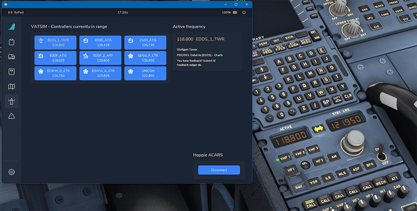

# flyPad Online ATC

## Description

The FlyByWire flyPad helps pilots managing the communication frequencies when using Online ATC services like VATSIM or IVAO.

It lists all currently available ATC stations which can then be activated in the RMP 1 by a single click.

## Usage

Go to the flyPad [ATSU/AOC settings page](settings.md#atsuaoc) and select your Online ATC service.

!!! warning ""
    Only VATSIM or IVAO are available at this time.

Go back to the ATC page and see the list of the currently available ATC stations. Click on a station to set this frequency in the Captain's RMP.

    
    <a href="../dashboard/">   
Dashboard
</a>
    <a href="../dispatch/">    
Dispatch
</a>
    <a href="../ground/">      
Ground
</a>
    <a href="../performance/"> 
Performance
</a>
    <a href="../charts/">      
Navigation & Charts
</a>
    <a href="../online-atc/">  
Online ATC
</a>
    <a href="../failures/">    
Failures
</a>
    <a href="../settings/">    
Settings
</a>

{loading=lazy}
