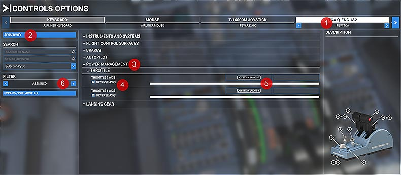
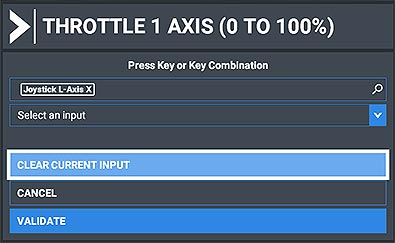
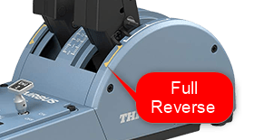

# flyPad Throttle Calibration

!!! warning "Please Note"
    Throttle Calibration is only required and available when using the [Development Version](../../fbw-versions.md#version-overview)

This guide will help you setting up your throttles for use with the FlyByWire A32NX.

It covers the frequently used [Thrustmaster TCA Throttle Quadrant Airbus edition](#thrustmaster-tca-or-similar-with-reverser-on-axis) with 2 throttle axis, reversers and detents, the [Thrustmaster TWCS Throttle](#thrustmaster-twcs-or-similar-without-reverser-on-axis-and-no-detents) as an example for a single axis throttle with no reverser and no detents and the [Honeycomb Bravo Throttle Quadrant](#honeycomb-bravo-throttle-quadrant) with its special button-style reverser.

---

## Index

1. [Quick Start](#quick-start)
- [Thrustmaster TCA or similar (with Reverser on Axis)](#thrustmaster-tca-or-similar-with-reverser-on-axis)
- [Thrustmaster TWCS or similar (without Reverser on Axis and no Detents)](#thrustmaster-twcs-or-similar-without-reverser-on-axis-and-no-detents)
- [Honeycomb Bravo Throttle Quadrant](#honeycomb-bravo-throttle-quadrant)
- [Troubleshooting](#troubleshooting)

---

## Quick Start

This quickstart lists all necessary steps for calibrating your throttle. Please read the sections below for a detailed step-by-step guide.

### Step 1: Setup the Correct Axis in Microsoft Flight Simulator Control Operations

- For throttles with reversers and the Honeycomb Bravo map the throttle axis of your controller to `THROTTLE 1 AXIS` and `THROTTLE 2 AXIS`. Do NOT use `THROTTLE 1 AXIS (0 TO 100%)` in this case!
- For throttles without reversers map the throttle axis of your controller to `THROTTLE 1 AXIS (0 TO 100%)` and `THROTTLE 2 AXIS (0 TO 100%)`. Do NOT use `THROTTLE 1 AXIS` or `THROTTLE 2 AXIS` in this case!
-  If you only have one axis on your hardware you still need to map it to both, `THROTTLE 1 AXIS (0 TO 100%)` and `THROTTLE 2 AXIS (0 TO 100%)`, as the A320 has two throttles and both need to be moved.
- Test if you need to set `REVERSE AXIS` - the TCA needs this, other controllers might not.
- Remove any sensitivity and dead zone settings for the throttle axis of your controller. Your throttle should be fully linear.

[Detailed step-by-step Guide ](#step-1-microsoft-flight-simulator-controls-option)

### Step 2: flyPad Throttle Calibration Page

- Set `Reverse On Axis` and `Independent Axis` as required for your controller (for the TCA both are ON)
- Move your controller all the way back (with reverser to `Reverse Full`, without reverser to `Idle`)
- Click in the middle on the detent's name to select the detent you want to calibrate
- Move your controller's throttle to the corresponding detent and click on `Set From Throttle` to set the current throttle position as the value for this detent.
- Repeat this for all positions/detents.
- Click `Save & Apply`
- Test your settings.

[Detailed step-by-step Guide](#step-2-calibrating-the-tca-throttle-detents-in-the-flybywire-flypad-efb)

---

## Thrustmaster TCA or Similar (with Reverser on Axis)

{loading=lazy}

### Step 1: Microsoft Flight Simulator Controls Option

Open the Microsoft Flight Simulator Controls Option page.

{loading=lazy}

Use the numbers in this image in the following text.

{loading=lazy}

- Select the TCA controller **(1)**

- Click on **SENSITIVITY** **(2)**

    Make sure sensitivity setting are set to linear. Set them exactly as per image below.

    {loading=lazy}

- Click on **DONE**

- Open **POWER MANAGEMENT - THROTTLE** **(3)**

    You should see the currently assigned control mappings. If not use FILTER **(6)** to see all controllable attributes.

    !!! warning "Important"
        Make sure **^^NOT^^** to use `THROTTLE 1 AXIS (0 TO 100%)` or `THROTTLE 2 AXIS (0 TO 100%)` for the TCA.

        Remove any mapping to these settings by double clicking the entry and choosing **CLEAR CURRENT INPUT**.

        {loading=lazy}

    Look for `THROTTLE 1 AXIS` and `THROTTLE 2 AXIS` and map it like this **(4)**:

    {loading=lazy}

    Test it by moving the TCA throttle - the white bar should move **(5)**.

- Exit the Control Options dialog and don't forget to **APPLY AND SAVE**!

Now Microsoft Flight Simulator should be setup correctly. The throttles should already move from Full Reverse to TOGA!

Now let's calibrate the detents as they are **NOT** correct yet - continue with the next chapter.

### Step 2: Calibrating the TCA throttle Detents in the FlyByWire flyPad (EFB)

#### Full Reverse

- Make sure that your TCA throttles are all the way back to Full Reverse (pull the **Reverse Levers** up to do so).

    {loading=lazy}

- Open the flyPad (maybe pop it out to a separate window next to the throttle with ++ralt+left-button++) and go to **Settings** -> **Calibrate**.

    {loading=lazy}

    {loading=lazy}

    Throttle Calibration Page:

    {loading=lazy}

- Set **`Reverser On Axis`**  to ON (see **1** in image).

- Set **`Independent Axis`** to ON (see **2** in image).

- Click on **`Reverse Full`** in the middle **(3)**
    - Confirm that the value for Axis 1 **(4)** and Axis 2 is -1.0 (or very close to).

    !!! info ""
        To get the current throttle values it might be necessary to move the mouse outside the EFB window if you popped out the window with ++ralt+left-button++

- Click on **`Set From Throttle`** for Axis 1 **(6)** and Axis 2 **(7)**.

#### Reverse Idle

- Move your TCA throttle forward until the **Reverse Levers** snap back and then pull the **Reverse Levers** up again and move the throttle back a bit. There is no detent for **Reverse Idle** so just make sure it is not all the way back but well out of the **Idle Detent**.

    !!! info ""
        To get the current throttle values it might be necessary to move the mouse outside the EFB window if you popped out the window with ++ralt+left-button++

    {loading=lazy}

- Click on **Reverse Idle** in the middle **(3)**
- Click on **Set From Throttle** for Axis 1 **(6)** and Axis 2 **(7)**.

    {loading=lazy}

    !!! info ""
        Notice how the blue bar (current throttle position) is between two  green lines. These green lines are your dead zone or dead band for the detent. As long as the blue bar is between them, the throttle reads this as the corresponding detent (in this case **Reverse Idle**). If you move the throttle outside these green bars they become gray as you now no longer are in the corresponding detent.

        You can enlarge the dead band by increasing the value above the "Set From Throttle" button. Currently this is 0.05 - set it as required which will move the green lines down/up. Usually the default values are sufficient.

#### Idle

- Move the TCA throttle into the IDLE detent by moving it forward until the **Reverse Levers** snap back then pull the throttle levers back against the reverse lock.
- Click on **Idle** in the middle **(3)**.
- Click on **Set From Throttle** for Axis 1 **(6)** and Axis 2 **(7)**.

    {loading=lazy}

#### CLB

- Move the TCA throttle forward one detent (CLB detent).
- Click on **CLB** in the middle **(3)**.
- Click on **Set From Throttle** for Axis 1 **(6)** and Axis 2 **(7)**.

    {loading=lazy}

#### FLX/MCT

- Move the TCA throttle forward one detent (FLX/MCT detent).
- Click on **FLX** in the middle **(3)**.
- Click on **Set From Throttle** for Axis 1 **(6)** and Axis 2 **(7)**.

    {loading=lazy}

#### TOGA

- Move the TCA throttle all the way forward (TO GA).
- Click on **TOGA** in the middle **(3)**
- Click on **Set From Throttle** for Axis 1 **(6)** and Axis 2 **(7)**.

    {loading=lazy}

- Click on "SAVE AND APPLY" **(8)**

    {loading=lazy}

- Test each setting with a view like this. Make sure the mouse is outside the popout window otherwise the aircraft's throttles won't move.

    {loading=lazy}

**Congratulations! You have successfully calibrated your TCA Throttle!**

---

## Thrustmaster TWCS or similar (without Reverser on Axis and no Detents)

This section describes the calibration of a single axis throttle with no Reverser on Axis and also no detents.

Example Thrustmaster TWCS Throttle:

{loading=lazy}

The configuration is very similar to the above TCA, therefore we are only describing the differences to the settings above. Read the above section when something is unclear.

### Step 1: Microsoft Flight Simulator Controls Option

#### Throttle Sensitivity

Same as described above, remove all sensitivity settings and make it linear. Be aware that your throttle might use different names for the axis. Move the throttle to see which graph is moving.

{loading=lazy}

#### Throttle Mapping

Instead of `Throttle Axis 1/2` throttles without **Reverser on Axis** often need the `Throttle Axis 1/2 (0 TO 100%)` (see **1** in image below) setting. Some need the `Reverse Axis` box checked, some not. Find the right setting for your throttle by trial and error.

"){loading=lazy}

Also, as these throttles do not have reversers on their axis, we can map the reverser activation onto a button on the throttle or key on the keyboard (see **2** below). In the example below we used the button "3" for this.

{loading=lazy}

Hold this button and push the throttle forward to increase reverse thrust.

### Step 2: Calibrating in the FlyByWire flyPad (EFB)

- Go to the flyPad Throttle Calibration page

    {loading=lazy}

- As this throttle has no reverse and only one real axis, set the `Reverser on Axis` to OFF **(1)** and also the `Independent Axis` to OFF **(2)**

- Move the throttle all the way back to idle.

- As described above we go through all detents and set the values accordingly with `Set From Throttle`. The easiest way to do that is by having the flyPad in a separate window next to the throttle as in the screenshot below.

    {loading=lazy}

- For the detents CL, FLX and TO GA you can increase the dead zone to make it easier to move your throttle into the detents.

    {loading=lazy}

    In this example we have set the dead zone to 0.25 on either side of the actual setting. For FLX and TO GA you can use 0.10 or 0.15.

  - Click on "SAVE AND APPLY" **(8)** and test everything

      {loading=lazy}

**Congratulations! You have successfully calibrated your throttle!**

---

## Honeycomb Bravo Throttle Quadrant


The Honeycomb Bravo Throttle Quadrant does not have a real reverser on axis but emulates this by using a button when pulled back into the reverser position.

This makes configuration a bit awkward because Microsoft Flight Simulator is not capable to directly use this setup for a realistic reverser functionality.

To realistically use the reverser the pilot would lift the reverser lever and the pull the throttle back into the reverser range of the throttle axis.

There is however a way to simulate this with MSFS and the FlyByWire Throttle Calibration as described below.

### Step 1: Microsoft Flight Simulator Controls Option

#### Throttle Sensitivity

Same as described above, remove all sensitivity settings and make it linear. Be aware that your throttle might use different names for the axis. Move the throttle to see which graph is moving.

{loading=lazy}

#### Throttle Mapping

The mapping required for the Bravo is shown in this screenshot:

{loading=lazy}

Be careful to use `THROTTLE 1/2 AXIS` and not `THROTTLE 1/2 AXIS (0 TO 100%)`.

Also do make sure to have `REVERSE AXIS` unchecked!

With the default Boeing levers the `THROTTLE 1/2 DECREASE` mapping to `Buttons 10,26` and `Buttons 11,27` simulates the reverser when the Bravo's reverser lever is lifted (buttons 10 and 11) and the thrust lever is pulled back (buttons 26 and 27). This activates the buttons configured in the image above and in turn decreases throttle power to negative values for the reverser.

If you use the A320 Throttle pack levers you must map the `Buttons 30 + 26` for lever 1 and `Buttons 48 + 27` for lever 2.

If you use the GA levers please only configure `Button 26` and `Button 27` as without the reverse levers of the airliner levers the other buttons (10, 11) will not be there.

To deactivate the reverse thrust the reverse levers must be released and the thrust lever must be pushed a bit above the idle position.

### Step 2: Calibrating in the FlyByWire flyPad (EFB)

- Go to the flyPad Throttle Calibration page

- As this throttle has no reverser on the axis, set the `Reverser on Axis` to OFF but set `Independent Axis` to ON.

    {loading=lazy}

- Move the throttle all the way back to idle.

- As described above we go through all detents and set the values accordingly with `Set From Throttle`.

- For the detents CL, FLX and TO GA you can increase the dead zone to make it easier to move your throttle into the detents.

    {loading=lazy}

    In this example we have set the dead zone to 0.25 on either side of the actual setting. For FLX and TO GA you can use 0.10 or 0.15.

  - Click on "SAVE AND APPLY" **(8)** and test everything

      {loading=lazy}

**Congratulations! You have successfully calibrated your throttle!**

---

## Troubleshooting

### Detents Overlap

One of the most common issues is overlapping detents. Especially when coming from a different throttle (e.g. without reverser axis).

**You can't Save and/or Apply** while this error message is shown!

{loading=lazy}

This can easily be fixed by carefully following the steps [above](#thrustmaster-tca-or-similar-with-reverser-on-axis) which will remove the error message which then in turn allows to `SAVE & APPLY`.

Another solution is to simply delete the current configuration file (as described in the next chapter) and start over your configuration from default values.

---

## Manual Configuration

!!! warning "Expert Advice - use with care!"
    This configuration is meant for users who are comfortable with finding and change setting-files manually.
    It is important to create a backup copy of each file you modify before changing anything to be able to revert to the previous state in case things go wrong!

To setup or correct throttle calibration values directly we follow these steps which are detailed below.

1. Shut down Microsoft Flight Simulator.
2. Locate you "**work***" folder.
3. Locate the "**ThrottleConfiguration.ini**" file.
4. Create a backup copy of the "**ThrottleConfiguration.ini**" file.
5. Delete or Edit the "**ThrottleConfiguration.ini**" file as required!
6. Start Microsoft Flight Simulator and test.

### Work Folder

Microsoft Flight Simulator allows mods like FlyByWire A32NX to store configuration and other data in a folder called "**work**": This folder is located in different places for the **MS Store version** and the **Steam version** of Microsoft Flight Simulator. The folder's location is described in the next paragraphs.

!!! info ""
    If you can't find the folders these folders might be hidden from you by Windows. Follow the directions on ["View hidden files and folders in Windows 10" on Microsoft's support site](https://support.microsoft.com/en-us/windows/view-hidden-files-and-folders-in-windows-10-97fbc472-c603-9d90-91d0-1166d1d9f4b5){target=new}.

#### Microsoft Store Version

The folder can be found here:

`%LOCALAPPDATA%\Packages\Microsoft.FlightSimulator_8wekyb3d8bbwe\LocalState\packages\flybywire-aircraft-a320-neo\work`

!!! warning ""
    This is not your community directory

#### Steam Version

The folder can be found here:

`%APPDATA%\Microsoft Flight Simulator\Packages\flybywire-aircraft-a320-neo\work`

!!! warning ""
    This is not your community directory

### ThrottleConfiguration.ini

The "**ThrottleConfiguration.ini**" file stores the configuration values from the flyPad Throttle Calibration page.

You can edit or delete this file while Microsoft Flight Simulator is shut down and it will be loaded when you start the next flight with the FlyByWire A32NX.

To restore the default values you can just delete this file. It will be regenerated the next time you start a flight with the FlyByWire A32NX and use the flyPad Throttle Configuration page to `SAVE & APPLY` a configuration.

!!! warning
    The below example file can be used as a starting point for a **Thrustmaster TCA Throttle Quadrant** although it is easier to just  delete the config file and restart configuration.

    Be aware that each throttle is a little different and you MUST verify that these values work for your hardware!

Example "**ThrottleConfiguration.ini**" file based on the default values:

```
[throttle_common]
reverse_on_axis = true

[throttle_axis_1]
reverse_low = -1.00
reverse_high = -0.95
reverse_idle_low = -0.72
reverse_idle_high = -0.62
idle_low = -0.50
idle_high = -0.40
climb_low = -0.03
climb_high = -0.07
flex_mct_low = 0.42
flex_mct_high = 0.52
toga_low = 0.95
toga_high = 1.00

[throttle_axis_2]
reverse_low = -1.00
reverse_high = -0.95
reverse_idle_low = -0.72
reverse_idle_high = -0.62
idle_low = -0.50
idle_high = -0.40
climb_low = -0.03
climb_high = -0.07
flex_mct_low = 0.42
flex_mct_high = 0.52
toga_low = 0.95
toga_high = 1.00
```

---

## Additional Video Guides

[FBW Tool-Tips | Throttle Calibration](https://www.youtube.com/watch?v=8yZuv2L4jPA&list=PLyIyZ4OtCKhxTSKfpwxxFEROEjAaKta7j){target=new}

<iframe width="790" height="450" src="https://www.youtube.com/embed/8yZuv2L4jPA?list=PLyIyZ4OtCKhxTSKfpwxxFEROEjAaKta7j" title="YouTube video player" frameborder="0" allow="accelerometer; autoplay; clipboard-write; encrypted-media; gyroscope; picture-in-picture" allowfullscreen loading="lazy"></iframe>

[FBW Tool-Tips | Throttle Calibration](https://www.youtube.com/watch?v=8yZuv2L4jPA&list=PLyIyZ4OtCKhxTSKfpwxxFEROEjAaKta7j){target=new}
[Flybywire A32NX Throttle Calibration Tutorial](https://www.youtube.com/watch?v=9oqFfAMXCcc){target=new}

<iframe width="790" height="450" src="https://www.youtube.com/embed/9oqFfAMXCcc" title="YouTube video player" frameborder="0" allow="accelerometer; autoplay; clipboard-write; encrypted-media; gyroscope; picture-in-picture" allowfullscreen loading="lazy"></iframe>
Credits to [British Avgeek](https://www.youtube.com/channel/UCiRbrJu4xfX7uRtZpXdFEdg){target=new}


