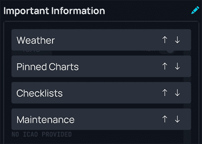
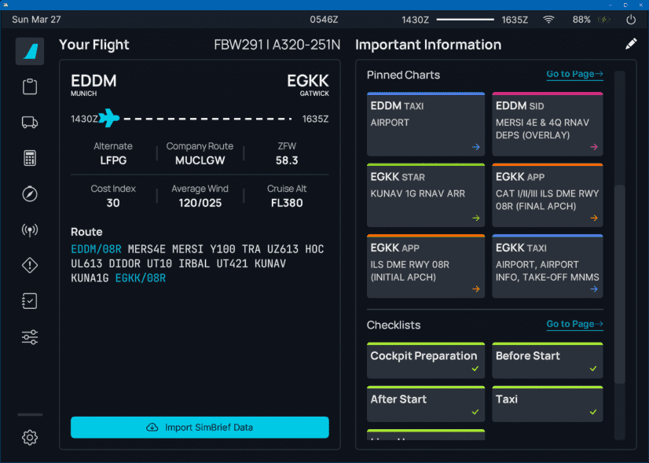
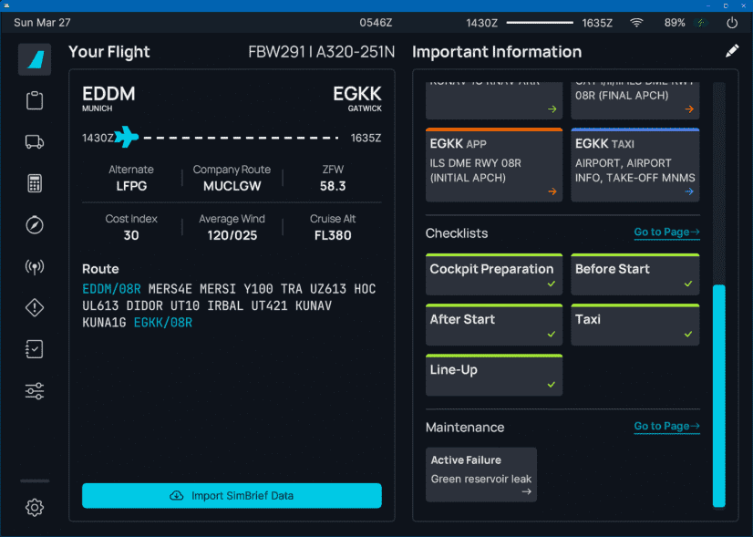

<link rel="stylesheet" href="../../../../stylesheets/efb-interactive.css">

# flyPad Dashboard

    
    <a href="../dashboard/">   
Dashboard
</a>
    <a href="../dispatch/">    
Dispatch
</a>
    <a href="../ground/">      
Ground
</a>
    <a href="../performance/"> 
Performance
</a>
    <a href="../charts/">      
Navigation & Charts
</a>
    <a href="../online-atc/">  
Online ATC
</a>
    <a href="../failures/">    
Failures
</a>
    <a href="../checklists/">  
Checklists
</a>
    <a href="../presets/">     
Presets
</a>
    <a href="../settings/">    
Settings
</a>
    Click on the menu icons in this image to see other flyPad pages.

## Description

The Dashboard is the default flyPad page after starting it.
    
## Usage

### Widgets

The Dashboard provides several widgets to allow quick access to specific information and pages.

The provided widget are: 

- Weather:
    - METAR weather information - see [Weather Widget](#weather-widget)
- Pinned Charts:
    - Navigation charts from the [Navigation page](charts.md) can be pinned and displayed here
- Checklists:
    - Specific checklists according to the current flight phase ([Checklists page](checklists.md))
- Maintenance:
    - Shows active failures from the [Failures page](failures.md) 

By clicking on the edit symbol (pen) the widgets can be rearranged as required by the user. 

### Weather Widget

The Weather widget shows the current METAR information of either the simBrief imported airports or manually entered 
airports.

You can type in any airport ICAO-code into the input fields to get the corresponding METAR information. To get back 
to the simBrief imported airports simply delete the manually entered ICAO.

You can switch between the weather summary which shows the most important METAR parts with icons or a raw view of 
the METAR information.

Selected METAR information is updated every 5 minutes.

{loading=lazy}

We have applied a helpful coloring scheme a large European airline uses to point out significant parts of the raw METAR information to the pilots. This coloring uses the following colors:

- Cyan: Chosen airport ICAO
- White: standard value with no special concern
- Amber: highlights significant values as a caution to the pilot
- Red: highlights very significant values as a warning to the pilot
- Grey: additional information and remarks

### Pinned Charts Widget

Any pinned charts from the [Navigation page](charts.md#pinned-charts) will be shown here. 
Clicking on a chart card brings up the corresponding chart. 

### Checklist and Maintenance Widget

This shows relevant checklists in relation to the current flight phase.
Clicking on a checklist card brings up the corresponding checklist.

### Load From simBrief

If you have [configured](settings.md) your simBrief account correctly, you can click the above button to load your 
last simBrief flight plan into the flyPad. This does not load the flight plan into the MCDU - you need to load it 
there separately (see [MCDU simBrief Integration](../../../pilots-corner/beginner-guide/preparing-mcdu.md#a32nx-simbrief-integration)).

It is also possible to configure the flyPad to automatically load the latest SimBrief data. 
See [ATSU / AOC Settings](settings.md#atsuaoc)

### After loading of a simBrief flight plan 

    
    <a href="../dashboard/">   
Dashboard
</a>
    <a href="../dispatch/">    
Dispatch
</a>
    <a href="../ground/">      
Ground
</a>
    <a href="../performance/"> 
Performance
</a>
    <a href="../charts/">      
Navigation & Charts
</a>
    <a href="../online-atc/">  
Online ATC
</a>
    <a href="../failures/">    
Failures
</a>
    <a href="../checklists/">  
Checklists
</a>
    <a href="../presets/">     
Presets
</a>
    <a href="../settings/">    
Settings
</a>
    Click on the menu icons in this image to see other flyPad pages.

