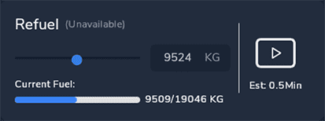

<link rel="stylesheet" href="../../../../stylesheets/efb-interactive.css">

# flyPad Ground

    
    <a href="../dashboard/">   
Dashboard
</a>
    <a href="../dispatch/">    
Dispatch
</a>
    <a href="../ground/">      
Ground
</a>
    <a href="../performance/"> 
Performance
</a>
    <a href="../charts/">      
Navigation & Charts
</a>
    <a href="../online-atc/">  
Online ATC
</a>
    <a href="../failures/">    
Failures
</a>
    <a href="../checklists/">  
Checklists
</a>
    <a href="../presets/">     
Presets
</a>
    <a href="../settings/">    
Settings
</a>
    Click on the menu icons in this image to see other flyPad pages.

## Ground Service

This page allows managing ground operation similar to the in-sim ATC ground services but without having to use the in-sim ATC.

### Connect Jet Bridge

When standing at a gate this connects and disconnects the gate's jetway if a jetway is available at the current gate.

### Door Fwd

Opens and closes the forward door.

### Call Fuel Truck

Calls the fuel truck if available at the current airport. It will take quite a while until the fuel truck while 
arrive. 5-10 minutes is not unusual. When the fuel truck arrives the MSFS fuel page appears.

!!! warning ""
    We have deactivated the MSFS Fuel Page and you can't use it with the FlyByWire A32NX.
    Fuel and payload should be loaded through this page only. 

### Call Baggage Truck

Calls the baggage service if available at the current airport and gate. Baggage service will open the cargo door, 
load baggage and then close the cargo door automatically.

### Connect External Power

Calls a ground power unit (GPU) if available at the current airport and gate or stand. This can be used if there is 
otherwise no external power available.

### Door Aft

Opens and closes the aft door.

### Call Catering Truck

Calls the catering service if available at the current airport and gate. The catering service will open the aft 
door and automatically closes it after it has virtually supplied the aircraft.

## Pushback

    
    <a href="../dashboard/">   
Dashboard
</a>
    <a href="../dispatch/">    
Dispatch
</a>
    <a href="../ground/">      
Ground
</a>
    <a href="../performance/"> 
Performance
</a>
    <a href="../charts/">      
Navigation & Charts
</a>
    <a href="../online-atc/">  
Online ATC
</a>
    <a href="../failures/">    
Failures
</a>
    <a href="../checklists/">  
Checklists
</a>
    <a href="../presets/">     
Presets
</a>
    <a href="../settings/">    
Settings
</a>
    Click on the menu icons in this image to see other flyPad pages.

!!! bug "TODO"

### Call Tug

Calls the pushback tug to be connected to the aircraft. The button will become green if the pushback tug is 
connected to the aircraft. At some airports the pushback tug might not be visible (MSFS issue) but it will still be 
possible to push back the aircraft.

To disconnect the pushback tug press this button again and the button turns blue again.

## Fuel Page

The fuel page provides accurate information about the quantity of fuel in the different tanks of the aircraft. It 
also allows fueling or de-fueling the aircraft to the desired fuel quantity.

    
    <a href="../dashboard/">   
Dashboard
</a>
    <a href="../dispatch/">    
Dispatch
</a>
    <a href="../ground/">      
Ground
</a>
    <a href="../performance/"> 
Performance
</a>
    <a href="../charts/">      
Navigation & Charts
</a>
    <a href="../online-atc/">  
Online ATC
</a>
    <a href="../failures/">    
Failures
</a>
    <a href="../checklists/">  
Checklists
</a>
    <a href="../presets/">     
Presets
</a>
    <a href="../settings/">    
Settings
</a>
    Click on the menu icons in this image to see other flyPad pages.

### Fuel and De-Fuel

To set the fuel quantity simply click into the input field and change the value to the desired quantity.

If you have loaded a SimBrief flight plan you can import the required fuel directly by pressing the import symbol 
(cloud with down arrow). 

Press the "play" symbol to start the refuelling process (de-fueling if the new quantity is lower than the current).

### Realism Settings for Fuel Time

Set this setting to the desired duration of refueling. Either instant refueling (Instant - but unrealistic), realistic refuel time (Real) or a middle ground (Fast).

After starting the engines only "Instant" is available. 
