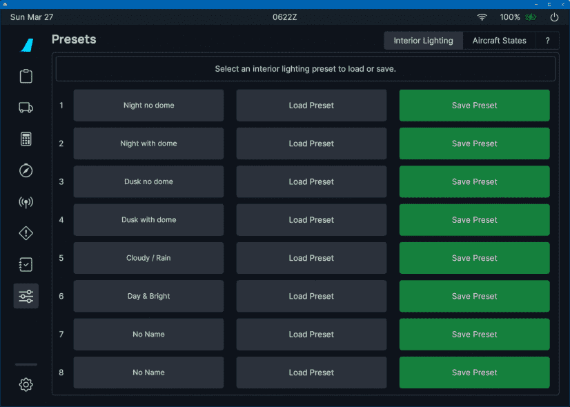
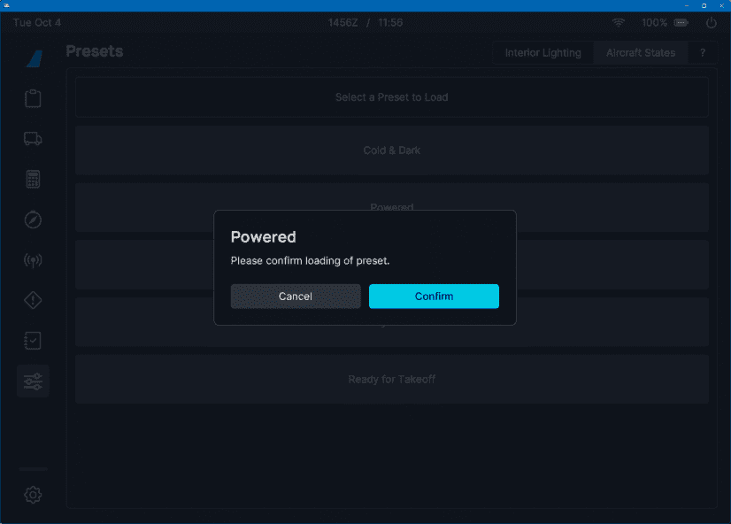
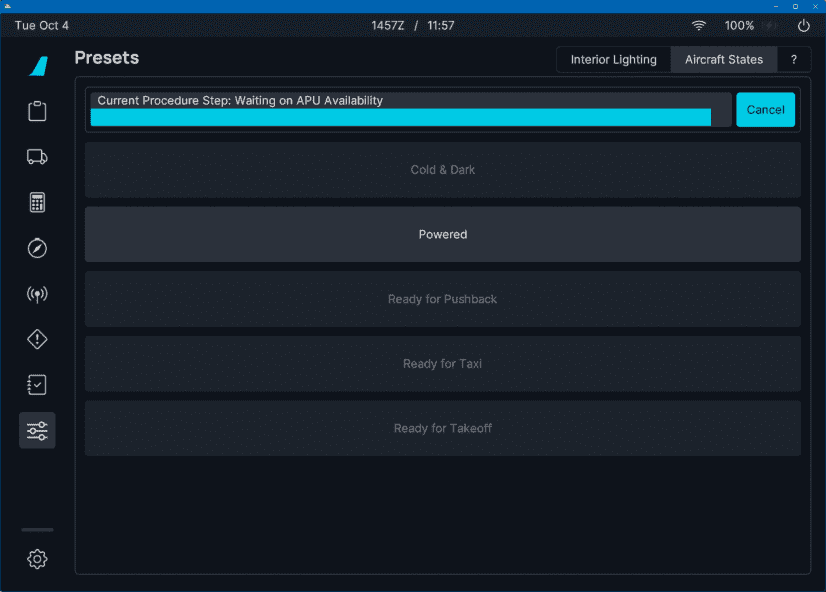
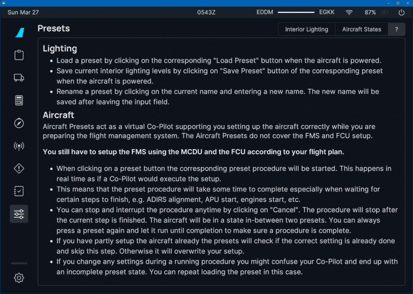

# Interior Lighting and Aircraft Presets

## Interior Lighting Presets

### Usage

The Interior Lighting Presets page allows you to save and load up to 8 presets for lighting levels of all internal 
lights and display brightness settings. 

!!! tip "Lighting Preset can only be loaded and saved when the aircraft is powered." 

#### ^^Changing Preset Name^^

To change a preset's name click on the current name of the preset and change the name to any string up to 16 
characters. The name will be saved as soon as you leave the input field.

#### ^^Load a Preset^^

To load a preset please click on the "Load Preset" button. The aircraft must be powered for the buttons to be enabled. 

#### ^^Save a Preset^^

To save a preset please click on the "Save Preset" button. The aircraft must be powered for the buttons to be enabled.

A confirmation dialog will appear to prevent you to accidentally overwrite existing presets. 

## Aircraft Presets

Aircraft presets allow you to automatically let a virtual co-pilot setup your aircraft to the requested preset state. 

When loading a preset the virtual co-pilot will perform all necessary setup tasks in real time. Therefore, systems 
like ADIR alignment, APU start, Engine starts will take the usual time to start up. 

You as the pilot can use the time to set up the FMGC (MCDU), Flight Control Unit (FCU), Transponder ident and radios.

!!! warning "It is important that you still set up the MCDU and FCU correctly for a successful flight."

!!! tip "Aircraft presets can only be used on the ground."

!!! tip "Interference While Loading a Preset" 
    You can interfere with the setup of the virtual co-pilot any time, but it will be your own responsibility to make sure 
    the setup is correct after the virtual co-pilot has finished setting up. Also, there is the risk that the virtual 
    co-pilot will wait for certain steps to complete forever if you interrupt these steps before they complete. 

    E.g. if the virtual co-pilot started the APU and you turn it of before the procedure is complete it can happen 
    that the virtual co-pilot waits in vain for this step to complete. In this case you must cancel the loading with 
    the `Cancel` button. 

### Loading a Preset

To load a preset click on the corresponding preset button. 

To avoid accidentally loading a preset a confirmation dialog will appear. 

During the loading the status bar will show the currently executed step. 

It will also show when the execution pauses for certain steps to complete. For example ADIR alignment, the 
APU start and the engines starts.

### Canceling Loading a Preset

You can cancel  loading of a preset any time by pressing the `Cancel` button. The currently executed step will be 
completed and the aircraft will be in between presets in the state up to the last executed step. You can then either 
complete the setup manually or simply click another preset (or the same) to be loaded.   

## Quick Help

For convenience there is also a summarized help page in the flyPad for your reference. 

