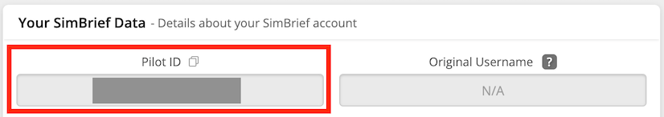

<link rel="stylesheet" href="../../../../stylesheets/efb-interactive.css">

# flyPad Settings

    
    <a href="../dashboard/">   
Dashboard
</a>
    <a href="../dispatch/">    
Dispatch
</a>
    <a href="../ground/">      
Ground
</a>
    <a href="../performance/"> 
Performance
</a>
    <a href="../charts/">      
Navigation & Charts
</a>
    <a href="../online-atc/">  
Online ATC
</a>
    <a href="../failures/">    
Failures
</a>
    <a href="../checklists/">  
Checklists
</a>
    <a href="../presets/">     
Presets
</a>
    <a href="../settings/">    
Settings
</a>
    Click on the menu icons in this image to see other flyPad pages.

## Overview

There are various aspects of the aircraft and its simulation which can and sometimes must be configured. 

Find a descriptions of all available setting categories and its settings below. 

## Aircraft Options / Pin Programs

Settings for A32NX aircraft configuration.

    
    <a href="../dashboard/">   
Dashboard
</a>
    <a href="../dispatch/">    
Dispatch
</a>
    <a href="../ground/">      
Ground
</a>
    <a href="../performance/"> 
Performance
</a>
    <a href="../charts/">      
Navigation & Charts
</a>
    <a href="../online-atc/">  
Online ATC
</a>
    <a href="../failures/">    
Failures
</a>
    <a href="../checklists/">  
Checklists
</a>
    <a href="../presets/">     
Presets
</a>
    <a href="../settings/">    
Settings
</a>
    Click on the menu icons in this image to see other flyPad pages.

### Usage

- Thrust Reduction Height (ft):
    - Default for the MCDU setting for thrust reduction height (above ground).
- Acceleration Height (ft):
    - Default for the MCDU setting for acceleration height (above ground).
- Engine-Out Acceleration Height (ft):
    - Default for the MCDU setting for engine-out acceleration height (above ground).
- Weight Unit:
    - The weight unit of the aircraft used for aircraft weight, fuel and simBrief imports.
- PAX Signs:
    - Configures if the aircraft should use "No Smoking" or "No Portable Devices" in its ECAM message when the no smoking selector switch on the overhead panel is selected on.
- ISIS Baro Unit
    - User can set which baro setting he wants to have in the ISIS backup instrument.
- ISIS Metric Altitude
    - User can set which units setting he wants to have in the ISIS backup instrument.
- RMP VHF Spacing
    - Changes the spacing for selectable frequencies in the RMPs from 8.33kHz to 25kHz and vice versa.

    ??? note "Channel Spacing (click to expand)"
         Aircraft radio systems transmit on a Very High Frequency (VHF) band between 117.975 and 137 MHz. The number of available VHF assignments has increased over the years by splitting the radio spectrum into narrower bandwidths from 50-kHz to 25-kHz channels. The bandwidth can support 760 channels, if channels are spaced by 25 kHz. In 1994, it was decided to introduce a further channel split from 25 to 8.33 kHz. 8.33-kHz spacing was introduced above Flight Level (FL) 240 in International Civil Aviation Organization (ICAO) European (EUR) regions in October 1999 and above FL 195 from March 15, 2007. Currently, 8.33-kHz channels have been implemented in the airspace of all 20 ICAO EUR region states. So far, Europe is the only region that’s moved to 8.33-kHz channel spacing.

         Source: [universalweather.com](https://www.universalweather.com/blog/8-33-khz-radio-channel-spacing-changes-are-coming-to-europe/){target=new)}

         See also: [8.33kHz Voice Channel Spacing communications](https://833radio.com/news/show/7){target=new}

## Sim Options

Settings for simulation aspects of the A32NX aircraft.

    
    <a href="../dashboard/">   
Dashboard
</a>
    <a href="../dispatch/">    
Dispatch
</a>
    <a href="../ground/">      
Ground
</a>
    <a href="../performance/"> 
Performance
</a>
    <a href="../charts/">      
Navigation & Charts
</a>
    <a href="../online-atc/">  
Online ATC
</a>
    <a href="../failures/">    
Failures
</a>
    <a href="../checklists/">  
Checklists
</a>
    <a href="../presets/">     
Presets
</a>
    <a href="../settings/">    
Settings
</a>
    Click on the menu icons in this image to see other flyPad pages.

### Usage

- Default Baro:
    - User can set which baro setting is wanted as a default: inHg, hPA or Auto (depends on the airport where 
      the aircraft spawned).
- Sync MSFS Flight Plan:
    - User can set if and how the flight plan synchronization between the simulator and the aircraft should work.
    - The options are:
        - None: No synchronization.
        - Load Only: Only once when loading the flight.
        - Save: Synchronization with every change in the aircraft

        !!! warning "Synchronization Issues Expected"
            The aircraft's custom Flight Management System provides better accuracy and features over the default flight plan manager in Microsoft Flight simulator which results in issues syncing the flight plan from the MCDU back into the simulator. Do not expect it to work properly in all cases.
 
- External MCDU Server Port
    - User can change the port for the internal MCDU websocket server in case the default port is already occupied on the user's system.
    - Default is: 8380
    - ~~This is not the port for using in the browser to access the MCDU Web Interface.~~
- Enable MCDU Server Connection
    - Auto:
        - The MCDU attempts to connect to the MCDU Server for 5min after pressing "Ready to Fly" (`Active` is shown).
        - If this setting is selected the MCDU will try to connect to the MCDU Server for 5min after every start of 
           a new flight.
        - After 5min of unsuccessful connection attempts the MCDU will stop any further attempts and `Inactive` will be
          shown.
        - If `Inactive` is shown but you want to connect to the MCDU server just click on `Off` and then `Auto` again.
    - Off:
        - The MCDU will not make any attempts to connect to the MCDU Server.
- Dynamic Registration Decal:
    - The dynamic registration number decal shown on the external livery can be disabled to improve appearance when using liveries with a static registration number.
- Use calculated ILS signals
    - Enable this setting to use a calculated ILS signal instead of the signal provided by Microsoft Flight Simulator.
    - This avoids unwanted and unrealistic loss of the ILS signal in Microsoft Flight Simulator which often happens when the aircraft gets below the antenna position.
    - In some rare cases this can cause a faulty G/S signal. In this case this setting can be disabled with immediate effect.
- Throttle Detents
    - Please see the [Throttle Configuration Guide](throttle-calibration.md).

## Realism

Settings for realism aspects of the A32NX aircraft.

    
    <a href="../dashboard/">   
Dashboard
</a>
    <a href="../dispatch/">    
Dispatch
</a>
    <a href="../ground/">      
Ground
</a>
    <a href="../performance/"> 
Performance
</a>
    <a href="../charts/">      
Navigation & Charts
</a>
    <a href="../online-atc/">  
Online ATC
</a>
    <a href="../failures/">    
Failures
</a>
    <a href="../checklists/">  
Checklists
</a>
    <a href="../presets/">     
Presets
</a>
    <a href="../settings/">    
Settings
</a>
    Click on the menu icons in this image to see other flyPad pages.

### Usage

- ADIRS Align Time:
    - User can set this to either a realistic time (~8min), a faster time (~2min) or instant.
- DMC Self Test Time:
    - User can set the time for the Display Management Computer's self test (Real ~15sec, Fast ~5sec, Instant).
- Boarding Time:
    - User can set the simulated boarding time to either a realistic time (~15min), a faster time (~3-4min), or instant.
        - Based on full load - 174 passengers and full cargo.
- MCDU Keyboard Input (unrealistic)
    - Enables the MCDU Keyboard input feature (see [MCDU Keyboard](../mcdu-keyboard.md)).
- MCDU Focus Timeout (s)
    - The timeout feature will "automatically unfocus" the MCDU screen after the given amount of seconds.
    - Valid range is 5 - 120 seconds.
- Separate Tiller from Rudder Inputs
    - User can chose to use how the nose wheel shall be controlled:
        - Legacy mode (Disabled): Rudder controls also move the nose wheel. No separation.
        - Realistic mode (Enabled): Nose Wheel steering with tiller handwheel is separate from the rudder.
            - See our guide: [Nose Wheel and Tiller Operation](../nw-tiller.md)
- Cockpit Mode
    - Removes backlight bleed from PFD, ND, and ECAMs
    - Removes reflection from the ISIS
- DATALINK transmission time
    - Instant: sends and receives messages within two seconds
    - Fast: sends and receives messages within twenty seconds
    - Real: sends and receives messages within sixty seconds
    - See [Hoppie ACARS](../hoppie.md)
- Autofill Checklists
    - Supports the user with checking items from the checklists by watching the corresponding switches, knobs and 
      buttons and setting the checklist item to complete when the setup is correct.  

## ATSU/AOC

Settings for integrations with various data and information sources.

    
    <a href="../dashboard/">   
Dashboard
</a>
    <a href="../dispatch/">    
Dispatch
</a>
    <a href="../ground/">      
Ground
</a>
    <a href="../performance/"> 
Performance
</a>
    <a href="../charts/">      
Navigation & Charts
</a>
    <a href="../online-atc/">  
Online ATC
</a>
    <a href="../failures/">    
Failures
</a>
    <a href="../checklists/">  
Checklists
</a>
    <a href="../presets/">     
Presets
</a>
    <a href="../settings/">    
Settings
</a>
    Click on the menu icons in this image to see other flyPad pages.

### Usage

- ATIS/ATC Source:
    - Choose which Online ATC service should be used for ATIS and ATC.
- METAR Source:
    - Choose which weather data provider should be used (Aircraft only - does not change sim weather).
    - MeteoBlue is the weather service the sim uses as well.
- TAF Source:
    - Choose which Terminal Area Forecast (TAF) service should be used.
- TELEX:
    - Enables free text and live map ([FlyByWire Live Map](https://flybywiresim.com/map/){target=new}).

        !!! warning
            If enabled, aircraft position data is published for the duration of the flight. Messages are public and not moderated.

            ~~USE AT YOUR OWN RISK~~

            [Free Text - Feature Guide](../freetext.md){.md-button}

    - If enabled a message will be displayed to confirm sharing of the free text and position data to the public.

        

- Simbrief Username/Pilot ID
    - See [next chapter](#simbrief-integration.)
- Automatically Import SimBrief Data
    - Imports latest SimBrief flight automatically when starting the flyPad.   
- Hoppie User ID:
    - Unique logon code that is used to identify the user for the Hoppie ACARS communication.
    - See [Create a logon code](../hoppie.md#create-a-logon-code) in our documentation for Hoppie ACARS.
- Error Reporting
    - Enables error reports to be sent to Sentry.io to allow the FlyByWire team to easier find and fix issues with the aircraft.

### simBrief Integration

Before you can use the A32NX simBrief Integration you need to provide your simBrief account details.

- Simbrief Username/Pilot ID:
    - Enter your simBrief username or Pilot ID.

        

    - If you entered a wrong username or Pilot ID a red error message will be displayed.

        

To get your simBrief username or Pilot ID you can go to your simBrief Account settings and open "Simbrief Data".

!!! attention ""
    If you use the Stable version please omit any space characters in your username. If for example your username is "Mr Pilot" the please use "MrPilot" as username.

    Also the Stable version does only allow the username to be entered here, not the Pilot ID.

## Audio

Settings for various audio sources and sounds.

    
    <a href="../dashboard/">   
Dashboard
</a>
    <a href="../dispatch/">    
Dispatch
</a>
    <a href="../ground/">      
Ground
</a>
    <a href="../performance/"> 
Performance
</a>
    <a href="../charts/">      
Navigation & Charts
</a>
    <a href="../online-atc/">  
Online ATC
</a>
    <a href="../failures/">    
Failures
</a>
    <a href="../checklists/">  
Checklists
</a>
    <a href="../presets/">     
Presets
</a>
    <a href="../settings/">    
Settings
</a>
    Click on the menu icons in this image to see other flyPad pages.

- PTU Audible in Cockpit (unrealistic):
    - The aircraft's PTU sound (barking sound) is not audible in the cockpit in the real aircraft.
    - To make it audible in the cockpit set this option to on.
- Volume Sliders:
    - Dynamically adjust various audio elements while in the virtual cockpit.  
- Passenger Ambience:
    - Select if passenger audio sounds should be played.  
- Announcements:
    - Select if crew announcements should be played.
- Boarding Music:
    - Select if music should be played while boarding. 

For detailed information on these settings please visit:

[Audio Configuration Page](../audio.md){.md-button}

## flyPad Settings

Settings for the flyPad itself.

    
    <a href="../dashboard/">   
Dashboard
</a>
    <a href="../dispatch/">    
Dispatch
</a>
    <a href="../ground/">      
Ground
</a>
    <a href="../performance/"> 
Performance
</a>
    <a href="../charts/">      
Navigation & Charts
</a>
    <a href="../online-atc/">  
Online ATC
</a>
    <a href="../failures/">    
Failures
</a>
    <a href="../checklists/">  
Checklists
</a>
    <a href="../presets/">     
Presets
</a>
    <a href="../settings/">    
Settings
</a>
    Click on the menu icons in this image to see other flyPad pages.

### Usage

- Brightness:
    - Manually set brightness of the flyPad
- Auto Brightness:
    - Sets the brightness of the flyPad automatically based on the time of day.
- Theme:
    - Select which coloring theme the flyPad should have.
- Automatically Show Onscreen Keyboard:
    - A virtual keyboard will appear whenever an input field is entered by the user. 
- Time Displayed:
    - Select which time should be displayed in the top bar of the flyPad screens.  
- Local Time Format:
    - Select if local time should be shown in 12 or 24 hours format. 
- Show Status Bar Flight Progress:
    - Select if the progress of the flight shall be shown in the top status of the flyPad screen.
- Colored Metar:
    - Enable or disable the colored raw METAR on the flyPad Dashboard.

### About

The About page provides the build information which is sometimes requested when seeking support on the FlyByWire 
Discord.

    
    <a href="../dashboard/">   
Dashboard
</a>
    <a href="../dispatch/">    
Dispatch
</a>
    <a href="../ground/">      
Ground
</a>
    <a href="../performance/"> 
Performance
</a>
    <a href="../charts/">      
Navigation & Charts
</a>
    <a href="../online-atc/">  
Online ATC
</a>
    <a href="../failures/">    
Failures
</a>
    <a href="../checklists/">  
Checklists
</a>
    <a href="../presets/">     
Presets
</a>
    <a href="../settings/">    
Settings
</a>
    Click on the menu icons in this image to see other flyPad pages.

