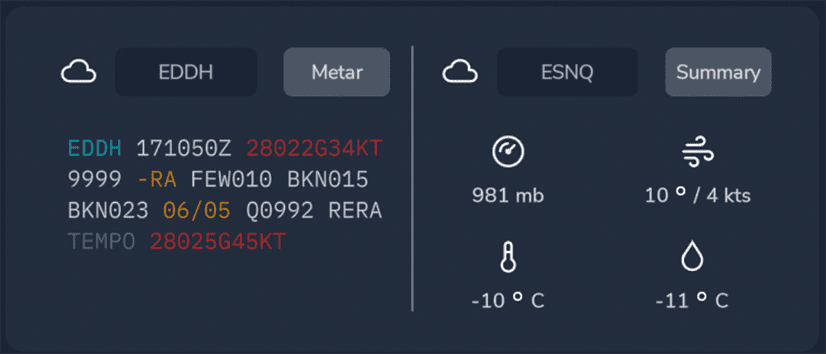

<link rel="stylesheet" href="../../../../stylesheets/efb-interactive.css">

# flyPad Dashboard

    
    <a href="../dashboard/">   
Dashboard
</a>
    <a href="../dispatch/">    
Dispatch
</a>
    <a href="../ground/">      
Ground
</a>
    <a href="../performance/"> 
Performance
</a>
    <a href="../charts/">      
Navigation & Charts
</a>
    <a href="../online-atc/">  
Online ATC
</a>
    <a href="../failures/">    
Failures
</a>
    <a href="../settings/">    
Settings
</a>
    Click on the menu icons in this image to see other flyPad pages.

## Description

The Dashboard is the default flyPad page after starting it.

It has three sections:

- Left:
    - Shows the currently loaded flight plan or dashes if none is loaded.
- Right Top:
    - Shows current METAR information for the loaded origin and destination airports.
- Right Bottom:
    - Moving map with your current location marked by a blue plane symbol.
    - Shows the current weather on the map.

## Usage

### METAR Information

The METAR widget on the top right shows the current METAR information of either the simBrief imported airports or manually entered airports.

You can type in any airport ICAO code into the input fields to get the corresponding METAR information. To get back to the simBrief imported airports simply delete the manually entered ICAO.

You can switch between the weather summary which shows the most important METAR parts with icons or a raw view of the METAR information.

{loading=lazy}

We have applied a helpful coloring scheme a large European airline uses to point out significant parts of the raw METAR information to the pilots. This coloring uses the following colors:

- Cyan: Chosen airport ICAO
- White: standard value with no special concern
- Amber: highlights significant values as a caution to the pilot
- Red: highlights very significant values as a warning to the pilot
- Grey: additional information and remarks

### Load From simBrief

If you have [configured](settings.md) your simBrief account correctly, you can click the above button to load your last simBrief flight plan into the flyPad. This does not load the flight plan into the MCDU - you need to load it there separately (see [MCDU simBrief Integration](../../../pilots-corner/beginner-guide/preparing-mcdu.md#a32nx-simbrief-integration)) .

### Map Zoom and Tools

!!! block ""
    {align=left}

    Zooms the map in (+) and out (-).

!!! block ""
    {align=left}

    Distance measurement tools.

    !!! attention ""
        Currently not available or INOP in the FBW A32NX for Microsoft Flight Simulator.

### After loading of a simBrief flight plan

    
    <a href="../dashboard/">   
Dashboard
</a>
    <a href="../dispatch/">    
Dispatch
</a>
    <a href="../ground/">      
Ground
</a>
    <a href="../performance/"> 
Performance
</a>
    <a href="../charts/">      
Navigation & Charts
</a>
    <a href="../online-atc/">  
Online ATC
</a>
    <a href="../failures/">    
Failures
</a>
    <a href="../settings/">    
Settings
</a>
    Click on the menu icons in this image to see other flyPad pages.

