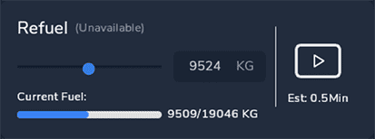

<link rel="stylesheet" href="../../../../stylesheets/efb-interactive.css">

# flyPad Dispatch

## Overview Page

This page provides information about the aircraft. It has no further functionality at this time.

    
    <a href="../dashboard/">   
Dashboard
</a>
    <a href="../dispatch/">    
Dispatch
</a>
    <a href="../ground/">      
Ground
</a>
    <a href="../performance/"> 
Performance
</a>
    <a href="../charts/">      
Navigation & Charts
</a>
    <a href="../online-atc/">  
Online ATC
</a>
    <a href="../failures/">    
Failures
</a>
    <a href="../settings/">    
Settings
</a>
    Click on the menu icons in this image to see other flyPad pages.

## OFP Page

The OFP (Operational Flight Plan) will be displayed on this page after importing it with the [button](dashboard.md#load-from-simbrief) on the [Dashboard](dashboard.md) page.

    
    <a href="../dashboard/">   
Dashboard
</a>
    <a href="../dispatch/">    
Dispatch
</a>
    <a href="../ground/">      
Ground
</a>
    <a href="../performance/"> 
Performance
</a>
    <a href="../charts/">      
Navigation & Charts
</a>
    <a href="../online-atc/">  
Online ATC
</a>
    <a href="../failures/">    
Failures
</a>
    <a href="../settings/">    
Settings
</a>
    Click on the menu icons in this image to see other flyPad pages.

!!! block "Zoom"
    {align=left}

    The OFP can be zoomed in and out with these buttons.

!!! block "Scroll"
    {align=left}

    You can scroll through the OFP by using the scrollbar on the right. 

## Fuel Page

The fuel page provides accurate information about the quantity of fuel in the different tanks of the aircraft. It also allows to fuel or de-fuel the aircraft to the desired fuel quantity.

    
    <a href="../dashboard/">   
Dashboard
</a>
    <a href="../dispatch/">    
Dispatch
</a>
    <a href="../ground/">      
Ground
</a>
    <a href="../performance/"> 
Performance
</a>
    <a href="../charts/">      
Navigation & Charts
</a>
    <a href="../online-atc/">  
Online ATC
</a>
    <a href="../failures/">    
Failures
</a>
    <a href="../settings/">    
Settings
</a>
    Click on the menu icons in this image to see other flyPad pages.

### Fuel and De-Fuel

To set the fuel quantity simply click into the input field and change the value to the desired quantity.

Press the "play" symbol to start the refuelling process (de-fueling if the new quantity is lower than the current).

### Realism Settings for Fuel Time

Set this setting to the desired duration of refueling. Either instant refueling (Instant - but unrealistic), realistic refuel time (Real) or a middle ground (Fast).
